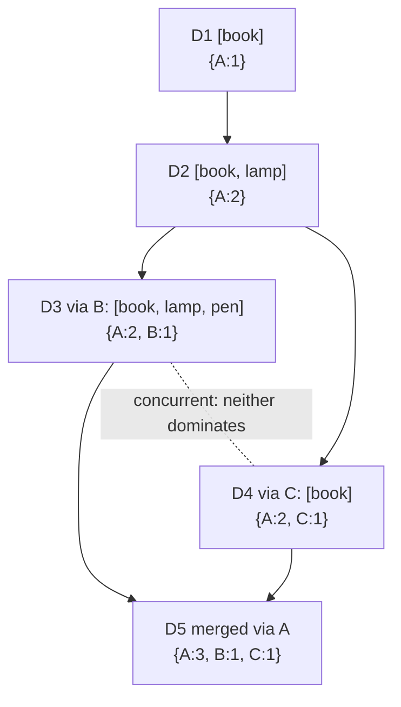

# Vector Clocks and Conflict Resolution

## 1. One-line summary

When two replicas accept different writes to the same key, the store must decide whether one write **replaced** the other or they happened **concurrently** (a real conflict); **last-writer-wins (LWW)** settles it by timestamp and silently drops a write, **vector clocks** detect true concurrency so the conflict can be merged, and **CRDTs** are data types designed so that merging is always automatic.

## 2. The problem it solves

In a leaderless store (Dynamo, Riak, [Cassandra](../technologies/cassandra.md)) any replica can accept a write, and with [sloppy quorums](hinted-handoff-and-sloppy-quorum.md) (accepting a write on a stand-in node when a home replica is down) even a stand-in node can. So two clients can update the same key at nearly the same time on different replicas:

```
Alice (via node A): cart:42 = [book]
Bob   (via node B): cart:42 = [pen]       ← same key, same moment, different node
```

Later the replicas sync ([read repair, anti-entropy](merkle-trees-and-anti-entropy.md): background processes that notice replicas disagree and copy the winning value across). Which value survives? Options:

- Pick one (**LWW**). Simple; one person's change vanishes without an error.
- Keep both and let someone **merge** (`[book, pen]`). Needs a way to know they really were concurrent, not "Bob saw Alice's write and replaced it on purpose". That is what **vector clocks** give you.

💡 *Concurrent* here doesn't mean "at the same millisecond". It means **neither writer had seen the other's write** when it wrote. Two writes 5 seconds apart are concurrent if the second writer read a stale replica.

Single-leader databases ([Postgres](../technologies/postgresql.md)) mostly avoid this: one leader orders all writes. See [consensus and Raft](consensus-and-raft.md) for the strongly consistent alternative.

## 3. How it works

### 3.1 Last-writer-wins (LWW) with timestamps

Every write carries a timestamp (from the client or coordinator clock). On conflict, the higher timestamp wins; the other value is discarded.

Problems:
1. **Concurrent writes lose data.** Alice's `[book]` at 10:00:00.120 and Bob's `[pen]` at 10:00:00.125 → cart is `[pen]`. Alice's book is gone, no error.
2. **Clock skew** (💡 different machines' clocks disagree, typically by a few ms with NTP, the protocol that syncs clocks over the network, but sometimes 100s of ms or more after a VM pause or bad NTP config). Example: node B's clock is 50 ms behind.

```
10:00:00.100 (true time)  write "v1" via A, stamped 10:00:00.100
10:00:00.130 (true time)  write "v2" via B, stamped 10:00:00.080   ← B is 50 ms slow
Result: v1 wins (100 > 080) although v2 happened later. The newer write is lost.
```

LWW is still the right default **when values are immutable or written once** (a short URL mapping, an event with a unique ID), or when losing one of two simultaneous updates is acceptable (a user's "last seen" time).

### 3.2 Vector clocks: tracking "who has seen what"

A **vector clock** is a small map `{nodeId → counter}` attached to every stored version. Rules:

1. When node N coordinates a write, it takes the version the client last read (the **context**), and increments its own entry: `N: +1`.
2. To compare two versions V1 and V2:
   - If every entry of V1 ≤ the same entry of V2 → **V1 happened before V2**. V2 replaces V1 safely.
   - If V1 has some entry bigger **and** V2 has some entry bigger → **concurrent**. Real conflict: keep both.

### 3.3 Worked example with 3 nodes (A, B, C)

| Step | What happens | Version stored | Clock |
|---|---|---|---|
| 1 | Client writes `[book]` via A (no context) | D1 | `{A:1}` |
| 2 | Client reads D1, writes `[book, lamp]` via A with context `{A:1}` | D2 | `{A:2}` |
| 3 | Alice reads D2, writes `[book, lamp, pen]` via **B** | D3 | `{A:2, B:1}` |
| 4 | Bob also read D2 (before step 3 reached his replica), writes `[book]` (removed lamp) via **C** | D4 | `{A:2, C:1}` |
| 5 | A read asks replicas, gets D3 and D4 | ? | compare |
| 6 | Client merges and writes via A with context `{A:2, B:1, C:1}` | D5 | `{A:3, B:1, C:1}` |

Comparisons:
- D1 `{A:1}` vs D2 `{A:2}`: 1 ≤ 2 → D1 happened before D2. Overwrite, no conflict.
- D3 `{A:2, B:1}` vs D4 `{A:2, C:1}`: D3 has B:1 > 0, D4 has C:1 > 0 → **concurrent**. Neither may be thrown away.
- D5 `{A:3, B:1, C:1}` vs D3 and D4: every entry ≥ → D5 descends from both. Once written, D3 and D4 can be dropped.



### 3.4 Siblings: the client resolves

At step 5 the store returns **both** values (called **siblings**) plus a merged context. The application decides: for a shopping cart, take the union (`[book, lamp, pen]`). This is what Amazon's 2007 Dynamo paper did, and it explains a known quirk: union-merging means a **deleted item can reappear** (Bob removed the lamp, but the union brings it back). Better merge logic needs more information, which leads to CRDTs.

Practical limits:
- **Clock size grows** with the number of nodes that coordinated writes. Dynamo truncated clocks beyond ~10 entries (dropping the oldest), risking false conflicts. Coordinating via a key's **preference list** (its N=3 replica nodes) keeps clocks to ~3 entries.
- Riak replaced plain vector clocks with **dotted version vectors** to avoid "sibling explosion" when many clients write concurrently.
- Clients must send the **context** back on every write (read-modify-write). An API like `put(key, value, context)` and `get(key) → (values[], context)`.

### 3.5 CRDTs: conflict-free by construction

A **CRDT** (Conflict-free Replicated Data Type) is a data structure whose merge function is commutative, associative and idempotent (💡 order doesn't matter, grouping doesn't matter, merging twice changes nothing), so any replicas that have seen the same updates end up identical, with no siblings and no lost writes.

| CRDT | Idea | Example |
|---|---|---|
| **G-Counter** (grow-only) | Each node keeps its own count; value = sum; merge = max per node | A:5, B:3, C:2 → 10. Merge `{A:5,B:3}` with `{A:4,B:7}` → `{A:5,B:7}` = 12 |
| **PN-Counter** | Two G-Counters: increments and decrements; value = P − N | Likes/unlikes |
| **G-Set** | Add-only set; merge = union | Tags ever applied |
| **OR-Set** (observed-remove) | Each add gets a unique tag; remove deletes only tags it has seen; concurrent add + remove → add wins | Shopping cart without the "lamp comes back" bug |
| **LWW-Register** | A single value with timestamp; merge = higher timestamp | That's just LWW, as a CRDT |

Used by Riak data types, Redis Enterprise active-active, Akka Distributed Data, collaborative editors (Automerge, Yjs). Limits: not every business rule fits ("balance ≥ 0" can't be enforced by merging), and metadata can grow.

### 3.6 What real systems do

| System | Conflict handling |
|---|---|
| **Dynamo** (2007 paper) | Vector clocks, siblings returned to the app; cart = union merge |
| **Riak** | Vector clocks → dotted version vectors, siblings (`allow_mult`), or built-in CRDTs (counters, sets, maps) |
| **Cassandra** | **LWW per cell** (each column value has its own write timestamp, microseconds), so two writers updating *different* columns of the same row both survive; same column → higher timestamp wins. Counters are a special type. |
| **DynamoDB** | Single-region: one leader per partition, no conflicts. Global tables (multi-region): LWW. |
| **CouchDB** | Keeps conflicting revisions, picks a deterministic winner, lets the app inspect and resolve |

## 4. When to use it

- **LWW**: immutable or write-once data, idempotent overwrites, "latest value is good enough" (status, last seen, a config blob edited by one person).
- **Vector clocks + siblings**: multi-writer data where every update matters and the app can merge (carts, user profiles edited from several devices, offline-first apps).
- **CRDTs**: counters, sets, flags, collaborative docs, multi-region active-active writes.
- In the [distributed KV store](../interviews/distributed-kv-store/README.md) interview: offer LWW as the simple default, vector clocks as the "no lost writes" option, and say which you'd ship and why.

## 5. When NOT to use it

- **Don't use LWW for read-modify-write on shared values** (balance, counters, inventory): concurrent increments overwrite each other. Use a CRDT counter, conditional writes, or a strongly consistent store.
- **Don't use vector clocks when the client can't merge.** Returning siblings to a caller that just wants "the value" pushes complexity onto every client; many teams who tried it in Riak moved to CRDTs or LWW.
- **Don't need any of this with a single leader per key** (Raft per partition, Postgres): writes are already totally ordered. Adding vector clocks there is a mistake: cost with no benefit.
- **Don't use CRDTs for invariants across items** (unique usernames, "no overbooking"). Merging can't undo a double booking; you need coordination.

## 6. Commonly confused with

| | Physical timestamp (LWW) | Lamport clock | Vector clock | Hybrid logical clock (HLC) |
|---|---|---|---|---|
| What it is | Wall-clock time | One counter: max(seen) + 1 | Counter per node | Wall time + logical counter |
| Detects concurrency? | No | No (gives an order, not "concurrent") | **Yes** | No |
| Size | 8 bytes | 8 bytes | O(nodes that wrote) | ~12 bytes |
| Affected by clock skew | Yes | No | No | Bounded |
| Used by | Cassandra, DynamoDB global tables | Theory, some logs | Dynamo, Riak | CockroachDB, YugabyteDB |

Also: **version number / ETag** (a single counter checked with compare-and-set) prevents lost updates *on one leader*, but can't describe concurrent branches across replicas.

## 7. Common mistakes / misuse

- Saying "conflicts resolved by timestamp" without admitting **one write is silently lost** and clocks skew.
- Thinking vector clocks **resolve** conflicts. They only **detect** them; someone still has to merge.
- Confusing vector clocks with Lamport clocks (a single counter can't tell "before" from "concurrent").
- Forgetting the **context** in the API: without it, every write looks concurrent with everything.
- Union-merging carts and forgetting deletes (the resurrected item), when an OR-Set would fix it.

## 8. Interview cheat-sheet

> "Because any replica can accept a write, two clients can update the same key concurrently on different nodes. The simple option is last-writer-wins: each value carries a timestamp and the higher one wins. It's what Cassandra does per column, and it's fine for write-once data, but it silently drops one of two concurrent writes and depends on clock sync. If every update matters, I attach a vector clock, a counter per coordinating node. If one version's counters are all ≤ the other's, it's an ancestor and can be dropped; otherwise they're concurrent, I keep both as siblings, and the client merges them and writes back with the combined clock. For counters and sets I'd prefer CRDTs, whose merge is automatic. And if the data needs invariants like uniqueness, I'd use the Raft-per-partition design instead."

## 9. Used in

- [Distributed key-value store](../interviews/distributed-kv-store/README.md): **conflict detection and resolution**: LWW timestamps as the simple choice vs vector clocks with siblings, the `get → (values, context)` / `put(key, value, context)` API, and CRDTs as a follow-up.
- [File storage & sync](../interviews/file-storage-sync/README.md): base / local / remote comparison instead of timestamps; unresolvable edits become conflicted copies.
- Related: [CAP and consistency](cap-and-consistency.md), [sharding and replication](sharding-and-replication.md) (multi-leader and leaderless conflicts), [hinted handoff and sloppy quorum](hinted-handoff-and-sloppy-quorum.md), [Merkle trees and anti-entropy](merkle-trees-and-anti-entropy.md), [consensus and Raft](consensus-and-raft.md), [message ordering and sequencing](message-ordering-and-sequencing.md), [counters at scale](counters-at-scale.md), [Cassandra](../technologies/cassandra.md).
