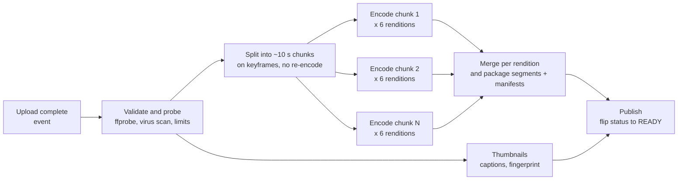

# Video Transcoding Pipeline

## 1. One-line summary

**Transcoding** turns the one video file a user uploaded into the many files viewers actually stream (several resolutions and bitrates, sometimes several codecs, cut into segments); at scale it runs as a **DAG of small, idempotent tasks** (validate → split into chunks at keyframes → encode each chunk per rendition in parallel → merge and package → thumbnails and captions → publish), so a 10-minute video is ready in about a minute instead of an hour.

💡 A **DAG** (directed acyclic graph) is a set of tasks with "must run after" arrows and no loops. If you've used Argo Workflows, Airflow or a CI pipeline with dependent jobs, you've run one.

---

## 2. The problem it solves

**The pain:** uploads arrive in every format phones and cameras produce: a 4K HEVC `.mov` from an iPhone, a 720p `.avi` from an old camera, a 3 GB screen recording. Viewers need something else: a [bitrate ladder](adaptive-bitrate-streaming.md) of renditions (240p to 1080p+) in codecs their devices can decode, cut into keyframe-aligned segments.

Doing it naively, one `ffmpeg` process per upload on one machine:

```
10-minute 1080p video, 6 renditions
assume one 4-vCPU worker encodes 1 second of video per 1 second, per rendition (1× real time)
600 s × 6 renditions = 3,600 s = 1 hour before the video can be published
```

A creator waiting an hour for a 10-minute video is unacceptable, and one crash at minute 55 restarts everything.

**The fix:** split the work into chunks and renditions, run them in parallel on many workers, and make every task safe to retry.

> Infra analogy: this is a batch job fan-out, like a k8s `Job` with `parallelism: 60` where each pod processes one shard, plus a final "reduce" step. The orchestration problems are ones you know: retries, poison inputs, priorities, autoscaling worker pools on queue depth.

---

## 3. How it works

### 3.1 Codec vs container

People say "an MP4 video" but two separate things are involved:

- A **codec** (coder-decoder) is the compression algorithm for the picture or sound itself. It decides quality per bit and how expensive encoding is.
- A **container** is the file format that wraps compressed streams (video, audio, subtitles) together with timing and index information. Think of it as the envelope; the codec is the language of the letter.

| Codec | Year | Compression vs H.264 (same quality, rough) | Notes |
|---|---|---|---|
| **H.264 / AVC** | 2003 | baseline | Plays on everything. Default safe rung. |
| **H.265 / HEVC** | 2013 | ~40–50% smaller | Patent licensing is messy; strong on Apple devices and TVs. |
| **VP9** | 2013 (Google) | similar to HEVC | Royalty-free, widely used by YouTube in browsers. |
| **AV1** | 2018 (AOMedia) | ~30% smaller than VP9/HEVC | Royalty-free; much slower to encode in software. |

| Container | Typically holds | Used for |
|---|---|---|
| **MP4** (ISO base media file) | H.264/HEVC/AV1 + AAC audio | downloads, uploads, progressive playback |
| **WebM** | VP9/AV1 + Opus audio | browsers |
| **MPEG-TS** (`.ts`) | H.264 + AAC | classic HLS segments, broadcast TV |
| **fragmented MP4** (fMP4, `.m4s`) | any of the above | modern HLS and DASH segments ([CMAF](adaptive-bitrate-streaming.md)) |

Changing only the container (**remuxing**) is cheap: bytes are copied (`ffmpeg -c copy`). Changing the codec, resolution or bitrate (**transcoding**: decode to raw frames, then re-encode) is the expensive CPU work.

### 3.2 Keyframes and GOPs (why you can only cut in some places)

Video compression stores most frames as *differences*:

- An **I-frame** (keyframe) is a complete picture.
- **P-frames** store changes from earlier frames, **B-frames** from frames before and after.
- A **GOP** (group of pictures) is one keyframe plus the dependent frames up to the next keyframe.

The frame types of the first 2 s of the test video (real `ffprobe` output, 30 fps, keyframe every 60 frames):

```text
IPPPPPPBPBBPPBBPPBBPBBBPBBPBBBPBBPPBBPPBBBPBBBPBBBPBBBPBPBBP I BPBBBP...
```

You can only start decoding at an I-frame, so **chunks and segments must start on keyframes**. That's why encoders for streaming are told to place a keyframe at a fixed interval (`-g 48 -keyint_min 48 -sc_threshold 0`: every 48 frames, i.e. every 2 s at 24 fps, and don't add extra ones on scene cuts). With the same interval in every rendition, segment boundaries line up and the player can switch between rungs.

### 3.3 The DAG



1. **Validate / probe**: read codec, duration, resolution with `ffprobe`. Reject corrupt files, files over limits, and run copyright and abuse checks ([content fingerprinting](content-fingerprinting-and-dedup.md)). Cheap, so failing here saves money.
2. **Split**: cut the source into chunks of ~10 s *without* re-encoding (`-c copy`), so it takes seconds. Chunks end at the next keyframe, so lengths vary.
3. **Encode**: one task per (chunk, rendition). This is 95%+ of the CPU.
4. **Merge / package**: concatenate each rendition's chunks, then cut into streaming segments and write HLS/DASH manifests ([ABR](adaptive-bitrate-streaming.md)).
5. **Side branches**: thumbnails, auto-captions (speech-to-text), audio normalisation, fingerprinting. They run in parallel with encoding.
6. **Publish**: write files to [object storage](../technologies/object-storage.md), flip the video's state `PROCESSING → READY` ([state machines](../../LLD/concepts/state-machines.md)), notify the uploader.

Orchestration: a workflow engine (or a DB table of tasks plus [message queues](../technologies/message-queues.md)/[Kafka](../technologies/kafka.md)) tracks which tasks are done and starts the next step when all its inputs exist. The whole thing is a long-running workflow, closer to a [saga](sagas-and-distributed-transactions.md) than to a database transaction.

### 3.4 Commands (run here with ffmpeg 6.1.1)

Split on keyframes without re-encoding:

```bash
ffmpeg -i input.mp4 -c copy -map 0 -f segment -segment_time 10 -reset_timestamps 1 chunk_%03d.mp4
```

On a 20 s test video with a keyframe every 2 s this produced two chunks of **12.02 s and 8.00 s**, not 10 + 10: a reminder that chunk boundaries depend on where the keyframes actually are.

Make a 3-rendition HLS ladder in one pass (decode once, scale three ways, encode three times):

```bash
ffmpeg -i input.mp4 \
  -filter_complex "[0:v]split=3[v1][v2][v3];[v1]scale=w=1920:h=1080[v1o];[v2]scale=w=1280:h=720[v2o];[v3]scale=w=640:h=360[v3o]" \
  -map "[v1o]" -c:v:0 libx264 -b:v:0 5000k -maxrate:v:0 5350k -bufsize:v:0 7500k \
  -map "[v2o]" -c:v:1 libx264 -b:v:1 2800k -maxrate:v:1 3000k -bufsize:v:1 4200k \
  -map "[v3o]" -c:v:2 libx264 -b:v:2 800k  -maxrate:v:2 856k  -bufsize:v:2 1200k \
  -map a:0 -map a:0 -map a:0 -c:a aac -b:a 128k -ac 2 \
  -preset veryfast -g 48 -keyint_min 48 -sc_threshold 0 -r 24 \
  -f hls -hls_time 4 -hls_playlist_type vod -hls_segment_type mpegts \
  -hls_segment_filename "v%v/seg_%03d.ts" -master_pl_name master.m3u8 \
  -var_stream_map "v:0,a:0 v:1,a:1 v:2,a:2" "v%v/index.m3u8"
```

It wrote `master.m3u8` plus `v0/`, `v1/`, `v2/` with 4 s segments (the playlists are shown in [ABR](adaptive-bitrate-streaming.md)). `-maxrate`/`-bufsize` cap bitrate peaks so a rung never bursts far above its advertised `BANDWIDTH`. Use `-hls_segment_type fmp4` for CMAF-style `.m4s` segments. Thumbnails, one every 5 s: `ffmpeg -i input.mp4 -vf "fps=1/5,scale=320:-2" thumb_%03d.jpg` (4 JPEGs for 20 s).

Measured speed on this 4-vCPU container: encoding a 12 s 1080p chunk to 720p H.264 (`-preset medium`) took **6.1 s**, about 2× real time. Treat that as one data point: speed varies hugely with codec, preset, content and hardware.

### 3.5 Time and cost arithmetic

A 10-minute 1080p upload, 6 renditions, 10 s chunks, assuming each (chunk, rendition) task takes **10 s** on one 4-vCPU worker (1× real time averaged over rungs; the 1080p rung is slower, 240p much faster):

```
chunks       = 600 s / 10 s        = 60
tasks        = 60 × 6 renditions   = 360
total work   = 360 × 10 s          = 3,600 worker-seconds = 1 worker-hour

1 worker:      360 tasks × 10 s = 3,600 s = 60 min
60 workers:    360 / 60 = 6 waves × 10 s = 60 s  + split ~10 s + merge/package ~10 s ≈ 80 s
360 workers:   1 wave = 10 s                      + ~20 s overhead                 ≈ 30 s
```

Doubling workers from 60 to 120 cuts the encode from 6 waves to 3 (saves 30 s); tripling again to 360 saves only 20 s more. Past that, split, merge and scheduling overhead dominate, so more workers stop helping.

Cost, with an assumed (illustrative) price of $0.04 per vCPU-hour:

```
1 worker-hour × 4 vCPU × $0.04 = $0.16 per 10-minute video
```

Parallelism changes the **wait**, not the **bill**: 1 worker for 60 min and 60 workers for 1 min cost the same CPU.

At platform scale, using the widely quoted YouTube figure of ~500 hours uploaded per minute (2019, not verified here):

```
500 h/min = 30,000 video-minutes per minute
our assumption: 1 video-minute × 6 renditions = 6 worker-minutes
30,000 × 6 = 180,000 workers busy all the time (before AV1, which costs several times more)
```

That's why big platforms invest in better encoders and custom hardware.

### 3.6 Idempotent retries

Workers die (spot instances, cheap cloud VMs the provider can take back at short notice, get reclaimed, pods get OOM-killed for exceeding their memory limit). Each task must be safe to run twice ([idempotency](idempotency-and-delivery-semantics.md)):

- **Deterministic output key**: `videos/{videoId}/{rendition}/chunk_{n}.mp4`. A retry overwrites the same object with the same content; nothing duplicates.
- **Mark done after the write**: task row `PENDING → RUNNING → DONE` updated only once the output exists. A lost "done" message just causes a harmless re-run.
- **Lease/visibility timeout**: if a worker stops heartbeating, the task becomes visible again (Amazon SQS calls this the visibility timeout, [message queues](../technologies/message-queues.md)).
- **Retry with backoff, then dead-letter**: a chunk that crashes the encoder three times is a poison input; send it to a DLQ and fail the video with a clear error instead of looping forever ([retries, backoff and DLQ](retries-backoff-and-dlq.md)).
- **Merge waits for all chunks**: the merge step checks that chunks 0..N-1 exist for every rendition, so a duplicate or late task can't produce a half video.

### 3.7 Priorities

Not every upload is equally urgent:

| Queue | Example | Policy |
|---|---|---|
| High | a big creator's upload with a million subscribers waiting, a live replay | dedicated capacity, process first |
| Normal | ordinary uploads | bulk of capacity |
| Low / batch | re-encoding the old catalog to AV1, extra 4K rungs added later | spot instances, only spare capacity |

Use separate queues or a priority field, plus a guaranteed share for low priority so it isn't starved forever. A common trick: encode a **fast, low-quality rung first** so the video can go live in seconds, then add higher rungs and better codecs in the background.

### 3.8 Per-title encoding

A fixed ladder wastes bits: a simple cartoon looks perfect at 1080p with far fewer bits than a grainy action film. Netflix described **per-title encoding** in December 2015 (tech blog "Per-Title Encode Optimization"): run trial encodes of each title at many resolution/bitrate points, measure visual quality, and build a ladder for that title from the best points. Their earlier fixed ladder topped out at 5,800 kbps for 1080p; per-title ladders let simple content use much less. They later moved to per-shot optimisation (2018, "Dynamic Optimizer"). The extra trial encodes cost CPU once; the bandwidth savings repeat for every view, which pays off for popular titles.

### 3.9 Hardware: GPUs and ASICs

Software encoders (x264, x265, libaom/SVT-AV1: open-source encoder libraries for H.264, HEVC and AV1) run on CPUs and give the best quality per bit. **GPU encoders** (e.g. NVIDIA NVENC) are much faster and cheaper per stream at slightly lower quality per bit, common for live. The biggest platforms built **ASICs** (chips designed for one job): Google announced its "Argos" video coding unit for YouTube in 2021, and Meta its MSVP chip in 2023 (both company claims of large efficiency gains, not independently verified here).

---

## 4. When to use it

- **User-generated video** (YouTube, Instagram, Loom): unpredictable inputs, need for ABR outputs.
- **Media libraries** re-encoded when a new codec or device appears.
- **Live streaming**: the same steps run continuously on a live feed (no split/merge: segments are encoded as they arrive).

## 5. When NOT to use it (and why it's a mistake)

| Situation | Why |
|---|---|
| Inputs already in the right codec/format | Remux (`-c copy`) or serve as-is. Re-encoding burns CPU and loses quality. |
| A few short internal videos | One `ffmpeg` call per file or a managed service (AWS MediaConvert and similar) beats building a DAG. |
| Chunk-parallel encoding of very short clips | For a 15 s clip, split/merge overhead exceeds the encode time. Encode it whole. |
| Archival masters | Keep the original upload untouched; transcode copies for viewing. |

---

## 6. Commonly confused with

| | **Transcoding** | **Transmuxing / remuxing** | **Packaging** | **Transrating** |
|---|---|---|---|---|
| What changes | codec, resolution and/or bitrate | container only | segments + manifests (HLS/DASH) | bitrate only, same codec |
| CPU cost | high | tiny | small | high |
| Example | 4K HEVC → 720p H.264 | `.mov` → `.mp4`, `-c copy` | MP4 → `.m4s` segments + `.m3u8` | 5 Mbps 1080p → 3 Mbps 1080p |

---

## 7. Common mistakes / misuse

1. **Splitting chunks at arbitrary times** instead of keyframes: broken frames at every boundary.
2. **Different keyframe intervals per rendition**: segments don't align, ABR switching glitches.
3. **One monolithic job per video**: no parallelism, and a crash restarts everything.
4. **Non-deterministic output paths** (random UUID per attempt): retries leave orphaned files and duplicates.
5. **Deleting the original after transcoding**: you can't re-encode for a new codec or fix a bad ladder later.
6. **Ignoring cost**: transcoding every upload into every codec, even videos nobody watches. Encode cheap rungs first, add expensive ones (AV1, 4K) when a video gets popular.
7. **Treating "uploaded" as "playable"**: the client needs a `PROCESSING` state and a notification when it becomes `READY`.

---

## 8. Interview cheat-sheet

> "When the upload completes, an event starts a transcoding workflow: probe and validate, split the source into roughly 10-second chunks at keyframes without re-encoding, then fan out one task per chunk and rendition to a worker pool, then merge each rendition and package HLS or DASH segments with manifests, with thumbnails and captions in parallel. A 10-minute video with 6 renditions is 360 tasks, about one worker-hour of CPU, so with 60 workers it's ready in under two minutes, and the cost is the same either way. Every task writes to a deterministic object key so retries are idempotent, failures retry with backoff and land in a DLQ, and the merge waits until every chunk exists. I'd keep separate priority queues so a backlog of catalog re-encodes never delays fresh uploads, and I'd mention per-title encoding to cut bandwidth on popular videos."

---

## 9. Used in

- [Video Streaming](../interviews/video-streaming/README.md): the upload-to-playable pipeline, the chunked DAG, worker pool sizing, and the processing state shown to the uploader.
- [Case study: video upload, transcode and storage](../../case-studies/video-upload-transcode-and-storage.md): how real platforms run their pipelines.
- Related: [adaptive bitrate streaming](adaptive-bitrate-streaming.md), [resumable and chunked uploads](resumable-and-chunked-uploads.md), [object storage](../technologies/object-storage.md), [message queues](../technologies/message-queues.md), [retries, backoff and DLQ](retries-backoff-and-dlq.md), [idempotency](idempotency-and-delivery-semantics.md), [content fingerprinting](content-fingerprinting-and-dedup.md), [sagas](sagas-and-distributed-transactions.md).
