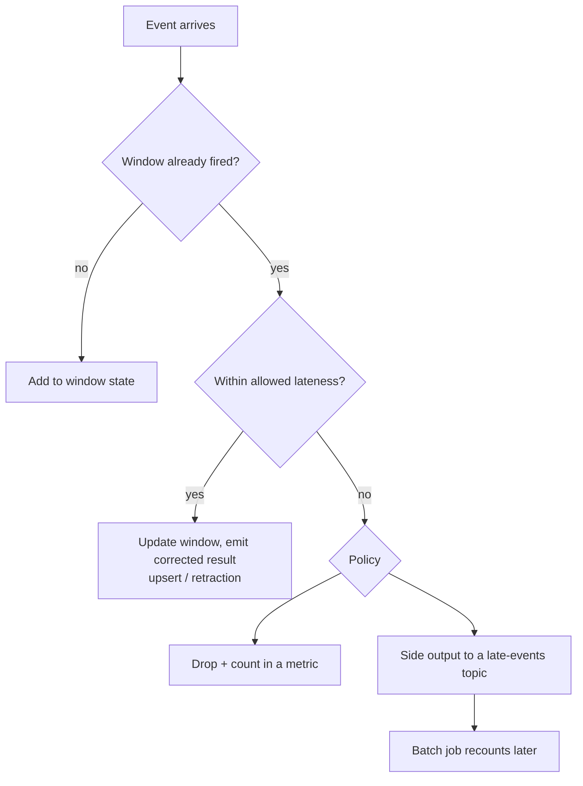

# Windowing, Watermarks and Late Events

## 1. One-line summary

**Windowing** chops an endless stream of events into finite buckets of time ("clicks per ad per minute") so you can aggregate them; **event time** says which bucket an event belongs to by when it *happened*, and a **watermark** is the processor's running guess that "no more events older than time T will arrive", which tells it when a bucket can be closed and its result emitted. Events that show up after that guess are **late events** and need an explicit policy: drop, side-output, or update the result.

💡 *Stream*: an endless flow of events (clicks, log lines, GPS pings) that never "finishes", so you can never say "wait for all the data, then sum". See [stream processing](../technologies/stream-processing.md) for the engines that run this.

---

## 2. The problem it solves

**The pain:** an ad platform wants "clicks per ad per minute". A user clicks at **10:00:59** on a phone with a bad connection. The event sits in the app's retry buffer and reaches the server at **10:01:07**, 8 seconds later. Two clocks now disagree:

- **Event time**: when the click actually happened (stamped on the device or edge server): 10:00:59.
- **Processing time**: when our pipeline saw it: 10:01:07.

If we bucket by processing time, this click lands in the 10:01 minute: the 10:00 count is **too low**, the 10:01 count **too high**, and advertisers are billed wrongly. Re-running the job tomorrow would even give a *different* answer, because arrival times differ run to run. Bucketing by **event time** gives the same answer every time, but creates a new puzzle: **when is the 10:00 bucket finished?** Another straggler might still be on a train in a tunnel.

Infra analogy: scraping metrics. A Prometheus sample has the timestamp of the scrape, but a log line shipped through a queue carries its original timestamp. If you graph logs by *arrival* time, a 3-minute outage in the log shipper shows up as a fake traffic spike when the backlog drains. Same bug.

💡 *Late event* (a.k.a. out-of-order event): an event whose event time is older than events the pipeline has already processed. Mobile clients, retries, multi-region links and Kafka partitions consumed at different speeds all cause it.

---

## 3. How it works

### 3.1 The three window types

| Window | Shape | Example | Each event belongs to |
|---|---|---|---|
| **Tumbling** | Fixed size, no overlap, back to back | clicks per ad per minute | exactly 1 window |
| **Hopping / sliding** | Fixed size, a new one starts every *hop* (hop < size), so they overlap | "last 5 min, refreshed every 1 min" | size ÷ hop windows |
| **Session** | Variable size; closes after a *gap* of inactivity per key | a user's browsing session with a 30-min gap | exactly 1 session (sessions can merge) |

```mermaid
gantt
    title Same events, three window types (minutes on x-axis)
    dateFormat HH:mm
    axisFormat %H:%M
    section Tumbling 1 min
    W 10:00-10:01 :t1, 10:00, 1m
    W 10:01-10:02 :t2, 10:01, 1m
    W 10:02-10:03 :t3, 10:02, 1m
    section Hopping 3 min / hop 1 min
    W 10:00-10:03 :h1, 10:00, 3m
    W 10:01-10:04 :h2, 10:01, 3m
    W 10:02-10:05 :h3, 10:02, 3m
    section Session (gap 2 min)
    Session A (3 clicks) :s1, 10:00, 90s
    Session B (after gap) :s2, 10:04, 60s
```



- **Tumbling** is the workhorse of billing and dashboards: simple, each click counted once.
- **Hopping** costs more: with size 5 min and hop 1 min every event is added to **5 windows**, so 5× the state and the writes. Use it for smooth "moving average" graphs; for the ad-click case you can usually compute 1-minute tumbling counts and let the *query* sum the last 5.
- **Session** windows have no fixed grid, so the engine must merge windows when a late event bridges two sessions. Good for user behaviour ("how long was this visit"), rare in billing.

### 3.2 Event time and the watermark

Every event carries an **event timestamp**. The engine keeps a window open per `(key, window)`, e.g. `(ad_42, 10:00)`, and adds each event to the window its *event time* maps to, regardless of arrival order.

To decide when `(ad_42, 10:00)` is complete, the engine tracks a **watermark**: a number that flows through the pipeline meaning *"I believe every event with event time ≤ W has now arrived."* When the watermark passes the window's end (10:01:00), the window **fires**: the result is emitted and (normally) the state is freed.

The most common heuristic, used by Flink's "bounded out-of-orderness" strategy:

```
watermark = max event time seen so far − allowed out-of-orderness
```

Worked example with allowed out-of-orderness = **10 s**: the newest event seen is 10:01:07 → watermark = 10:00:57. Window 10:00 (ends 10:01:00) is **not** closed yet (10:00:57 < 10:01:00). Once an event with time ≥ 10:01:10 arrives, the watermark is ≥ 10:01:00 and the window fires. So the 10:00:59 click that arrived at 10:01:07 is **still counted**: that is exactly what the 10 s of slack buys.

💡 *Watermark with many partitions*: a Kafka topic has many partitions ([consumer groups](consumer-groups-and-rebalancing.md)) and each has its own newest time. The operator's watermark is the **minimum** across inputs, so one slow or idle partition holds everything back. Engines offer an "idle source" timeout so a quiet partition does not stall the whole job forever.

### 3.3 Seeing it run (a short simulation)

We ran a ~35-line Java simulation (tumbling 60 s windows, allowed out-of-orderness 10 s, one count per window). Events are `(event time, arrival time)` in seconds; the last one is 28 s late.

```
arrive 56s event 55s -> window 0, watermark=45
arrive 59s event 58s -> window 0, watermark=48
arrive 63s event 62s -> window 60, watermark=52
arrive 67s event 59s -> window 0, watermark=52       <- 8 s late, still accepted
arrive 71s event 70s -> window 60, watermark=60
   watermark passed 60: emit window [0,60) count=3   <- window fires
arrive 85s event 57s -> window [0,60) already closed: LATE, side output
final {0=3, 60=2}
```

The core of the logic (the full file is just a loop around this):

```java
long window = c.eventSec() / 60 * 60;                    // event-time bucket
if (closed.contains(window)) { /* late: side output */ continue; }
counts.merge(window, 1, Integer::sum);
maxSeen = Math.max(maxSeen, c.eventSec());
long watermark = maxSeen - allowedLateness;              // the heuristic
for (long w : counts.keySet())
    if (w + 60 <= watermark && closed.add(w)) emit(w, counts.get(w));
```

Note the 8 s-late event was counted, and the 28 s-late one was not. Whatever the heuristic, **some event is always later than the guess**. That is not a bug in watermarks; it is the nature of the problem, so we need a policy.

### 3.4 What to do with late events



| Policy | How | Pros | Cons |
|---|---|---|---|
| **Drop** | Ignore, but increment a "dropped_late" metric | Simplest, no extra state | Silent under-counting; fine for dashboards, bad for billing |
| **Side output** | Send to a separate topic/stream | Nothing lost; a batch recount or manual fix can apply it | Needs a consumer and a merge story |
| **Update the result** | Keep the window's state a while longer; on a late event, recompute and emit a *correction* | Final numbers converge to the truth | Downstream must accept corrections |

Corrections come in two flavours. An **upsert**: write `(ad_42, 10:00) = 1,043` again to a sink keyed by `(ad, window)`, overwriting the earlier `1,042` (see [idempotent sinks](idempotency-and-delivery-semantics.md)). A **retraction**: emit "retract old value 1,042" then "new value 1,043", needed when downstream also aggregates the result and must subtract the stale number. For ad-click counts, upserts into an OLAP table are almost always enough.

### 3.5 The allowed-lateness trade-off, with arithmetic

Keeping windows open longer catches more stragglers but costs **memory** (state is the bucket-per-key table the engine holds until the window is closed, kept in a local store such as RocksDB and snapshotted by checkpoints, see [stream processing](../technologies/stream-processing.md)).

```
open windows per key  = (window size + allowed lateness) / window size
state entries         = open windows per key × active keys
```

Say **2 million active ads**, 1-minute windows, ~64 bytes per `(ad, window)` counter entry:

| Allowed lateness | Open windows per ad | State entries | Memory |
|---|---|---|---|
| 10 s | (60+10)/60 ≈ 2 (rounded up) | 2 × 2,000,000 = 4,000,000 | 4,000,000 × 64 B ≈ **256 MB** |
| 5 min | (60+300)/60 = 6 | 6 × 2,000,000 = 12,000,000 | ≈ **768 MB** |
| 1 hour | (60+3600)/60 = 61 | 61 × 2,000,000 = 122,000,000 | ≈ **7.8 GB** |

Spread over e.g. 20 workers the 1-hour case is ~390 MB each: affordable. But the real cost of long lateness is **latency**: a window cannot be *finalised* until the watermark passes `end + lateness`. With 1 hour of lateness, "final" numbers lag an hour. The usual compromise: emit an **early/approximate** result at window end (with small lateness, say 10 s), keep updating for a few minutes, and let a [batch recount](lambda-vs-kappa-architecture.md) fix the long tail.

### 3.6 Checkpoints and state, briefly

The per-window counters live in the engine's local state store. To survive a crash, the engine periodically takes a **checkpoint**: a consistent snapshot of state plus the Kafka offsets it had read up to. After a failure it restores the snapshot and re-reads from those offsets, so each event affects the state once. Watermarks are part of this restored progress. Details and the exactly-once story are in [stream processing](../technologies/stream-processing.md) and [idempotency and delivery semantics](idempotency-and-delivery-semantics.md).

---

## 4. When to use it

- Any aggregation over time on a stream: clicks per minute, errors per 5 minutes, orders per hour. Tumbling for reports and billing, hopping for smooth trend lines, session for user-journey analytics.
- Whenever events can arrive out of order (mobile, multi-region, retries) and the result must be **reproducible**: use event time.
- When the answer must converge to the truth: allowed lateness plus upserts, with a batch recount as a backstop.

## 5. When NOT to use it

- **Processing-time windows for correctness-sensitive numbers.** They are fine for "how busy is my consumer right now" (an ops metric), but wrong for billing: replaying the same data gives different results.
- **A huge allowed lateness "to be safe".** It inflates state (table above) and delays every result. Pick it from the measured lateness distribution (e.g. p99.9 = 20 s) and send the remainder to a recount.
- **Windowing when you need all-time totals.** A running counter per key ([counters at scale](counters-at-scale.md)) is simpler than a window that never closes.
- **Event time from untrusted clients.** A phone with the clock set to 2035 pushes `max event time` forward and slams every window shut (or opens windows in the far future). Prefer a server-side or edge timestamp, or clamp client times to "now ± a few minutes".

## 6. Commonly confused with

| Pair | Difference |
|---|---|
| Event time vs processing time | When it *happened* vs when we *saw* it. Billing needs the first. |
| Watermark vs checkpoint | Watermark = progress in *event time* ("how complete is time T"). Checkpoint = a fault-tolerance *snapshot* of state and offsets. |
| Allowed lateness vs watermark delay | Both add slack. Watermark delay postpones the *first* firing; allowed lateness keeps state *after* firing so later events still update the result. |
| Tumbling vs hopping | No overlap vs overlap; hopping multiplies state and writes by size ÷ hop. |
| Window vs batch job | A batch job has a start and an end of input; a window emits results while input keeps flowing. |

## 7. Common mistakes / misuse

- Bucketing with `System.currentTimeMillis()` in the processing code, then wondering why a replay changes the totals.
- Forgetting the **idle partition** problem: one empty Kafka partition freezes the watermark, windows never fire, and memory grows.
- Dropping late events with no metric. Always count them; the late-drop rate is your data-quality gauge.
- Emitting a correction to a sink that *appends* rather than upserts, so the same window appears twice and the dashboard double counts.
- Hopping windows with a tiny hop (1 s hop, 1 h size = 3,600 windows per event). Precompute small tumbling windows and combine at query time.
- Treating the watermark as a guarantee. It is a heuristic; design for the event that violates it.

## 8. Interview cheat-sheet

"I aggregate by **event time**, not processing time, so a click at 10:00:59 that arrives at 10:01:07 still counts in the 10:00 window and replays give the same answer. I use **1-minute tumbling windows** per ad. A **watermark** of max-seen-time minus about 10 seconds decides when a window closes; I pick the 10 seconds from the measured lateness percentiles. Events later than that go to a **side output**, and a **batch recount** fixes them, while small lateness is handled by **upserting** corrected counts into the sink. Longer lateness costs state, since open windows per key times number of keys is the memory bill, and it delays finality, so I trade the two explicitly."

## 9. Used in

- [Ad click aggregation, overview](../interviews/ad-click-aggregation/README.md)
- [Ad click aggregation, L4](../interviews/ad-click-aggregation/L4-mid.md): tumbling-window counts per ad per minute
- [Ad click aggregation, L5](../interviews/ad-click-aggregation/L5-senior.md): event time, watermarks, late events
- [Ad click aggregation, L6](../interviews/ad-click-aggregation/L6-staff.md): correctness as billing
- [Metrics and monitoring](../interviews/metrics-monitoring/README.md): late-arriving samples and rollups
- [Stream processing](../technologies/stream-processing.md), [Kafka](../technologies/kafka.md)
- Sibling concept: [Lambda vs Kappa architecture](lambda-vs-kappa-architecture.md)

**Sources**: Akidau et al., "The Dataflow Model" (VLDB 2015) introduced the event-time / watermark / trigger vocabulary; Apache Flink documentation on event time, watermarks and allowed lateness. Exact API names differ per engine.
