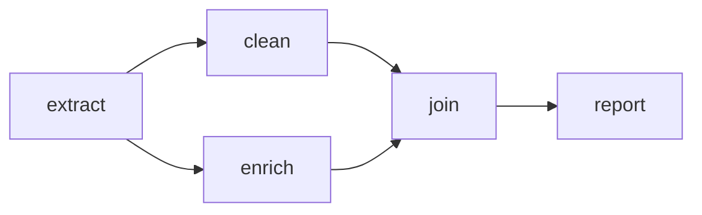
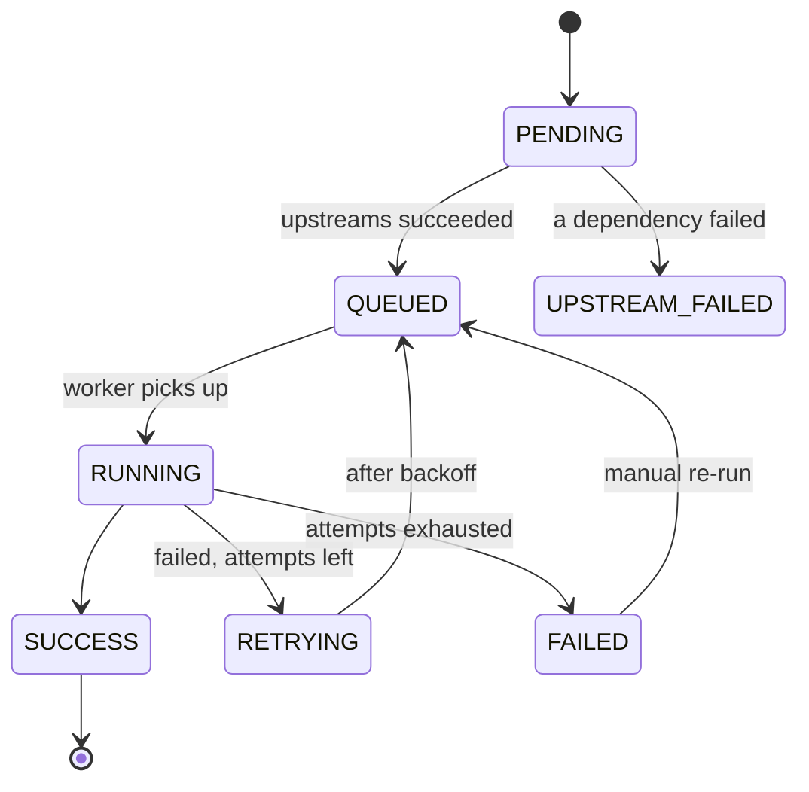
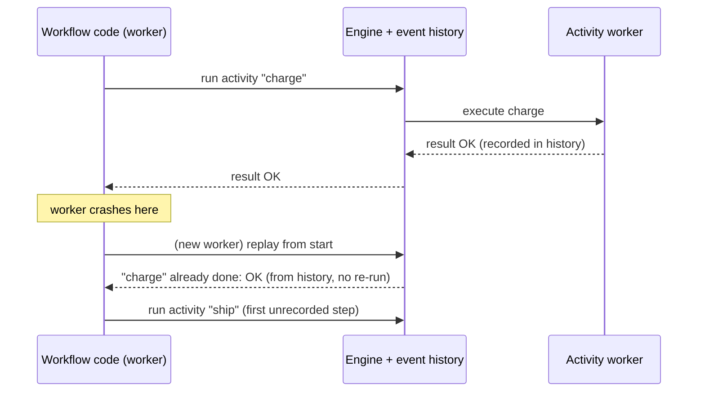

# Workflow Orchestration and DAGs

## 1. One-line summary

A **workflow orchestrator** runs a set of tasks that depend on each other, in a valid order, tracking each task's state and retrying failures; the dependencies are usually a **DAG** (directed acyclic graph), and modern "durable execution" engines like Temporal go further by recording every step in a history so the workflow can resume exactly where it left off after any crash.

## 2. The problem it solves

A nightly report needs: `extract` raw data, then `clean` and `enrich` it (independent of each other), then `join` the two results, then `report`. A scheduler that only knows "run X at 02:00" cannot express "run `join` only after both `clean` and `enrich` succeeded; if `enrich` fails, retry it three times but don't re-run `extract`; tomorrow, re-run last Tuesday's data". Without an orchestrator, people chain cron jobs with `sleep 3600` and hope. When step 2 is slow, step 3 reads half-written data.

The orchestrator adds three things on top of [distributed scheduling](distributed-scheduling-and-time-buckets.md) (which decides *when*):

- **Order**: what may start now, given what finished.
- **State**: which tasks are pending, running, succeeded or failed, durable across restarts.
- **Recovery**: retries, resume-from-failure, and re-running history ("backfill").

Infra analogy: it is a CI pipeline (stages with `needs:`), or Kubernetes' dependency ordering for init containers, but for data and business processes, with persistent state.

## 3. How it works

### 3.1 DAGs and topological order

💡 *Graph*: nodes (tasks) joined by edges (dependencies). *Directed*: an edge has a direction, "A before B". *Acyclic*: no loop, so you can never get "A needs B needs A", which would deadlock.



A **topological order** is any listing of tasks where every task comes after everything it depends on. The common algorithm (Kahn's) repeatedly picks tasks whose upstream tasks are all done. Tasks picked in the same round can run **in parallel**. Running Kahn's algorithm on the graph above (a short Java 21 simulation) gives this real output:

```
wave 0 (run in parallel): [extract]
wave 1 (run in parallel): [clean, enrich]
wave 2 (run in parallel): [join]
wave 3 (run in parallel): [report]
with cycle, runnable tasks: [] -> cycle detected: true
```

The last line adds an edge `extract -> report` making a loop: nothing is ever runnable, which is exactly how engines reject cyclic definitions at deploy time. Core loop: `ready = tasks whose upstreams are all SUCCESS and which are still PENDING`.

### 3.2 Task state machine

Each task instance (one task for one run, e.g. `enrich` for 2026-10-08) moves through states. See [state machines](../../LLD/concepts/state-machines.md).



Rules that make it safe: transitions are written to a database with a conditional update (`UPDATE ... SET state='RUNNING' WHERE id=? AND state='QUEUED'`), so two schedulers can't both start it; a worker that stops sending heartbeats gets its task moved back to `QUEUED` (see [presence and heartbeats](presence-and-heartbeats.md)).

### 3.3 Retries per task, not per workflow

Each task has its own `max_attempts`, backoff and timeout (see [retries, backoff and DLQ](retries-backoff-and-dlq.md)). If `enrich` fails on attempt 1, only `enrich` is retried, and `extract`'s output is reused. Tasks that exhaust retries go to FAILED and block only their descendants (`join`, `report`); unrelated branches continue.

### 3.4 Backfills

A **backfill** = run the same DAG for past dates (e.g. you fixed a bug and need the last 30 days recomputed). Each run is identified by its **logical date** (the data interval it processes, not the wall-clock time it runs). Arithmetic: 30 days × 4 tasks = 120 task runs; with a concurrency cap of 5 runs at a time that is 30 ÷ 5 = 6 waves of whole-DAG runs. Backfills make the worker side compete with live traffic, so they get lower priority and a concurrency limit.

### 3.5 Two architectures

**A. Scheduler-and-state-table (Airflow style).** A scheduler process periodically reads DAG definitions, creates task instances in a metadata database, pushes ready ones to a queue or executor, and workers report status back. The DAG is *data about tasks*; each task body is a separate black box (a script, a SQL query). The scheduler loop and "find ready tasks" query is the same polling pattern as time-bucket scheduling.

**B. Durable execution (Temporal style).** The workflow is **ordinary code** (loops, ifs, variables) and the engine persists an **event history** of everything that happened: activity scheduled, activity completed with result X, timer fired, signal received. After a crash the engine starts the code again on another worker and **replays** it: each time the code calls an activity that already has a recorded result, the engine returns the stored result instead of running it again, until the code reaches the first not-yet-recorded step and continues live.



Consequence: **workflow code must be deterministic** (no `System.currentTimeMillis()`, random, or direct network calls; use the engine's APIs), because replay must take the same path. Side effects live in *activities*, which can run more than once.

### 3.6 The "exactly-once" illusion

Engines advertise "exactly-once workflow execution", but a task that calls an external system can only be **at-least-once**: the worker may complete the side effect (charge the card), then die before reporting success; the engine, seeing no result, retries. So what you actually get is *exactly-once state transitions in the engine* plus *at-least-once side effects*. The fix is on you: **idempotent tasks** (see [idempotency and delivery semantics](idempotency-and-delivery-semantics.md)):

- Pass a deterministic **idempotency key** such as `workflow_id + task_name + logical_date` to the payment/email API.
- Write outputs to a path derived from the logical date and overwrite (`INSERT ... ON CONFLICT DO UPDATE`, or write temp file then atomic rename), never "append".
- For multi-service business flows with compensation (undo steps), see [sagas](sagas-and-distributed-transactions.md).

## 4. When to use it

- Multi-step pipelines with dependencies (ETL, ML training, report generation, data-quality checks).
- Long-running business processes that must survive deploys and crashes: order fulfilment, user onboarding with waits of days, payment retries.
- When you need visibility ("which step is stuck?"), manual re-run, and backfills.
- Fan-out/fan-in: process 1,000 files in parallel, then aggregate.

## 5. When NOT to use it

- **A single independent job**: a plain scheduler plus queue is enough; a DAG engine adds a metadata DB and web UI to operate.
- **Low-latency request paths** (e.g. serving an API call in 50 ms): orchestrators add scheduling latency of hundreds of ms to seconds per task.
- **Very high-throughput small tasks** (100k/s): put that on a stream processor or queue; orchestrate at batch granularity (one task = "process this partition").
- **Dynamic, data-dependent graphs in a static-DAG engine**: use durable execution or dynamic task mapping instead of generating thousands of DAGs.

## 6. Commonly confused with

| Looks similar | Difference |
|---|---|
| Cron / [job scheduler](distributed-scheduling-and-time-buckets.md) | Decides when to start something; no dependencies or per-task state |
| [Saga](sagas-and-distributed-transactions.md) | A pattern for undoing partial work across services; an orchestrator can implement it |
| Message queue + consumers | Moves independent messages; has no notion of "B after A and C" |
| Stream processing | Continuous per-record flow; workflows are finite runs with a start and end |

Product comparison (details change often; treat as a starting point and check current docs):

| | Airflow | Temporal | AWS Step Functions | k8s CronJob + Argo Workflows |
|---|---|---|---|---|
| Model | Python-defined DAG of tasks | Workflow as code, replayed from history | State machine in JSON (Amazon States Language) | CronJob triggers; Argo defines DAG/steps as k8s resources |
| Typical use | Batch data pipelines, schedule-driven | Long-running, event-driven business processes | Orchestrating AWS services, serverless flows | Container-based batch/ML on k8s |
| State store | Metadata DB (Postgres/MySQL) | Persistence DB (Cassandra, MySQL or Postgres) | Managed by AWS | k8s API server (etcd), so large workflows strain it |
| Scheduling | Built-in cron-like schedules, backfills | Schedules exist; main strength is durability, not cron | Triggered by EventBridge schedules or events | k8s CronJob, Argo CronWorkflow |
| Waits of days/months | Poor fit (occupies slots unless deferrable) | Native (durable timers) | Supported up to 1 year for Standard workflows (verify) | Possible but awkward |
| Operate yourself? | Yes, or managed (e.g. MWAA, Cloud Composer) | Yes, or Temporal Cloud | No (fully managed) | Yes (you run k8s) |
| Watch out | Scheduler is a bottleneck at huge DAG counts; task latency | Determinism rules, versioning of running workflows | Per-state-transition pricing, size limits on payloads (about 256 KB, verify) | etcd object size and count limits |

Unverified: managed-service names, the 1-year Step Functions limit, 256 KB payload limit and Temporal's supported databases are from memory of public docs; confirm before quoting in an interview.

## 7. Common mistakes / misuse

- Non-idempotent tasks plus automatic retries: double emails, double charges.
- Passing big data **between** tasks through the engine (XCom-style) instead of via object storage and passing the path.
- Using wall-clock `now()` inside a task instead of the logical date, so a backfill produces today's data 30 times.
- In durable engines: nondeterministic workflow code (random, time, thread sleeps), or changing code while workflows are in flight without versioning, which breaks replay.
- One giant task that does everything, so a failure at step 9 of 10 redoes all 10.
- Cycles or hidden dependencies (task B reads A's table but has no edge), so ordering is only correct by luck.
- No timeouts: a hung task holds its worker slot forever.

## 8. Interview cheat-sheet

"Dependencies form a DAG; I topologically sort it and release a task when all its upstreams are SUCCESS, so independent branches run in parallel. Each task instance has a state machine persisted in a database with conditional updates, and its own retry, backoff and timeout; a failure blocks only its descendants. Runs are keyed by logical date so backfills are just more runs. The engine gives at-least-once task execution, so tasks must be idempotent, using a key like workflow id + task + date. If the process is long-lived or event-driven I'd reach for durable execution like Temporal, where code replays from an event history and therefore must be deterministic. I'd buy rather than build unless scale or control demands it."

## 9. Used in

- [Distributed job scheduler: README](../interviews/distributed-job-scheduler/README.md)
- [L5 senior](../interviews/distributed-job-scheduler/L5-senior.md): DAG and workflow dependencies, exactly-once execution
- [L6 staff](../interviews/distributed-job-scheduler/L6-staff.md): build vs buy (Airflow, Temporal, cloud schedulers)
- [L4 mid-level](../interviews/distributed-job-scheduler/L4-mid.md): retries, timeouts, heartbeats per job
- [LLD: task scheduler](../../LLD/interviews/task-scheduler/README.md): in-process dependency ordering
- Related: [distributed scheduling and time buckets](distributed-scheduling-and-time-buckets.md)
