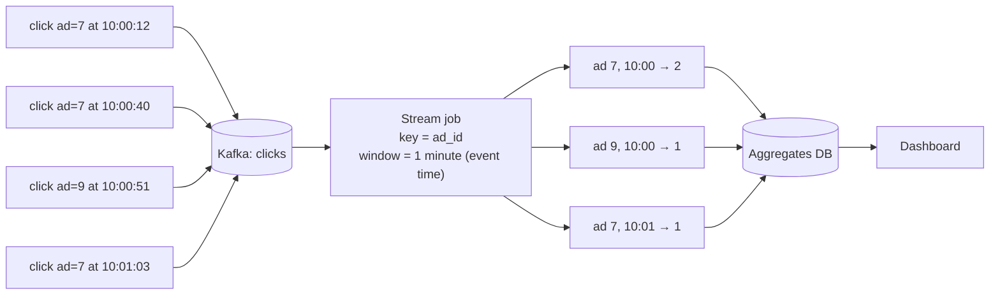

# Start Here: What Is Ad Click Aggregation? (Before the Interview)

> Every time someone clicks an ad, the advertiser pays: often a few rupees per click. A big ad platform sees about a billion clicks a day. Advertisers want a dashboard that says "your ad got 12,408 clicks in the last hour" **within a minute**, and at the end of the month they want an invoice that is **exactly right**. Counting fast and counting correctly are different problems. This interview is about doing both.
>
> Time: ~12 minutes. Then: [L4](L4-mid.md) → [L5](L5-senior.md) → [L6](L6-staff.md).

---

## 1. The story: "Why does the dashboard say 12,408 but the invoice says 12,131?"

A shoe brand runs a sale campaign at ₹4 per click.
- **10:00:** their dashboard shows clicks per minute, live. They raise the budget because clicks look great.
- **10:05:** a bot farm starts clicking their ads. The dashboard counts those clicks too.
- **Next day:** the bot clicks are filtered out. The invoice is 277 clicks lower than the dashboard. The brand asks why.
- **Also:** a phone on a train clicked at 10:00:59, but the click reached the servers at 10:01:07. Which minute does it belong to?
- **And:** a server retried a batch after a timeout. Were those clicks counted twice?

Each of these is an interview question: fast vs correct counts, fraud filtering, event time vs arrival time, duplicates.

---

## 2. Where you've already seen it

| Where | What you saw |
|---|---|
| **Google Ads / Meta Ads dashboards** | Clicks, impressions and spend by hour; "data may be delayed up to 3 hours"; numbers that change slightly later |
| **YouTube Studio / Instagram insights** | "Real-time" views that get adjusted after spam filtering |
| **At work: metrics** | Prometheus counters per minute, Grafana graphs: the same "count events in time buckets" problem ([metrics & monitoring](../metrics-monitoring/README.md)) |
| **Log pipelines** | Kafka → stream job → aggregates in a database |
| **UPI / payments dashboards** | "Transactions per minute" for a merchant |

---

## 3. The features, through situations

### 3.1 "Show clicks per ad per minute, live" → windowed aggregation
Group clicks by ad ID and by one-minute window, count them, and store the result. → L4 §5.2, [windowing & watermarks](../../concepts/windowing-watermarks-and-late-events.md).

### 3.2 "Which minute does a late click belong to?" → event time
A click belongs to the minute it **happened** (event time), not the minute it **arrived**. Late arrivals must still land in the right minute. → L5 §3.1.

### 3.3 "Don't count retried clicks twice" → dedup and exactly-once
Each click has an ID; duplicates from retries are dropped. → L4 §5.4, L5 §3.2.

### 3.4 "Top 10 ads in the last hour" → queries over aggregates
Dashboards query pre-aggregated rows, not raw clicks. → L4 §5.3, [top-k & heavy hitters](../../concepts/top-k-and-heavy-hitters.md).

### 3.5 "The invoice must be exact" → reconciliation
A slower batch job recounts everything from raw logs; billing uses that number. → L5 §3.4, [Lambda vs Kappa](../../concepts/lambda-vs-kappa-architecture.md).

### 3.6 "Bots clicked my ad" → fraud filtering
Suspicious clicks are flagged and excluded from billing. → L5 §3.5.

---

## 4. The key mechanism: count in time windows, as events stream by

The raw clicks are also archived. They're the source of truth for recounts, audits and billing.

---

## 5. Try it yourself

- **Google Ads or Meta Ads Manager** (if you have access): compare "today" numbers in the morning and again the next day. Watch them change after filtering.
- **At work:** find a Grafana panel showing `rate(...[1m])` and think of it as "events per one-minute window".
- **Kafka Streams / Flink quickstarts** both include a windowed word-count example. It's the same job with "word" replaced by "ad ID".

---

## 6. From experience to requirements

| What people experience | Requirement |
|---|---|
| Live dashboard within a minute | **NF:** end-to-end latency ≤ ~1 min |
| Clicks in the right minute | **F:** event-time windows; late events handled |
| No double counting | **F:** dedup by click ID; **NF:** exactly-once aggregation |
| Correct invoices | **F:** batch recount + reconciliation; raw data retained |
| Top ads, filters by country/device | **F:** query aggregates by dimensions |
| Bots don't cost money | **F:** fraud filtering before billing |
| Billions of clicks a day | **NF:** horizontal scale; handle hot ads |

---

## 7. Mini glossary

| Term | Plain meaning |
|---|---|
| Impression / click | The ad was shown / the ad was clicked |
| Aggregation | Turning many events into a few numbers (count per ad per minute) |
| Window | A time bucket for grouping events (e.g. each minute) |
| Event time / processing time | When it happened / when our system saw it |
| Watermark | The stream job's estimate of "I've now seen everything up to time T" |
| Late event | An event arriving after its window was considered complete |
| OLAP store | A database built for fast analytical queries over many rows (Druid, Pinot, ClickHouse) |
| Reconciliation | Comparing fast numbers with a slower exact recount and fixing differences |

➡️ Next: [README.md](README.md) · then [L4-mid.md](L4-mid.md)
