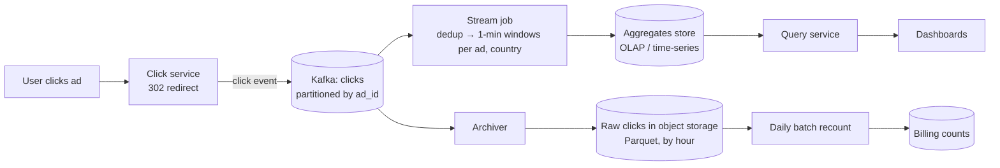

# Ad Click Aggregation — L4 (Mid-level / SDE2) Interview

> **Level expectation:** a working streaming design:
> - clicks ingested into [Kafka](../../technologies/kafka.md);
> - a stream job counting **clicks per ad per minute**;
> - results stored where dashboards can query them quickly;
> - raw events kept for recounts;
> - duplicates removed.
>
> Clear estimates and a clean data flow matter more than streaming theory, which is L5.

> 🆕 Read [00-understand-the-product.md](00-understand-the-product.md) first: "the dashboard says 12,408 but the invoice says 12,131".

Legend: **🧑‍💼 Interviewer** · **🧑‍💻 Candidate** · **📝 Note** = commentary for you.

---

## 1. Clarifying requirements

**🧑‍💼 Interviewer:** Design a system that aggregates ad clicks for advertisers' dashboards and billing.

**🧑‍💻 Candidate:** Questions:
- **Queries:** clicks per ad over the last M minutes? Top N ads? Filters by country, device?
- **Freshness:** how stale can the dashboard be?
- **Correctness:** is the dashboard number used for billing, or is there a separate billing count?
- **Scale:** clicks per day, number of ads, peak?
- **Retention:** how long do we keep minute-level data and raw clicks?

**🧑‍💼 Interviewer:** Clicks per ad per minute and top-N ads over the last M minutes, filterable by country. Dashboard within about a minute. Billing must be exact but can be daily. 1B clicks/day, 2M active ads. Keep raw clicks for 1 year.

**🧑‍💻 Candidate:**

**Functional**
1. Ingest click events (click ID, ad ID, user/device, country, timestamp).
2. Count clicks per ad per minute (and per country).
3. Query: clicks for ad X between T1 and T2; top N ads in the last M minutes.
4. Exact daily counts per ad for billing.

**Non-functional**
1. Dashboard freshness ≤ ~1 minute.
2. No double counting; no lost clicks.
3. Scale to peaks of several times the average.
4. Raw data retained for recounts and audits.

---

## 2. Back-of-the-envelope estimates

(Method: [back-of-the-envelope](../../concepts/back-of-the-envelope.md).)

| What | Calculation | Result |
|---|---|---|
| Average click rate | 1B ÷ 86,400 s | **~11,600 clicks/s** |
| Peak | assume 5× average | **~58,000 clicks/s** |
| Raw event size | ~200 bytes (IDs, country, device, timestamps) | |
| Raw data per day | 1B × 200 B | **~200 GB/day** → ~73 TB/year (less after compression) |
| Aggregate rows per minute | assume 10% of 2M ads get ≥1 click each minute → 200k (ad, minute) rows; × ~5 countries each | **~1M rows/min** |
| Aggregate rows per day | 1M × 1,440 min | ~1.4B rows/day at minute level → roll up to hours after 7 days |

**🧑‍💻 Candidate:** Ingest volume is moderate for Kafka (~12 MB/s average, ~60 MB/s peak). The interesting parts are aggregating correctly and storing aggregates so queries are fast.

---

## 3. API

```http
# Click logging (from the ad server's redirect, like a URL shortener's redirect)
GET /click?ad=7&imp=imp_8f3…  → 302 to advertiser site; event logged asynchronously

# Advertiser queries
GET /ads/7/clicks?from=2026-10-10T10:00Z&to=2026-10-10T11:00Z&granularity=minute&country=IN
GET /ads/top?window=60m&n=10&country=IN
```

**🧑‍💻 Candidate:** The click endpoint must stay fast: it redirects the user first and logs the click asynchronously (the same pattern as the [URL shortener](../url-shortener/L4-mid.md) redirect). The click ID is derived from the impression ID (one billable click per impression), which helps dedup.

---

## 4. High-level design



**🧑‍💻 Candidate:**
- **Kafka** decouples the click service from processing and keeps events for replay ([Kafka](../../technologies/kafka.md)).
- **Stream job** ([stream processing](../../technologies/stream-processing.md)) counts per (ad, country, minute).
- **Aggregates store:** an OLAP database (Druid, Pinot, ClickHouse) or a time-series DB, optimised for "sum over time range, group by".
- **Raw archive** in [object storage](../../technologies/object-storage.md), columnar format (Parquet: stores each column together, so queries read only the columns they need), partitioned by hour.
- **Batch recount** from the archive produces the billing numbers (L5 §3.4).

---

## 5. Deep dives

### 5.1 Ingestion

- Click service writes events to Kafka with key = `ad_id`, so all clicks for one ad go to one partition. That keeps per-ad counting on one stream worker. (Hot ads are an L5 problem: §3.3.)
- `acks=all` so an acknowledged event isn't lost ([distributed message queue L4 §5.3](../distributed-message-queue/L4-mid.md)).
- If Kafka is briefly unavailable, the click service buffers locally (bounded) and retries. The user's redirect never waits for it.

### 5.2 Counting per ad per minute

**🧑‍💻 Candidate:** A **tumbling window** of 1 minute (back-to-back, non-overlapping buckets), keyed by `(ad_id, country)`:

```text
state per key:  { window_start → count }
on click(ad=7, country=IN, ts=10:00:40):  state[(7,IN)][10:00] += 1
when window 10:00 closes:  emit (7, IN, 10:00, count) → aggregates store
```

- Counting happens in memory per stream worker, with the state checkpointed periodically so a crash resumes from the last checkpoint (L5 §3.2).
- "When does the window close?" is the key L5 question (late events, §3.1). At L4: close it a little after the minute ends, e.g. 10:01:10, and accept that a few very late clicks are counted by the batch job instead.

Details: [windowing, watermarks & late events](../../concepts/windowing-watermarks-and-late-events.md).

### 5.3 Storing and querying aggregates

```text
clicks_by_minute(ad_id, country, minute, clicks)   -- primary key (ad_id, minute, country)
```

- **Clicks for ad 7 between 10:00 and 11:00:** sum 60 rows. Fast.
- **Top 10 ads in the last 60 minutes:** sum per ad over 60 minutes, then sort. Over ~200k active ads that's a big scan every refresh. Options: pre-compute per-minute top-K lists and merge them, or let the OLAP store do it (they're built for this group-by). See [top-k & heavy hitters](../../concepts/top-k-and-heavy-hitters.md).
- **Roll-ups:** after 7 days, minute rows are merged into hour rows, and after 90 days into day rows. That keeps storage bounded, like metrics downsampling ([time-series downsampling](../../concepts/time-series-compression-and-downsampling.md)).

### 5.4 Duplicates

- **Where they come from:** browser double-clicks, the click service retrying a Kafka send after a timeout, stream job restarts replaying events.
- **Dedup by click ID** in the stream job: keep a set of click IDs seen in the last ~10 minutes (in the job's state). A duplicate within that window is dropped.
- Double-clicks on the same impression share an impression ID, so they produce the same click ID. One billable click per impression.
- Memory check: 58k clicks/s × 600 s = ~35M IDs × ~16 bytes ≈ **~560 MB** across the job. Fine when spread over workers. A [Bloom filter](../../concepts/bloom-filters.md) cuts this further, at the cost of rarely dropping a real click (a false positive).

---

## 6. Follow-ups

**🧑‍💼 Interviewer:** Why not write every click into the database and `COUNT(*)` on query?

**🧑‍💻 Candidate:** At ~12k–58k inserts/s, and with every dashboard refresh scanning billions of rows, the database would melt. Pre-aggregating means a query for one ad over one hour reads 60 small rows instead of thousands of raw clicks. Roll-ups keep the aggregate table bounded, and raw clicks sit in cheap object storage for recounts.

**🧑‍💼 Interviewer:** The stream job crashes. Do we lose counts?

**🧑‍💻 Candidate:** No. It restarts from its last checkpoint: the state (partial counts) plus the Kafka offsets saved together. It re-reads events after those offsets, so partial windows are rebuilt. The danger is double-writing windows that were already emitted. That's the exactly-once topic of L5 §3.2; at L4 I'd make the sink an **upsert** (`INSERT … ON CONFLICT (ad, minute, country) DO UPDATE SET clicks = excluded.clicks`), so re-emitting a window overwrites rather than adds.

---

## 7. What the interviewer was evaluating (L4)

- [ ] Clarified queries, freshness, billing vs dashboard, scale, retention
- [ ] Estimates: ingest rate, raw size, aggregate rows
- [ ] Async click logging; Kafka keyed by ad
- [ ] Tumbling 1-minute windows per (ad, country) in a stream job
- [ ] Aggregates in an OLAP/time-series store; roll-ups
- [ ] Raw archive + batch recount for billing
- [ ] Dedup by click ID; upsert sinks

## 8. Common mistakes at this level

| Mistake | Why it hurts |
|---|---|
| Counting by arrival time | Late clicks land in the wrong minute |
| `COUNT(*)` over raw clicks per query | Doesn't scale; slow dashboards |
| Incrementing counters in the sink on each re-emit | Restarts double-count |
| No raw archive | No way to recount, audit or fix bugs |
| Billing from the real-time number | Fraud and late data make invoices wrong |

➡️ Next: [L5-senior.md](L5-senior.md)
