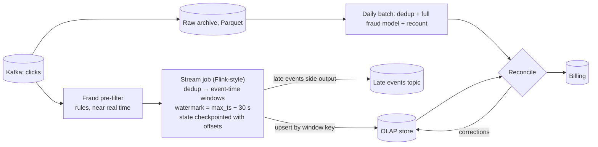

# Ad Click Aggregation — L5 (Senior) Interview

> **Level expectation:** everything in [L4](L4-mid.md), and then the streaming correctness problems:
> - event time vs processing time, **watermarks** and late events;
> - **exactly-once** aggregation across crashes;
> - **hot ads** that overload one partition;
> - **reconciling** fast numbers with an exact batch recount (Lambda vs Kappa);
> - filtering **click fraud** before billing.

> 🆕 Read [00-understand-the-product.md](00-understand-the-product.md) and [L4](L4-mid.md) first.

Legend: **🧑‍💼 Interviewer** · **🧑‍💻 Candidate** · **📝 Note** = commentary for you.

---

## 1. Requirements and estimates (fast)

**🧑‍💻 Candidate:** Same as L4: 1B clicks/day, ~11,600/s on average, ~58k/s at peak, 2M active ads, dashboard within ~1 minute, exact daily billing. Added requirements:
1. A click is counted in the minute it **happened**, even if it arrives minutes later (mobile networks, offline devices).
2. Crashes and restarts must not change totals.
3. A viral ad can receive 20% of all clicks.

---

## 2. Design (refined)

---

## 3. Deep dives

### 3.1 Event time, watermarks and late events

**🧑‍💼 Interviewer:** A click at 10:00:59 arrives at 10:01:07. Another arrives 20 minutes late from a phone that was offline. What happens?

**🧑‍💻 Candidate:** We window by **event time** (the click's timestamp), so both belong to the 10:00 window. The question is when to declare the 10:00 window finished. The stream job tracks a **watermark**: its estimate that "all events up to time T have arrived". A simple rule: watermark = largest event time seen − 30 s (the allowed lateness).

- The 10:00 window emits its count when the watermark passes 10:01:00, i.e. when we've seen an event stamped 10:01:30. With live traffic, that's about 30 s after real time.
- **The click arriving 8 s late** is well within 30 s, so it's counted normally.
- **The click 20 minutes late** arrives after its window was emitted. Choices:
  - **drop** it (cheap; the batch recount still counts it for billing);
  - send it to a **late-events side output**, which a small job uses to issue corrections;
  - keep windows open longer and **re-emit updated counts** (upserts). That costs state: keys × open windows.

| Allowed lateness | State kept (200k active (ad, country) keys × open windows × ~50 B) | Dashboard delay |
|---|---|---|
| 30 s | 200k × 2 × 50 B ≈ **20 MB** | ~30 s |
| 10 min | 200k × 11 × 50 B ≈ **110 MB** | windows update for 10 min |
| 24 h | 200k × 1,441 × 50 B ≈ **14 GB** | too much state for little gain |

**Choice:** 30 s watermark for the dashboard; late events go to the side output and corrections; the batch recount catches everything for billing. Details: [windowing, watermarks & late events](../../concepts/windowing-watermarks-and-late-events.md).

- **Client clocks lie.** A phone with a wrong clock can stamp a click in 2019 or tomorrow. Validate timestamps against server arrival time, and clamp or reject outliers. Otherwise one bad device drags the watermark forward or keeps windows open.
- **Idle partitions stall watermarks.** If one Kafka partition gets no clicks (a quiet region at night), its watermark doesn't advance and holds back the global watermark. Stream frameworks mark idle sources so they don't block.

> 📝 **Note:** Explaining the watermark as "a guess with a deadline", plus the state-size trade-off, is the core L5 signal.

### 3.2 Exactly-once aggregation

**🧑‍💼 Interviewer:** The stream job crashes mid-minute. Can counts end up wrong?

**🧑‍💻 Candidate:** Three places duplicates or losses come from, and their fixes ([idempotency & delivery semantics](../../concepts/idempotency-and-delivery-semantics.md)):

1. **Input replay.** The job checkpoints **state and Kafka offsets together** (a consistent snapshot of the whole pipeline; Flink does this with barriers flowing through the job). After a crash it restores both and replays from the saved offsets, so every event affects state exactly once.
2. **Output re-emission.** A window emitted before the crash may be emitted again after recovery. Make the sink **idempotent**: upsert keyed by `(ad, country, window)` with the full count, never `count += n`. Alternatively use a transactional sink that commits with the checkpoint (two-phase commit, as in Kafka transactions: [message queue L5 §3.4](../distributed-message-queue/L5-senior.md)).
3. **Duplicate events from producers.** Dedup by click ID in state (L4 §5.4), and Kafka's idempotent producer for the click service's retries.

Result: **exactly-once effect** on the aggregates, as long as the sink is an upsert.

### 3.3 Hot ads

**🧑‍💼 Interviewer:** A celebrity's ad gets 20% of all clicks: ~12k/s at peak on one key.

**🧑‍💻 Candidate:** With key = `ad_id`, one partition and one worker take all of it. Fix: **two-stage aggregation**.
1. Key by `(ad_id, salt)` where `salt = hash(click_id) % 16`. 16 workers each count part of the ad's clicks per window.
2. A second stage keyed by `ad_id` sums the 16 partial counts per window. That's only 16 small records per minute, trivial.

It's the same trick as [counters at scale](../../concepts/counters-at-scale.md) and the hot-key fixes in the [Discord case study](../../../case-studies/discord-message-storage.md). Apply salting only to ads detected as hot (a [top-k](../../concepts/top-k-and-heavy-hitters.md) sketch over the last minute), so normal ads keep the simple path.

### 3.4 Reconciliation: Lambda vs Kappa

**🧑‍💼 Interviewer:** The dashboard total for yesterday is 1.2% higher than the billing total. Is that a bug?

**🧑‍💻 Candidate:** Probably not, as long as the difference is explained. The two numbers are computed differently on purpose:

| | Real-time path | Batch path |
|---|---|---|
| Input | Kafka stream | Raw archive (complete, late events included) |
| Fraud filtering | Fast rules | Full model, cross-day signals |
| Dedup | 10-minute window | Whole day |
| Late events | Mostly dropped after 30 s | All included |
| Use | Dashboards, pacing budgets | Invoices |

This is the **Lambda** architecture: a speed layer plus a batch layer. Each night a reconciliation job compares the two per ad. Expected differences (fraud removed, late events added) are labelled; unexpected ones (bugs, lost partitions) alert. The dashboard then shows the batch numbers for closed days ("data finalised").

**Kappa** is the alternative: one streaming pipeline, and to recompute you **replay** Kafka (or the archive) through a new version of the same job. It's less code to keep in sync. But billing-grade fraud models and whole-day dedup are easier in batch, so many ad platforms keep a batch recount for money and use streaming for everything else. See [Lambda vs Kappa](../../concepts/lambda-vs-kappa-architecture.md).

> 📝 **Note:** "Two numbers, different purposes, reconciled nightly" is the answer interviewers want. Same pattern as [payment reconciliation](../../concepts/payment-reconciliation.md).

### 3.5 Click fraud

**🧑‍💻 Candidate:** Billing depends on filtering invalid clicks:
- **Real-time rules** (before counting for dashboards): same device or IP clicking the same ad more than N times per minute, known data-centre IP ranges, clicks with no matching impression, impossible timing (click 10 ms after the ad rendered).
- **Batch models** (before billing): patterns across days and advertisers, device fingerprint clusters, conversion behaviour (bots never buy).
- Store **why** a click was invalidated: advertisers dispute charges, and the answer must be explainable.
- Invalid clicks are flagged, not deleted, so rules can be changed and the archive recounted.

---

## 4. Follow-ups

**🧑‍💼 Interviewer:** We need "unique users who clicked" per ad per day.

**🧑‍💻 Candidate:** Exact distinct counts need a set per ad, which is big. Use HyperLogLog sketches per (ad, minute): ~12 KB each, mergeable into hours and days, ~1% error ([HyperLogLog](../../../under-the-hood/hyperloglog.md)). For billing-grade uniques, compute exact counts in batch.

**🧑‍💼 Interviewer:** We changed a fraud rule and need last month recomputed.

**🧑‍💻 Candidate:** Re-run the batch job over the archive with the new rule (that's why raw data is kept), write the results to a new table version, diff against the old one, and switch over after review. Invoices already sent get credit notes, not edits.

---

## 5. What the interviewer was evaluating (L5)

- [ ] Event time vs processing time; watermarks; allowed lateness with state arithmetic
- [ ] Late-event options, bad client clocks, idle partitions
- [ ] Exactly-once: checkpoint state + offsets, idempotent upsert sinks, dedup
- [ ] Hot keys via two-stage (salted) aggregation, only for hot ads
- [ ] Lambda reconciliation: why dashboard ≠ invoice, and how it's explained
- [ ] Fraud filtering in real-time rules and batch models, with reasons kept

## 6. Common mistakes at this level

| Mistake | Why it hurts |
|---|---|
| Windows by processing time | A Kafka backlog moves clicks into the wrong minutes |
| Huge allowed lateness "to be safe" | State explodes; dashboards keep changing |
| `count += n` sinks | Restarts double-count |
| Salting every key | Extra stage cost for 99% of ads that don't need it |
| One number for dashboard and invoice | Either the dashboard is slow or invoices are wrong |

➡️ Next: [L6-staff.md](L6-staff.md)
