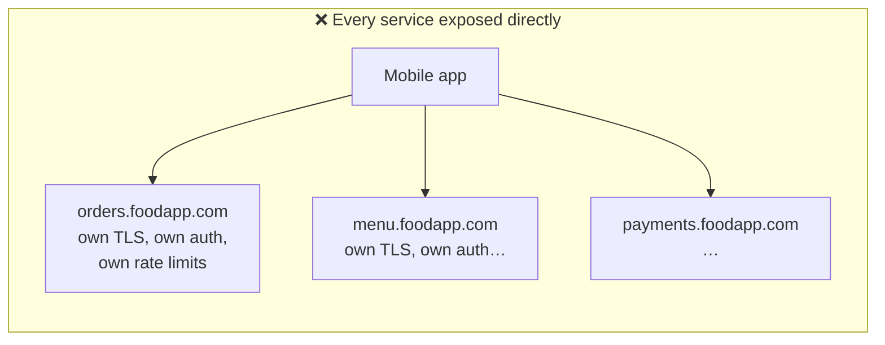
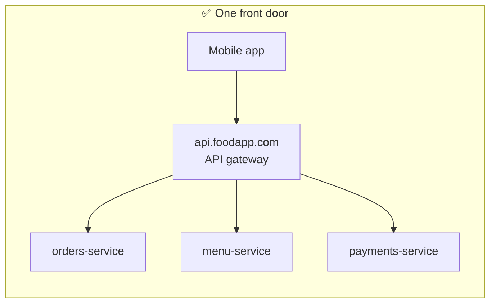

# Start Here: What Does an API Gateway Do? (Before the Interview)

> Every time your phone app talks to a company's backend, the request almost certainly passes through an **API gateway** first: the front door that checks who you are, how much you're allowed, and which internal service should answer. As an infra engineer you've likely touched one (nginx, a Kubernetes Ingress, AWS API Gateway, Kong, Envoy). This page shows what it does from the request's point of view.
>
> Time: ~10 minutes. Then: [L4](L4-mid.md) → [L5](L5-senior.md) → [L6](L6-staff.md).

---

## 1. One request's journey

Meera taps "My orders" in a food-delivery app. The app calls `GET https://api.foodapp.com/v1/orders`.

| Step | What happens at the gateway |
|---|---|
| 1. Connection arrives | **TLS termination**: decrypt HTTPS here, so internal services don't each need public certificates |
| 2. "Who is this?" | **Authentication**: check the token in the `Authorization` header is valid and not expired |
| 3. "Are they allowed?" | **Authorisation** (coarse): this token may call `/v1/orders` (fine-grained checks stay in the service) |
| 4. "Too many requests?" | **Rate limiting**: Meera's app isn't calling 1,000 times a second |
| 5. "Who handles this?" | **Routing**: `/v1/orders/*` → `orders-service`; find a healthy instance (**service discovery**) |
| 6. Forward it | Add headers (`X-User-Id`, a **request/trace id**), maybe re-encrypt (**mTLS**) to the backend |
| 7. Backend is slow/down | **Timeout**, maybe **retry** once on another instance; if it keeps failing, **circuit breaker** fails fast |
| 8. Response | Maybe transform/compress it, add CORS headers, return to the app |
| 9. Record it | **Access log, metrics, trace**: who called what, how long, which status |

All of that in a few milliseconds, for every request, for every service in the company.

---

## 2. Why have one? Life without a gateway





Without a gateway, 40 teams each implement TLS, token checks, rate limits, CORS, logging, and each makes slightly different mistakes. Clients need to know 40 hostnames, and moving `orders` to a new service means updating every app. **A gateway centralises the cross-cutting concerns** and decouples public URLs from internal services.

> 🛠️ **Infra analogy you already know:** a Kubernetes **Ingress controller** (e.g. ingress-nginx) is a basic API gateway: TLS termination + host/path routing to Services. An API gateway adds auth, rate limits, retries, transformations and richer observability on top.

---

## 3. The features, one situation at a time

### 3.1 Routing
`/v1/orders/*` → orders-service, `/v1/menu/*` → menu-service. Also: **canary** routing (send 5% of traffic to the new version), header-based routing (beta users), API **versioning** (`/v1` vs `/v2` to different backends).

👉 Interview: *a routing table, how it's updated without restarts, and how instances are found* ([service discovery](../../concepts/service-discovery.md)).

### 3.2 Authentication
Users log in once and get a **token** (often a **JWT**: a signed, self-contained token). The gateway verifies the signature with the identity provider's public key, with no network call per request. Partners use **API keys**.

👉 Interview: *validate at the edge vs in services; key rotation; revocation* ([authentication, OAuth & JWT](../../concepts/authentication-oauth-jwt.md)).

### 3.3 Rate limiting and quotas
"Free plan: 100 requests/minute", "this IP is hammering the login endpoint", "protect the payment service from a retry storm".

👉 Interview: *per-key limits across many gateway nodes*. This is the [LLD rate limiter](../../../LLD/interviews/rate-limiter/README.md) placed in a real system.

### 3.4 Resilience
A backend gets slow. Without timeouts, gateway threads/connections pile up waiting, and the gateway itself falls over, taking down *every* API. Retries can help or make things worse.

👉 Interview: *timeouts, retry budgets, circuit breakers, load shedding* ([resilience patterns](../../concepts/resilience-patterns.md)).

### 3.5 Security at the edge
TLS termination, blocking oversized requests, WAF rules (web application firewall: blocks known attack patterns), DDoS protection in front, and **mTLS** to backends so internal traffic is encrypted and authenticated too ([TLS & mTLS](../../concepts/tls-and-mtls.md)).

### 3.6 Observability
Every request gets an ID that flows through all services, so "why was this request slow?" can be answered with a **trace**. Per-route metrics: requests/sec, error rate, latency.

👉 Interview: *the gateway as the best place to measure what users experience* ([observability](../../concepts/observability.md)).

### 3.7 Config changes are deploys
Adding a route or changing a rate limit changes behaviour for live traffic. A bad config (a typo routing `/v1/payments` to nowhere) is an outage.

👉 Interview: *control plane vs data plane, validation, staged rollout* ([service mesh & Envoy](../../technologies/service-mesh-and-envoy.md)).

---

## 4. Try it yourself (real, 10 minutes)

1. **Look at a real gateway's response headers:**
   ```sh
   curl -sI https://api.github.com/users/octocat
   ```
   Look for `x-ratelimit-limit` / `x-ratelimit-remaining` (rate limiting), `x-github-request-id` (request id for tracing), `strict-transport-security` (TLS policy), `content-encoding`/`vary` (transformations, caching). Those headers are added by GitHub's edge/gateway layer, not by the code that knows about users.
2. **Your cluster's front door:** `kubectl get ingress -A` and `kubectl describe ingress <name>`: hosts, paths, backends, TLS secrets. That's a routing table.
3. **Peek inside a JWT** (use a sample token, never a real one): a JWT is three base64url parts separated by dots. Decode the middle part locally:
   ```sh
   TOKEN='eyJhbGciOiJIUzI1NiJ9.eyJzdWIiOiJ1c2VyLTQyIiwic2NvcGUiOiJvcmRlcnM6cmVhZCIsImV4cCI6MTk5OTk5OTk5OX0.sig'
   echo "$TOKEN" | cut -d. -f2 | base64 -d 2>/dev/null; echo
   ```
   You'll see `{"sub":"user-42","scope":"orders:read","exp":1999999999}`: who the user is, what they may do, when the token expires. The gateway reads this *after* verifying the signature (the third part).

---

## 5. From experience to requirements

| What you experienced | Requirement | Type |
|---|---|---|
| One hostname for all APIs | Route by host/path/header to backend services | Functional |
| Login once, call everything | Validate tokens / API keys at the edge | Functional |
| "429 Too Many Requests" | Rate limits and quotas per key/user/IP | Functional |
| HTTPS everywhere | TLS termination; mTLS to backends | Functional |
| Canary releases | Weighted / header-based routing | Functional |
| Request IDs in error messages | Tracing and logging for every request | Functional |
| The app stays up when one service is slow | **Isolation**: timeouts, circuit breakers, load shedding | Non-functional |
| Adds almost no latency | **Low overhead** (p99 a few ms) | Non-functional |
| Every request goes through it | **Higher availability than any backend** | Non-functional |
| Route changes many times a day | **Safe, dynamic configuration** | Non-functional |

---

## 6. Mini glossary

| Term | Meaning in plain words |
|---|---|
| **API gateway** | The single entry point that receives client API calls and forwards them to internal services |
| **Reverse proxy** | A server that receives requests on behalf of other servers (the basic building block of a gateway) |
| **TLS termination** | Decrypting HTTPS at the gateway |
| **JWT** | A signed token that carries claims (user id, permissions, expiry) and can be verified without calling the issuer |
| **API key** | A secret string identifying a calling application (often partners/machines) |
| **Rate limit / quota** | Max requests per time window (short-term) / per period like a month (long-term) |
| **Service discovery** | How the gateway finds the current healthy instances of a service |
| **Circuit breaker** | Stops calling a failing backend for a while, failing fast instead |
| **mTLS** | Both sides present certificates, so each knows who the other is |
| **Control plane / data plane** | The part that manages configuration / the part that actually handles requests |
| **BFF (backend for frontend)** | A gateway tailored to one client type (mobile vs web) that can aggregate calls |

➡️ **Now design it:** [L4-mid.md](L4-mid.md)
