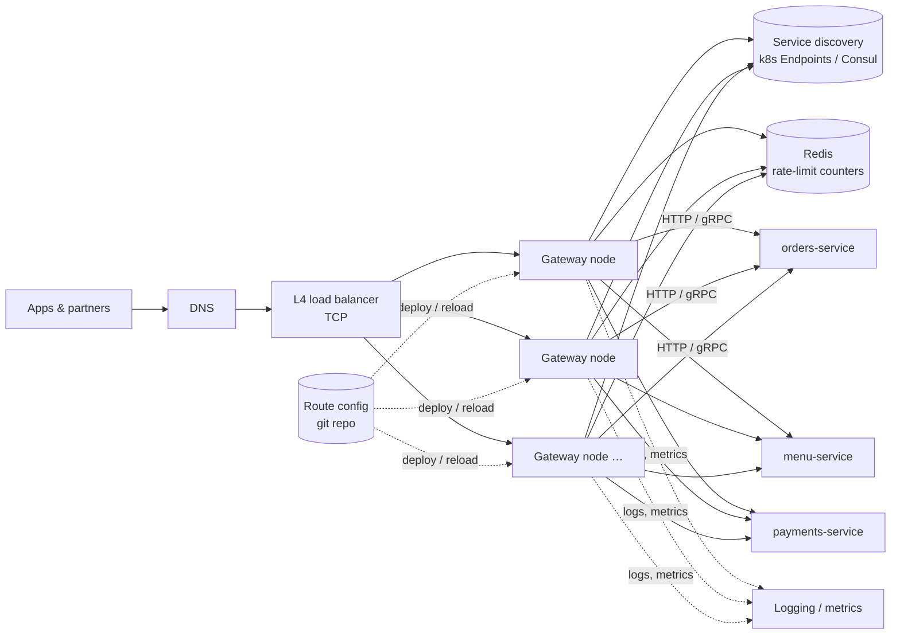

# API Gateway — L4 (Mid-level / SDE2) Interview

> **Level expectation:** a correct, scalable design: stateless gateway nodes behind a load balancer, a routing table, token/API-key authentication, rate limiting, timeouts, and request logging. Explain each choice and handle follow-ups (scaling, config changes, a slow backend).

> 🆕 New to API gateways? Read [00-understand-the-product.md](00-understand-the-product.md) first. It follows one request through every gateway step.

Legend: **🧑‍💼 Interviewer** · **🧑‍💻 Candidate** · **📝 Note** = commentary for you.

---

## 1. Clarifying requirements

**🧑‍💼 Interviewer:** Design an API gateway for our company.

**🧑‍💻 Candidate:** Some questions:
- Who are the clients: our own mobile/web apps, external partners, or both?
- Roughly how many backend services and how much traffic?
- What protocols: HTTP/JSON only, or gRPC/WebSockets too?
- Which concerns must it own: auth, rate limiting, request transformation, caching?
- Build vs use an existing proxy (Envoy, Kong, nginx)?

**🧑‍💼 Interviewer:** Mobile/web apps and some partners. ~200 services, peak 100k requests/s. HTTP and gRPC. Auth, rate limiting, routing, and basic resilience. Assume we build on an existing proxy, but design the system.

**🧑‍💻 Candidate:**

**Functional**
1. Route requests by host/path (and header) to the right backend service.
2. Authenticate: JWT for users, API keys for partners.
3. Rate limit per user/API key.
4. Terminate TLS.
5. Log every request with a request ID.

**Non-functional**
1. **Low added latency:** p99 < 5 ms of gateway overhead.
2. **Highly available:** it's in front of everything (99.99%+).
3. **Horizontally scalable** to 100k+ requests/s.
4. **Config changes without downtime.**

> 📝 **Note:** "Build on an existing proxy" is the realistic answer. Nobody writes an HTTP proxy from scratch in an interview; you design the *system* around Envoy/nginx/Kong.

---

## 2. Back-of-the-envelope estimates

| What | Calculation | Result |
|---|---|---|
| Peak traffic | given | **100k req/s** |
| Per-node capacity | a tuned Envoy/nginx node handles ~10–20k req/s of typical API traffic (TLS + small JSON) | — |
| Nodes needed | 100k / ~10k, plus 50% headroom, plus spares per zone | **~15–20 nodes** across 3 zones |
| Bandwidth | 100k × ~5 KB avg (req + resp) | **~500 MB/s ≈ 4 Gbps** |
| Rate-limit checks | one per request | 100k/s: must be cheap |
| Access logs | 100k × ~500 B | **~50 MB/s ≈ 4 TB/day** → sample or ship to a log pipeline |

**🧑‍💻 Candidate:** Takeaways: the fleet is small; the challenges are **per-request overhead** (auth and rate limiting must not add network calls on the hot path if possible) and **volume of logs**.

---

## 3. API / configuration

The gateway's "API" is its **route configuration**:

```yaml
routes:
  - match: { host: api.foodapp.com, pathPrefix: /v1/orders }
    backend: orders-service          # resolved via service discovery
    auth: jwt                        # or: apiKey, none
    rateLimit: { key: user, limit: 100, per: 1m }
    timeout: 2s
  - match: { host: api.foodapp.com, pathPrefix: /v1/menu }
    backend: menu-service
    auth: none
    rateLimit: { key: ip, limit: 300, per: 1m }
    timeout: 1s
```

Responses the gateway itself generates: `401` (bad/missing token), `403` (not allowed), `429` + `Retry-After` (rate limited), `502/503/504` (backend unreachable/unavailable/timed out).

---

## 4. High-level design



**🧑‍💻 Candidate:**
- **[L4 load balancer](../../technologies/load-balancer.md)** (TCP level) spreads connections across gateway nodes; the gateway does the HTTP (L7) work.
- **Gateway nodes are stateless**, so any node can serve any request. Scale by adding nodes; a node dying only drops its in-flight requests.
- **[Service discovery](../../concepts/service-discovery.md):** the gateway watches the list of healthy backend instances (in Kubernetes: the Endpoints of each Service) and load-balances across them itself.
- **Rate-limit counters** in [Redis](../../technologies/redis.md), shared by all nodes.

### Request pipeline inside a node


Order matters: cheap rejections first. A request without a valid token is rejected **before** it costs a Redis rate-limit call or a backend call.

---

## 5. Deep dives

### 5.1 Authentication without a network call per request

**🧑‍💻 Candidate:** Users log in with the identity service and get a **JWT** (JSON Web Token: a small signed document with the user id, permissions and expiry). The identity service signs it with its **private key**; the gateway verifies it with the matching **public key**, which it downloads once and caches (refreshing periodically). Verification is local CPU work, ~microseconds, with no call to the identity service ([authentication, OAuth & JWT](../../concepts/authentication-oauth-jwt.md)).

After verifying, the gateway forwards trusted headers like `X-User-Id: 42` and **strips** any such headers sent by the client, so a client can't impersonate someone by sending `X-User-Id` itself.

**Partners** send an **API key**. The gateway looks up its hash (keys are stored hashed, like passwords) in a cached table → partner id, plan, allowed routes.

### 5.2 Rate limiting

**🧑‍💻 Candidate:** Per route: a key (user id, API key, or IP) and a limit. Shared counters in Redis so the limit is global across all gateway nodes. A fixed-window counter is one `INCR` + `EXPIRE` per request; a token bucket needs a small Lua script. Algorithms and the Redis details are in the [LLD rate limiter](../../../LLD/interviews/rate-limiter/L6-staff.md). Over the limit → `429 Too Many Requests` with a `Retry-After` header.

### 5.3 Timeouts

**🧑‍💻 Candidate:** Every backend call has a **timeout** from the route config. Without it, a hung backend holds gateway connections forever; enough of those and the gateway can't serve *any* route. That's how one bad service takes down the whole API ([resilience patterns](../../concepts/resilience-patterns.md)).

### 5.4 Request IDs and logging

Each request gets an ID (or keeps the one the client sent), added as a header to the backend call and returned to the client. Support can then find the exact request in logs across services. Access logs go to a log pipeline asynchronously, never written synchronously in the request path.

---

## 6. Follow-ups

**🧑‍💼 Interviewer:** How do you add a new route without downtime?

**🧑‍💻 Candidate:** Routes live in a git repo; a change is reviewed, then deployed. The proxies support **hot reload**: new config is loaded and new requests use it while in-flight requests finish on the old config. Roll out to one node first, watch errors, then the rest. (L5 makes this a proper control plane.)

**🧑‍💼 Interviewer:** Redis (rate limiting) goes down.

**🧑‍💻 Candidate:** Don't take the whole API down for it: **fail open** (allow requests) with a short timeout on the Redis call, and alert. For sensitive endpoints like login, fall back to a stricter **local** per-node limit instead.

**🧑‍💼 Interviewer:** Should the gateway retry failed requests?

**🧑‍💻 Candidate:** Only when it's safe: for **idempotent** requests (GET, or ones with an idempotency key) and for errors that mean "didn't reach the backend" (connection refused, 503). Retrying a `POST /payments` that timed out could charge twice ([idempotency](../../concepts/idempotency-and-delivery-semantics.md)). And at most once, to a different instance.

**🧑‍💼 Interviewer:** Why not let each service handle auth itself?

**🧑‍💻 Candidate:** Each service *should* still do fine-grained authorisation ("can user 42 see order 9001?"), since only it knows the data. But token validation, rate limiting and TLS are identical everywhere; doing them once at the edge means one correct implementation instead of 200 slightly different ones.

---

## 7. What the interviewer was evaluating (L4)

- [ ] Clarified clients, scale, protocols, concerns; chose an existing proxy
- [ ] Estimated node count and log volume
- [ ] Stateless nodes behind an L4 LB; service discovery for backends
- [ ] Ordered pipeline with cheap rejections first
- [ ] Local JWT verification with cached public keys; header stripping; hashed API keys
- [ ] Shared rate limits with a fail-open policy
- [ ] Timeouts on every backend call; safe retries only
- [ ] Request IDs and async logging

## 8. Common mistakes at this level

| Mistake | Why it hurts |
|---|---|
| Calling the auth service on every request to validate tokens | Adds latency and makes auth a single point of failure for every API |
| Trusting `X-User-Id` headers from clients | Anyone can impersonate anyone |
| No timeouts to backends | One slow service exhausts the gateway |
| Retrying non-idempotent requests | Duplicate payments/orders |
| Storing API keys in plain text | One leak exposes every partner |
| Putting business logic in the gateway | Every product change becomes a gateway deploy; the gateway grows into a monolith |
| Synchronous logging to disk/DB per request | Latency and a new failure mode |

➡️ Next: [L5-senior.md](L5-senior.md)
