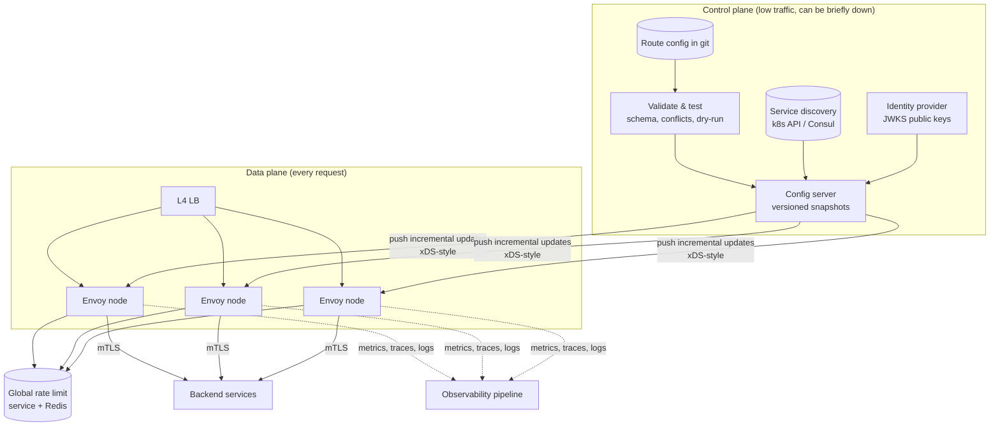
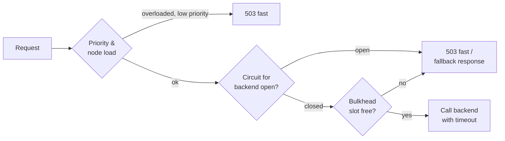

# API Gateway — L5 (Senior) Interview

> **Level expectation:** you separate the **data plane** (handles requests) from the **control plane** (manages config), make config changes safe, keep per-request work local, design layered resilience (timeouts, retry budgets, circuit breakers, load shedding), and define a degraded mode for every dependency. Numbers back the latency and capacity claims. Read [L4-mid.md](L4-mid.md) first.

Legend: **🧑‍💼 Interviewer** · **🧑‍💻 Candidate** · **📝 Note** = commentary for you.

---

## 1. Requirements

**🧑‍💻 Candidate:** Same scope as L4 (100k req/s, 200 services, HTTP + gRPC), plus:
- **Dozens of config changes per day** from many teams, with no outages from bad config.
- **Canary and weighted routing** for deployments.
- **mTLS** from gateway to backends.
- **End-to-end tracing**.
- Gateway overhead p99 **< 5 ms**; availability **99.99%** (≈ 4.3 min/month), higher than any single backend's.

---

## 2. Architecture: data plane + control plane



**🧑‍💻 Candidate:** The key split ([service mesh & Envoy](../../technologies/service-mesh-and-envoy.md)):
- **Data plane:** proxies (Envoy) that handle requests using **only local state**: routes, backend endpoints, public keys, local rate-limit buckets.
- **Control plane:** computes config (from git, service discovery, the identity provider) and **pushes** it to proxies. Envoy's xDS APIs are exactly this: a stream of config updates (listeners, routes, clusters, endpoints).
- **Consequence:** if the control plane is down, proxies keep serving with **the last config they received**. The request path doesn't depend on the control plane being up.

> 📝 **Note:** "The data plane must keep working with last-known-good config when the control plane is down" is the single most important availability property of this design. Say it explicitly.

---

## 3. Deep dives

### 3.1 Safe configuration changes

**🧑‍💻 Candidate:** Most gateway outages are config outages. Defences in depth:
1. **Static validation in CI:** schema; no overlapping route matches across teams; backends exist; timeouts within allowed bounds; auth required on non-public routes.
2. **Dry-run/simulation:** replay a sample of recent production requests against the new route table and diff the routing decisions. "This change moves 30% of `/v1/payments` traffic to a different backend" is caught before it ships.
3. **Versioned snapshots:** every pushed config has a version; proxies report which version they run.
4. **Staged rollout:** canary to 1 node / 1 zone → watch error rate and latency per route → all.
5. **One-click rollback** to the previous version; proxies keep the previous snapshot locally.
6. **Ownership:** each team owns routes under their path prefix (enforced by CI), so team A can't break team B's routes.

### 3.2 Keeping per-request work local

| Concern | Hot-path work | Off the hot path |
|---|---|---|
| JWT auth | Verify signature with a cached public key (µs) | JWKS refreshed every few minutes; new keys pre-published before rotation ([authentication](../../concepts/authentication-oauth-jwt.md)) |
| API keys | Hash → lookup in a local cache | Cache synced from the key store; revocations pushed |
| Routing | Prefix/trie match in memory | Route table pushed by control plane |
| Endpoints | Pick a healthy instance from local list | Endpoint updates streamed from service discovery ([service discovery](../../concepts/service-discovery.md)) |
| Rate limits | **Local** token bucket per node (µs) | **Global** limits via a rate-limit service/Redis only for routes that need exactness |

**Rate limiting in two tiers:**
- **Local** (per node): `limit / number_of_nodes`, approximate, no network call, protects against floods even if Redis is down.
- **Global** (shared Redis, ~0.5 ms): for paid quotas and sensitive endpoints where approximate isn't good enough. Short timeout; on failure, fall back to local limits. Details: [LLD rate limiter L6](../../../LLD/interviews/rate-limiter/L6-staff.md).

**Revocation trade-off:** JWTs are valid until they expire, even if the user logs out or is banned. Keep access tokens **short-lived** (5–15 min) and push a small **deny list** of revoked token IDs to proxies for urgent cases.

### 3.3 Resilience: protect the gateway from backends

See [resilience patterns](../../concepts/resilience-patterns.md).

**Timeout budgets.** The client gives up after, say, 10 s. If the gateway waits 10 s for the backend and then retries, the retry is pointless: the client already left. Set per-route timeouts from the backend's p99.9 latency, and propagate a deadline header so backends stop work that nobody is waiting for.

**Retry budgets.** Retries multiply load exactly when a backend is struggling. Rules:
- Only idempotent requests, only on connect failures / 503 / reset streams.
- Max 1 retry, to a **different** instance.
- **Retry budget:** retries may add at most ~10% extra load per backend; when exceeded, stop retrying ([retries & backoff](../../concepts/retries-backoff-and-dlq.md)).

**Circuit breakers** per backend: if errors or pending requests exceed thresholds, fail fast for a cool-down period instead of queueing more work (Envoy implements this as per-cluster limits on connections, pending requests and active retries, plus *outlier detection* that ejects individual bad instances).

**Bulkheads:** separate connection pools and concurrency limits **per backend**, so 10,000 requests stuck on a slow `recommendations-service` can't use up the connections needed for `payments-service`.

**Load shedding:** when the gateway itself is near capacity, reject early and cheaply (`503` with `Retry-After`), **by priority**: shed recommendation and analytics routes before checkout and login.



### 3.4 Canary and weighted routing

```yaml
- match: { pathPrefix: /v1/orders }
  backends:
    - { service: orders-v41, weight: 95 }
    - { service: orders-v42, weight: 5 }        # canary
  stickiness: header x-user-id                  # same user stays on the same version
```

Automated canary analysis compares error rate and latency of v42 vs v41 on the same route and rolls back automatically on regression.

### 3.5 Security on the request path

- **TLS at the edge** with modern ciphers; HTTP/2 to clients ([TLS & mTLS](../../concepts/tls-and-mtls.md)).
- **mTLS to backends:** each backend verifies the caller is the gateway (not some other pod), and traffic inside the cluster is encrypted. Short-lived certificates, rotated automatically.
- **Request hygiene:** max header/body sizes, strip hop-by-hop and spoofable identity headers, normalise paths (`/v1/../admin` tricks).
- A **WAF/DDoS** layer (CDN or cloud edge) in front of the gateway absorbs volumetric attacks before they reach it ([CDN](../../technologies/cdn.md)).

### 3.6 Observability

- **RED metrics per route** (rate, errors, duration) at the gateway: the most honest picture of what users experience ([observability](../../concepts/observability.md)).
- **Tracing:** generate a trace ID (W3C `traceparent` header) if absent; sample (e.g. 1% normally, 100% for errors); every service propagates it.
- **Cardinality discipline:** label metrics by route *template* (`/v1/orders/{id}`), never by raw path, or the metrics backend explodes.

---

## 4. Failure modes

| Failure | Impact | Mitigation |
|---|---|---|
| Control plane down | No config changes | Proxies serve last-known-good; alert |
| Bad config pushed | Routes broken | CI validation, dry-run, canary rollout, auto-rollback on error spike |
| Identity provider down | No new logins | Existing JWTs still verify with cached keys |
| Redis (global limits) down | Global limits unavailable | Fall back to local buckets; fail open for normal routes |
| One backend slow | Its routes time out | Timeouts, circuit breaker, bulkhead: other routes unaffected |
| Gateway node dies | In-flight requests fail | LB health checks remove it; clients retry idempotent calls |
| Traffic spike 5× | Gateway near capacity | Autoscale + priority load shedding; edge rate limits |
| Certificate expiry | TLS failures everywhere | Automated rotation; alerts at 30/7/1 days; synthetic TLS checks |

---

## 5. Follow-ups

**🧑‍💼 Interviewer:** Mobile needs one screen's data from 5 services. Should the gateway aggregate?

**🧑‍💻 Candidate:** Not the shared edge gateway: aggregation is product logic, and putting it there turns the gateway into a monolith every team must deploy through. Use a **BFF** (backend for frontend): a small service owned by the mobile team, behind the gateway, that fans out to the 5 services and shapes the response for that screen.

**🧑‍💼 Interviewer:** Edge gateway or service mesh for service-to-service calls?

**🧑‍💻 Candidate:** Different jobs. The edge gateway handles *north-south* traffic (outside → in): public auth, quotas, WAF. A mesh (sidecars or node proxies) handles *east-west* traffic (service → service): mTLS, retries, telemetry. Same proxy technology (often both Envoy), different policies and owners.

---

## 6. What the interviewer was evaluating (L5)

- [ ] Data plane / control plane split; last-known-good config when the control plane is down
- [ ] Layered config safety: validation, dry-run, versioning, canary, rollback, ownership
- [ ] All hot-path work local (cached keys, local buckets, pushed endpoints)
- [ ] Two-tier rate limiting with an explicit fallback
- [ ] Timeout budgets, retry budgets, circuit breakers, bulkheads, priority load shedding
- [ ] Canary routing with automated analysis
- [ ] mTLS, header hygiene, WAF in front
- [ ] Route-level RED metrics, tracing with sampling, cardinality control
- [ ] Failure table with a degraded mode per dependency

## 7. Common mistakes at this level

| Mistake | Why it hurts at L5 |
|---|---|
| Gateway reads config from a DB/service on each request | The control plane becomes a request-path dependency |
| Config changes applied to all nodes at once without validation | One typo = global outage |
| Unbounded retries at the gateway | Turns a backend slowdown into a retry storm |
| One shared connection pool for all backends | One slow backend starves all others |
| Metrics labelled by raw URL path | Cardinality explosion; observability stack falls over |
| Aggregation/business logic in the shared gateway | Coupling, slow deploys, a new monolith |

⬅️ Previous: [L4-mid.md](L4-mid.md) · ➡️ Next: [L6-staff.md](L6-staff.md)
