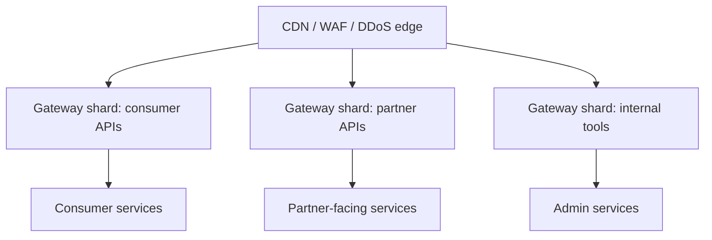

# API Gateway — L6 (Staff) Interview

> **Level expectation:** the L5 design is assumed. The staff conversation treats the gateway as a **shared platform that every team depends on**: ownership and self-service, blast radius, where the edge ends and the mesh begins, build vs buy, API lifecycle, edge security layers, and SLOs that must be stricter than anything behind it. You make organisational and technical trade-offs explicit. Read [L5-senior.md](L5-senior.md) first.

Legend: **🧑‍💼 Interviewer** · **🧑‍💻 Candidate** · **📝 Note** = commentary for you.

---

## 1. Start with ownership, not boxes

**🧑‍💼 Interviewer:** We have 200 services, 25 teams, and a gateway the platform team maintains. Everyone complains it's a bottleneck. Redesign it.

**🧑‍💻 Candidate:** "Bottleneck" usually means one of three things, and the fixes are different:

| Complaint | Real cause | Fix |
|---|---|---|
| "Adding a route takes a week" | Central team reviews every change | **Self-service** config with automated guardrails |
| "Our launch broke because another team's change" | Shared config, shared blast radius | **Isolation**: per-team route ownership, sharded gateways |
| "It's slow / it went down" | Capacity or design | L5 resilience + capacity engineering |

I'd confirm which it is with data (lead time for route changes, incidents by cause) before redesigning anything.

---

## 2. Self-service with guardrails

**🧑‍💻 Candidate:** Teams own their routes as code in their own repos, and a **policy engine** enforces company rules automatically:

```yaml
# lives in the orders team's repo
apiVersion: gateway/v1
kind: Route
metadata: { owner: team-orders }
spec:
  pathPrefix: /v1/orders               # must be within the team's allocated prefixes
  backend: orders-service
  auth: jwt                            # policy: "auth: none" requires security approval
  rateLimit: { key: user, limit: 100, per: 1m }
  timeout: 2s                          # policy: ≤ 10 s
```

- **Policy as code** (OPA-style rules, i.e. machine-checked policies) rejects violations in CI: public route without auth, timeout above maximum, path outside the team's namespace, missing rate limit on write endpoints.
- **Platform team** owns the gateway software, policies, and the rollout pipeline, not each route.
- **Kubernetes analogy:** the Gateway API's split between `GatewayClass`/`Gateway` (platform-owned) and `HTTPRoute` (app-team-owned) is exactly this separation of ownership.

> 📝 **Note:** Turning a central approval bottleneck into automated guardrails is the platform-engineering move staff interviews look for. It scales the organisation, not just the system.

---

## 3. Blast radius: one gateway or many?



**🧑‍💻 Candidate:** A single gateway fleet means any bad config or overload hits *everything*. Split into **shards** (separate fleets with separate config and rollout) by risk and audience:
- **Consumer** (highest traffic, strictest SLO), **partner** (API keys, quotas, contracts), **internal/admin** (SSO, IP allow-lists).
- Optionally **cells** per region, with a small global layer routing users to their cell.
- Config rollouts go shard by shard, starting with the least critical.

Trade-off: more fleets to operate. Shared tooling and a single control plane with per-shard snapshots keep it manageable.

---

## 4. Edge vs mesh: drawing the line

| Concern | Edge gateway (north-south) | Mesh / internal (east-west) |
|---|---|---|
| End-user/partner authentication | ✅ | ❌ (pass identity along as signed context) |
| Quotas tied to plans/billing | ✅ | ❌ |
| WAF, bot protection | ✅ | ❌ |
| mTLS, service identity | to backends | ✅ everywhere |
| Retries, timeouts, circuit breaking | ✅ for the first hop | ✅ per hop |
| Fine-grained authorisation | ❌ | ✅ in the service |

**🧑‍💻 Candidate:** I'd resist pushing everything into the edge (it becomes a monolith) and resist a mesh where the org can't operate it (sidecar memory, upgrade pain, debugging an extra hop). Sometimes a well-configured client library plus mTLS at the node level is enough. The deciding question is **who will operate it at 3 am** ([service mesh & Envoy](../../technologies/service-mesh-and-envoy.md)).

---

## 5. Build vs buy

| Option | Fits when |
|---|---|
| Cloud-managed (AWS API Gateway, Apigee, Azure APIM) | Moderate traffic, want quotas/portal/billing out of the box; accept per-request pricing and vendor limits |
| Open-source proxy + own control plane (Envoy + custom/Envoy Gateway, Kong, Traefik) | High traffic (per-request pricing gets expensive), need deep customisation, have a platform team |
| Fully custom proxy | Almost never: proxies are hard (HTTP/2, gRPC, TLS, connection management) |

**Cost check:** at 100k req/s ≈ 260B requests/month, per-request cloud gateway pricing (on the order of $1 per million requests) is ~$260k/month, while a self-run Envoy fleet is a small fraction of that in compute, plus engineering time. At that scale, open-source + own control plane usually wins. At 1k req/s, managed wins easily.

---

## 6. API lifecycle as a platform feature

- **Versioning:** `/v1` → `/v2` routing at the gateway; deprecation headers (`Deprecation`, `Sunset`) added centrally; per-version traffic metrics show who still calls v1.
- **Partner experience:** developer portal, key issuance and rotation, usage dashboards, per-plan quotas, all driven by the same key store the gateway uses.
- **Contract safety:** schema checks (OpenAPI/proto) in CI catch breaking changes before they reach the gateway.

---

## 7. SLOs and operating the thing in front of everything

- The gateway's availability bounds every API's availability: if the gateway is 99.95%, no API can be 99.99%. So the gateway SLO must be **stricter than the strictest backend SLO**, which drives redundancy across zones/regions, conservative rollouts, and minimal features in the hot path.
- **Measure from outside:** synthetic probes per shard from multiple regions; client-side (app) telemetry for real latency including TLS and network.
- **Error budget policy:** if the gateway burns its budget, feature work on it stops in favour of reliability work. That's enforced, not just suggested.
- **On-call:** route-level dashboards make "is it the gateway or the backend?" answerable in a minute. Gateway-generated errors (`429`, `503` from shedding, `504` from timeouts) are labelled distinctly from backend errors passed through.

---

## 8. Curveballs

**🧑‍💼 Interviewer:** After a gateway upgrade, p99 latency rose 3 ms across all APIs. Nobody noticed for two weeks.

**🧑‍💻 Candidate:** 3 ms at p99 over 100k req/s is real user impact, and it slipped through because nothing compared before/after. Process fixes: upgrades go through a canary with **automated latency comparison** at p50/p99/p99.9 per route (not just error rates); a gateway-overhead SLI (time spent inside the gateway, excluding the backend) on the main dashboard with alerting on regression. Then investigate the cause: new filter in the chain, TLS settings, connection reuse changes, or resource limits.

**🧑‍💼 Interviewer:** A partner's integration sends 50× normal traffic due to a bug.

**🧑‍💻 Candidate:** Their API-key quota returns `429`s, which protects everyone else. That's the system working. The staff-level additions: alerting the partner automatically (usage anomaly → email/webhook), a per-partner circuit that tightens limits further if `429`s don't reduce their traffic (retry storm), and making sure their requests are rejected *early* (edge rate limit before auth/routing work) so rejecting them is cheap.

---

## 9. What the interviewer was evaluating (L6)

- [ ] Diagnosed "bottleneck" into process, isolation and capacity problems with data
- [ ] Self-service config with policy-as-code guardrails; clear ownership split
- [ ] Sharded gateways/cells to limit blast radius
- [ ] Clear edge vs mesh boundary, driven by operability
- [ ] Build vs buy with a cost estimate
- [ ] API lifecycle (versioning, deprecation, partner portal) as platform features
- [ ] SLO stricter than any backend; external measurement; error-budget policy
- [ ] Operational maturity: latency canaries, gateway-overhead SLI, partner anomaly handling

## 10. Common mistakes at this level

| Mistake | Why it hurts at L6 |
|---|---|
| Central team approves every route change | Becomes the org's bottleneck |
| One global gateway fleet for every audience | Global blast radius |
| Pushing aggregation and business rules into the edge | Monolith, coupling, slow everyone down |
| Adopting a service mesh because "everyone does" | Large operational cost without a clear need |
| Picking managed vs self-hosted without a cost model | Surprise bills or unnecessary engineering |
| Gateway SLO equal to backend SLOs | Mathematically caps every API below its target |

⬅️ Previous: [L5-senior.md](L5-senior.md) · 🏠 [Problem overview](README.md)
