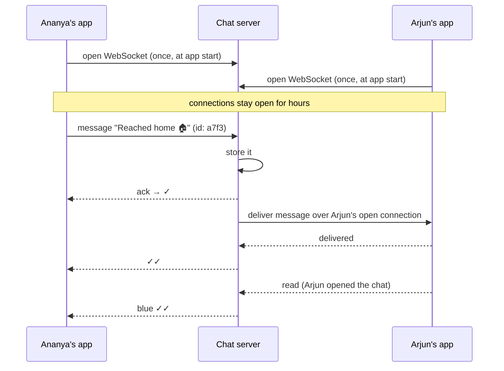

# Start Here: How Does a Chat App Actually Work? (Before the Interview)

> You use WhatsApp, Telegram or Slack every day, but have you thought about what the ✓, ✓✓ and blue ticks *mean* to the server, or how a message reaches a phone that was off for 3 hours? This page takes the features you already know and shows the mechanism behind each one, so the interview is about *how*, not *what*.
>
> Time: ~15 minutes. Then: [L4](L4-mid.md) → [L5](L5-senior.md) → [L6](L6-staff.md).

---

## 1. One message, step by step

Ananya sends "Reached home 🏠" to her brother Arjun on WhatsApp.

| What Ananya / Arjun see | What's happening behind it |
|---|---|
| Ananya taps send. A 🕓 clock icon shows briefly | The app is sending the message to the server over its open connection |
| 🕓 becomes **✓ (one grey tick)** | The **server received and stored** it. Ananya's job is done even if her phone dies now |
| Arjun's phone is in his pocket, app closed | The server can't reach the app directly → asks Apple/Google to show a **push notification** |
| ✓ becomes **✓✓ (two grey ticks)** | Arjun's **phone received** the message (the app woke up and fetched it) |
| Arjun opens the chat. ✓✓ turns **blue** | Arjun's app tells the server "**read**", and the server tells Ananya's app |
| Ananya sees "**online**" or "**last seen today at 9:41 pm**" under his name | The server tracks whether Arjun's app has a live connection (**presence**) |
| Arjun sees "**typing…**" when Ananya replies | Small temporary signals sent through the same connection, never stored |

Now the harder situations:
- 📵 Arjun's phone was **off for 3 hours**. When he turns it on, 47 messages from 5 chats arrive **in the right order**.
- 🚇 Ananya's train goes into a tunnel mid-send. The app **retries**, but Arjun must not get the message **twice**.
- 👨‍👩‍👧‍👦 In the family group of 30, one message must reach **29 people**, some online, some not.
- 📷 She sends a 4 MB photo. It doesn't travel through the chat server the same way text does.
- 💻 Arjun uses WhatsApp on his **phone and laptop**. Both must show the same chats.

Every one of those is an interview topic.

---

## 2. The one mechanism you must understand: a connection that stays open

Normal websites work like **sending a letter**: the browser asks (`HTTP request`), the server answers, done. The server can **never** start the conversation.

Chat needs the server to say "you have a new message" **at any time**. So the app opens a connection when it starts and **keeps it open**, usually a **WebSocket** (a two-way channel over one long-lived TCP connection; TCP is the reliable byte-stream protocol underneath most internet traffic). Think of it as a phone call that stays connected instead of letters back and forth.



And when Arjun's app is **closed** (no open connection), the server stores the message, sends a **push notification** via Apple/Google (see [push providers](../../technologies/push-email-sms-providers.md)), and when he opens the app it **syncs**: "give me everything after the last message I have."

More on long-lived connections: [WebSockets & SSE](../../technologies/websockets-and-sse.md).

> 🛠️ **Infra analogy:** `kubectl logs -f` or `kubectl get pods --watch` keep a connection open and the API server *pushes* new lines/events to you. Same idea. And just like those watches break when a pod is redeployed, chat connections break when a server is redeployed. That's a real interview topic.

---

## 3. The features, one situation at a time

### 3.1 Ticks: sent / delivered / read
Three separate events, each flowing back to the sender:
- **✓ sent**: server has stored it (durable)
- **✓✓ delivered**: recipient's device has it
- **blue ✓✓ read**: recipient opened the chat

👉 Interview: *acknowledgements, receipts, and what "delivered" means when a person has two devices.*

### 3.2 Offline users and sync
A phone that was off for 3 hours must get everything it missed, in order, without duplicates.

👉 Interview: *store-and-forward; per-conversation **sequence numbers** so a device can say "I have up to #1042, send the rest"*. See [message ordering](../../concepts/message-ordering-and-sequencing.md).

### 3.3 No duplicates when retrying
The tunnel case: Ananya's app sent the message, the server stored it, but the ✓ ack got lost. The app retries. The server must recognise "I already have message `a7f3`" and not store it twice.

👉 Interview: *client-generated message IDs, idempotency*. See [idempotency](../../concepts/idempotency-and-delivery-semantics.md).

### 3.4 Order
If Ananya sends "Reached home" then "Going to sleep", Arjun must never see them reversed, even if they travel through different servers.

👉 Interview: *why timestamps aren't enough (clocks on different machines disagree) and who assigns the order.*

### 3.5 Groups
A message to a 30-person group becomes 29 deliveries. A WhatsApp group can have up to ~1,000 members; a Telegram channel can have millions of subscribers.

👉 Interview: ***fan-out***. Copy the message to every member at send time, or let members fetch it? See [fan-out](../../concepts/fan-out.md).

### 3.6 Online / last seen / typing
"Online" means "this user's app has a live connection right now". "Typing…" is a short-lived signal that's never stored.

👉 Interview: *presence with heartbeats, and why broadcasting every user's online status to all their contacts is expensive*. See [presence & heartbeats](../../concepts/presence-and-heartbeats.md).

### 3.7 Photos, videos, voice notes
A 4 MB photo isn't pushed through the chat connection like text. The app uploads it to **file storage**, and the chat message only carries a small **link** to it. The recipient's app downloads it separately.

👉 Interview: *object storage, pre-signed upload URLs, CDN*. See [object storage](../../technologies/object-storage.md).

### 3.8 Multiple devices
Phone + laptop + tablet, all showing the same chats, read status synced across them.

👉 Interview: *per-device delivery state; sync.*

### 3.9 End-to-end encryption
WhatsApp shows "Messages are end-to-end encrypted. No one outside of this chat, not even WhatsApp, can read them." That means **the server stores and forwards scrambled bytes it cannot read**.

👉 Interview: *what this prevents the server from doing (search, spam filtering by content, server-side backups)*. See [end-to-end encryption](../../concepts/end-to-end-encryption.md).

---

## 4. Try it yourself (10 minutes, all real)

1. **Watch the ticks with a friend.** Send a message to someone whose phone is on **airplane mode**: you'll see ✓ (server has it) but not ✓✓. Ask them to turn airplane mode off: ✓✓ appears without them opening the app (the push notification woke it). Then they open the chat: blue.
2. **See offline sync.** Put your own phone in airplane mode for a few minutes while a group is active. Turn it back on and watch messages arrive in a burst, in order.
3. **See a WebSocket in your browser.** Open **web.whatsapp.com** (or Slack/Discord in the browser), press F12 → **Network** tab → filter **WS**. Reload. You'll see a long-lived connection; click it → **Messages** to watch frames flow as chats update (the content is encrypted/binary, but you can see the traffic pattern).
4. **Try a raw WebSocket from your terminal** with a public echo server (it sends back whatever you type):
   ```sh
   npx wscat -c wss://echo.websocket.org
   ```
   Type anything: it comes back over the same open connection. That's the transport every chat app is built on. (Public echo servers come and go; if this one is down, search "websocket echo server" for another. Step 3 always works.)

---

## 5. From experience to requirements

| What you experienced | Requirement | Type |
|---|---|---|
| Send to a person or group | 1:1 and group messaging | Functional |
| Message appears instantly if they're online | Real-time delivery over persistent connections | Functional |
| Phone off for hours, gets everything later | Store-and-forward + sync on reconnect | Functional |
| ✓ / ✓✓ / blue | Sent / delivered / read receipts | Functional |
| Online / last seen / typing | Presence and typing indicators | Functional |
| Photos and voice notes | Media messages | Functional |
| Phone + laptop | Multi-device | Functional |
| Feels instant | Low latency (< ~200–500 ms when both online) | Non-functional |
| Never lose a message after ✓ | **Durability** | Non-functional |
| Never see a message twice | **Deduplication** | Non-functional |
| Never out of order | **Ordering per conversation** | Non-functional |
| Billions of messages a day | **Scale**: hundreds of millions of open connections | Non-functional |
| "Not even WhatsApp can read them" | End-to-end encryption | Non-functional (security) |

---

## 6. Mini glossary

| Term | Meaning in plain words |
|---|---|
| **WebSocket** | A connection that stays open so both sides can send messages any time |
| **Gateway / connection server** | A server whose main job is holding millions of open client connections |
| **Presence** | Whether a user is online right now (and when they were last online) |
| **Heartbeat** | A tiny "I'm still here" message sent every few seconds to prove a connection is alive |
| **Ack / receipt** | Confirmation that something was received (✓), delivered (✓✓) or read (blue) |
| **Sequence number** | A counter per conversation (1, 2, 3…) that fixes message order and lets devices ask for "everything after #N" |
| **Store-and-forward** | Keep the message until the recipient is reachable, then deliver it |
| **Fan-out** | Turning one group message into one delivery per member |
| **Push notification** | A message shown by the phone's OS via Apple/Google when the app isn't running |
| **Object storage** | Storage for files (photos, videos), like Amazon S3 |
| **Pre-signed URL** | A temporary link that lets the app upload/download one specific file directly to storage |
| **End-to-end encryption (E2EE)** | Only the sender's and recipients' devices can read the message; the server only sees scrambled bytes |

➡️ **Now design it:** [L4-mid.md](L4-mid.md)
