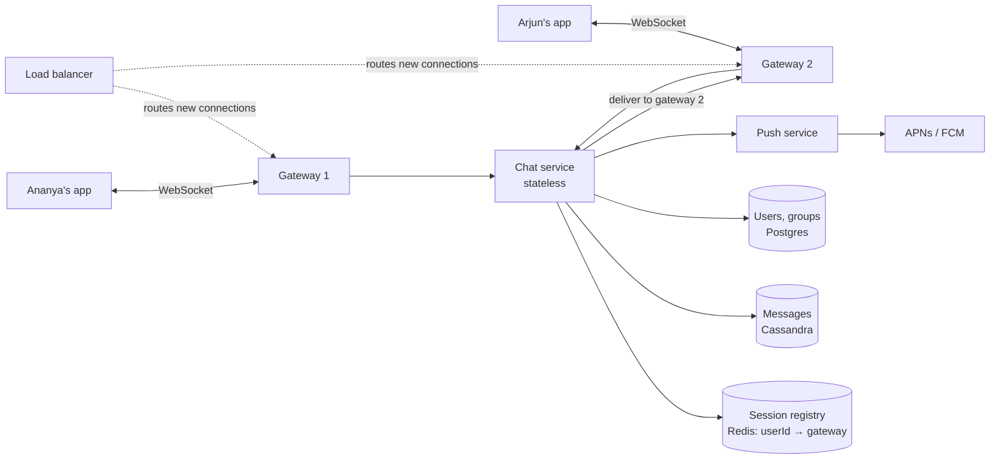
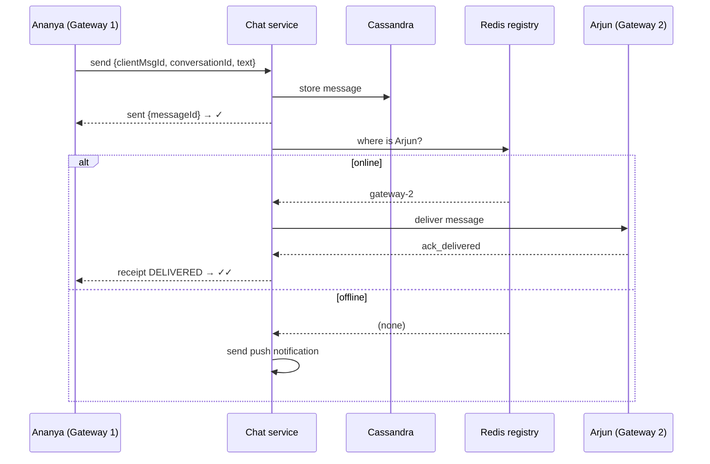

# Chat System — L4 (Mid-level / SDE2) Interview

> **Level expectation:** a working design for 1:1 and small-group chat: persistent connections, a way to find which server holds a user's connection, durable message storage, offline delivery via push + sync, and receipts. Handle follow-ups on ordering, duplicates and groups sensibly.

> 🆕 Never thought about how chat apps work underneath? Read [00-understand-the-product.md](00-understand-the-product.md) first. It explains WebSockets, ticks, offline sync and groups.

Legend: **🧑‍💼 Interviewer** · **🧑‍💻 Candidate** · **📝 Note** = commentary for you.

---

## 1. Clarifying requirements

**🧑‍💼 Interviewer:** Design a chat application like WhatsApp.

**🧑‍💻 Candidate:** Let me scope it:
- 1:1 chat and group chat? How big can groups get?
- Text only, or media too?
- Sent / delivered / read receipts? Online status?
- Message history: kept on the server forever, or just until delivered?
- Mobile only, or multiple devices per user?

**🧑‍💼 Interviewer:** 1:1 and groups up to 100 people. Text first, media as a follow-up. Receipts and online status yes. Keep history on the server. One device per user for now.

**🧑‍💻 Candidate:**

**Functional**
1. Send/receive 1:1 and group (≤ 100) messages in real time.
2. Offline users receive messages when they come back (and get a push notification).
3. Sent / delivered / read receipts.
4. Online / last seen.
5. Chat history.

**Non-functional**
1. **Low latency**: delivered within a few hundred ms when both users are online.
2. **Durable**: once the sender sees ✓, the message is never lost.
3. **Ordered** within a conversation.
4. **Highly available**: messaging is the core product.

---

## 2. Back-of-the-envelope estimates

**🧑‍💻 Candidate:** Assume **500M daily active users**, each sending **~40 messages/day**. (Method: [back-of-the-envelope](../../concepts/back-of-the-envelope.md).)

| What | Calculation | Result |
|---|---|---|
| Messages/day | 500M × 40 | **20B/day** |
| Average send rate | 20B / ~86,400 s | **~230k messages/s** (peak ~2× ≈ 500k/s) |
| Concurrent connections | ~1/3 of DAU online at peak | **~150M open connections** |
| Gateway servers | 150M / ~100k connections per server | **~1,500 gateway servers** |
| Storage per message | ~100 B text + ~200 B metadata | ~300 B |
| Storage/day | 20B × 300 B | **~6 TB/day** (~2 PB/year) |

**🧑‍💻 Candidate:** Takeaways:
- 150M **open connections** is the defining number. Holding connections is a specialised job, so it gets its own server tier.
- 230k writes/s and petabytes per year → a write-optimised, horizontally scalable store.

> 📝 **Note:** "100k connections per server" is a reasonable assumption for a tuned JVM/Netty server (the limit is memory per connection plus OS file-descriptor limits). WhatsApp famously ran ~1–2M per server on Erlang. Any number in that range with a reason is fine.

---

## 3. API

Two kinds of API:

**REST (normal request/response):** login, fetch history, create group, upload media.

```http
GET  /v1/conversations/{id}/messages?before={messageId}&limit=50    ← scroll back through history
POST /v1/groups  { "name": "Family", "members": ["u1","u2",...] }
```

**WebSocket (persistent, both directions):** real-time events as small JSON frames.

```json
// client → server
{ "type": "send", "clientMsgId": "a7f3...", "conversationId": "c_91", "text": "Reached home 🏠" }
{ "type": "ack_delivered", "messageId": "m_1042" }
{ "type": "ack_read", "conversationId": "c_91", "upToMessageId": "m_1042" }

// server → client
{ "type": "sent", "clientMsgId": "a7f3...", "messageId": "m_1042", "ts": 1791381572000 }   ← ✓
{ "type": "message", "messageId": "m_1042", "conversationId": "c_91", "from": "u_ananya", "text": "..." }
{ "type": "receipt", "messageId": "m_1042", "status": "DELIVERED" }                          ← ✓✓
```

**🧑‍💼 Interviewer:** Why does the client send its own `clientMsgId`?

**🧑‍💻 Candidate:** So retries are safe. If the network drops before the client gets "sent", it resends with the **same** `clientMsgId`, and the server sees it already has that ID and just re-acks instead of storing a duplicate. ([Idempotency](../../concepts/idempotency-and-delivery-semantics.md).)

---

## 4. High-level design



**🧑‍💻 Candidate:** Components:

- **Gateways** hold the [WebSocket](../../technologies/websockets-and-sse.md) connections. They're deliberately "dumb": authenticate the connection, pass frames to the chat service, push frames to clients. Keeping logic out of them means we rarely need to redeploy them, which matters because a redeploy drops every connection on that server.
- **[Load balancer](../../technologies/load-balancer.md)** (L4/TCP, since connections are long-lived) spreads *new* connections across gateways.
- **Session registry** in [Redis](../../technologies/redis.md): `session:{userId} → gateway-17`, written on connect, deleted on disconnect, with a TTL as a safety net.
- **Chat service** (stateless): stores messages, looks up where recipients are, routes deliveries, triggers push for offline users.
- **[Cassandra](../../technologies/cassandra.md)** for messages; Postgres for users, groups and memberships (small, relational).

### Sending a 1:1 message



**🧑‍💻 Candidate:** The important order: **store first, then ack the sender, then deliver.** That's what makes ✓ mean "safe on the server".

### Data model (Cassandra)

```sql
CREATE TABLE messages (
    conversation_id text,
    message_id      timeuuid,      -- unique and roughly time-ordered
    sender_id       text,
    body            text,
    PRIMARY KEY ((conversation_id), message_id)
) WITH CLUSTERING ORDER BY (message_id DESC);
```

- **Partition key `conversation_id`**: all messages of one chat live together → "latest 50 messages of this chat" is one fast read.
- **Clustering by `message_id` DESC**: newest first, perfect for opening a chat and scrolling up.
- Why Cassandra: very high write throughput, scales horizontally, and our main query is "by conversation, by time", exactly its model.

---

## 5. Deep dives

### 5.1 Offline users: push + sync

**🧑‍💻 Candidate:** If Arjun has no session in the registry:
1. The message is already stored.
2. Send a push notification via APNs/FCM ("Ananya: Reached home 🏠").
3. When Arjun opens the app, it connects and asks: "for each of my conversations, give me messages newer than the last one I have." The app stores the last `message_id` it has per conversation.
4. After receiving them, Arjun's app sends `ack_delivered` → Ananya gets ✓✓.

### 5.2 Groups (≤ 100 members)

**🧑‍💻 Candidate:** Store the message **once** under the group's `conversation_id`. Then for each member (except the sender), look up their gateway and deliver, or push if offline. That's a loop of up to 99 deliveries: fine for small groups. ([Fan-out](../../concepts/fan-out.md).)

Receipts in groups: ✓✓ when *all* members' devices have it, blue when all have read it. (WhatsApp shows per-member details under "Message info".)

### 5.3 Online / last seen

**🧑‍💻 Candidate:** Online = "has an active session in the registry". The app sends a **heartbeat** (a tiny "I'm alive" frame) every ~30 s; the gateway refreshes the TTL on the session key. If the phone loses signal without closing the connection cleanly, the key expires after ~60 s and the user shows as offline. "Last seen" = timestamp written when the session ends. ([Presence & heartbeats](../../concepts/presence-and-heartbeats.md).)

---

## 6. Follow-ups

**🧑‍💼 Interviewer:** A gateway server crashes. What happens to its 100k users?

**🧑‍💻 Candidate:** Their connections drop. Apps reconnect automatically (through the load balancer, to some other gateway), re-register in Redis, and sync anything they missed using "messages newer than my last one". Messages sent to them during the gap were stored, so nothing is lost. One subtlety: 100k apps reconnecting in the same second is a spike, so clients should wait a **random** 0–5 s before reconnecting (jitter).

**🧑‍💼 Interviewer:** Could messages show up out of order?

**🧑‍💻 Candidate:** I'm using `timeuuid`, which is time-based, but times come from different chat-service servers whose clocks can differ by milliseconds. Two messages sent quickly could be ordered wrong. For L4 that's rare and mostly harmless, but the proper fix is a per-conversation **sequence number** handed out by one owner. ([Message ordering](../../concepts/message-ordering-and-sequencing.md), and the [L5 answer](L5-senior.md#31-ordering-per-conversation-sequence-numbers).)

**🧑‍💼 Interviewer:** How do photos work?

**🧑‍💻 Candidate:** Not through the WebSocket. The app uploads the photo to [object storage](../../technologies/object-storage.md) (like S3) and gets back an ID/URL; the chat message just contains that reference plus a small thumbnail. Recipients download the full photo from storage, ideally via a [CDN](../../technologies/cdn.md). This keeps big files off the chat servers.

**🧑‍💼 Interviewer:** How does the chat service deliver to "gateway-2"?

**🧑‍💻 Candidate:** Either call gateway-2 directly (each gateway exposes an internal endpoint), or publish to a [pub/sub](../../technologies/pub-sub.md) channel that gateway-2 subscribes to (`gateway-2-inbox`). Pub/sub decouples them: the chat service doesn't need to know gateway addresses.

---

## 7. What the interviewer was evaluating (L4)

- [ ] Clarified group size, media, receipts, history, devices
- [ ] Estimated connections and storage; drew conclusions
- [ ] Separate stateful gateway tier for WebSockets; stateless services behind it
- [ ] Session registry to find a user's gateway
- [ ] Store → ack (✓) → deliver; client message IDs for safe retries
- [ ] Sensible Cassandra data model keyed by conversation
- [ ] Offline: push + sync on reconnect
- [ ] Heartbeats for presence; reconnect with jitter after gateway failure

## 8. Common mistakes at this level

| Mistake | Why it hurts |
|---|---|
| Clients polling `GET /messages` every second | Huge wasted load at 500M users and still not real-time |
| Putting business logic in the gateways | Every deploy disconnects millions of users |
| Acking the sender before storing | ✓ shown, server crashes, message lost |
| Ordering by client device timestamps | Phone clocks are wrong all the time |
| Sending media through the WebSocket | Large files block small messages on the same connection; wastes chat-server bandwidth |
| SQL table `messages` with a global auto-increment ID on one DB | Can't handle 230k writes/s |
| No plan for offline users | That's half of all deliveries |

➡️ Next: [L5-senior.md](L5-senior.md)
