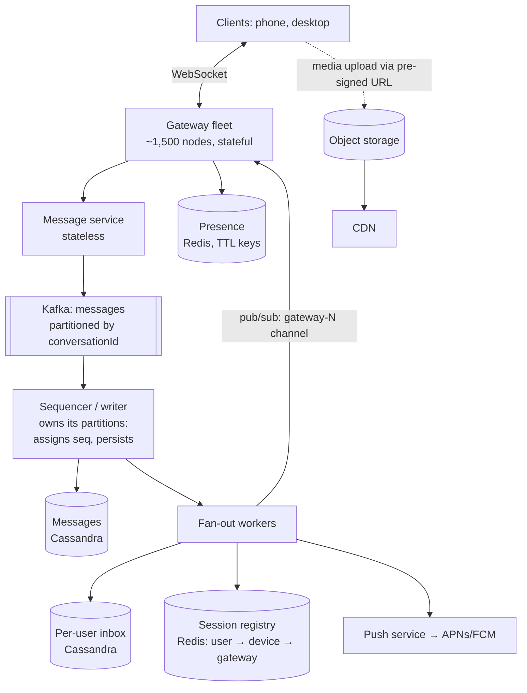

# Chat System — L5 (Senior) Interview

> **Level expectation:** you drive, and you go deep where chat is genuinely hard: **ordering**, **exactly-once-looking delivery** across reconnects and retries, **efficient sync**, **group fan-out trade-offs**, **presence at scale**, and **gateway failure behaviour**. Numbers back every choice. Read [L4-mid.md](L4-mid.md) first.

Legend: **🧑‍💼 Interviewer** · **🧑‍💻 Candidate** · **📝 Note** = commentary for you.

---

## 1. Requirements

**🧑‍💻 Candidate:** Same functional scope as L4, plus **multiple devices per user** (phone + desktop) and groups up to **1,000** members. Non-functional targets:

| Property | Target |
|---|---|
| Delivery latency, both online | p99 < 300 ms sender → recipient device |
| Durability | No loss after ✓ |
| Ordering | Every device sees a conversation in the **same** order |
| Duplicates | Never shown twice, even across retries/reconnects |
| Availability | 99.99% for send/receive |
| Sync after offline | Seconds, even after days offline |

Scale from [L4](L4-mid.md#2-back-of-the-envelope-estimates): ~230k msgs/s avg (~500k peak), ~150M concurrent connections, ~6 TB/day.

---

## 2. Architecture



**🧑‍💻 Candidate:** The flow in one sentence: *gateway → message service → Kafka (partitioned by conversation) → sequencer assigns the next sequence number and persists → fan-out writes each recipient's inbox and pushes to online devices or sends a push notification.* The deep dives explain why each step exists.

---

## 3. Deep dives

### 3.1 Ordering: per-conversation sequence numbers

**🧑‍💻 Candidate:** Timestamps can't order messages: two servers' clocks differ by milliseconds to seconds, and phone clocks can be off by hours. I need **one owner per conversation** that hands out 1, 2, 3… ([Message ordering](../../concepts/message-ordering-and-sequencing.md).)

| Option | How | Problem |
|---|---|---|
| Redis `INCR seq:{conversationId}` | Atomic counter | Redis failover can lose recent increments → duplicate seq numbers |
| Cassandra lightweight transaction (`INSERT … IF NOT EXISTS` on `(conv, seq)`) | Retry with seq+1 on conflict | Paxos round trip per message: slow under contention in busy groups |
| **Kafka partition ownership** ✅ | Partition by `conversationId`; exactly one consumer owns each partition; it keeps the last seq per conversation in memory, assigns `seq+1`, writes `(conversation_id, seq)` | Need care on ownership change (below) |

**Why Kafka partitioning works:** Kafka guarantees one consumer per partition within a consumer group, and order within a partition. So all messages of a conversation flow through **one** sequencer, in order. ([Kafka](../../technologies/kafka.md).)

**Ownership change** (consumer crash, rebalance): the new owner doesn't know the last seq. On partition assignment it reads `max(seq)` per active conversation from Cassandra (cheap: newest row of each partition) and continues. As a final guard, the write is `INSERT … IF NOT EXISTS` on `(conversation_id, seq)` **only during the first seconds after takeover**, when a zombie old owner might still be writing.

```sql
CREATE TABLE messages (
    conversation_id text,
    bucket          int,          -- e.g. month number: bounds partition size
    seq             bigint,
    client_msg_id   uuid,
    sender_id       text,
    body            blob,         -- ciphertext if E2EE (L6)
    PRIMARY KEY ((conversation_id, bucket), seq)
) WITH CLUSTERING ORDER BY (seq DESC);
```

- **`bucket` in the partition key**: a busy group sending 50k messages/day would otherwise grow one Cassandra partition forever (huge partitions = slow compaction and reads). Bucketing by month caps it.
- **Gap detection on the client**: if a device receives seq 1043 but its last was 1041, it knows 1042 is missing and fetches it. Order is preserved even if delivery isn't.

### 3.2 No duplicates: client IDs end to end

**🧑‍💻 Candidate:** Delivery is **at-least-once** everywhere (client retries, Kafka redelivery, gateway reconnects). Duplicates are removed at two points ([idempotency](../../concepts/idempotency-and-delivery-semantics.md)):
1. **Server side:** the sequencer keeps a short-lived dedup set `(conversationId, clientMsgId)` (e.g. Redis with 24 h TTL). A retried send gets the *original* seq back, not a new one.
2. **Client side:** devices store messages keyed by `(conversationId, seq)`, so receiving the same message twice is a no-op.

Together this looks like exactly-once to users, without needing exactly-once infrastructure.

### 3.3 Sync: per-user inbox

**🧑‍💼 Interviewer:** Arjun was offline 3 days and is in 200 conversations. How does his app catch up?

**🧑‍💻 Candidate:** Asking 200 conversations "anything after seq N?" is 200 queries, mostly returning nothing. Instead, fan-out also appends to a **per-user inbox**, which has its own sequence:

```text
inbox(user_id, inbox_seq) → (conversation_id, message seq)
```

The device remembers its last `inbox_seq` and asks one question: **"inbox entries after #88,120"**. That's one partition read, in order across all chats. Then it fetches message bodies (or the inbox row carries small bodies directly).

- Per **device** cursors: phone at inbox_seq 88,120, laptop at 87,900. Each syncs independently; that's multi-device.
- Inbox rows have a TTL (e.g. 30 days); after that a device does a full resync per conversation.

### 3.4 Groups: fan-out on write, with a limit

**🧑‍💻 Candidate:** Fan-out on write = when a message is sent, write it to every member's inbox and push to every online device ([fan-out](../../concepts/fan-out.md)).

| Group size | Strategy | Cost |
|---|---|---|
| ≤ 1,000 members (all groups here) | **Fan-out on write**: one inbox row per member | 1 message → up to 999 inbox writes (small rows, Cassandra handles it) |
| Channels with 100k+ readers | **Fan-out on read**: store once; readers pull the channel's messages when they open it | Can't write 1M inbox rows per post |

Estimate: if 20% of messages go to groups averaging 20 members → 230k × (0.8 × 1 + 0.2 × 20) ≈ **1.1M inbox writes/s**. Large, but Cassandra scales linearly with nodes: roughly 30–50 nodes at ~25k writes/s each. A real cost, and the reason big groups have a member cap.

### 3.5 Routing to the right gateway

- Registry: `user:{id}:devices → {deviceId: gateway-17, …}` in [Redis](../../technologies/redis.md), refreshed by heartbeats, TTL 90 s.
- Fan-out publishes to a per-gateway channel (`gw:17`) via [pub/sub](../../technologies/pub-sub.md). **Redis Pub/Sub is fire-and-forget**: if the gateway misses it, the message is *not* lost, because it's already in the inbox and the client's gap detection or next sync fetches it. Real-time push is an optimisation on top of durable storage, so a lossy, fast transport is fine here.

> 📝 **Note:** "Real-time delivery is best-effort; durability comes from storage + sync" is the key design idea of chat systems. It lets you use simple, fast transports without risking message loss.

### 3.6 Presence without a broadcast storm

**🧑‍💻 Candidate:** Naively, when a user with 500 contacts comes online we notify 500 people. With 150M users online and frequent flapping (network blips on mobile), that's billions of presence events. ([Presence & heartbeats](../../concepts/presence-and-heartbeats.md).)

- **Subscribe on view:** only push presence for the chat you're *currently looking at* (that's why WhatsApp shows "online" in the open chat header, not live dots on your whole contact list).
- **Debounce:** ignore offline→online flips shorter than a few seconds.
- Presence data: `presence:{userId}` with TTL in Redis, refreshed by heartbeats; `last_seen` written on expiry/disconnect.

### 3.7 Media

**🧑‍💻 Candidate:** App requests an upload URL → server returns a **pre-signed URL** (a temporary link allowing one upload to one object key) → app uploads directly to [object storage](../../technologies/object-storage.md) → sends a chat message with `{mediaKey, mimeType, size, thumbnail (few KB)}`. Recipients download via [CDN](../../technologies/cdn.md) with pre-signed download URLs. Chat servers never touch the megabytes.

### 3.8 Gateway failure and reconnect storms

- On gateway crash: ~100k clients reconnect. **Exponential backoff with jitter** on the client, so they arrive over ~10–30 s instead of in one second.
- The load balancer and gateways **rate-limit new connections** (accept N/s per node) so a storm can't overload auth/registry.
- Reconnected devices sync via inbox cursor, so nothing is lost; at worst some messages arrive a few seconds late.

---

## 4. Failure modes (raise them yourself)

| Failure | Impact | Mitigation |
|---|---|---|
| Gateway node dies | 100k users reconnect | Jittered backoff, connection rate limits, sync by cursor |
| Sequencer consumer dies | Partition stalls until rebalance (seconds) | Kafka rebalance; new owner restores max seq; brief higher latency |
| Redis registry lost | Can't route real-time; deliveries look "offline" | Push notifications + sync still deliver; rebuild registry as clients heartbeat |
| Cassandra node down | RF=3 with QUORUM writes keeps going | Monitor hinted handoff / repair |
| Push provider outage | Offline users not notified | They still get everything on next app open |
| Hot group (viral 1,000-member group) | One Kafka partition / Cassandra partition hot | Bucketing; per-conversation rate limits; monitor partition lag |

---

## 5. Follow-ups

**🧑‍💼 Interviewer:** How do read receipts work in a 1,000-person group?

**🧑‍💻 Candidate:** Per-member read receipts would be 999 events per message, and each one notifying the sender. Instead, each member periodically sends a **read cursor** ("read up to seq 5,021 in conv c_91"); store `(conversation, user) → last_read_seq`. The sender's "Message info" view reads those cursors on demand. For big groups, receipts are aggregated or disabled.

**🧑‍💼 Interviewer:** Why not let gateways write to Cassandra directly and skip Kafka?

**🧑‍💻 Candidate:** Then two gateways handling two members of the same conversation would race to assign seq numbers, which is back to needing a distributed lock per conversation. Kafka partitioning gives us "one writer per conversation" for free, plus buffering when Cassandra is slow and replay if a consumer fails.

---

## 6. What the interviewer was evaluating (L5)

- [ ] Ordering from a single owner per conversation, with ownership-change handling
- [ ] Partition sizing (bucketing) to avoid unbounded Cassandra partitions
- [ ] At-least-once + client message IDs + client-side dedup by seq
- [ ] Inbox model for efficient multi-conversation, multi-device sync
- [ ] Group fan-out math and a size threshold for switching strategies
- [ ] "Real-time is best-effort, durability is storage + sync" → lossy pub/sub is fine
- [ ] Presence without broadcast storms (subscribe-on-view, debounce)
- [ ] Media via pre-signed URLs; reconnect storms with jitter and connection rate limits

## 7. Common mistakes at this level

| Mistake | Why it hurts at L5 |
|---|---|
| "Use timestamps for order" | Clock skew reorders messages; different devices disagree |
| Redis `INCR` for seq with no answer for failover | Duplicate sequence numbers after a Redis failover |
| One Cassandra partition per conversation forever | Busy groups create huge partitions |
| Syncing by querying every conversation | O(conversations) queries per reconnect × millions of reconnects |
| Broadcasting presence to all contacts | Billions of useless events |
| Relying on pub/sub for durability | Pub/sub drops messages; storage must be the source of truth |
| No jitter on reconnect | A gateway crash becomes a self-DDoS |

⬅️ Previous: [L4-mid.md](L4-mid.md) · ➡️ Next: [L6-staff.md](L6-staff.md)
