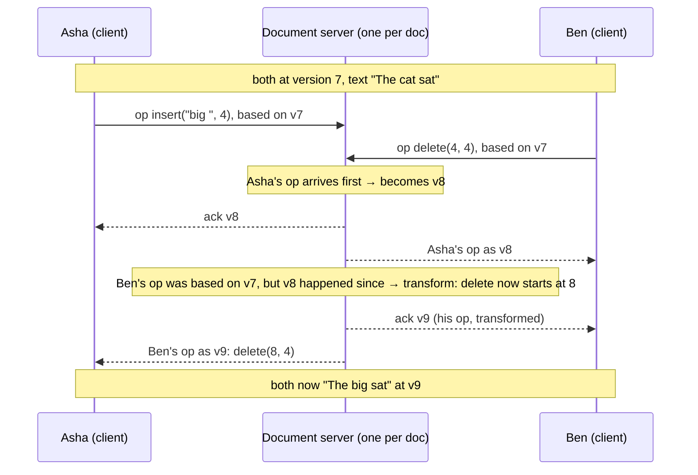

# Start Here: What Is a Collaborative Editor? (Before the Interview)

> Three people have the same Google Doc open. One types a heading, another fixes a typo two lines below, a third deletes a paragraph, all at the same moment. A second later all three screens show exactly the same document, with nobody's work lost. That "exactly the same, nobody's work lost" is the hard part, and it's why this interview is famous.
>
> Time: ~15 minutes. Then: [L4](L4-mid.md) → [L5](L5-senior.md) → [L6](L6-staff.md). The single-user version (undo/redo, buffers) is the [Text Editor LLD](../../../LLD/interviews/text-editor/README.md).

---

## 1. The story: two people, one sentence

Asha and Ben share a doc containing:

```text
"The cat sat"
```

At the same moment:
- Asha inserts `"big "` at position 4 → she sees `"The big cat sat"`.
- Ben deletes `"cat "`, starting at position 4 → he sees `"The sat"`.

Each edit is sent to the other. If each side applies the other's edit **as it was sent**:
- Ben applies "insert `big ` at 4" to `"The sat"` → `"The big sat"`.
- Asha applies "delete 4 characters at 4" to `"The big cat sat"` → deletes `"big "` → `"The cat sat"`.

Two screens, two different documents, and on Asha's screen Ben's deletion removed the wrong word. Positions **shifted** because of the other person's edit. Making every copy converge to the same, sensible result (`"The big sat"`) no matter the order edits arrive in is the core problem. → L4 §5.2.

What else goes wrong with naive approaches:
- **Locking** ("only one person may edit at a time", or "lock this paragraph") is safe but feels terrible: you can't fix a typo while someone else is typing.
- **Last write wins on the whole document** throws away one person's edits.
- **Sending the whole document on every keystroke** is huge and still has the overwrite problem.

---

## 2. Where you've already seen it

| Where | What's being shared |
|---|---|
| **Google Docs / Sheets / Slides** | Text, cells, slides, with colored cursors for each person |
| **Figma** | Design objects on a canvas, edited by many designers |
| **Notion, Confluence, Coda** | Blocks of rich text |
| **VS Code Live Share, JetBrains Code With Me** | Source code in your IDE |
| **Overleaf** | LaTeX papers |
| **At work** | A shared incident doc during an outage, everyone typing timelines at once |

---

## 3. The features, through situations

### 3.1 "I see your typing as you type" → real-time sync
Each keystroke (batched every ~100 ms) becomes a small **operation** ("insert 'a' at position 57"), sent over a persistent connection ([WebSockets](../../technologies/websockets-and-sse.md)) to a server that forwards it to everyone else in the document. → L4 §4, §5.1.

💡 **Operation (op):** a small description of one change, like `insert("big ", 4)` or `delete(4, 4)`, instead of the whole new document.

### 3.2 "We both typed in the same sentence" → OT or CRDTs
The two families of solutions ([OT & CRDTs](../../concepts/operational-transformation-and-crdts.md)):
- **Operational Transformation (OT):** before applying someone else's operation, **transform** it against the operations it didn't know about (shift positions, adjust deletes). Google Docs works this way, with a central server deciding the order. → L4 §5.2.
- **CRDTs:** give every character a unique, ordered identity instead of a position number, so edits can be merged in any order and still agree. Used by local-first tools and libraries like Yjs and Automerge. → L5 §3.2.

### 3.3 "Where is everyone?" → presence and cursors
Colored cursors, "Ben is viewing", selection highlights. This **presence** data changes constantly but doesn't need to be saved. → [Real-time collaboration & presence](../../concepts/real-time-collaboration-and-presence.md), L4 §5.4.

### 3.4 "I was on a flight and kept editing" → offline editing
Your edits queue locally; when you reconnect, they must merge with hours of other people's changes. → L5 §3.3.

### 3.5 "Who deleted my paragraph?" → version history
Every operation is logged, so the doc can show history ("edited by Ben, 3:42 pm") and restore old versions. Periodic **snapshots** keep loading fast. → L4 §5.5.

### 3.6 "Anyone with the link can comment" → sharing and permissions
Owners, editors, commenters, viewers, link sharing, organisation-only access. Checked when you open the doc *and* on every operation. → L4 §5.6.

### 3.7 "500 people opened the all-hands doc" → hot documents
Most docs have 1–3 editors. A few have hundreds at once, and every keystroke would fan out to all of them. → L5 §3.5.

### 3.8 "Undo my change, not Ben's" → collaborative undo
Ctrl+Z should undo *your* last edit even if Ben typed after you. That's harder than single-user undo ([Text Editor LLD](../../../LLD/interviews/text-editor/README.md)). → L5 §3.1.

---

## 4. The key mechanism: a central server orders, clients transform



The server is the referee: it puts every operation in **one order** (versions 8, 9, …) and transforms late-arriving operations against what happened in between. Clients do the same transformation on their side for operations they receive while their own are still in flight.

---

## 5. Try it yourself

- **Two windows, one Google Doc:** open the same doc in two browser windows side by side (or two accounts). Type in the same word from both. Watch the other cursor move.
- **Go offline:** in one window, DevTools → Network → *Offline*. Edit a paragraph. Edit the same paragraph in the other window. Go back online and watch them merge.
- **Version history:** *File → Version history → See version history*. Each entry is a snapshot of a long stream of operations; expand one to see who changed what.
- **Watch the traffic:** DevTools → Network → WS (or the `save`/`bind` requests Google Docs uses) while typing: small messages, not the whole document.

> These are user-visible experiments; nothing to install.

---

## 6. From experience to requirements

| What people experience | Requirement |
|---|---|
| See others' typing within a blink | **NF:** operation round trip ~100–300 ms |
| Never lose anyone's edit; everyone ends up with the same text | **F:** convergence and intention preservation (OT or CRDT) |
| See cursors and who's here | **F:** presence, ephemeral and throttled |
| Keep editing offline | **F:** local queue + merge on reconnect |
| Browse and restore old versions | **F:** operation log + snapshots |
| Share with the right people | **F:** permissions checked on open and on every op |
| Docs open fast, even huge ones | **NF:** snapshot + recent ops; lazy loading |
| A server crash doesn't lose typed text | **NF:** acknowledged ops are durable; clients resend unacknowledged ops |

---

## 7. Mini glossary

| Term | Plain meaning |
|---|---|
| Operation (op) | A small description of one edit: insert/delete at a position |
| Convergence | All copies end up identical, whatever order ops arrived in |
| Intention preservation | Each user's edit still does what they meant after others' edits |
| OT | Operational Transformation: adjust ops against concurrent ops |
| CRDT | Conflict-free Replicated Data Type: data that merges automatically in any order |
| Revision / version | The position of an op in the server's single order |
| Presence | Who's online, where their cursor is (not saved) |
| Snapshot | The full document at some version, so loading doesn't replay every op ever |
| Tombstone | A "deleted" marker some CRDTs keep instead of removing a character |

➡️ Next: [README.md](README.md) · then [L4-mid.md](L4-mid.md)
