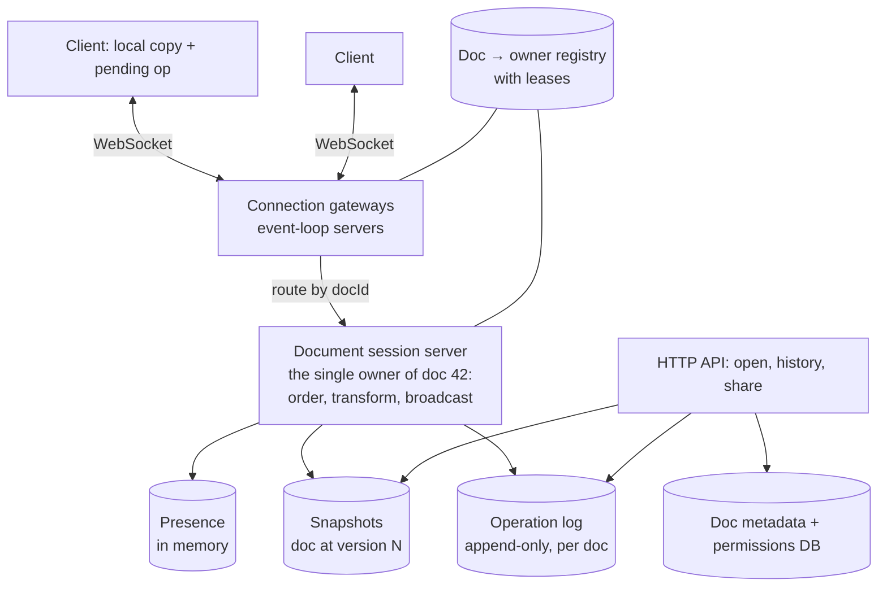
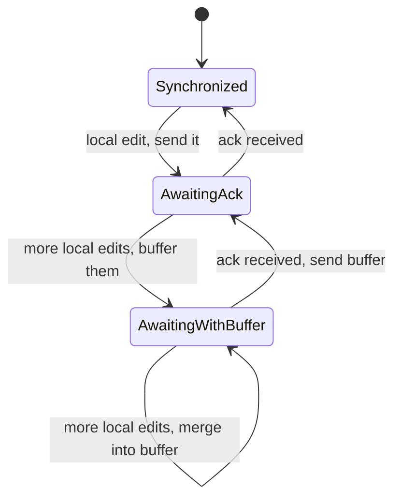

# Collaborative Editor (Google Docs) — L4 (Mid-level / SDE2) Interview

> **Level expectation:** a working real-time design: persistent connections, **one owner process per document** that puts operations in a single order, **Operational Transformation** with a central server (explained with a worked example), a client that keeps one operation in flight, presence, an operation log with snapshots for loading and history, and permission checks. You don't need to derive every transform case; you do need to explain why positions must be transformed.

> 🆕 Read [00-understand-the-product.md](00-understand-the-product.md) first. Its "The cat sat" example is the heart of this interview.

Legend: **🧑‍💼 Interviewer** · **🧑‍💻 Candidate** · **📝 Note** = commentary for you.

---

## 1. Clarifying requirements

**🧑‍💼 Interviewer:** Design Google Docs.

**🧑‍💻 Candidate:** Scope first:
- Plain text or rich text (bold, headings, tables)? Images, comments?
- How many people edit one document at once, typically and at most?
- Must offline editing work?
- Version history? Sharing and permissions?
- Scale: documents, daily users?

**🧑‍💼 Interviewer:** Start with plain text; we'll talk about rich text later. Usually 1–5 editors per doc, sometimes 100+. Offline is a stretch goal. Yes to history and sharing. 50M daily active users.

**🧑‍💻 Candidate:**

**Functional**
1. Open a document, edit it, see other people's edits and cursors in real time.
2. Concurrent edits never lose anyone's work; everyone converges to the same text.
3. Version history: see and restore earlier versions.
4. Share with permissions (owner, editor, commenter, viewer).

**Non-functional**
1. **Low latency:** your own typing is instant (applied locally); others' edits appear within ~100–300 ms.
2. **Convergence:** all replicas identical after edits stop. Non-negotiable.
3. **Durability:** an acknowledged edit is never lost.
4. **Scale:** millions of concurrent connections.

> 📝 **Note:** "Your own typing is applied locally, immediately" is a key requirement. If each keystroke waited for the server, the editor would feel broken on any real network.

---

## 2. Back-of-the-envelope estimates

(Method: [back-of-the-envelope](../../concepts/back-of-the-envelope.md).)

| What | Calculation | Result |
|---|---|---|
| Concurrent editing sessions at peak | assume 10% of 50M DAU at once | **5M WebSocket connections** |
| Actively typing at any instant | assume 30% of them | 1.5M users |
| Operations sent | typing batched into ~2 ops/s per active typist: 1.5M × 2 | **~3M ops/s** at peak |
| Op size | position + text + IDs ≈ 100 bytes | 3M × 100 B = **~300 MB/s** inbound |
| Fan-out | average ~2 other people in the doc → each op sent ~2 times | ~6M outbound messages/s |
| Op log growth | assume 1M ops/s average × 100 B × 86,400 s | **~8.6 TB/day** raw |
| Documents stored | 1B documents × ~50 KB average | **~50 TB** of current content |
| Connection servers | 5M connections ÷ ~100k per server | **~50 servers** (plus headroom) |

**🧑‍💻 Candidate:** Takeaways:
- Per document, traffic is tiny (a few ops/s). The scale is in the **number of documents and connections**, so we shard by document and keep each document's work on one machine.
- **8.6 TB/day of operations** can't be kept forever as-is: compact old ops into snapshots and keep coarser history (L5 §3.6).
- 5M long-lived connections need event-loop servers ([epoll](../../../under-the-hood/epoll.md)).

---

## 3. API

**HTTP** for everything that isn't live editing:
```http
POST /v1/docs                         → { docId }
GET  /v1/docs/{docId}                 → { snapshot, version, permissions }
GET  /v1/docs/{docId}/history         → [ { version, author, time } ]
POST /v1/docs/{docId}/share           body: { email, role }
```

**WebSocket** messages while editing:
```text
client → server   join    { docId, version: 120 }                 // "I have v120, send me anything newer"
client → server   op      { opId: "c7-41", baseVersion: 120, op: insert("big ", 4) }
server → client   ack     { opId: "c7-41", version: 121 }
server → client   remote  { version: 122, author: "ben", op: delete(8, 4) }
both directions   cursor  { user: "ben", position: 8 }            // presence, not stored
```

- **`opId`** (client ID + counter) makes resending safe: if the server already has `c7-41`, it re-sends the ack instead of applying it twice ([idempotency](../../concepts/idempotency-and-delivery-semantics.md)).
- **`baseVersion`** tells the server which document state the op was written against, so it knows what to transform it over.

---

## 4. High-level design



**🧑‍💻 Candidate:**
- **Gateways** hold WebSocket connections and forward messages; they're stateless about document content.
- **Document session servers:** each active document is owned by **exactly one** session server process (found via a registry, or [consistent hashing](../../concepts/consistent-hashing.md) on `docId`). That owner holds the current text in memory, assigns versions, transforms incoming ops, appends them to the log, and broadcasts.
- **Operation log + snapshots** for durability, loading and history.
- **Metadata DB** ([PostgreSQL](../../technologies/postgresql.md)) for documents, owners and permissions.

---

## 5. Deep dives

### 5.1 Why one owner per document?

**🧑‍💻 Candidate:** Transformation needs **a single agreed order** of operations per document ([message ordering & sequencing](../../concepts/message-ordering-and-sequencing.md)). If two servers accepted ops for the same document independently, they'd each assign "version 121" to different ops. One owner = one sequencer, with no coordination on the hot path. A document's traffic is tiny (a few ops/s), so one process easily handles thousands of documents.

When the owner dies, another process takes over the document (L5 §3.4). The registry uses **leases** so two owners can't run at once ([distributed locks & leases](../../concepts/distributed-locks-and-leases.md)).

### 5.2 Operational Transformation, with the server ordering

**🧑‍💻 Candidate:** Using the product page example, text `"The cat sat"` at version 7 ([OT & CRDTs](../../concepts/operational-transformation-and-crdts.md)):

1. Asha sends `insert("big ", 4)` based on v7. It arrives first: the server applies it, it becomes **v8**. Text: `"The big cat sat"`.
2. Ben sends `delete(4, 4)` (remove `"cat "`) also based on v7. The server sees that v8 happened since Ben's base. It **transforms** Ben's op against Asha's: Asha inserted 4 characters at position 4, which is at or before Ben's delete position, so Ben's delete shifts right by 4 → `delete(8, 4)`. Applied as **v9**. Text: `"The big sat"`.
3. The server broadcasts v8 to Ben and v9 (the transformed delete) to Asha.

The basic transform rules for plain text:

| Incoming op | Already-applied op | Adjustment |
|---|---|---|
| insert at p | insert at q ≤ p (length n) | shift p by n (ties broken by user ID so both sides agree) |
| insert at p | delete at q < p (length n) | shift p left by up to n |
| delete at p | insert at q ≤ p (length n) | shift p by n |
| delete range | overlapping delete range | delete only the part not already deleted |

**Requirement for correctness:** applying A then transformed B gives the same text as applying B then transformed A. With a central server ordering everything, this one property is enough; that's why server-based OT is practical.

### 5.3 The client: apply locally, one op in flight

**🧑‍💻 Candidate:** Each client keeps:
- **Its current text** (with its own edits already applied, so typing is instant).
- **One "sent" op** waiting for an ack, and a **buffer** of local edits made since (combined into one op).

When a remote op arrives, the client transforms it against its sent and buffered ops before applying it, and transforms its own pending ops against the remote op. When the ack arrives, the buffer becomes the next sent op. Keeping **only one op in flight** means the server only ever transforms a client's op against ops from *other* clients, which keeps the logic simple (this is the classic Google Wave / Jupiter-style client design).



### 5.4 Presence and cursors

- Cursor positions are **positions in the text**, so they also need shifting when ops arrive (same transform rules).
- Presence is **ephemeral**: kept in the owner's memory, broadcast to the doc's participants, never written to the op log ([presence & heartbeats](../../concepts/presence-and-heartbeats.md), [real-time collaboration & presence](../../concepts/real-time-collaboration-and-presence.md)).
- **Throttled:** at most ~10 cursor updates per second per user, and dropped (not queued) when a connection is slow: the latest position is all that matters.

### 5.5 Persistence: operation log + snapshots

- Every op is appended to the document's **log** before it's acknowledged: (docId, version, author, op, time). An ack means "durable".
- Every N ops (e.g. 500) or every few minutes, the owner writes a **snapshot**: the full text at version V.
- **Opening a doc** = load the latest snapshot + replay ops after it.
- **Version history** = snapshots (named versions) plus "who changed what" from the log. Restoring an old version is itself a new edit (an op that replaces the content), so history stays append-only.

This is event sourcing: the log is the truth, snapshots are a cache ([ledgers & event sourcing](../../../LLD/concepts/ledgers-and-event-sourcing.md)). The log store needs fast appends and range reads by (docId, version): a wide-column store like [Cassandra](../../technologies/cassandra.md) partitioned by docId, or a relational table for smaller scale. Snapshots go to [object storage](../../technologies/object-storage.md) or the same DB.

### 5.6 Sharing and permissions

- Roles per document in the metadata DB; link sharing is a role granted to "anyone with the link" (optionally within an organisation).
- Checked on **open** (HTTP) and on **join** (WebSocket). The session server caches the user's role for the session and rejects ops from viewers/commenters.
- **Revocation:** when access is removed, the server closes that user's session for the document immediately, not at next reload.

---

## 6. Follow-ups

**🧑‍💼 Interviewer:** The WebSocket drops for 10 seconds. What happens?

**🧑‍💻 Candidate:** The client keeps editing locally. On reconnect it sends `join` with its last acknowledged version, receives the ops it missed, transforms its pending ops against them, and resends them with the same `opId`s. Ops the server already applied are recognised by `opId` and just acknowledged again.

**🧑‍💼 Interviewer:** Why not just lock the paragraph someone is editing?

**🧑‍💻 Candidate:** It's simpler, but users feel it constantly ("this paragraph is being edited") and stale locks from disconnected users need timeouts. OT gives the experience users expect from Docs: anyone types anywhere, anytime.

**🧑‍💼 Interviewer:** Why do clients apply their own edits before the server confirms?

**🧑‍💻 Candidate:** Latency. A round trip of 100–300 ms per keystroke would be unusable. Applying locally and transforming later is exactly what OT exists to make safe.

---

## 7. What the interviewer was evaluating (L4)

- [ ] Explained the shifted-position problem with a concrete example
- [ ] Estimates showing per-doc traffic is tiny and the scale is in documents and connections
- [ ] WebSocket protocol with `baseVersion`, versions, acks and idempotent `opId`s
- [ ] One owner per document as the sequencer; lease-protected ownership
- [ ] Server-ordered OT with a worked transform and basic rules
- [ ] Client with local apply and one op in flight
- [ ] Presence as ephemeral and throttled
- [ ] Op log + snapshots; history as append-only; permissions on open and join

## 8. Common mistakes at this level

| Mistake | Why it hurts |
|---|---|
| Sending the whole document on each change | Huge traffic; still overwrites concurrent edits |
| Last write wins | Silently loses edits |
| Any server can accept any doc's ops | No single order; transforms impossible |
| Waiting for the server before showing your own typing | Editor feels laggy on every network |
| Persisting cursor movements | Massive, useless write volume |
| Acknowledging before the op is durable | A crash loses text the user saw as saved |

➡️ Next: [L5-senior.md](L5-senior.md)
