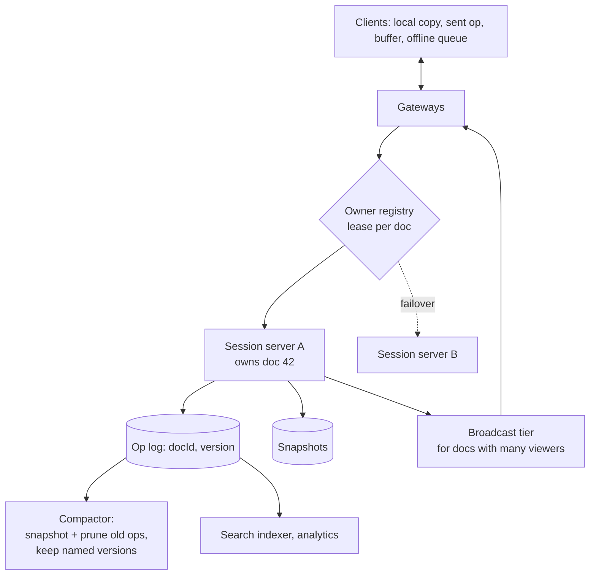

# Collaborative Editor (Google Docs) — L5 (Senior) Interview

> **Level expectation:** the L4 design (one owner per doc, server-ordered OT, op log + snapshots) is assumed. Now: **collaborative undo**, **CRDTs** as the alternative and when to prefer them, **offline editing** with long divergence, **owner failover** without losing or duplicating ops, **hot documents** with hundreds of editors, **compaction**, **rich text**, and **comments anchored to text that keeps moving**. Read [L4-mid.md](L4-mid.md) first.

Legend: **🧑‍💼 Interviewer** · **🧑‍💻 Candidate** · **📝 Note** = commentary for you.

---

## 1. Requirements (sharpened)

Same as L4, plus:
- **Offline editing** for hours, merging on reconnect.
- **Rich text:** bold, headings, lists, links.
- **Comments** attached to a range of text.
- An all-hands doc with **300 simultaneous editors and 2,000 viewers**.
- No lost edits when a session server crashes.

---

## 2. Architecture (what changes from L4)

---

## 3. Deep dives

### 3.1 Collaborative undo

**🧑‍💼 Interviewer:** Asha presses Ctrl+Z. Ben has typed since her last edit. What happens?

**🧑‍💻 Candidate:** She expects **her** last change undone, not Ben's. Single-user undo pops the last op and applies its inverse ([Text Editor LLD](../../../LLD/interviews/text-editor/README.md)). Collaboratively:
1. Keep each user's own undo stack of **their** ops (with the versions they were applied at).
2. To undo op X, compute its **inverse** (insert ↔ delete), then **transform that inverse against every op applied after X** (including Ben's), exactly as if it were a new edit made now.
3. Send the result as a normal new op. History stays append-only.

Edge case: if Ben already deleted the text Asha inserted, her undo transforms into "delete nothing": a no-op, which is the intuitive result.

### 3.2 CRDTs: when to choose them instead of OT

**🧑‍💻 Candidate:** OT shifts **positions**. CRDTs avoid positions altogether ([OT & CRDTs](../../concepts/operational-transformation-and-crdts.md)):
- Each inserted character gets a **unique ID** (e.g. `(clientId, counter)`) and a reference to the character it was inserted after.
- A delete marks a character's ID as deleted (a **tombstone**) rather than removing it, so later ops that refer to it still make sense.
- Any two replicas that have received the same set of ops show the same text, **in any order of arrival**, with no central server needed.

| | Server-ordered OT (L4) | CRDT |
|---|---|---|
| Needs a central sequencer | Yes | No (peers, multiple servers, offline devices) |
| Metadata overhead | Small (positions) | IDs per character, tombstones (can be several × the text size; modern libraries compress heavily) |
| Long offline periods | Server transforms a large backlog | Merge naturally |
| Correctness reasoning | Transform functions must be right for every pair | Merge is mathematically guaranteed by construction |
| Typical users | Google Docs | Local-first apps, libraries such as Yjs and Automerge; Figma uses a server-authoritative design inspired by CRDTs |

**My choice for this product:** keep the server as the authority (needed anyway for permissions, history and search), with **either** OT or a CRDT under it. If offline-for-hours and multi-device editing are first-class requirements, a CRDT makes merging simpler and safer; if documents are huge and mostly online, server OT keeps memory smaller.

### 3.3 Offline editing

**🧑‍💻 Candidate:** Offline, the client records ops in a **local durable queue** (IndexedDB in browsers, SQLite on mobile) with their base version.
- **Short offline (minutes):** reconnect, fetch missed ops, transform the queue against them (L4 §6), send.
- **Long offline (hours, thousands of ops on both sides):** transforming each local op against thousands of remote ops is O(local × remote). Compose the local ops into fewer ops first, or, with a CRDT, simply exchange missing ops in both directions.
- **Surprising merges are a UX problem:** after a big merge, highlight "changes made while you were offline" so users can review.

### 3.4 Owner failover without losing or duplicating edits

**🧑‍💻 Candidate:** Session server A owns doc 42 with a lease in the registry ([leases](../../concepts/distributed-locks-and-leases.md)). A crashes:
1. A's lease expires (seconds). Gateways see the doc has no owner; the next message for doc 42 triggers a new owner B to acquire the lease.
2. B loads the latest snapshot and replays the op log **to the highest durable version**.
3. Clients reconnect (their gateway tells them), send `join` with their last acked version, and **resend unacknowledged ops with the same `opId`s**.
4. B deduplicates by `opId` (it keeps the recent `opId`s per client, recovered from the log), so an op that A logged but never acked is acknowledged, not applied twice ([idempotency](../../concepts/idempotency-and-delivery-semantics.md)).

**Fencing:** if A was only *paused* (GC pause) and wakes up, its log appends must be rejected. Use the lease's **fencing token** as part of the log write (a conditional append "only if owner epoch = 7"), so a stale owner can't write version 512 a second time. The [Raft simulation](../../../see-it-work/raft-leader-election/README.md) shows the same stale-leader problem.

### 3.5 Hot documents: 300 editors, 2,000 viewers

**🧑‍💻 Candidate:** Fan-out arithmetic: 300 editors each sending 2 ops/s = 600 ops/s; each must go to 2,300 participants → **~1.4M messages/s** from one document's owner. Too much for one process. So:
- **Separate editors from viewers:** viewers get a **batched** stream (e.g. every 200–500 ms) from a broadcast tier ([fan-out](../../concepts/fan-out.md)), not each op individually.
- **Batch ops to editors too:** combine ops per 50–100 ms window; one message carries many ops.
- **Throttle presence harder** as participants grow: show 20 cursors, summarise the rest ("+280 others").
- **Cap simultaneous editors** (Google Docs caps how many can edit at once and makes the rest viewers) and degrade gracefully.

### 3.6 Compaction and history retention

8.6 TB/day of raw ops (L4) can't be kept forever. The compactor:
- Snapshots each active doc periodically; ops older than the newest snapshot are **pruned** except those needed for "fine-grained recent history" (e.g. last 30 days).
- Keeps **named versions** forever and **coarse history** (one snapshot per hour/day) for older periods.
- Stores snapshots compressed in object storage; the op log stays small and hot.

### 3.7 Rich text and comments

- **Rich text** is usually modelled as text plus **formatting marks** over ranges (bold from 10 to 20), or as a tree of blocks (paragraphs, lists, tables). Each needs its own transform/merge rules: e.g. concurrent "bold 10–20" and "insert at 15" → bold range grows to include the insertion if it's inside.
- **Comments anchored to text:** store the anchor as a range that is **transformed like a cursor** with every op (or, with CRDTs, anchored to character IDs, which never move). If the commented text is deleted, the comment becomes "orphaned" and shows the original quote.

---

## 4. Failure modes

| Failure | Behaviour | Mitigation |
|---|---|---|
| Session server crash | Doc briefly unavailable for edits | Lease expiry → new owner, replay log, clients resend by `opId` |
| Paused old owner wakes up | Could write duplicate versions | Fencing token on log appends |
| Gateway crash | Its clients disconnect | Reconnect to another gateway; resume from last acked version |
| Transform bug | Replicas diverge silently | Periodic checksum of the doc sent with acks; on mismatch, client reloads from snapshot; fuzz tests (L6) |
| Hot document | Owner CPU/network saturated | Batching, viewer broadcast tier, editor caps |
| Huge offline backlog | Slow merge on reconnect | Compose ops; or CRDT merge; show "offline changes" UI |

---

## 5. Follow-ups

**🧑‍💼 Interviewer:** How would you detect that two clients have silently diverged?

**🧑‍💻 Candidate:** Have the server include a hash of the document text with each ack (cheap: one hash per op of a few KB in memory, or every Nth op). The client compares with its own hash at that version; a mismatch triggers a reload from the server's snapshot and a bug report with the op history. Never trust that transforms are perfect.

**🧑‍💼 Interviewer:** Can search indexing read the op log?

**🧑‍💻 Candidate:** Yes, asynchronously: the indexer consumes "doc changed" events, debounced per doc (index a few seconds after typing pauses), and reads the latest snapshot rather than replaying ops. Search freshness of seconds is fine.

---

## 6. What the interviewer was evaluating (L5)

- [ ] Collaborative undo as an inverse transformed against later ops
- [ ] CRDT mechanics (IDs, tombstones) and a reasoned OT-vs-CRDT choice
- [ ] Offline queue; cost of long divergence; UX for big merges
- [ ] Owner failover with leases, log replay, opId dedup and fencing
- [ ] Hot-doc fan-out arithmetic with batching, viewer tier, editor caps
- [ ] Compaction and history retention
- [ ] Rich-text marks and comments anchored through transforms
- [ ] Divergence detection with document hashes

## 7. Common mistakes at this level

| Mistake | Why it hurts at L5 |
|---|---|
| Global undo stack | Undoes someone else's edit |
| "CRDTs are always better" | Ignores metadata cost and that you still need a server for permissions and history |
| Failover that replays without dedup | Duplicate text appears after a crash |
| No fencing for the old owner | Two writers for the same document versions |
| Sending every op to 2,000 viewers individually | One document saturates a server |
| Comments stored as fixed character offsets | They drift onto the wrong text after edits |

⬅️ Previous: [L4-mid.md](L4-mid.md) · ➡️ Next: [L6-staff.md](L6-staff.md)
