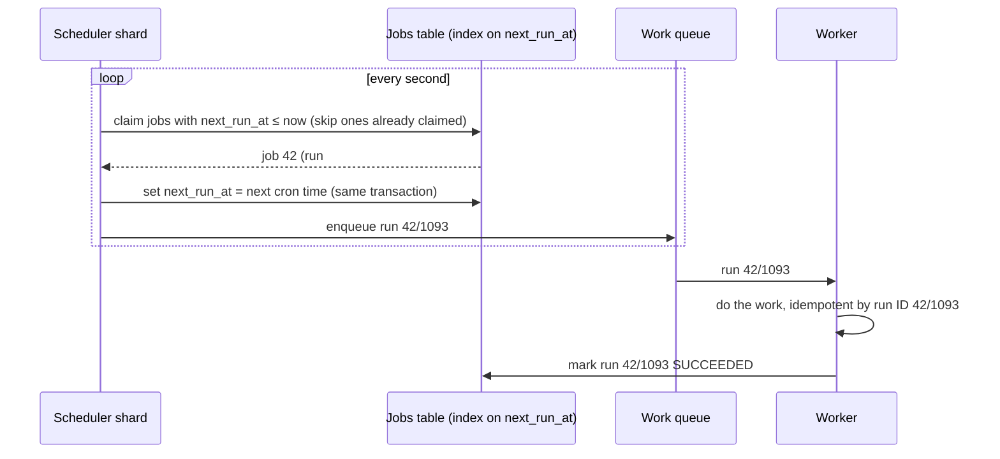

# Start Here: What Is a Distributed Job Scheduler? (Before the Interview)

> You've written a cron line or a Kubernetes CronJob: "run this every night at 2 am". Now imagine a company with **50 million** of them: every user's "remind me at 9 am", every merchant's daily report, every subscription renewal, every retry "in 5 minutes". They must fire on time, in the right time zone, **exactly once**, even when servers die at 1:59 am. That's the system this interview asks you to design.
>
> Time: ~12 minutes. Then: [L4](L4-mid.md) → [L5](L5-senior.md) → [L6](L6-staff.md). The single-process version (a heap, a dispatcher thread, cron parsing, retries) is the [Task Scheduler LLD](../../../LLD/interviews/task-scheduler/README.md).

---

## 1. The story: "Why did 40,000 customers get charged twice?"

A subscription company renews plans at midnight, each customer in their own time zone. Version 1 is one server running cron: at 00:00 it loads every customer due today and charges them.

What went wrong over one year:
- **The server died at 00:03.** Half the renewals never ran. Nobody noticed until customers lost access.
- **They added a second server for safety.** Both ran the same cron. **40,000 customers were charged twice.**
- **Daylight saving time ended** in the US. 01:30 happened twice that night; jobs scheduled for 01:30 ran twice. In spring, 02:30 didn't exist and those jobs never ran.
- **Midnight UTC became a stampede:** millions of jobs due in the same second overloaded the payment service.
- **A job hung for 6 hours** holding a lock, and the next night's run piled on top.

Each of these is an interview question.

---

## 2. Where you've already seen it

| Where | What you saw |
|---|---|
| **Linux cron, k8s CronJob** | `0 2 * * *`; `concurrencyPolicy: Forbid`; `startingDeadlineSeconds` (misfire handling!) |
| **Reminders, calendars** | "Remind me tomorrow at 9", recurring meetings in your time zone |
| **Billing, subscriptions** | Renewals, invoices, "your trial ends in 3 days" emails |
| **Airflow / Jenkins schedules** | Nightly ETL pipelines with dependencies between tasks |
| **Retries "in 5 minutes"** | Delayed jobs: a scheduler with a one-off schedule |
| **At work** | Leader election, leases, idempotent handlers, on-call pages at midnight |

---

## 3. The features, through situations

### 3.1 "Run this every day at 9 am in my time zone" → schedules
One-off (`at 2026-10-12T09:00 Asia/Kolkata`), recurring (cron expression), or fixed interval ("every 15 minutes"). Stored with the **next run time**. → L4 §5.1, §5.5.

### 3.2 "Fire on time, at huge scale" → finding due jobs
With 50M schedules, you can't scan them all every second. You need an index by next run time. → L4 §5.2, [distributed scheduling & time buckets](../../concepts/distributed-scheduling-and-time-buckets.md).

### 3.3 "Run it somewhere, and know if it finished" → dispatch, workers, heartbeats
The scheduler decides *when*; a fleet of workers does the *work*. → L4 §5.3–5.4.

### 3.4 "Never charge twice" → exactly-once execution
Two schedulers, a worker that pauses then wakes up: who is allowed to run the job? → L5 §3.1, [distributed locks & leases](../../concepts/distributed-locks-and-leases.md).

### 3.5 "The scheduler was down for 10 minutes" → misfires
Run the missed jobs now? Skip them? Run only the latest? Depends on the job. → L5 §3.3.

### 3.6 "Everything is due at midnight" → thundering herd
Jitter, rate limits and priorities. → L5 §3.4.

### 3.7 "Run B after A succeeds" → workflows
Dependencies form a graph (DAG). → L5 §3.5, [workflow orchestration & DAGs](../../concepts/workflow-orchestration-and-dags.md).

---

## 4. The key mechanism: due-time index + lease + idempotent run

Three ideas:
1. **Index by time:** find "due now" without scanning everything.
2. **Claim before running:** a lease says "I own this run until 00:01:00"; others skip it.
3. **Each run has an ID** (`job 42, run 1093`). If anything retries, the work checks that ID and doesn't repeat its effect.

---

## 5. Try it yourself

- **Linux:** `crontab -l`, then read `man 5 crontab` for what happens to jobs during DST changes on your system.
- **Kubernetes:** `kubectl explain cronjob.spec` and read `concurrencyPolicy`, `startingDeadlineSeconds`, `timeZone`. Each is an answer to an interview question.
- **Time zones:** run `TZ=America/New_York date -d '2026-11-01 01:30'` (GNU date). That local time happens twice that night.

---

## 6. From experience to requirements

| What people experience | Requirement |
|---|---|
| Reminder fires at 9:00 my time | **F:** one-off, cron and interval schedules with time zones |
| It fires even if a server dies | **NF:** no single point of failure; failover in seconds |
| Charged once, not twice | **NF:** exactly-once *effect*: leases, fencing, idempotent jobs |
| Missed runs handled sensibly | **F:** per-job misfire policy |
| Midnight doesn't melt the payment service | **NF:** smoothing (jitter), rate limits, priorities |
| I can see what ran and why it failed | **F:** run history, retries, alerts |
| Job B waits for job A | **F:** dependencies (DAG) |

---

## 7. Mini glossary

| Term | Plain meaning |
|---|---|
| Schedule | When a job should run (one-off time, cron expression, interval) |
| Run / execution | One firing of a job, with its own ID |
| next_run_at | The time a job is next due; the indexed column |
| Lease | A time-limited claim: "I own this until T" |
| Fencing token | An increasing number that lets a resource reject a stale owner |
| Misfire | A run that should have happened while the system couldn't fire it |
| Jitter | A small random delay to spread out jobs due at the same instant |
| DAG | Directed acyclic graph: tasks with "after" arrows and no loops |
| Idempotent | Running it twice has the same effect as once |

➡️ Next: [README.md](README.md) · then [L4-mid.md](L4-mid.md)
