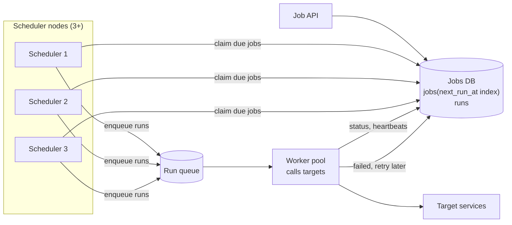

# Distributed Job Scheduler — L4 (Mid-level / SDE2) Interview

> **Level expectation:** a correct design for "run jobs at a given time, at scale".
> - A **job model** (one-off, cron, interval, with time zone) and a **next_run_at** index.
> - A way to find due jobs without scanning everything, safely shared between several scheduler nodes (**claiming**).
> - Dispatch through a queue to a pool of workers.
> - Retries, timeouts and heartbeats.
> - Correct time-zone and DST handling.

> 🆕 Read [00-understand-the-product.md](00-understand-the-product.md) first: the "charged twice" story.

Legend: **🧑‍💼 Interviewer** · **🧑‍💻 Candidate** · **📝 Note** = commentary for you.

---

## 1. Clarifying requirements

**🧑‍💼 Interviewer:** Design a distributed job scheduler.

**🧑‍💻 Candidate:** A few questions:
- **What are the jobs?** Callbacks to other services (HTTP or a queue message), or arbitrary code we run? I'll assume we *trigger* work, not host it.
- **Schedule types:** one-off, cron, fixed interval? Time zones?
- **Scale:** how many schedules and runs per day? Peaks?
- **Precision:** within a second? A minute?
- **Guarantees:** at-least-once with idempotent jobs, or must we try for exactly-once?

**🧑‍💼 Interviewer:** Internal platform. Jobs trigger an HTTP endpoint or publish a message. One-off, cron and interval, with time zones. 50M active schedules, 100M runs/day. Fire within a few seconds of due time. Assume jobs can be made idempotent, but don't fire twice if you can help it.

**🧑‍💻 Candidate:**

**Functional**
1. Create / update / pause / delete a job with a schedule and a target.
2. Fire each run once, close to its due time.
3. Retry failed runs with backoff, up to a limit.
4. Run history and status per job.

**Non-functional**
1. **Reliability:** no lost runs; no single point of failure.
2. **Timeliness:** p99 firing delay under a few seconds.
3. **Scale:** 100M runs/day with peaks (midnight).
4. **At-most-one concurrent run per job** by default; runs are idempotent.

> 📝 **Note:** "Do we run the code or trigger it?" changes the design a lot. Hosting arbitrary code means containers, isolation and resource limits (a k8s problem). Triggering keeps the scheduler small.

---

## 2. Back-of-the-envelope estimates

(Method: [back-of-the-envelope](../../concepts/back-of-the-envelope.md).)

| What | Calculation | Result |
|---|---|---|
| Average firing rate | 100M ÷ 86,400 s | **~1,160 runs/s** |
| Midnight peak | assume 10% of runs are "at 00:00" in UTC or major zones: 10M in one minute | 10M ÷ 60 ≈ **~170k runs/s** if spread over the minute; **millions/s** if all at second 0 |
| Job definitions | 50M × ~1 KB | **~50 GB** (fits one database, with replicas) |
| Run history | 100M runs × ~300 B | **~30 GB/day**, ~900 GB per 30 days |

**🧑‍💻 Candidate:** The average is modest; **the peak is the problem** (L5 §3.4). Storage is small. The hard parts are correctness under failure and smoothing peaks.

---

## 3. API

```http
POST /jobs
{ "name": "renew-subscription-881",
  "schedule": { "type": "cron", "expr": "0 0 * * *", "timeZone": "Asia/Kolkata" },
  "target":   { "type": "http", "url": "https://billing/renew/881", "timeoutSec": 30 },
  "retry":    { "maxAttempts": 5, "backoff": "exponential" },
  "misfirePolicy": "FIRE_ONCE_NOW",
  "concurrency": "FORBID" }
→ 201 { "jobId": "job_42", "nextRunAt": "2026-10-10T18:30:00Z" }

PATCH  /jobs/{id}            pause, resume, change schedule
DELETE /jobs/{id}
GET    /jobs/{id}/runs?limit=20
```

The job target receives a header `X-Run-Id: job_42/1093`, so it can dedupe ([idempotency](../../concepts/idempotency-and-delivery-semantics.md)).

---

## 4. High-level design



**🧑‍💻 Candidate:**
- **Jobs DB** ([PostgreSQL](../../technologies/postgresql.md)) holds definitions with `next_run_at` and a run history table.
- **Schedulers** only decide *what is due* and enqueue it. They're stateless apart from the DB.
- **Run queue** ([message queues](../../technologies/message-queues.md)) decouples firing from executing, so a slow target doesn't delay other jobs.
- **Workers** call the target, enforce timeouts, record results and schedule retries.

---

## 5. Deep dives

### 5.1 Job model and computing the next run

```text
jobs(id, owner, schedule_type, cron_expr, interval_sec, run_at, time_zone,
     target_json, retry_json, misfire_policy, concurrency,
     next_run_at TIMESTAMPTZ,          -- always stored in UTC
     status (ACTIVE|PAUSED), version)
runs(job_id, run_no, scheduled_for, started_at, finished_at, attempt, status, error)
```

After each firing we compute the **next** `next_run_at` from the cron expression **in the job's time zone**, then convert to UTC. Cron parsing and next-time computation are covered in [cron & recurring schedules](../../../LLD/concepts/cron-and-recurring-schedules.md).

### 5.2 Finding due jobs without scanning everything

**🧑‍💼 Interviewer:** You have three scheduler nodes and 50M jobs. How does each find due jobs without two of them firing the same one?

**🧑‍💻 Candidate:** An index on `next_run_at` and a **claiming query** that skips rows another node has locked:

```sql
WITH due AS (
  SELECT id FROM jobs
  WHERE status = 'ACTIVE' AND next_run_at <= now()
  ORDER BY next_run_at
  LIMIT 500
  FOR UPDATE SKIP LOCKED            -- rows locked by another scheduler are skipped, not waited on
)
UPDATE jobs SET next_run_at = <next time>, version = version + 1
WHERE id IN (SELECT id FROM due)
RETURNING id, ...;
-- same transaction: INSERT INTO runs (...); INSERT INTO outbox (...)  → enqueue
```

💡 **`SKIP LOCKED`:** a Postgres/MySQL option that makes a query ignore rows another transaction has locked instead of waiting. Three schedulers running this concurrently each get **different** jobs.

- **Advancing `next_run_at` and creating the run row happen in one transaction**, so a crash either fires the job and moves it forward, or does neither.
- The enqueue uses an **outbox** (a table written in the same transaction, published afterwards), so a run is never created without being queued ([sagas & outbox](../../concepts/sagas-and-distributed-transactions.md)).
- Each scheduler loops every ~1 s, and immediately again if it got a full batch.

At larger scale, time-bucketed tables or sorted sets and sharding take over (L5 §3.2, [distributed scheduling & time buckets](../../concepts/distributed-scheduling-and-time-buckets.md)).

### 5.3 Dispatch and workers

- Workers pull runs from the queue, call the target with a timeout, and record `SUCCEEDED` / `FAILED`.
- **Concurrency policy:** with `FORBID`, the scheduler doesn't fire a new run while the previous one is still `RUNNING` (it records a skipped run instead). Like k8s CronJob's `concurrencyPolicy`.
- Long jobs send **heartbeats**: "run 42/1093 still alive". If heartbeats stop for, say, 2 minutes, a reaper marks the run `TIMED_OUT` and retries it.

### 5.4 Retries and timeouts

- Failed run → `attempt + 1`, re-enqueued with **exponential backoff and jitter** (30 s, 1 min, 2 min…), up to `maxAttempts`, then `DEAD` plus an alert to the job's owner ([retries, backoff & DLQ](../../concepts/retries-backoff-and-dlq.md)).
- A **timeout doesn't prove failure**: the target may have done the work. That's why the run ID goes in the request, so the target can dedupe a retry.
- Retries are separate from the schedule: a daily job retrying for an hour doesn't shift tomorrow's run.

### 5.5 Time zones and DST

**🧑‍💻 Candidate:** Store schedules in **local time + IANA zone** (`Asia/Kolkata`, `America/New_York`), compute each next run in that zone, store `next_run_at` in UTC.

- **Spring forward** (02:00 → 03:00): a job at 02:30 local doesn't exist that day. Policy: run at 03:00 (most common), or skip.
- **Fall back** (01:00–02:00 happens twice): a job at 01:30 matches twice. Policy: run once, on the first occurrence.
- **Why not just store UTC?** "9 am every day" in New York is 13:00 UTC in summer and 14:00 UTC in winter. A UTC cron drifts by an hour twice a year.
- India has no DST, but your users' zones might; tests must cover both transitions.

> 📝 **Note:** Mention the two DST edge cases by name. It's the classic L4 differentiator in this interview.

---

## 6. Follow-ups

**🧑‍💼 Interviewer:** A scheduler node crashes mid-batch. What happens?

**🧑‍💻 Candidate:** Its transaction rolls back: rows unlock, `next_run_at` stays in the past, and another scheduler claims them on its next loop, about a second later. If it crashed *after* commit, the runs and outbox rows exist and get published. Nothing is lost.

**🧑‍💼 Interviewer:** The database is the bottleneck at midnight.

**🧑‍💻 Candidate:** First smooth the load (jitter, L5 §3.4). Then partition: shard jobs by ID across several databases, each with its own scheduler group, or move the due-time index to a faster structure (L5 §3.2).

**🧑‍💼 Interviewer:** How precise can firing be?

**🧑‍💻 Candidate:** Loop interval (1 s) + queue latency + worker pickup: typically 1–3 s. For sub-second precision on near-term jobs, schedulers can load the next minute's jobs into an in-memory timer wheel ([timers & timing wheels](../../../LLD/concepts/timers-delay-queues-and-timing-wheels.md)).

---

## 7. What the interviewer was evaluating (L4)

- [ ] Clarified trigger vs host, schedule types, scale, precision, guarantees
- [ ] Estimates showing peak vs average
- [ ] `next_run_at` index; claiming with `SKIP LOCKED`; advance + create run atomically
- [ ] Queue + worker pool; concurrency policy; heartbeats and timeouts
- [ ] Retries with backoff, max attempts, dead runs, idempotency via run ID
- [ ] Time zones stored as IANA zones; both DST cases handled

## 8. Common mistakes at this level

| Mistake | Why it hurts |
|---|---|
| Every scheduler node runs every job ("for HA") | Duplicate runs: the "charged twice" story |
| Scanning all jobs every tick | 50M rows per second |
| Storing schedules in UTC only | Jobs drift an hour at DST changes |
| Firing and advancing `next_run_at` in separate steps | Crash in between → lost or duplicate runs |
| Treating a timeout as failure without a run ID | Retries repeat side effects |

➡️ Next: [L5-senior.md](L5-senior.md)
