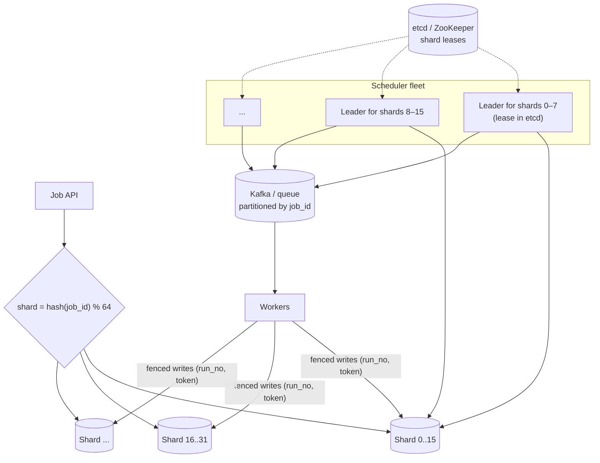
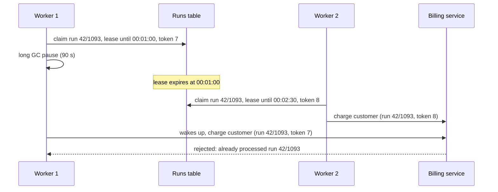

# Distributed Job Scheduler — L5 (Senior) Interview

> **Level expectation:** everything in [L4](L4-mid.md), and then the failure cases and scale:
> - **exactly-once execution**: why it's impossible in general, and how leases, fencing tokens and idempotent jobs get close;
> - **partitioning** the schedule beyond one database;
> - **misfire** policies after an outage;
> - the **midnight thundering herd**;
> - **workflows** with dependencies.

> 🆕 Read [00-understand-the-product.md](00-understand-the-product.md) and [L4](L4-mid.md) first.

Legend: **🧑‍💼 Interviewer** · **🧑‍💻 Candidate** · **📝 Note** = commentary for you.

---

## 1. Requirements and estimates (fast)

**🧑‍💻 Candidate:** Same as L4: 50M schedules, 100M runs/day, ~1,160 runs/s on average, a midnight spike of ~10M runs. Two senior additions:
1. **No duplicate side effects**, even when workers pause (GC, network) and come back.
2. **Grow 10×** without redesign: 1B runs/day, ~11,600/s on average.

---

## 2. High-level design (sharded)



---

## 3. Deep dives

### 3.1 Exactly-once execution: leases, fencing, idempotency

**🧑‍💼 Interviewer:** Guarantee each run executes exactly once.

**🧑‍💻 Candidate:** I can guarantee each run is **fired** at least once and **claimed by one owner at a time**. I can't guarantee a remote side effect happens exactly once without the target's help. Here's the failure that breaks naive designs:



Three layers, all needed ([distributed locks & leases](../../concepts/distributed-locks-and-leases.md)):
1. **Lease:** a run is claimed with an expiry. Long runs renew it with heartbeats. If the worker dies, the lease expires and someone else takes over.
2. **Fencing token:** every claim gets a strictly increasing number. Writes back to *our* DB are conditional: `UPDATE runs SET status='SUCCEEDED' WHERE run_no=1093 AND token=8`. A zombie with token 7 changes nothing.
3. **Idempotent target:** the target stores the run ID (`job_42/1093`) with its effect, in one transaction, and ignores repeats. This is the only layer that protects the *external* effect.

> 📝 **Note:** Say plainly: "a lease alone is not mutual exclusion, because of pauses; fencing protects our state; idempotency protects theirs". That sentence is the L5 bar.

### 3.2 Partitioning the schedule

**🧑‍💼 Interviewer:** One Postgres can't take 1B runs/day with midnight spikes. How do you scale?

**🧑‍💻 Candidate:** Two independent axes ([distributed scheduling & time buckets](../../concepts/distributed-scheduling-and-time-buckets.md)):

**Split the jobs (sharding by job ID).** 64 logical shards, `hash(job_id) % 64`, mapped onto N databases. Each shard has **one leader scheduler**, chosen with a lease in [etcd / ZooKeeper](../../technologies/zookeeper-etcd.md). One leader per shard means no `SKIP LOCKED` contention, and a dead leader's shards move to another node within the lease timeout (~10 s). It's like a k8s controller with leader election per shard.

**Make "what's due" cheap (time buckets).** Instead of a B-tree index on `next_run_at` over all rows, keep per-minute buckets:

```text
due_bucket(shard, minute_utc, job_id)   e.g. (17, 2026-10-10T18:30, job_42)
```

- The leader reads only the current minute's bucket for its shard: a small, sequential read.
- Near-term jobs (next ~5 minutes) are loaded into an in-memory **timing wheel** to fire precisely; far-future jobs stay on disk ([timers & timing wheels](../../../LLD/concepts/timers-delay-queues-and-timing-wheels.md)).
- A Redis sorted set (`ZADD due <timestamp> job_42`, `ZRANGEBYSCORE due 0 <now>`) works too. [Redis](../../technologies/redis.md) is fast but needs persistence, and a rebuild path from the source-of-truth DB.

| Arithmetic | Value |
|---|---|
| 1B runs/day over 64 shards | ~15.6M runs/shard/day → ~180/s per shard on average |
| Midnight 10% spike, spread over 60 s by jitter | 100M ÷ 60 ÷ 64 ≈ **26k/s per shard**. Too high for one DB shard writing run rows → batch inserts (500 rows per statement) and more shards |

### 3.3 Misfires: the scheduler was down

**🧑‍💼 Interviewer:** The cluster was down from 00:00 to 00:20. What happens at 00:20?

**🧑‍💻 Candidate:** Every job with `next_run_at` in that window is overdue. Each job picks a **misfire policy**, because the right answer depends on the job:

| Policy | Behaviour | Good for |
|---|---|---|
| `FIRE_ONCE_NOW` | Run once now, then resume the normal schedule | Daily reports, renewals |
| `SKIP` | Don't run the missed slot | "Send the 9 am push": at 9:20 it's pointless |
| `CATCH_UP_ALL` | Run every missed slot in order | Per-interval billing, metering |
| Deadline (`startingDeadlineSeconds`) | Fire if within X of the due time, else skip | Time-sensitive tasks |

- **Recovery is itself a thundering herd:** 20 minutes of jobs at once. Release the backlog through the same rate limiter as normal traffic, oldest first.
- Each run records `scheduled_for` vs `started_at`; their difference (**firing lag**) is the main SLI ([alerting & SLOs](../../concepts/alerting-and-slos.md)).

### 3.4 The midnight thundering herd

**🧑‍💻 Candidate:** People pick round numbers. At 00:00 UTC (and at local midnights, top of each hour), millions of jobs come due in the same second and hammer both us and the targets.

1. **Jitter at creation:** for jobs that don't need precision (most reports and cleanups), the API offers `"window": "00:00–01:00"` and we pick a random but **stable** offset per job (`hash(job_id) % 3600 s`). Stable, so each job runs at the same minute every day.
2. **Per-target rate limits:** the billing service registers "max 2,000 runs/s". Runs beyond that wait in the queue (back-pressure) instead of overloading it ([rate limiting at the gateway](../api-gateway/L4-mid.md)).
3. **Priorities:** separate queues for "on-time critical" (renewals) vs "best effort" (cleanups), so cleanups never delay renewals.
4. **Pre-load:** at 23:55, leaders load the 00:00 bucket into memory, so the spike reads nothing from disk.

> 📝 **Note:** "Stable jitter" (hash-based, not random each day) is a nice detail: it spreads load without making each job's run time wander.

### 3.5 Workflows: run B after A

**🧑‍💼 Interviewer:** Teams want "run the report after the ETL finishes, and the email after the report".

**🧑‍💻 Candidate:** That's a **DAG** of tasks ([workflow orchestration & DAGs](../../concepts/workflow-orchestration-and-dags.md)):
- A **workflow run** holds task states (`PENDING → RUNNING → SUCCEEDED/FAILED`). When a task succeeds, its children whose parents have all succeeded become `READY` and are enqueued.
- Retries are per task; the failure policy decides whether downstream tasks are skipped or the whole run fails.
- **Backfill:** re-run the workflow for past dates (e.g. last 7 days) with a concurrency cap.
- At this point we're building Airflow/Temporal. For complex, long-running workflows I'd adopt one (L6 §4) and keep our scheduler for simple triggers.

---

## 4. Follow-ups / curveballs

**🧑‍💼 Interviewer:** A shard leader is partitioned from etcd but can still reach its database.

**🧑‍💻 Candidate:** It stops scheduling when it can't renew its lease, *before* the lease expires (it uses its own timer with a safety margin). The new leader's claims carry a higher fencing token, and the DB rejects writes from the old one. Same pattern as Kafka's leader epochs ([distributed message queue L5 §3.2](../distributed-message-queue/L5-senior.md)).

**🧑‍💼 Interviewer:** A user edits a job's schedule while a run is in flight.

**🧑‍💻 Candidate:** The update bumps `version` and recomputes `next_run_at`. The in-flight run finishes under the old definition (it carries its own snapshot). The claim query's conditional update on `version` prevents the scheduler from overwriting the new `next_run_at` with a stale computation.

**🧑‍💼 Interviewer:** Why not just use Kafka with delayed messages?

**🧑‍💻 Candidate:** Kafka has no native per-message delay; you'd build delay topics per interval (1 min, 5 min, 1 h…), which suits retries but not "every Tuesday 9 am in Kolkata" for 50M jobs with edits, pauses and deletes. A queue is the dispatch layer, not the schedule store.

---

## 5. What the interviewer was evaluating (L5)

- [ ] Exactly-once explained honestly: leases + fencing + idempotent targets
- [ ] Sharding by job ID with a leader per shard; time buckets / sorted sets / timing wheel
- [ ] Misfire policies chosen per job; backlog through rate limits; firing lag as SLI
- [ ] Thundering herd: stable jitter, per-target limits, priorities, pre-loading
- [ ] DAG workflows, per-task retries, backfill, and when to adopt a workflow engine

## 6. Common mistakes at this level

| Mistake | Why it hurts |
|---|---|
| "A distributed lock makes it exactly-once" | GC pauses and partitions make two owners possible |
| One global leader for all jobs | Bottleneck and slow failover |
| One misfire policy for all jobs | Either floods targets or silently skips billing |
| Random jitter re-rolled every day | Job times wander; hard to reason about |
| Building a full workflow engine inside the scheduler by accident | Months of work an existing engine already does |

➡️ Next: [L6-staff.md](L6-staff.md)
