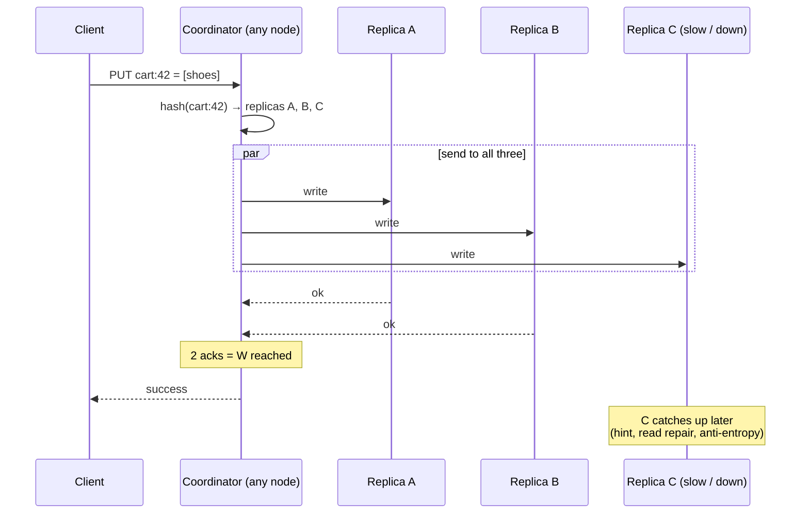

# Start Here: What Is a Distributed Key-Value Store? (Before the Interview)

> In six earlier designs we drew a box labelled "Cassandra / DynamoDB" and moved on. This interview opens that box: how do you store hundreds of terabytes across hundreds of machines, keep working when some of them die, and still return the right value? It's the most "under the hood" interview in this repo, and the one that makes every other design make more sense.
>
> Time: ~15 minutes. Then: [L4](L4-mid.md) → [L5](L5-senior.md) → [L6](L6-staff.md).

---

## 1. The origin story: a shopping cart that must never fail

In the mid-2000s, Amazon noticed that every time their database had trouble, customers couldn't add items to their **shopping cart**, and lost sales. Their requirement: *"add to cart" must work even if servers, disks, or a whole datacenter fail.* They'd rather show a slightly stale cart than an error.

That led to **Dynamo** (2007 paper), whose ideas became **Cassandra**, **Riak**, **ScyllaDB** and influenced **Amazon DynamoDB**. Its choices are the backbone of this interview:
- Spread data over many machines (**partitioning**).
- Keep 3 copies of everything (**replication**).
- Let any copy accept writes, even if others are unreachable (**availability over strict consistency**).
- Fix disagreements between copies later (**conflict resolution, repair**).

> 📝 Just a single machine with `HashMap` + disk is the [LLD KV store](../../../LLD/interviews/kv-store/README.md). This interview is what happens when one machine isn't enough.

---

## 2. Where you've already relied on one

| Where | What it stores |
|---|---|
| Our **URL shortener** | `shortCode → longUrl`, 3 TB+ |
| Our **chat system** | Messages by conversation (Cassandra) |
| Our **news feed** | Posts, inboxes |
| **Discord, Netflix, Instagram, Apple** | Massive Cassandra / ScyllaDB clusters |
| **AWS DynamoDB** | The managed version: you never see the nodes |
| **Kubernetes etcd** | A small, *strongly consistent* KV store (different trade-offs: see L6) |
| **Redis Cluster** | Partitioned in-memory KV with 16,384 hash slots |

---

## 3. The features and the problems they create

### 3.1 Too much data for one machine → partitioning
100 TB doesn't fit on one server. Split keys across many nodes: `hash(key)` decides which node owns it. When nodes are added, as few keys as possible should move. See [consistent hashing](../../concepts/consistent-hashing.md).

### 3.2 Machines die → replication
Disks fail daily in a large cluster. Every key lives on **3 nodes** (replication factor N = 3). Lose one, you still have two.

### 3.3 Copies can disagree → consistency levels
A write reaches 2 of the 3 copies before a network blip. A read asks a different node. Does it see the new value? You choose per request:

| Setting | Meaning | Trade-off |
|---|---|---|
| `ONE` | wait for 1 replica | fastest, may read stale data |
| `QUORUM` | wait for a majority (2 of 3) | if both reads and writes use QUORUM, reads see the latest write |
| `ALL` | wait for all 3 | strongest, but any one down node blocks you |

The rule behind it: if **R + W > N** (replicas read + replicas written > copies), every read overlaps at least one replica that has the latest write. See [CAP & consistency](../../concepts/cap-and-consistency.md).

### 3.4 Two people edit the same key on different copies → conflicts
Your cart: on your phone you add "shoes" (reaches replica A); on your laptop at the same moment you add "socks" (reaches replica B). Which version wins? Last write wins (and loses one item)? Or keep both and **merge** (cart has shoes + socks)? See [vector clocks & conflict resolution](../../concepts/vector-clocks-and-conflict-resolution.md).

### 3.5 A replica was down for an hour → repair
It missed writes. Someone must bring it up to date: other nodes keep **hints** for it ([hinted handoff](../../concepts/hinted-handoff-and-sloppy-quorum.md)), reads fix stale copies they notice (**read repair**), and a background process compares copies efficiently with **Merkle trees** ([anti-entropy](../../concepts/merkle-trees-and-anti-entropy.md)).

### 3.6 Who's alive? → gossip
With 500 nodes, there's no central list of who's up. Nodes **gossip**: every second each tells a few random others what it knows; news spreads to everyone in seconds. See [gossip & failure detection](../../concepts/gossip-and-failure-detection.md).

### 3.7 Fast writes on disk → LSM trees
Writing randomly into a big on-disk B-tree is slow. These stores append to a log and to a sorted in-memory table, flushing sorted files and merging them in the background. See [LSM trees & storage engines](../../concepts/lsm-trees-and-storage-engines.md).

### 3.8 Sometimes "eventually consistent" isn't OK → consensus
Kubernetes can't have two copies of etcd disagreeing about which node a pod runs on. Systems like etcd use **Raft**: a leader orders every write and a majority must agree before it counts. Stronger, but slower and less available during failures. See [consensus & Raft](../../concepts/consensus-and-raft.md).

---

## 4. The key mechanism: a write with N = 3, W = 2



---

## 5. Try it yourself (real, 10–20 minutes)

1. **Cassandra in Docker** (needs ~2 GB RAM):
   ```sh
   docker run -d --name cass cassandra:5
   docker exec -it cass nodetool status          # the ring: nodes, ownership %, state
   docker exec -it cass cqlsh
   ```
   In `cqlsh`: `CONSISTENCY;` shows the current level; `CONSISTENCY QUORUM;` changes it. Create a keyspace with `replication = {'class':'SimpleStrategy','replication_factor':1}` (one node here) and insert/select rows.
2. **Redis Cluster** (if you run one): `redis-cli CLUSTER SLOTS` shows which node owns which of the 16,384 hash slots.
3. **etcd** (Kubernetes control plane): `etcdctl endpoint status -w table` shows which member is the Raft **leader** and the current **raft term**.

---

## 6. From experience to requirements

| What you need | Requirement | Type |
|---|---|---|
| Store and fetch values by key | `put(key, value)`, `get(key)`, `delete(key)` | Functional |
| Data bigger than one machine | Partitioning across nodes | Non-functional (scale) |
| Survive disk/node/zone failures | Replication (N = 3), across zones | Non-functional (durability) |
| Cart must always accept writes | High write availability | Non-functional |
| Choose speed vs freshness per call | Tunable consistency (R, W) | Functional |
| Concurrent updates on different replicas | Conflict detection/resolution | Functional |
| Add capacity without downtime | Online rebalancing | Non-functional |
| Single-digit ms latency at p99 | Low latency at scale | Non-functional |

---

## 7. Mini glossary

| Term | Meaning in plain words |
|---|---|
| **Partition / shard** | A slice of the key space stored on particular nodes |
| **Replication factor (N)** | How many copies of each key exist |
| **Coordinator** | The node that receives a request and talks to the replicas |
| **Quorum** | A majority (e.g. 2 of 3); with R + W > N reads see the latest write |
| **Hinted handoff** | A stand-in node holds writes for a down replica and passes them on later |
| **Read repair** | Fixing stale replicas noticed during a read |
| **Anti-entropy / Merkle tree** | Background comparison of replicas using a tree of hashes |
| **Gossip** | Nodes periodically sharing state with random peers so news spreads to all |
| **Vector clock** | Per-node counters that tell whether two versions are ordered or concurrent |
| **Tombstone** | A marker that says "this key was deleted" (needed so deletes replicate) |
| **LSM tree** | A storage engine that writes sequentially and merges sorted files in the background |
| **Raft** | A consensus algorithm: one leader, majority agreement, strongly consistent |

➡️ **Now design it:** [L4-mid.md](L4-mid.md)
