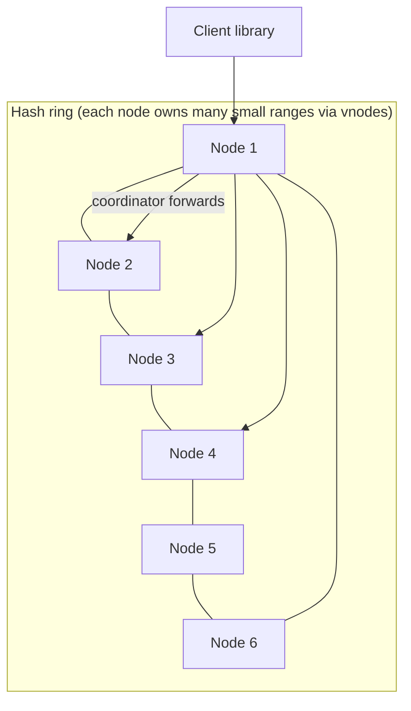
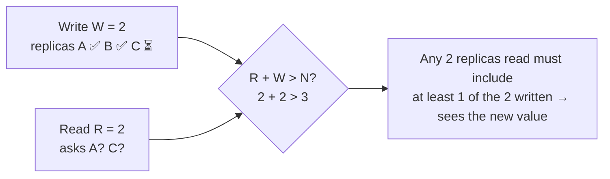

# Distributed KV Store — L4 (Mid-level / SDE2) Interview

> **Level expectation:** a working distributed design: partition keys with consistent hashing, replicate each key to 3 nodes, coordinate reads/writes with quorums, survive a node failure, and explain the per-node storage. You should know *why* R + W > N works.

> 🆕 New to distributed databases? Read [00-understand-the-product.md](00-understand-the-product.md) first. It explains partitioning, replication and quorums with pictures.

Legend: **🧑‍💼 Interviewer** · **🧑‍💻 Candidate** · **📝 Note** = commentary for you.

---

## 1. Clarifying requirements

**🧑‍💼 Interviewer:** Design a distributed key-value store.

**🧑‍💻 Candidate:** Questions:
- API: just `get(key)`, `put(key, value)`, `delete(key)`? Any range scans?
- Data size and value size?
- Read/write ratio and throughput?
- Consistency: is it OK to occasionally read a slightly stale value? Or must every read see the latest write?
- Availability: during a node or network failure, should writes still succeed?

**🧑‍💼 Interviewer:** Point operations only. ~100 TB, values up to 1 KB typically. ~1M ops/s, 70% reads. Availability matters more than perfect consistency, but we'd like a way to get strong reads when needed.

**🧑‍💻 Candidate:**

**Functional:** `get`, `put`, `delete` by key.

**Non-functional:**
1. **Scale:** 100 TB, 1M ops/s, growing.
2. **Highly available:** writes succeed even if some replicas are down.
3. **Durable:** no data loss when a node dies.
4. **Low latency:** p99 < 10 ms.
5. **Tunable consistency** per request.

---

## 2. Back-of-the-envelope estimates

| What | Calculation | Result |
|---|---|---|
| Raw data | given | 100 TB |
| With 3 replicas | 100 TB × 3 | **300 TB** |
| Node disk (usable, leaving room for compaction) | ~2 TB per node | 300 / 2 = **150 nodes** (storage-bound) |
| Replica operations | reads at quorum touch 2 replicas, writes touch 3: 700k × 2 + 300k × 3 | **~2.3M replica ops/s** |
| Per-node throughput | ~20k ops/s per node (SSD, LSM) | 2.3M / 20k ≈ **115 nodes** (throughput-bound) |
| Cluster size | max(150, 115) + headroom | **~180 nodes** |

**🧑‍💻 Candidate:** Storage drives the node count here. Also: with ~180 nodes, **some node is failing at any given time**: failure is the normal state, not an exception. ([Back-of-the-envelope](../../concepts/back-of-the-envelope.md).)

---

## 3. API

```http
GET    /v1/kv/{key}?consistency=ONE|QUORUM|ALL
PUT    /v1/kv/{key}?consistency=QUORUM      body: value
DELETE /v1/kv/{key}
```

Usually exposed as a client library (like Cassandra drivers) that knows the cluster layout and talks directly to the right nodes.

---

## 4. High-level design



**🧑‍💻 Candidate:** All nodes are **equal** (no master). Any node can receive a request and act as **coordinator** for it.

### 4.1 Partitioning: consistent hashing with virtual nodes

- Hash each key to a position on a ring (e.g. 0 … 2⁶⁴). Each node owns ranges of the ring; the key belongs to the first node clockwise ([consistent hashing](../../concepts/consistent-hashing.md)).
- **Virtual nodes (vnodes):** each physical node owns many small ranges (e.g. 16–256) spread around the ring. That evens out load, and when a node joins it takes a little from many nodes instead of a big chunk from one neighbour.
- Adding a node moves only ~1/N of the data, unlike `hash(key) % numberOfNodes`, where almost everything would move.

### 4.2 Replication: N = 3

- The key is stored on the owning node **and the next 2 distinct nodes clockwise** (skipping vnodes of the same physical node). That list is the key's **preference list**.
- Place the 3 replicas in **different racks/availability zones**, so one zone outage leaves two copies ([sharding & replication](../../concepts/sharding-and-replication.md)).

### 4.3 Quorum reads and writes

**🧑‍💻 Candidate:** The coordinator sends each write to **all 3** replicas and replies to the client after **W** of them confirm. A read asks replicas and returns after **R** reply, choosing the newest version.



| R | W | Effect |
|---|---|---|
| 2 | 2 | R + W = 4 > 3 → reads see the latest acknowledged write (the default) |
| 1 | 3 | fast reads, but every write needs all 3 replicas up |
| 3 | 1 | fast writes, slow/fragile reads |
| 1 | 1 | fastest, eventually consistent: may read stale data |

**How does the read pick "newest"?** Each write carries a **timestamp**; the highest timestamp wins (**last write wins**). Simple; L5 discusses its problems ([CAP & consistency](../../concepts/cap-and-consistency.md)).

### 4.4 Storage on each node

**🧑‍💻 Candidate:** Each node needs fast writes and durability:
1. Append the write to a **commit log** (write-ahead log) on disk, which is fast because it's sequential.
2. Put it in an in-memory sorted table (**memtable**).
3. When the memtable is full, write it to disk as an immutable sorted file (**SSTable**).
4. Reads check the memtable, then SSTables newest-first; background **compaction** merges files.

That's an **LSM tree** ([LSM trees & storage engines](../../concepts/lsm-trees-and-storage-engines.md)), and the same idea as the write-ahead log in the [LLD KV store](../../../LLD/interviews/kv-store/L5-senior.md).

---

## 5. Deep dives

### 5.1 A node dies

**🧑‍💻 Candidate:** With N = 3 and W = 2, writes still succeed with 2 replicas up. Reads with R = 2 also work. The dead node's data still exists on 2 others. When it comes back it has missed writes, and other nodes must help it catch up. Simplest mechanism: during reads, if replicas disagree, the coordinator writes the newest value back to the stale one (**read repair**). L5 adds more.

### 5.2 Deletes

**🧑‍💻 Candidate:** Deleting by "remove the key" on the replicas that are up has a trap: the down replica still has the old value, and when it returns, it looks like *newer* data to the others and the key comes back. So a delete writes a **tombstone** (a "deleted at time T" marker) that replicates like any write; it's cleaned up only after all replicas have surely seen it.

---

## 6. Follow-ups

**🧑‍💼 Interviewer:** How does the client know which nodes to contact?

**🧑‍💻 Candidate:** Each node knows the ring layout (which node owns which ranges). A smart client library fetches that layout and sends requests straight to a replica of the key, avoiding an extra hop. A simple client can send to any node, which forwards.

**🧑‍💼 Interviewer:** We add 10 new nodes.

**🧑‍💻 Candidate:** Each new node takes ownership of some vnode ranges and **streams** that data from the current owners in the background. Reads and writes continue; for a moving range, writes go to both old and new owners until the move completes.

**🧑‍💼 Interviewer:** Why not a single primary with replicas, like Postgres?

**🧑‍💻 Candidate:** A primary is a bottleneck for writes and, while it fails over, writes for its data stop. The requirement favours write availability, so leaderless replication fits. For data needing strict consistency, a leader-based design is better ([L6](L6-staff.md)).

---

## 7. What the interviewer was evaluating (L4)

- [ ] Clarified consistency vs availability and data/throughput numbers
- [ ] Estimated node count from storage and throughput
- [ ] Consistent hashing with vnodes; why not modulo
- [ ] N = 3 replicas across racks/zones; coordinator; preference list
- [ ] Quorum reads/writes and the R + W > N reasoning
- [ ] Per-node storage: commit log + memtable + SSTables
- [ ] Node failure handling; tombstones for deletes

## 8. Common mistakes at this level

| Mistake | Why it hurts |
|---|---|
| `hash(key) % N` partitioning | Adding a node reshuffles almost all data |
| Replicas in the same rack/zone | One rack failure loses all copies |
| Waiting for all replicas on every write | One slow/down node blocks writes |
| Physically deleting keys | Deleted data resurrects from a returning replica |
| Single master for writes when availability was the priority | Contradicts the requirement |
| Ignoring that failures are constant at 180 nodes | Design assumes a perfect world |

➡️ Next: [L5-senior.md](L5-senior.md)
