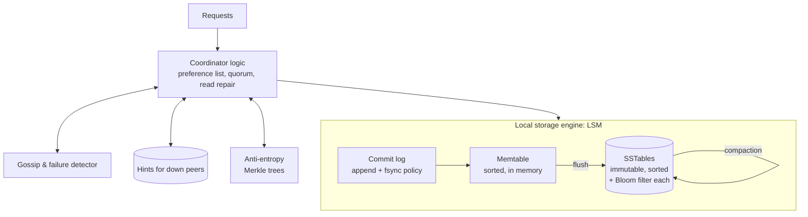
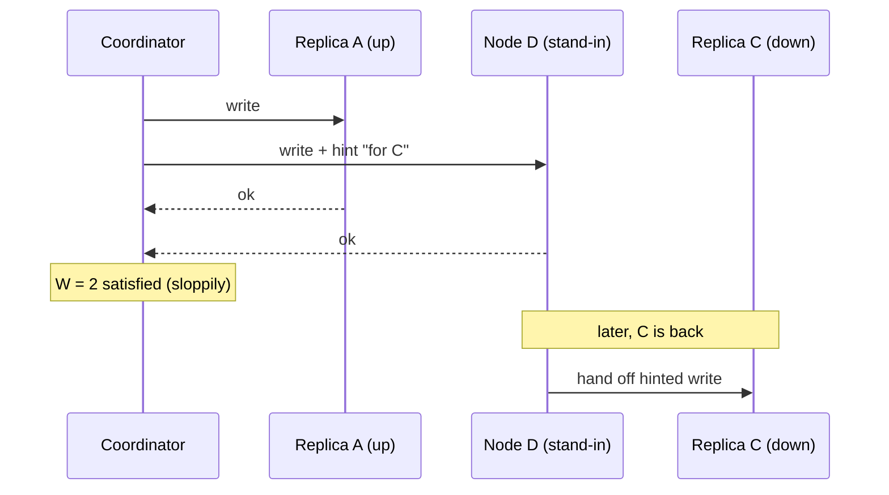

# Distributed KV Store — L5 (Senior) Interview

> **Level expectation:** you go beyond "quorums" to the mechanisms that make a leaderless store actually work: what happens when replicas are down (sloppy quorum, hints), how divergent copies are detected and fixed (read repair, Merkle trees), how conflicts are resolved (LWW vs vector clocks), how nodes know who's alive (gossip, phi accrual), and how each node stores data (LSM, tombstones). You state precisely where guarantees break. Read [L4-mid.md](L4-mid.md) first.

Legend: **🧑‍💼 Interviewer** · **🧑‍💻 Candidate** · **📝 Note** = commentary for you.

---

## 1. Requirements (sharpened)

Same as L4 (100 TB, 1M ops/s, 70% reads, p99 < 10 ms), plus:
- Writes must succeed even when **2 of a key's 3 replicas** are unreachable (cart-style availability).
- Some callers need **read-your-writes**; others accept staleness for speed.
- Background repair must not hurt foreground latency.

---

## 2. Architecture of one node



---

## 3. Deep dives

### 3.1 Tunable consistency, precisely

**🧑‍💻 Candidate:** With N = 3 replicas, a read quorum R and write quorum W ([CAP & consistency](../../concepts/cap-and-consistency.md)):
- **R + W > N** → read and write sets overlap → a read sees the latest *acknowledged* write. But only if both quorums are counted on the **same N home replicas** (the next point breaks this).
- **W > N/2** → two concurrent writes can't both complete on disjoint majorities.
- Typical choices: `QUORUM/QUORUM` for read-your-writes; `ONE/ONE` for speed-critical, staleness-tolerant data; `LOCAL_QUORUM` in multi-DC (L6).

### 3.2 Sloppy quorum and hinted handoff

**🧑‍💻 Candidate:** Requirement: writes succeed even when replicas are down. With a **strict** quorum, if 2 of 3 home replicas are down, W = 2 fails. With a **sloppy quorum**, the coordinator writes to the next healthy nodes on the ring instead, with a **hint**: "this belongs to node C; deliver when C is back" ([hinted handoff & sloppy quorum](../../concepts/hinted-handoff-and-sloppy-quorum.md)).



**The precise cost:** R + W > N no longer guarantees overlap, because the 2 acknowledged copies may be A and D, while a later read at R = 2 asks A's neighbours B and C. That read can miss the write until the hint is delivered. Sloppy quorum trades a consistency guarantee for write availability, which is exactly Dynamo's cart choice. Hints are kept only for a window (e.g. Cassandra keeps hints up to 3 hours by default); beyond that, full repair is needed.

> 📝 **Note:** Being able to say *exactly* why sloppy quorum breaks R + W > N is the senior-level understanding interviewers look for here.

### 3.3 Conflicts: LWW vs vector clocks

**🧑‍💻 Candidate:** Two clients update `cart:42` concurrently through different coordinators; replicas end up with different versions ([vector clocks & conflict resolution](../../concepts/vector-clocks-and-conflict-resolution.md)).

| Strategy | How | Pros | Cons |
|---|---|---|---|
| **Last write wins (LWW)** | Highest timestamp wins | Simple; no client work | **Silently loses** one update; wrong winner if clocks are skewed by even a few ms |
| **Vector clocks** | Each version carries counters per coordinating node; compare to tell "newer" from "concurrent" | Detects true conflicts | Concurrent versions (**siblings**) returned to the client to merge; clocks grow with many writers |
| **CRDTs** | Data types whose merge is automatic and order-independent (counters, sets, maps) | No conflicts to resolve | Only for data that fits those types |

Worked example with vector clocks:

```text
v1 = [cart: shoes]           clock {A:1}
client 1 via A → [shoes, socks]   clock {A:2}         (descends from v1)
client 2 via B → [shoes, hat]     clock {A:1, B:1}    (also descends from v1)
compare {A:2} vs {A:1,B:1}: neither ≥ the other in every entry → CONCURRENT
read returns both siblings → the cart merges them → [shoes, socks, hat], written back with {A:2, B:1}
```

**My choice:** LWW by default (Cassandra does LWW per column) with **NTP-synchronised clocks** and guidance to model data so concurrent overwrites are rare (e.g. one row per cart *item* rather than one value per cart). Vector clocks/CRDTs for data where lost updates are unacceptable and merges are natural.

### 3.4 Repair: three layers

| Mechanism | When it runs | Fixes |
|---|---|---|
| **Hinted handoff** | Node returns within the hint window | Writes it missed while down |
| **Read repair** | During reads at R > 1, if replicas disagree | Keys that are read |
| **Anti-entropy (Merkle trees)** | Scheduled background job | Everything else, including keys nobody reads |

**Merkle trees** ([anti-entropy](../../concepts/merkle-trees-and-anti-entropy.md)): each replica builds a tree of hashes over its key range; leaves hash small key buckets, parents hash children. Two replicas compare root hashes; if equal, the whole range matches. If not, descend only into differing branches. For 1 billion keys split into 2²⁰ buckets, finding a handful of differences needs comparing ~tens of hashes per difference, not a billion values.

**Tombstones and repair interact:** a tombstone must be kept at least until repair has run on all replicas (Cassandra's `gc_grace_seconds`, default 10 days). Drop it sooner and a replica that missed the delete **resurrects** the data ("zombie data"). That's why repairs must run at least once per grace period.

### 3.5 Membership and failure detection

**🧑‍💻 Candidate:** 180 nodes, no central registry. **Gossip** ([gossip & failure detection](../../concepts/gossip-and-failure-detection.md)): every second each node exchanges its view (members, versions, heartbeat counters) with ~3 random peers. Information reaches all nodes in O(log n) rounds: for 180 nodes, roughly 5–8 seconds.

**Failure detection:** a fixed "no heartbeat for 5 s = dead" rule is either too jumpy (GC pauses, network blips) or too slow. The **phi accrual detector** tracks each peer's heartbeat inter-arrival times and outputs a *suspicion level* (φ). Coordinators stop routing to a node above a threshold, and the node is only removed from the ring by an **operator** (or after a long timeout), because a "dead" node is usually just temporarily unreachable.

### 3.6 Storage engine: LSM tree

([LSM trees & storage engines](../../concepts/lsm-trees-and-storage-engines.md))
- **Write path:** append to commit log → insert into memtable → acknowledge. When the memtable reaches ~128 MB, flush to an immutable **SSTable**. All disk writes are sequential, which is why LSM stores ingest so fast.
- **Read path:** memtable → SSTables newest-first. Each SSTable has a **Bloom filter** ([Bloom filters](../../concepts/bloom-filters.md)) answering "definitely not here" in memory, so most files are skipped without a disk read.
- **Compaction** merges SSTables, dropping overwritten values and expired tombstones. Size-tiered (good for writes) vs leveled (good for reads, more write amplification).
- **Deletes are writes** (tombstones) and cost until compaction removes them. Workloads that delete a lot (queues stored in Cassandra!) degrade badly. A classic anti-pattern.

### 3.7 Hot keys and tail latency

- **Hot key:** one key gets 50k reads/s; its 3 replicas can't keep up. Options: cache it in front (the gateway/app), allow reads at `ONE` spread across replicas, or split the value across `key#0…key#9` with client-side merge.
- **Tail latency:** with R = 2, a read waits for the 2nd-fastest of 3 replicas. A GC pause on one replica hits p99. **Speculative retry**: if a replica hasn't answered within its p95 latency, send the request to the third replica too, and use the first two answers. Costs a few % extra load, cuts p99 significantly.

---

## 4. Failure modes

| Failure | Behaviour | Mitigation |
|---|---|---|
| 1 replica down | QUORUM still works | Hints; repair on return |
| 2 replicas down | Strict quorum fails; sloppy quorum succeeds | Hints; accept weaker reads until repaired |
| Network partition splits the cluster | Both sides may accept writes (AP) | Conflict resolution on heal; repair |
| Node down longer than hint window | Missed writes not in hints | Run full repair before it serves reads |
| Repair not run within gc_grace | Deleted data resurrects | Automated repair scheduling; alerts |
| Clock skew with LWW | Wrong version wins | NTP monitoring; reject writes with timestamps far in the future |
| Compaction falls behind | Read latency climbs, disk fills | Throttling, capacity headroom, compaction strategy choice |

---

## 5. What the interviewer was evaluating (L5)

- [ ] Precise quorum guarantees and how sloppy quorum weakens them
- [ ] Hinted handoff with windows and limits
- [ ] LWW vs vector clocks vs CRDTs with a worked example and a justified choice
- [ ] Three repair layers; Merkle tree efficiency; tombstones + gc_grace
- [ ] Gossip propagation time; phi accrual instead of fixed timeouts
- [ ] LSM write/read path, Bloom filters, compaction trade-offs, delete cost
- [ ] Hot keys and speculative retries for tail latency

## 6. Common mistakes at this level

| Mistake | Why it hurts at L5 |
|---|---|
| "R + W > N means strongly consistent", full stop | Ignores sloppy quorum, LWW clock skew, and partial failures |
| LWW without mentioning lost updates or clock skew | Silent data loss is the default behaviour |
| Removing a node from the ring on the first missed heartbeat | Flapping, constant rebalancing |
| Relying only on read repair | Cold keys never get repaired; zombies after deletes |
| Treating deletes as free | Tombstone build-up kills read performance |
| No answer for hot keys | One celebrity key overloads three nodes |

⬅️ Previous: [L4-mid.md](L4-mid.md) · ➡️ Next: [L6-staff.md](L6-staff.md)
