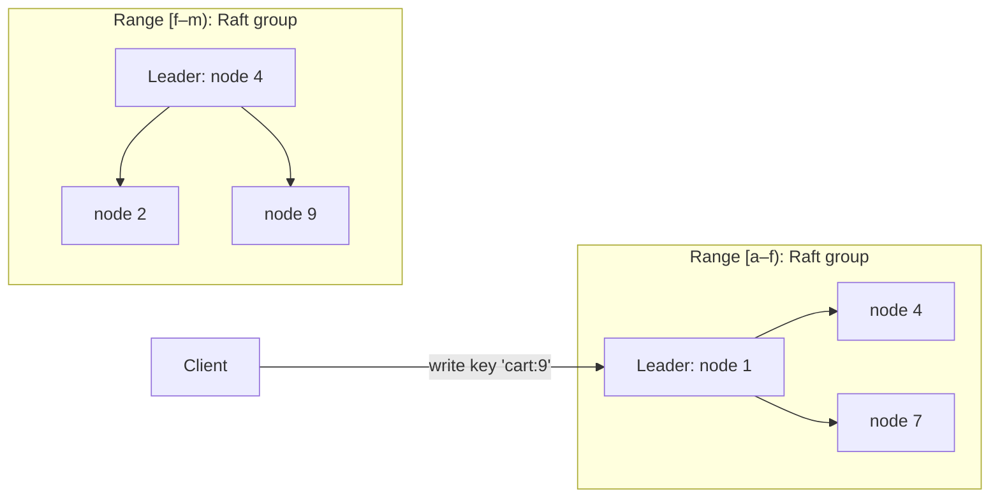

# Distributed KV Store — L6 (Staff) Interview

> **Level expectation:** the L5 mechanisms are known. The staff conversation is about **choosing the right consistency model per workload**, the leaderless vs consensus trade-off, multi-region design, what operating these systems really involves, how you'd know your store is correct, and whether to build at all. Read [L5-senior.md](L5-senior.md) first.

Legend: **🧑‍💼 Interviewer** · **🧑‍💻 Candidate** · **📝 Note** = commentary for you.

---

## 1. One store can't be right for everything

**🧑‍💼 Interviewer:** The company wants one internal KV store for everything: shopping carts, user sessions, feature flags, inventory counts, and distributed locks.

**🧑‍💻 Candidate:** Those want different guarantees:

| Workload | Needs | Fits |
|---|---|---|
| Shopping carts, sessions | Always writable; merge or LWW acceptable | **Leaderless, AP** (Dynamo-style, L5) |
| Feature flags, config | Small, read-heavy, must be consistent across services | **Consensus (Raft)**: etcd/Consul |
| Inventory counts | No overselling → atomic conditional updates | **Single leader per key range** (Raft-replicated ranges) or a relational DB |
| Distributed locks / leader election | Linearizable (every reader sees one agreed order of operations), with fencing tokens | **Consensus only**: never an AP store ([distributed locks](../../concepts/distributed-locks-and-leases.md)) |

So either offer **two tiers** (an AP store and a CP store) or one system with **per-keyspace modes**. Pretending one setting serves all is how teams end up building locks on eventually consistent stores, and selling the last item twice.

> 📝 **Note:** Classifying workloads by the guarantee they need, before picking technology, is the core staff move in this problem.

---

## 2. The CP alternative: multi-Raft ranges

**🧑‍💻 Candidate:** Instead of leaderless replicas, split the key space into **ranges** (e.g. 64–512 MB each), and replicate each range with its own **Raft group** of 3 or 5 replicas ([consensus & Raft](../../concepts/consensus-and-raft.md)). TiKV, CockroachDB and YugabyteDB work this way; Spanner uses Paxos.

| | Leaderless (Dynamo) | Multi-Raft ranges |
|---|---|---|
| Write path | Any replica; quorum acks | Leader only; majority acks |
| Consistency | Tunable, eventually consistent by default | Linearizable per range |
| Conflicts | Possible → LWW / vector clocks / repair | None: one leader orders writes |
| Availability on partition | Both sides keep writing | Minority side can't write (a range is unavailable until a new leader is elected, typically a few seconds) |
| Latency | One round trip to W replicas | Leader + majority round trip; extra hop if the client hits a follower |
| Rebalancing | Move vnode ranges | Split/merge ranges, move Raft replicas, transfer leadership |
| Multi-key transactions | Hard (no single order) | Possible (2PC across ranges with timestamps: Percolator/Spanner style) |

Range partitioning (sorted keys) also enables **range scans**, which hash partitioning can't do efficiently, at the cost of hot ranges with sequential keys (timestamps), solved by splitting hot ranges and avoiding monotonically increasing keys.

---

## 3. Multi-region

- **Leaderless:** replicate to every region (e.g. 3 replicas per region) and use `LOCAL_QUORUM` (quorum within the caller's region, async to others) for low latency. Cross-region conflicts resolved by LWW/merge. `EACH_QUORUM` when a write must be durable in every region, which costs a cross-region round trip (~100+ ms).
- **Raft-based:** a Raft group spanning regions pays cross-region latency on **every write** (majority must ack). Options: place each range's leader near its users (**leader pinning**), keep replicas regional for latency-sensitive data, or accept the latency for data that needs global consistency (Spanner reduces read cost with synchronized clocks).
- **The honest summary:** you can't have low-latency writes in every region *and* global strong consistency. Decide per keyspace which one matters ([CAP & consistency](../../concepts/cap-and-consistency.md)).

---

## 4. Operating it is most of the work

| Operational area | What actually goes wrong | What you build |
|---|---|---|
| **Repair** | Skipped repairs → zombie data after gc_grace | Automated, throttled, incremental repair scheduler with alerts |
| **Compaction** | Falls behind → read amplification, disk full, write stalls | Disk headroom (keep ~50% free with size-tiered), compaction throughput metrics, per-table strategy |
| **Node replacement** | Streaming 2 TB onto a new node takes hours and loads neighbours | Throttled streaming, replace-node workflow, capacity plan for the stream |
| **Rolling upgrades** | Mixed versions, protocol changes | Version-skew testing, canary nodes, one rack at a time |
| **Hot partitions** | One key/range melts its replicas | Per-partition metrics, key-design reviews, caching tier |
| **Large partitions** | Unbounded rows (e.g. all events for a user) → slow reads, GC | Data modelling guidelines (bucketing by time), partition-size alerts |
| **Clock problems** | LWW chooses wrong winner | NTP/chrony monitoring, reject far-future timestamps |

**🧑‍💻 Candidate:** Teams that run these well spend more on tooling (repair, replace, rebalance, observability) than on the database itself. The interview answer should show you know that, especially coming from infra.

---

## 5. How do you know it's correct?

- **Deterministic simulation** (FoundationDB's approach): run the whole cluster in one process with simulated network, disk and clocks; inject failures; replay any failing seed exactly.
- **Fault injection in real clusters:** kill nodes, partition networks, pause processes (to simulate GC), skew clocks.
- **Jepsen-style checking:** record every operation's invocation and result during chaos, then check the history against the promised model (e.g. linearizability). Many popular databases have failed such tests on their own documented guarantees, so test what you promise.
- **Invariants in production:** periodic read-after-write probes; checksum comparisons across replicas (the Merkle trees double as a correctness check).

---

## 6. Build vs buy

| Option | When |
|---|---|
| **DynamoDB / Cosmos DB / Bigtable** (managed) | Most companies: no operations, pay per request/storage |
| **Cassandra / ScyllaDB** (self-run, AP) | Very high write throughput, cost at huge scale, multi-region control |
| **etcd / Consul / ZooKeeper** (CP, small data) | Config, service discovery, coordination, locks: GBs not TBs |
| **TiKV / CockroachDB / YugabyteDB / FoundationDB** (CP, large data) | Need transactions and consistency at scale |
| **Build your own** | Almost never. Only a few companies at extreme scale with unique needs |

**🧑‍💻 Candidate:** I'd recommend the managed or established option and spend the effort on **data modelling guidance** and **operational tooling**, which is where most production problems come from, not on writing a storage engine.

---

## 7. Curveballs

**🧑‍💼 Interviewer:** After a network partition healed, some users saw their deleted messages reappear.

**🧑‍💻 Candidate:** Classic tombstone resurrection: a replica was isolated longer than the tombstone grace period, so its peers had already purged the tombstones while it still held the original values; when it rejoined, its copies looked like live data. Fixes: never let a node rejoin after being away longer than gc_grace without a full repair (or a wipe + rebuild); alert on nodes down approaching that limit; make sure repairs actually complete within the window.

**🧑‍💼 Interviewer:** p99 latency doubled when we added 20 nodes.

**🧑‍💻 Candidate:** Bootstrapping nodes stream data from existing nodes, consuming their disk and network; meanwhile compaction runs on the newly received SSTables. Throttle streaming, add nodes one at a time (or per rack), add capacity *before* utilisation is high, and watch per-node pending compactions. This is a capacity-planning lesson: scaling out costs capacity while it happens.

---

## 8. What the interviewer was evaluating (L6)

- [ ] Classified workloads by required guarantee before choosing technology
- [ ] Explained multi-Raft ranges vs leaderless with a clear comparison
- [ ] Range vs hash partitioning trade-offs (scans vs hot ranges)
- [ ] Multi-region options and the latency/consistency trade-off per keyspace
- [ ] Operational realities: repair, compaction, replacement, upgrades, data modelling
- [ ] Correctness verification: simulation, fault injection, history checking
- [ ] Build vs buy with a sensible recommendation

## 9. Common mistakes at this level

| Mistake | Why it hurts at L6 |
|---|---|
| One consistency setting for all workloads | Locks and inventory on an AP store → real business bugs |
| Choosing Raft for everything | Lost availability and higher latency where it wasn't needed |
| Ignoring operations | The database works; the cluster doesn't |
| Trusting documented guarantees without testing | Many systems have failed their own claims under faults |
| Proposing to build a new database | Massive cost, years of hardening |
| Multi-region with global strong consistency "for free" | Physics: cross-region round trips on every write |

⬅️ Previous: [L5-senior.md](L5-senior.md) · 🏠 [Problem overview](README.md)
