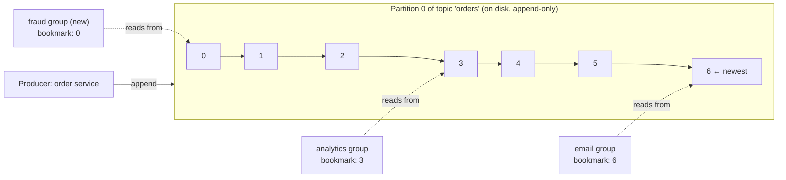

# Start Here: What Is a Distributed Message Queue? (Before the Interview)

> You've probably *used* Kafka or a queue at work: some service "publishes an event" and other services "consume" it. This interview asks you to **build the thing in the middle**: a cluster of servers that accepts millions of messages per second, never loses one it has acknowledged, keeps them in order, and lets many independent readers move through them at their own speed, even while servers crash.
>
> Time: ~15 minutes. Then: [L4](L4-mid.md) → [L5](L5-senior.md) → [L6](L6-staff.md). The single-process version (topics, subscribers, back-pressure, acks in code) is the [Pub-Sub Broker LLD](../../../LLD/interviews/pub-sub-broker/README.md).

---

## 1. The story: "The order service went down, and so did checkout"

An online shop places an order. Five things must happen after: charge payment, reserve stock, email the buyer, update analytics, notify the seller.

**Version 1:** the order service calls all five services directly, one after another.
- The email service is slow today → every checkout takes 4 seconds.
- Analytics is down for a deploy → checkout **fails**, even though analytics is irrelevant to the buyer.
- A sixth team (fraud) wants order events → the order team must change code and deploy.
- During a sale, 10× traffic hits all five services at once; the weakest falls over.

**Version 2:** the order service writes one message, "order 881 placed", to a **message queue** and returns. Each of the five services **reads** that message when it's ready.
- Slow or down consumers no longer slow down checkout. Messages wait for them.
- A new consumer (fraud) just starts reading. Nobody else changes.
- Spikes are absorbed: the queue fills up for a few minutes, consumers catch up later.

The queue is now the most important piece of infrastructure in the company: if it loses messages, orders silently disappear; if it goes down, everything stops. Building *that* is this interview.

---

## 2. Where you've already seen it

| Where | What you saw |
|---|---|
| **Kafka at work** | Topics, partitions, consumer groups, "consumer lag" dashboards |
| **Log pipelines** | Fluent Bit / Filebeat → Kafka → Elasticsearch. The middle stage is a message queue |
| **AWS SQS / RabbitMQ** | Background jobs: "send email", "resize image", with retries and dead-letter queues |
| **Kubernetes** | The API server's *watch* stream: controllers subscribe to changes and react, at their own pace |
| **Database replication** | A replica reading the primary's write-ahead log (WAL: the database's append-only record of every change). A message log is the same idea, offered as a product |
| **Your phone's notifications** | Pub/sub: one event, many subscribers |

💡 **Message queue vs log:** a classic *queue* (SQS, RabbitMQ) deletes a message once a consumer acknowledges it. A *log* (Kafka, Pulsar, Kinesis) keeps every message for a retention period, and each reader just remembers its position. This interview is mostly about the log kind, because it's the harder and more common design question. Compare them in [message queues](../../technologies/message-queues.md) and [Kafka](../../technologies/kafka.md).

---

## 3. The features, through situations

### 3.1 "Write it down and tell me it's safe" → durable publish
The order service publishes "order 881 placed" and gets an **acknowledgement** ("ack"). After the ack, the message must survive any single server dying. → L4 §5.1, §5.3.

### 3.2 "Keep the events for one order in order" → partitions and keys
"Order placed" must be processed before "order cancelled". The queue guarantees order **within a partition** (one ordered slice of a topic), and the producer chooses a **key** (the order ID) so all events for one order land in the same partition. → L4 §5.1.

### 3.3 "Five teams read the same events" → consumer groups
Payments, email and analytics each read **every** message, independently. Within one team, ten pods **share** the work. → L4 §5.2, [consumer groups](../../concepts/consumer-groups-and-rebalancing.md).

### 3.4 "Where was I?" → offsets
Each team's position is just a number per partition: "email has processed partition 3 up to message 51,200". After a crash, it resumes from there. → L4 §5.2.

### 3.5 "We shipped a bug; reprocess yesterday" → retention and replay
Because messages stay for days, a team can **rewind** its offset and re-read history. A classic queue can't do this once messages are deleted. → L4 §5.4.

### 3.6 "A server died mid-sale" → replication and failover
Every partition has copies on several servers. When the leader dies, a follower that has every acknowledged message takes over. → L4 §5.3, L5 §3.1–3.2, [log replication & ISR](../../concepts/log-replication-and-isr.md).

### 3.7 "Process each payment exactly once" → delivery guarantees
Networks retry; retries cause duplicates. What does "exactly once" really mean here? → L5 §3.4, [idempotency & delivery semantics](../../concepts/idempotency-and-delivery-semantics.md).

### 3.8 "One team's flood shouldn't hurt the others" → quotas and multi-tenancy
A shared cluster serves hundreds of teams. One runaway producer must not slow everyone down. → L6 §2.

---

## 4. The key mechanism: an append-only log with readers' bookmarks

Three ideas in that picture:
1. **Writing = appending to the end of a file.** No updates, no deletes of single messages. Appending is the fastest thing a disk can do ([Kafka's speed tricks](../../../under-the-hood/kafka-speed-tricks.md)).
2. **Reading doesn't remove anything.** Each group keeps a **bookmark** (offset). Analytics being slow doesn't affect email.
3. **Old data is deleted in bulk** by age or size (e.g. after 7 days), whole files at a time, regardless of who has read it.

---

## 5. Try it yourself

- **Kafka in 5 minutes (if you have Docker):** the official Apache Kafka quickstart runs a single broker with `docker run -p 9092:9092 apache/kafka`. Then, using the scripts inside the container (`/opt/kafka/bin/`), create a topic with 3 partitions, produce a few lines with `kafka-console-producer.sh`, and read them with `kafka-console-consumer.sh --from-beginning`. Run two consumers with the same `--group` and watch them split the partitions; run `kafka-consumer-groups.sh --describe` to see each group's offsets and **lag** (how far behind it is).
- **At work:** open your team's Kafka/MSK dashboard and find a topic's partition count, replication factor, retention, and the lag of a consumer group you own.
- **SQS for contrast (AWS free tier):** send a message, receive it (it becomes invisible for 30 s), don't delete it, and watch it reappear. That's the queue model's acknowledgement.

> Nothing to install for the reading; the Docker command is optional.

---

## 6. From experience to requirements

| What people experience | Requirement |
|---|---|
| "Published" means it won't be lost | **NF:** durability after ack; replication; no data loss on one server failure |
| Events for one order arrive in order | **F:** ordering per partition key |
| Many teams read the same stream independently | **F:** consumer groups with their own offsets |
| A team can reprocess last week | **F:** time/size-based retention, replay from any offset |
| Checkout doesn't wait for consumers | **NF:** low publish latency (ms), decoupled consumers |
| Millions of events per second at peak | **NF:** horizontal scalability by partitions and brokers |
| A broker crash is a non-event | **NF:** automatic leader failover in seconds |
| One noisy team doesn't hurt others | **NF:** quotas, isolation |

---

## 7. Mini glossary

| Term | Plain meaning |
|---|---|
| Broker | One server in the queue cluster |
| Topic | A named stream of messages, e.g. `orders` |
| Partition | One ordered, append-only slice of a topic; the unit of parallelism and ordering |
| Offset | A message's position number inside a partition |
| Producer / consumer | Writes messages / reads messages |
| Consumer group | A team of consumers sharing a topic's partitions, with one shared set of offsets |
| Lag | How many messages a group is behind the newest one |
| Replication factor | How many copies of each partition exist (often 3) |
| Leader / follower | The copy that takes writes / copies that replicate from it |
| ISR | In-sync replicas: followers that are fully caught up |
| Retention | How long messages are kept (e.g. 7 days), whether read or not |
| Ack | The broker's "your message is safely stored" reply |

➡️ Next: [README.md](README.md) · then [L4-mid.md](L4-mid.md)
