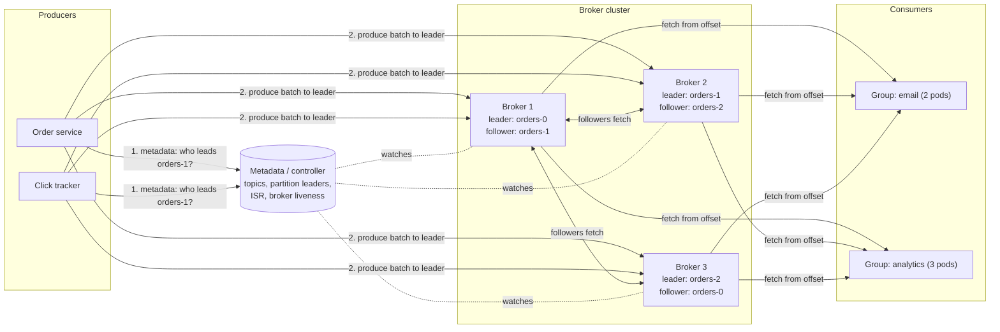

# Distributed Message Queue — L4 (Mid-level / SDE2) Interview

> **Level expectation:** a working design for a Kafka-like system. Topics split into **partitions**, each an **append-only log** on disk. Producers choose a partition by key, which gives ordering per key. **Consumer groups** track **offsets**. Each partition is **replicated** with a leader and followers. **Retention** deletes old segments. You should also explain how a broker finds a message by offset. Correct estimates and clear trade-offs matter more than exotic internals.

> 🆕 Read [00-understand-the-product.md](00-understand-the-product.md) first: the "checkout went down with analytics" story and the log-with-bookmarks picture.

Legend: **🧑‍💼 Interviewer** · **🧑‍💻 Candidate** · **📝 Note** = commentary for you.

---

## 1. Clarifying requirements

**🧑‍💼 Interviewer:** Design a distributed message queue.

**🧑‍💻 Candidate:** Before designing, I need to know which kind:
- **Queue semantics** (a message is consumed once and then deleted, like SQS) or **log semantics** (messages are retained and many consumer groups read the same stream, like Kafka)?
- **Ordering:** global, per key, or none?
- **Delivery:** is at-least-once OK, or do we need exactly-once?
- **Scale:** messages per second, message size, retention?
- **Latency:** is end-to-end in tens of milliseconds OK?

**🧑‍💼 Interviewer:** Log semantics, like Kafka. Ordering per key. At-least-once to start. Peak 1M messages/s, ~1 KB each, 7-day retention. Many consumer groups.

**🧑‍💻 Candidate:**

**Functional**
1. Create topics with a number of partitions and a replication factor.
2. Produce messages (key, value) to a topic; get back an ack with the partition and offset.
3. Consume from a topic as part of a consumer group, from a stored offset or from earliest/latest.
4. Commit offsets; resume from them after a restart.
5. Retain messages for a configured time/size, then delete them.

**Non-functional**
1. **Durability:** an acknowledged message survives the loss of one broker.
2. **Throughput:** 1M msg/s in, several times that out (multiple groups).
3. **Ordering** within a partition.
4. **Availability:** a broker failure causes seconds of disruption, not minutes.
5. **Latency:** publish ack in a few ms (p99 tens of ms), end to end < 100 ms.

> 📝 **Note:** "Queue or log?" is the most important clarifying question here. The designs diverge: a queue tracks per-message state (in flight, acked, redelivered); a log tracks one number per partition per group. Starting with it shows you know both exist.

---

## 2. Back-of-the-envelope estimates

(Method: [back-of-the-envelope](../../concepts/back-of-the-envelope.md).)

| What | Calculation | Result |
|---|---|---|
| Peak ingest | 1M msg/s × 1 KB | **~1 GB/s** in |
| Average ingest | assume half of peak: 500k msg/s × 1 KB | ~500 MB/s |
| Messages per day | 500,000 × 86,400 s | **~43 billion/day** |
| Bytes per day | 43.2B × 1 KB | **~43 TB/day** |
| With replication factor 3 | 43 TB × 3 | **~130 TB/day** written to disks |
| Retained (7 days) | 130 TB × 7 | **~910 TB ≈ 0.9 PB** on disk |
| Brokers for storage | 910 TB ÷ 20 TB usable per broker | **~46 brokers** → plan ~50 |
| Peak network into the cluster | 1 GB/s from producers + 2 GB/s of follower replication | **~3 GB/s** |
| Peak network out | 2 GB/s replication + 3 consumer groups × 1 GB/s | **~5 GB/s** → ~100 MB/s per broker across 50: easy for 10–25 Gbps NICs (1.25–3 GB/s) |
| Partitions | 1 GB/s ÷ ~10 MB/s comfortable per partition | **≥ 100 partitions** for this topic; more for consumer parallelism |

💡 **NIC:** network interface card, the server's network port. "25 Gbps" means 25 gigabits per second ≈ 3 GB/s.

**🧑‍💻 Candidate:** Storage dominates, not CPU. ~50 brokers is driven by disk; network has headroom. A single partition is read and written by one leader, so the partition count is what lets us scale beyond one machine.

---

## 3. API

```text
createTopic(name, partitions=120, replicationFactor=3, retention=7d)

produce(topic, key, value, acks=all) → {partition, offset}
    # partition = hash(key) % partitions   (no key → round-robin / sticky batches)

fetch(topic, partition, fromOffset, maxBytes) → [ {offset, key, value, timestamp}, ... ]

joinGroup(groupId, topics) → assigned partitions
commitOffset(groupId, topic, partition, offset)
fetchCommittedOffset(groupId, topic, partition) → offset
```

**🧑‍💻 Candidate:**
- Real clients **batch**: `produce` buffers messages per partition and sends a batch every few ms or when it reaches e.g. 64 KB. Batching is the single biggest throughput lever ([Kafka's speed tricks](../../../under-the-hood/kafka-speed-tricks.md)).
- `fetch` is a **pull**: the consumer asks for "everything after offset X, up to 1 MB". The broker can hold the request open briefly if nothing new is there (**long polling**), so consumers don't spin.
- The protocol is binary over TCP, not JSON over HTTP, to keep per-message overhead tiny.

> 📝 **Note:** Explain *why pull*: the consumer controls its own pace (natural back-pressure), can rewind, and can batch. With push, the broker has to track every consumer's speed.

---

## 4. High-level design



**🧑‍💻 Candidate:**
- **Brokers** store partitions. Each partition has one **leader** (takes reads and writes) and followers on other brokers. Leaders are spread so every broker leads some partitions.
- **Metadata / controller:** knows which broker leads which partition, which replicas are in sync, and which brokers are alive. Historically [ZooKeeper](../../technologies/zookeeper-etcd.md); in modern Kafka a built-in Raft-based controller quorum (L5 §3.2).
- **Clients cache metadata** and talk **directly** to partition leaders. There's no central router in the data path, like a client-side load balancer that knows which pod owns which shard.
- **Committed offsets** are themselves stored in an internal, replicated topic (`__consumer_offsets`), so the system uses its own log for its own state.

---

## 5. Deep dives

### 5.1 The partitioned, append-only log

**🧑‍💼 Interviewer:** Why partitions? Why not one log per topic?

**🧑‍💻 Candidate:** One log means one leader broker handles all writes for the topic: ~100–200 MB/s at best, and consumers can't parallelise beyond one reader per group. Partitions split a topic into N independent logs on different brokers.

- **Choosing a partition:** `hash(key) % N`. Every event for order 881 goes to the same partition, so they're **ordered** relative to each other. Events for different orders may interleave; that's fine.
- **No key:** spread across partitions for balance. No ordering promise.
- **Each partition is append-only.** A new message gets offset = last + 1. Messages are never modified in place.

**The catch: changing N.** If we go from 120 to 240 partitions, `hash(key) % N` changes for most keys, so new events for order 881 may land in a different partition than its old events. Ordering across that change breaks. So: **over-provision partitions up front** (they're cheap-ish), and if you must grow, accept a reordering window or create a new topic and migrate consumers. (Unlike a cache, we can't use [consistent hashing](../../concepts/consistent-hashing.md) to move only some keys, because a key's *old* messages stay in the old partition.)

> 📝 **Note:** Interviewers often ask "how do you guarantee global ordering?" Answer: one partition, and accept its throughput limit (~one broker). Almost nobody needs global order; per-entity order is what businesses need.

### 5.2 Offsets and consumer groups

**🧑‍💻 Candidate:**
- A **consumer group** is a set of consumers sharing a topic. Each partition is assigned to **exactly one** consumer in the group, so a group of 3 consumers reading 6 partitions gets 2 each. A 7th consumer in a 6-partition group sits idle: **partitions cap a group's parallelism**.
- Different groups are independent: each has its own offsets and reads every message.
- **Offset commit:** after processing messages up to offset 51,200 in partition 3, the consumer commits "next to read: 51,201". On restart (or when another consumer takes over the partition) reading resumes there.
- **When you commit decides the delivery guarantee:**
  - Commit **after** processing → a crash between processing and committing re-processes some messages → **at-least-once**. Consumers must be idempotent ([idempotency](../../concepts/idempotency-and-delivery-semantics.md)).
  - Commit **before** processing → a crash loses those messages → **at-most-once**.
- **Rebalancing:** when a consumer joins, leaves or dies (missed heartbeats), partitions are reassigned among the rest ([consumer groups & rebalancing](../../concepts/consumer-groups-and-rebalancing.md), L5 §3.3).

**Lag** = newest offset − committed offset, per partition. It's the main health metric for consumers: alert when lag grows steadily ([alerting & SLOs](../../concepts/alerting-and-slos.md)).

### 5.3 Replication basics

**🧑‍💼 Interviewer:** A broker's disk dies. What do we lose?

**🧑‍💻 Candidate:** Nothing acknowledged, if we set it up right:
- Each partition has **replication factor 3**: one leader, two followers on different brokers (and different racks/zones).
- Followers continuously **fetch** from the leader, exactly like consumers do, and append to their own copy.
- The producer chooses how safe its write is with **acks**:

| acks | Leader replies when | Risk |
|---|---|---|
| `0` | Never (fire and forget) | Lost if anything fails |
| `1` | Leader has written it | Lost if the leader dies before followers copy it |
| `all` | All **in-sync** replicas have it | Safe as long as one in-sync replica survives |

- With `acks=all` and a minimum of 2 in-sync replicas, a write is acknowledged only once it's on at least 2 brokers.
- If the leader dies, the controller promotes an **in-sync** follower (one that has every acknowledged message). Producers and consumers refresh metadata and continue with the new leader. Details: [log replication & ISR](../../concepts/log-replication-and-isr.md), L5 §3.1.

💡 **In-sync replica (ISR):** a follower that's caught up with the leader within a time limit (e.g. 30 s). Slow or dead followers drop out of the ISR, so they don't block `acks=all` writes.

### 5.4 Retention

**🧑‍💻 Candidate:**
- Messages are deleted by **age** (7 days) or **size** (e.g. 1 TB per partition), **regardless of whether consumers read them**. A consumer that is 8 days behind has lost data; that's what lag alerts are for.
- Deletion is cheap because the log is stored in **segment files** (§5.5): we delete whole files whose newest message is older than 7 days. No per-message deletes, no compaction of holes.
- **Compacted topics** are the other retention mode: keep only the **latest message per key** (e.g. "current address of user 42"). Used for changelogs and state. L5 §3.6, [log segments, retention & compaction](../../concepts/log-segments-retention-and-compaction.md).

### 5.5 Storage layout: how a broker finds offset 51,200

**🧑‍💻 Candidate:** A partition is a directory of **segments**, e.g. one file per 1 GB:

```text
orders-3/
  00000000000000000000.log     offsets 0 .. 1,048,575
  00000000000000000000.index   sparse: offset → byte position, one entry every ~4 KB
  00000000000001048576.log     offsets 1,048,576 .. (active segment, being appended)
  00000000000001048576.index
```

To fetch from offset 51,200:
1. **Pick the segment:** file names are the first offset in each file; binary search over them → `000...000.log`.
2. **Look up the sparse index:** binary search the `.index` file for the largest entry ≤ 51,200, e.g. "offset 51,180 is at byte 52,428,000".
3. **Scan forward** from that byte position for a few KB until offset 51,200.
4. **Send bytes** from there to the consumer, ideally straight from the OS page cache to the socket (zero-copy: [Kafka's speed tricks](../../../under-the-hood/kafka-speed-tricks.md)).

Why it's fast: writes are appends to the end of one file (sequential I/O), and most reads are of recent data still in memory (the OS **page cache**: spare RAM the kernel uses to keep recently read/written file data). Compare with a [B-tree](../../../under-the-hood/b-tree.md) database, which does random writes to update pages in place.

---

## 6. Follow-ups

**🧑‍💼 Interviewer:** A consumer is slow. Does it slow down producers or other groups?

**🧑‍💻 Candidate:** No. It only grows its own lag. Producers append regardless and other groups have their own offsets. The only shared cost: a group reading old data pulls it from disk instead of the page cache, which can slow the broker for everyone (L5 §3.5).

**🧑‍💼 Interviewer:** How does a producer know a message was written exactly once if it retries after a timeout?

**🧑‍💻 Candidate:** At L4 level it doesn't: a retry after a lost ack can create a **duplicate** at a new offset. Consumers must dedupe (by a message ID in the payload). The fix in the broker is the **idempotent producer**: producer ID + sequence number per partition, so the leader drops duplicates (L5 §3.4).

**🧑‍💼 Interviewer:** Why not store messages in a database?

**🧑‍💻 Candidate:** We'd pay for features we don't need (random updates, secondary indexes, transactions per row) and lose what we need: sequential append at disk speed, cheap bulk deletion of old segments, and serving many readers from the page cache. The access pattern, append and read sequentially, is exactly a file.

**🧑‍💼 Interviewer:** How many partitions should a topic have?

**🧑‍💻 Candidate:** Enough for peak throughput (here ≥ 100 at ~10 MB/s each) and for the largest consumer group's parallelism, with headroom because changing it later breaks key ordering. Not tens of thousands per broker: every partition costs open files, memory and failover time.

---

## 7. What the interviewer was evaluating (L4)

- [ ] Asked queue vs log semantics, ordering, delivery guarantee
- [ ] Estimates with arithmetic: bandwidth, storage with replication and retention, broker count
- [ ] Partitions as the unit of parallelism and ordering; key → partition
- [ ] Consumer groups: one consumer per partition per group; offsets; commit timing → at-least/at-most-once
- [ ] Leader/follower replication, acks levels, failover to an in-sync replica
- [ ] Retention by time/size via whole segments
- [ ] Segment files + sparse index for offset lookup; sequential I/O

## 8. Common mistakes at this level

| Mistake | Why it hurts |
|---|---|
| Promising global ordering at 1M msg/s | Only possible with one partition, i.e. one machine |
| Deleting messages when consumed (in a log design) | Breaks multiple groups and replay |
| More consumers than partitions "to go faster" | Extra consumers sit idle |
| `acks=1` for data that must not be lost | Leader dies before replicating → acknowledged message gone |
| Forgetting replication in storage estimates | Off by 3× |
| "Increase partitions later" without mentioning key remapping | Silent ordering breaks |

➡️ Next: [L5-senior.md](L5-senior.md)
