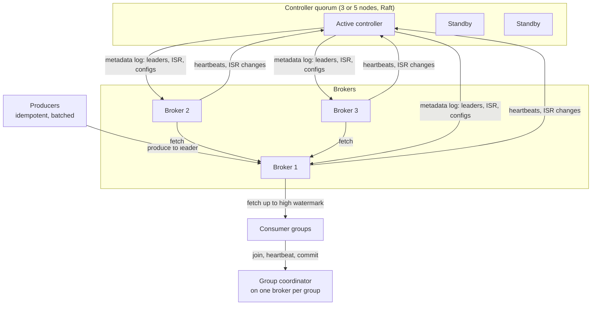
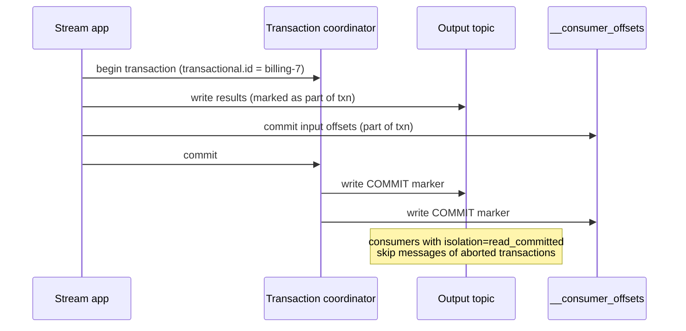

# Distributed Message Queue — L5 (Senior) Interview

> **Level expectation:** everything in [L4](L4-mid.md), and then the internals that decide whether it actually works under failure and load:
> - what "committed" means: the in-sync replica set (ISR) and the **high watermark**;
> - how leaders are elected without losing acknowledged data or ending up with two leaders;
> - how consumer-group **rebalancing** works and why it hurts;
> - what **exactly-once** really means (idempotent producer, transactions);
> - where the throughput comes from (batching, page cache, zero-copy);
> - **log compaction** for keyed state.

> 🆕 Read [00-understand-the-product.md](00-understand-the-product.md) and [L4](L4-mid.md) first.

Legend: **🧑‍💼 Interviewer** · **🧑‍💻 Candidate** · **📝 Note** = commentary for you.

---

## 1. Requirements and estimates (fast)

**🧑‍💻 Candidate:** Same as L4: log semantics, per-key ordering, 1M msg/s peak at ~1 KB, 7-day retention, replication factor 3, ~50 brokers, ≥ 100 partitions for the big topics. I'll add three requirements:
1. **No acknowledged message is ever lost**, even across leader failovers, as long as one in-sync copy survives.
2. **Exactly-once processing** is required for some pipelines (billing, counters).
3. **Failover in seconds**, even with ~100k partitions in the cluster.

| Extra number | Calculation | Result |
|---|---|---|
| Partitions in the cluster | ~500 topics, average ~200 partitions × RF 3 | **~300k partition replicas**, ~100k leaders |
| Leaders per broker | 100k ÷ 50 | **~2,000** |
| One broker dies | its ~2,000 leaderships must move | Controller must elect ~2,000 leaders quickly; at ~1 ms per metadata change that's ~2 s, at ~10 ms it's ~20 s |

> 📝 **Note:** The last row is why the controller design (§3.2) matters at senior level: failover time scales with the number of partitions, not with data size.

---

## 2. High-level design (refined)



**🧑‍💻 Candidate:** Two coordination roles to keep apart:
- The **controller** owns cluster metadata (which broker leads which partition, the ISR, topic configs) and runs leader elections.
- A **group coordinator** (a role on an ordinary broker, chosen by hashing the group ID) manages one consumer group's membership and stores its offsets.

---

## 3. Deep dives

### 3.1 What "committed" means: ISR and the high watermark

**🧑‍💼 Interviewer:** With `acks=all`, when exactly is a message safe, and when can consumers see it?

**🧑‍💻 Candidate:** Each replica has a **log end offset (LEO)**: the next offset it would write. The leader tracks every follower's LEO from their fetch requests. The **high watermark (HW)** is the smallest LEO among the in-sync replicas: every message below it is on every ISR member.

Example, partition `orders-3`, replicas on brokers 1 (leader), 2, 3:

| | Broker 1 (leader) | Broker 2 | Broker 3 |
|---|---|---|---|
| LEO | 108 | 106 | 104 |
| In ISR? | yes | yes | yes (within 30 s) |

**HW = min(108, 106, 104) = 104.** Offsets 0–103 are **committed**:
- a producer waiting with `acks=all` on offset 105 gets its ack only when HW passes 105;
- consumers can only read below the HW, so they never see a message that could vanish in a failover.

**When a follower falls behind** (no fetch for `replica.lag.time.max.ms`, e.g. 30 s), the leader removes it from the ISR. Now HW = min over the remaining members, so one slow disk doesn't stall every `acks=all` producer.

**The safety knob: `min.insync.replicas = 2`.** If the ISR shrinks to just the leader, `acks=all` would mean "only the leader has it", the same as `acks=1`. With min ISR 2, the leader **rejects** `acks=all` writes while the ISR is smaller than 2. That trades availability for durability: the producer gets an error rather than a weak ack.

| RF | min ISR | Tolerates without losing acked data | Writes stop when |
|---|---|---|---|
| 3 | 2 | 1 broker down | 2 brokers down |
| 3 | 1 | 0 (a lone leader can ack and then die) | never stops, loses data instead |

More detail and comparisons with Raft quorums: [log replication & ISR](../../concepts/log-replication-and-isr.md).

> 📝 **Note:** Say "the ISR is dynamic, so the quorum size adapts". Raft needs a fixed majority (2 of 3) for every write. Kafka's ISR can shrink to the healthy replicas, guarded by `min.insync.replicas`. Same safety goal, different mechanism.

### 3.2 Leader election and the controller

**🧑‍💼 Interviewer:** Broker 1 dies. Walk me through what happens to `orders-3`.

**🧑‍💻 Candidate:**
1. The controller notices broker 1 missed its heartbeats (session timeout, a few seconds).
2. For each partition broker 1 led, it picks a new leader **from the ISR** (here broker 2 or 3) and bumps the partition's **leader epoch** (a counter that increases with every leadership change).
3. It writes the change to the metadata log; brokers and clients learn the new leader and continue.

**The subtle part: followers with extra, uncommitted data.** Say broker 2 becomes leader with LEO 106, and broker 3 had written up to 104. Broker 3 is fine (it's behind and just fetches). But if old leader broker 1 comes back with LEO 108, its offsets 106–107 were never committed and exist nowhere else. Broker 1 asks the new leader "where did epoch N end?" and **truncates** its log to 106 before fetching. Those two messages were never acked (HW was 104), so dropping them breaks no promise. That's the producer's retry to make, not the broker's.

💡 **Leader epoch:** using epochs rather than the old high watermark to decide where to truncate fixed real data-loss and divergence bugs in early Kafka ([log replication & ISR](../../concepts/log-replication-and-isr.md)).

**Unclean leader election:** if **every** ISR member is dead and only an out-of-sync replica remains, you choose:
- `unclean.leader.election.enable=false` (default): the partition stays **offline** until an ISR member returns. Consistent, unavailable.
- `true`: promote the stale replica. Available again, but **acknowledged messages are lost** and offsets get reused.

Choose per topic: payments say false; metrics/clickstream may say true.

**The controller itself:** originally a single controller elected through [ZooKeeper](../../technologies/zookeeper-etcd.md), which kept metadata in ZooKeeper; a new controller had to reload everything, which was slow with ~100k+ partitions. Modern Kafka (**KRaft**) replaces ZooKeeper with a small **Raft quorum of controllers** storing metadata as a replicated log ([consensus & Raft](../../concepts/consensus-and-raft.md)). Standbys already have the metadata, so failover is fast, and brokers catch up by reading the metadata log like any other log.

**Fencing zombies:** a paused old leader (long GC, network partition) might still think it's leader. Requests carry the leader epoch, and followers and the controller reject the stale epoch. It's the same idea as fencing tokens in [distributed locks & leases](../../concepts/distributed-locks-and-leases.md).

### 3.3 Consumer group rebalancing

**🧑‍💼 Interviewer:** You deploy a new version of a 50-pod consumer group. What happens?

**🧑‍💻 Candidate:** With the classic **eager** protocol, every membership change triggers a rebalance:
1. Every consumer **revokes all** its partitions (commits offsets, stops processing).
2. All rejoin; the coordinator picks a group leader, which computes a new assignment.
3. Everyone resumes with the new assignment.

A rolling deploy of 50 pods can cause 50+ stop-the-world pauses: a **rebalance storm**. Lag spikes during the deploy.

Fixes:
- **Cooperative (incremental) rebalancing:** consumers keep the partitions that aren't moving; only the partitions that change owners are revoked. Most consumers never stop.
- **Static membership:** each pod has a stable `group.instance.id` (like a StatefulSet pod name). A pod restarting within the session timeout gets its same partitions back with **no rebalance**.
- **Sticky assignment:** minimise partition movement, which also keeps local caches warm.
- **Session timeout vs processing time:** a consumer that takes too long between polls (a slow batch) is considered dead and kicked out → rebalance → the batch is processed again by someone else. Tune `max.poll.interval.ms`, or hand slow work to a separate thread pool while keeping the poll loop alive.

Details: [consumer groups & rebalancing](../../concepts/consumer-groups-and-rebalancing.md). Newer Kafka versions also move assignment logic from the client to the broker-side coordinator (a newer consumer group protocol) to shorten rebalances further.

> 📝 **Note:** Infra analogy: a rebalance is like a k8s rolling update that drains *every* pod for each new one. Cooperative + static membership turn it into a normal rolling update.

### 3.4 Exactly-once: what it really means

**🧑‍💼 Interviewer:** A billing pipeline must count each order exactly once. Can the queue guarantee that?

**🧑‍💻 Candidate:** Only within limits, so let me split it into the three places duplicates come from ([idempotency & delivery semantics](../../concepts/idempotency-and-delivery-semantics.md)):

**1. Producer retries → duplicates in the log.** Fix: the **idempotent producer**. Each producer gets a **producer ID**, and each message batch carries a per-partition **sequence number**. The leader remembers the last few sequence numbers per producer. A retried batch with an already-seen sequence is acknowledged but not appended again. This is cheap and is the default in modern clients.

**2. Read → process → write to another topic → commit offset.** A crash between steps duplicates the output. Fix: **transactions**. The producer writes its output messages *and* the consumer offset commit in one atomic transaction:



- A zombie instance with the same `transactional.id` is **fenced** by an epoch, so two copies of the app can't both commit.
- Downstream consumers use `isolation.level=read_committed` to see only committed results.

**3. Side effects outside the log** (charging a card, sending an email, writing to Postgres). The queue **can't** make these exactly-once. You need idempotent consumers: store the processed message ID (or the offset) in the same database transaction as the effect, and skip duplicates. It's the same pattern as the [payment system's](../payment-system/L5-senior.md) idempotent consumers.

> 📝 **Note:** The senior answer is "exactly-once *within the log* via idempotent producer + transactions; end to end only with idempotent sinks". Claiming the queue gives exactly-once delivery to arbitrary consumers is a red flag.

### 3.5 Where the throughput comes from

**🧑‍💼 Interviewer:** How does one broker handle hundreds of MB/s on ordinary hardware?

**🧑‍💻 Candidate:** Four design choices that stack ([Kafka's speed tricks](../../../under-the-hood/kafka-speed-tricks.md)):

| Trick | What it avoids | Rough gain |
|---|---|---|
| **Sequential appends** | Disk seeks (HDD ~10 ms each; SSDs also prefer large sequential writes) | HDD: ~100 random writes/s vs ~100+ MB/s sequential |
| **OS page cache instead of an in-process cache** | Double caching and JVM garbage-collection pressure; cache survives broker restarts | Recent data is served from RAM |
| **Zero-copy (`sendfile`)** | Copying bytes from kernel → JVM → kernel for every consumer | Data goes file → socket inside the kernel |
| **Batching + compression end to end** | Per-message overhead: syscalls, network round trips, headers | Producer compresses a batch once; broker stores it as is; consumer decompresses |

💡 **Syscall:** a call from a program into the operating system kernel (read a file, write to a socket). Each one has a fixed cost, so doing one per 64 KB batch instead of one per 100-byte message matters.

**Where it breaks:**
- **Lagging consumers** read old data from disk, evicting hot data from the page cache, so the tail consumers suddenly slow down too. Mitigations: more RAM, separate clusters for replay-heavy workloads, tiered storage (L6).
- **TLS** encrypts in user space, so the zero-copy path is lost (unless the kernel does the TLS). CPU per byte goes up noticeably.
- **Tiny messages, no batching** (`linger.ms=0`, one message per request): throughput collapses. Tune `batch.size` and `linger.ms` (e.g. 5–20 ms) to trade a little latency for a lot of throughput.
- **Durability doesn't come from fsync.** Brokers don't fsync each message (fsync: forcing data from the page cache to the physical disk, slow). Durability comes from **replication to other machines** before acking. A power loss across all replicas at once (one rack, one zone) can lose data, which is why replicas go in different zones.

### 3.6 Log compaction

**🧑‍💼 Interviewer:** A team wants the topic to hold "current state per user" forever, not 7 days of events.

**🧑‍💻 Candidate:** Use a **compacted topic**: instead of deleting by age, a background **cleaner** rewrites old segments keeping only the **latest message per key**.

```text
before:  [u1:addr=A] [u2:addr=X] [u1:addr=B] [u3:addr=M] [u1:addr=C] [u2:null]
after:   [u3:addr=M] [u1:addr=C] [u2:null]   ← null = tombstone, removed later
```

- Offsets stay the same (gaps appear); order per key is preserved.
- A **tombstone** (key with a null value) means "delete this key"; it's kept for a while (`delete.retention.ms`) so consumers see the deletion, then removed.
- **Use cases:** changelogs for stream-processing state, the system's own `__consumer_offsets`, config/state distribution, rebuilding a cache from scratch by reading the topic from offset 0.

Details and the cleaner's mechanics: [log segments, retention & compaction](../../concepts/log-segments-retention-and-compaction.md).

---

## 4. Follow-ups / curveballs

**🧑‍💼 Interviewer:** A producer sends to partition 3 with `acks=all`, and the ISR is {1, 2, 3}. Broker 3 is slow (disk at 100%). What does the producer see?

**🧑‍💻 Candidate:** Latency climbs until broker 3 is dropped from the ISR (after `replica.lag.time.max.ms`). Then HW advances with {1, 2}, and latency recovers. If broker 3 flaps in and out, p99 latency is spiky: alert on ISR shrink/expand rate per broker.

**🧑‍💼 Interviewer:** One key is extremely hot (a celebrity's user ID); its partition is overloaded.

**🧑‍💻 Candidate:** Per-key ordering pins the key to one partition, so I'd ask whether that key truly needs order. If not, salt it (`key#0..7`) to spread across 8 partitions and merge downstream. If yes, the partition's leader must be on a strong broker, and consumers of that partition must be fast. That's the same hot-partition problem as in [counters at scale](../../concepts/counters-at-scale.md) and the [Discord case study](../../../case-studies/discord-message-storage.md).

**🧑‍💼 Interviewer:** Why do consumers pull instead of the broker pushing?

**🧑‍💻 Candidate:** Pull gives natural back-pressure, lets consumers batch and rewind, and keeps the broker simple: it doesn't track each consumer's speed. The cost is polling when idle, solved with long-poll fetches. Push systems (RabbitMQ) need per-consumer prefetch limits to get the same back-pressure ([message queues](../../technologies/message-queues.md)).

**🧑‍💼 Interviewer:** Can consumers read from followers?

**🧑‍💻 Candidate:** Yes, as an option: reading from the nearest replica (same zone) saves cross-zone network cost, which is real money in the cloud. Followers serve only up to the HW they've learned from the leader, so a consumer may see slightly older data, but never uncommitted data.

---

## 5. What the interviewer was evaluating (L5)

- [ ] LEO, high watermark, ISR; consumers read only below the HW
- [ ] `acks=all` + `min.insync.replicas` and the durability/availability trade-off
- [ ] Leader election from the ISR, leader epochs and truncation, unclean election as an explicit choice
- [ ] Controller design (ZooKeeper → Raft quorum) and failover time vs partition count
- [ ] Rebalancing costs; cooperative + static membership
- [ ] Exactly-once: idempotent producer, transactions, and the limits at external side effects
- [ ] Throughput sources and where they break (lagging consumers, TLS, tiny messages, fsync)
- [ ] Log compaction and its use cases

## 6. Common mistakes at this level

| Mistake | Why it hurts |
|---|---|
| "acks=all means it's on 3 brokers" | It means "on all *current* ISR members", possibly just one without `min.insync.replicas` |
| Letting consumers see messages above the HW | They could read messages that disappear after failover |
| Claiming end-to-end exactly-once to any database | Only true with idempotent or transactional sinks |
| Ignoring rebalance cost in deploy plans | Lag spikes on every rollout |
| fsync on every message for durability | Throughput collapses; replication is the durability mechanism |
| Unclean leader election enabled for financial topics | Silent loss of acknowledged messages |

➡️ Next: [L6-staff.md](L6-staff.md)
