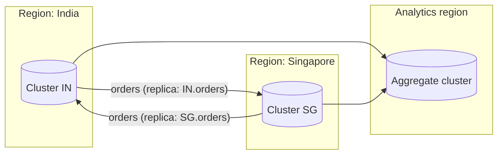

# Distributed Message Queue — L6 (Staff) Interview

> **Level expectation:** the [L4](L4-mid.md)/[L5](L5-senior.md) internals are assumed. The staff conversation is about running the log as a **company-wide platform**:
> - **multi-tenancy** and quotas, so one team can't hurt the others;
> - **tiered storage**, which separates compute from retention;
> - **multi-region** replication and what happens to offsets and ordering across regions;
> - moving data when brokers are added;
> - **schemas** as contracts between teams;
> - **build vs buy** (self-run Kafka, managed Kafka, Pulsar, cloud-native queues);
> - the cost model.

> 🆕 Read [00-understand-the-product.md](00-understand-the-product.md), [L4](L4-mid.md) and [L5](L5-senior.md) first.

Legend: **🧑‍💼 Interviewer** · **🧑‍💻 Candidate** · **📝 Note** = commentary for you.

---

## 1. Framing

**🧑‍💼 Interviewer:** You own the messaging platform for a company with 300 engineering teams. Today it's five Kafka clusters run by hand. Where do you take it?

**🧑‍💻 Candidate:** First the questions that decide the architecture:
1. **Who are the tenants and what do they need?** Event streams for analytics (high volume, loss-tolerant), business events (orders, payments: must not lose, ordered per key), CDC (change data capture: a database's change log streamed out) and task queues (per-message acks and retries, which a log does badly).
2. **What's the failure domain we accept?** One zone down: invisible. One region down: minutes of disruption, defined data loss (RPO, recovery point objective).
3. **What's the cost driver?** For a log platform it's usually **storage × retention × replication** and **cross-zone network**, not CPU.
4. **What's the contract with teams?** Topic ownership, schemas, SLOs (latency, availability, durability), quotas and chargeback (billing each team for its share).

> 📝 **Note:** A staff answer separates *the log as a technology* from *the platform as a product*: self-service, guardrails, ownership, cost.

---

## 2. Multi-tenancy and quotas

**🧑‍💼 Interviewer:** The analytics team's backfill saturated the cluster and payments' p99 latency went from 10 ms to 2 s. How do you prevent that?

**🧑‍💻 Candidate:** Layers of isolation, cheapest first:

| Layer | Mechanism | Protects against |
|---|---|---|
| **Quotas** | Per-client produce/fetch bytes per second and request-time percentage; the broker **delays responses** (throttles) instead of failing them | A runaway producer or a backfill hogging network and disk |
| **Partition and topic limits** | Max partitions per topic and per team; review above a threshold | Metadata blow-up, slow failover (L5 §1) |
| **Separate clusters by tier** | "Critical" cluster (payments, orders) vs "bulk" cluster (logs, clickstream) | Noisy neighbours that quotas can't fully stop (page-cache eviction, disk I/O) |
| **Replay isolation** | Backfills read from tiered storage (§3) or a dedicated replay cluster | Cold reads evicting hot data from the page cache |

- Quotas are **bytes-based** and per principal (authenticated client identity), enforced on every broker.
- **Self-service with guardrails:** teams create topics through a platform API (or GitOps), which applies defaults (RF 3, `min.insync.replicas=2`, retention by tier) and blocks dangerous ones (`acks=0` on the critical tier, unclean election).
- **Chargeback:** bill teams by bytes in × retention × replication. Retention costs then become visible to the team that chose them.

💡 **Noisy neighbour:** one tenant's workload degrading others on shared hardware, like one pod without CPU limits starving others on a k8s node.

---

## 3. Tiered storage: separating compute from retention

**🧑‍💼 Interviewer:** Teams want 90-day retention for replay. At 43 TB/day that's 3.9 PB × 3 replicas on broker disks.

**🧑‍💻 Candidate:** That's the case for **tiered storage**. Brokers keep only recent segments (e.g. 1 day) on local disk, and closed segments are copied to [object storage](../../technologies/object-storage.md) (S3), which is already replicated internally, so we store **one** logical copy there instead of 3 on brokers.

| | All on brokers | Tiered (1 day local, rest in S3) |
|---|---|---|
| Local disk | 43 TB × 3 × 90 = **11.6 PB** | 43 TB × 3 × 1 = **129 TB** |
| Object storage | 0 | 43 TB × 89 = **3.8 PB** (one copy) |
| Brokers needed (20 TB each) | ~580 | ~7 for storage (network now drives the count) |
| Broker replacement | Re-replicate days of data | Re-replicate one day |

- Consumers reading old offsets are served from S3 by the broker, transparently; it's slower (higher first-byte latency) but doesn't touch the page cache of hot data.
- Brokers become **mostly stateless**: scaling and replacing them is faster. That's the direction of Pulsar's design (brokers + BookKeeper storage) and of Kafka's tiered storage feature.
- Some newer systems go further and write directly to object storage with no local replication, trading higher latency (hundreds of ms) for much lower cost. That's fine for logs and analytics, not for checkout events.

Details: [log segments, retention & compaction](../../concepts/log-segments-retention-and-compaction.md).

---

## 4. Multi-region

**🧑‍💼 Interviewer:** We're adding a second region. What does Kafka look like across regions?

**🧑‍💻 Candidate:** First: **don't stretch one cluster across regions** for normal workloads. With `acks=all`, every write would wait for a cross-region round trip (~50–100 ms), and leader elections across a WAN partition get ugly. Instead, run one cluster per region and **replicate between clusters** asynchronously (MirrorMaker 2, Confluent Replicator / Cluster Linking, or a managed equivalent).

Topologies:

- **Active–passive (DR):** producers write in region A; topics are mirrored to B. On failover, producers and consumers move to B.
- **Active–active:** each region produces locally to its own topic; mirrored copies are **prefixed** (`IN.orders`, `SG.orders`) to avoid infinite loops. Consumers that need a global view read both.
- **Aggregation:** regional clusters mirror into one analytics cluster.

The hard parts:
1. **Offsets differ between clusters.** Offset 51,200 in region A is not offset 51,200 in region B (different batching, gaps, compaction). Failover needs **offset translation**: the replicator periodically records "A's offset X ≈ B's offset Y" checkpoints per group. Consumers resume slightly before the true position → some **duplicates**, so consumers must be idempotent.
2. **RPO is the replication lag.** Async mirroring is seconds behind; a region loss loses those seconds unless producers also write to the other region (expensive) or the source of truth can replay (e.g. CDC from a database replicated synchronously in its own way).
3. **Ordering across regions isn't guaranteed.** Per-key order holds within one region's topic. If the same key is written in two regions, there's no global order: design ownership so each key has a **home region** (like data residency).
4. **Data residency:** some data may not leave its region at all (e.g. Indian payment data). The mirroring config is a compliance artefact; review it like code.

> 📝 **Note:** Saying "offset translation" and "home region per key" is the staff signal here. Most candidates stop at "use MirrorMaker".

---

## 5. Operating the platform

**Adding brokers doesn't move data by itself.** New brokers start empty, and existing partitions stay where they are. Moving a partition means copying all its data (e.g. 1 TB) to a new replica while it keeps serving, then switching. So:
- Throttle reassignment bandwidth so it doesn't starve production traffic.
- Use a balancer (Cruise Control or a managed equivalent) to plan moves by disk, network and leader count.
- Tiered storage makes this far cheaper: only the local tail moves.

**Upgrades:** rolling, one broker at a time, waiting for under-replicated partitions to return to zero before the next. Like a k8s `PodDisruptionBudget` of 1, but measured in data being in sync rather than pods being ready.

**The SLIs (service level indicators: the metrics an SLO is measured on) that matter** ([alerting & SLOs](../../concepts/alerting-and-slos.md)):

| SLI | Why |
|---|---|
| Under-replicated / under-min-ISR partitions | Durability at risk *now* |
| Offline partitions | Unavailability |
| Produce p99 latency per tier | What producers feel |
| Consumer lag (time-based, not just message count) | "Email is 40 minutes behind" is what the business cares about |
| Controller failover time, ISR shrink rate | Early warnings |
| Disk usage vs retention | A full disk takes a broker down |

---

## 6. Schemas: the contract between teams

**🧑‍💼 Interviewer:** The order team renamed a field and 12 consumers broke.

**🧑‍💻 Candidate:** Bytes in a topic are an API. Treat them like one:
- A **schema registry**: producers register a schema (Avro/Protobuf/JSON Schema) and messages carry a schema ID. Consumers fetch the schema by ID.
- **Compatibility rules** enforced at registration: backward-compatible changes only (add optional fields, never rename/remove required ones). The rename would have been rejected in CI.
- **Ownership:** every topic has an owning team, an on-call rota and a documented schema. Orphan topics get flagged and eventually deleted.
- For breaking changes: publish v2 to a new topic, dual-write during migration, retire v1 when consumers have moved.

This is the same discipline as API versioning in the [API gateway](../api-gateway/L6-staff.md) interview.

---

## 7. Log vs queue, and build vs buy

**🧑‍💼 Interviewer:** A team wants per-message retries with a 10-minute delay and a dead-letter queue. Kafka?

**🧑‍💻 Candidate:** That's **queue** semantics: per-message acks, visibility timeouts, delays and DLQs ([message queues](../../technologies/message-queues.md), [retries & DLQ](../../concepts/retries-backoff-and-dlq.md)). On a log, one slow or poison message blocks its whole partition for that group (head-of-line blocking), and you build retry topics by hand. I'd offer both on the platform: a log for event streams, and a queue (SQS, RabbitMQ) for task distribution. Newer Kafka versions add queue-like share groups, which is worth evaluating, but it's not a reason to force every job queue onto a log.

| Option | Good at | Watch out for |
|---|---|---|
| **Self-run Kafka** | Full control, cheapest at very large scale with a strong team | Operating cost: upgrades, balancing, on-call |
| **Managed Kafka** (MSK, Confluent Cloud, Aiven…) | Same API, less ops | Price at scale, cross-zone network charges, limited tuning |
| **Pulsar** | Built-in tiered storage, separate compute/storage, many topics, queue + stream semantics | Smaller ecosystem; more moving parts (BookKeeper) |
| **Kinesis / Pub/Sub / Event Hubs** | Zero ops, pay per use | Per-shard limits, retention caps, vendor lock-in, different semantics |
| **Redis Streams / NATS** | Low latency, simple | Smaller durability/retention envelope |

**Cost model for our 43 TB/day example (illustrative, not quotes):** storage is roughly 129 TB/day × retention days. Network is often the surprise. In the cloud, replicating to followers in other zones and consumers reading across zones are both billed per GB. At ~130 TB/day of cross-zone replication, the network can cost more than the brokers. Hence follower fetching from the same zone (L5 §4), compression, and tiered storage.

> 📝 **Note:** "Network across zones is the hidden bill" is a real-world insight interviewers like. Check your own cloud bill: it's true for many Kafka deployments.

---

## 8. Curveballs

**🧑‍💼 Interviewer:** A producer bug published 2 million malformed messages to `orders`. Consumers crash on them.

**🧑‍💻 Candidate:** You can't delete messages from the middle of a log. Options:
- Consumers **skip** the bad range by moving their offset past it (a tool lets on-call set a group's offset), after recording which offsets were skipped.
- Consumers should not crash on one bad message anyway: catch the error, send the message to a dead-letter topic with the reason, and continue (poison-pill handling).
- Prevent it next time: schema validation at produce time (registry), and canary producers.

**🧑‍💼 Interviewer:** Legal says a user's data must be deleted within 30 days, but retention is 90 days.

**🧑‍💻 Candidate:** Retention alone doesn't satisfy that. Options: keep personal data out of long-retention topics (reference IDs, not contents); compacted topics with tombstones for keyed personal data; or **crypto-shredding**: encrypt each user's fields with a per-user key and delete the key. Every copy, mirrors and tiered storage included, becomes unreadable.

**🧑‍💼 Interviewer:** Should the order service write to the database and then publish to Kafka?

**🧑‍💻 Candidate:** Not as two separate steps: a crash between them loses or invents events. Use the **outbox pattern** with CDC from the database's log ([sagas & distributed transactions](../../concepts/sagas-and-distributed-transactions.md), [payment system L5 §3.1](../payment-system/L5-senior.md)). The platform can offer CDC connectors as a managed product.

**🧑‍💼 Interviewer:** How would you test that the platform really doesn't lose acknowledged messages?

**🧑‍💻 Candidate:** Continuous **verification traffic**: a canary producer writes sequence-numbered messages with `acks=all` to every broker's partitions, and a canary consumer checks for gaps and duplicates. Add fault injection (kill brokers, partition networks, fill disks) in staging and occasionally in production, like Netflix's chaos engineering ([case study](../../../case-studies/netflix-open-connect-and-chaos-engineering.md)). Jepsen-style tests (a well-known series of distributed-systems correctness tests) of the configuration you actually run are worth reading before trusting any vendor's claims.

---

## 9. What the interviewer was evaluating (L6)

- [ ] Framed tenants, failure domains, cost drivers and the team contract before designing
- [ ] Multi-tenancy: quotas, limits, tiered clusters, replay isolation, chargeback
- [ ] Tiered storage arithmetic and its effect on operations
- [ ] Multi-region: cluster per region, async mirroring, offset translation, home region per key, residency
- [ ] Operations: reassignment, upgrades, the right SLIs
- [ ] Schemas and compatibility as an API contract
- [ ] Log vs queue for the workload; build vs buy with a cost model (cross-zone network)
- [ ] Practical answers to poison messages, deletion requests, dual writes, verification

## 10. Common mistakes at this level

| Mistake | Why it hurts |
|---|---|
| Stretching one cluster across regions | Every `acks=all` write pays WAN latency; elections across partitions |
| Assuming offsets are the same after failover to a mirror | Consumers skip or reprocess large ranges |
| Long retention on broker disks "because disks are cheap" | ×3 replication, slow broker replacement; tiered storage fixes both |
| One giant shared cluster with no quotas | One backfill hurts payments |
| Forcing job queues onto a log | Head-of-line blocking, hand-built retry topics |
| Ignoring cross-zone network in the cost model | Often the largest line item |

⬅️ Back to [README.md](README.md)
