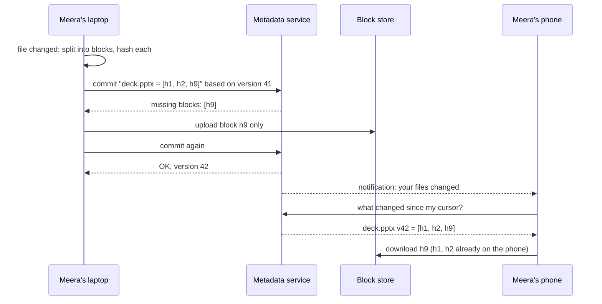

# Start Here: What Is a File Storage & Sync Service? (Before the Interview)

> You save a presentation on your laptop. Twenty minutes later you open it on your phone at the airport, and it's already there. On the flight you edit it offline; your colleague edits the same file from the office. When you land, both versions are safe. And when you change one slide in a 1 GB video project, the app uploads a few megabytes, not the whole gigabyte. That's Dropbox / Google Drive / OneDrive, and almost everything about it is a sync problem, not a storage problem.
>
> Time: ~15 minutes. Then: [L4](L4-mid.md) → [L5](L5-senior.md) → [L6](L6-staff.md). The single-machine version (paths, folders, permissions) is the [In-memory File System LLD](../../../LLD/interviews/file-system/README.md).

---

## 1. The story: one folder, every device

Meera is a designer. She has:
- A laptop with a `Dropbox/Clients/Acme` folder: 40 GB of images, videos and decks.
- A phone she uses to show work to clients.
- A shared folder with two colleagues who also edit files in it.

She expects:
1. **Anything she saves appears everywhere**, within seconds, without pressing "upload".
2. **Big files don't take forever:** changing one frame of a video shouldn't re-upload the whole thing.
3. **Nothing is ever lost:** not when two people edit at once, not when she deletes by mistake, not when a laptop dies.
4. **Offline works:** edits made on a plane sync when she lands.

What goes wrong with the naive version ("upload the whole file to a server whenever it changes, other devices download it"):
- A **1 GB file re-uploaded** for every small edit: hours on a home connection.
- **Two edits at once:** the second upload silently overwrites the first.
- **Polling** "has anything changed?" every few seconds from 100 million devices melts the servers.
- **The same file stored a million times** (everyone's copy of the same PDF or installer).

---

## 2. Where you've already seen it

| Where | What it does |
|---|---|
| **Dropbox, Google Drive, OneDrive, iCloud Drive** | Sync folders across devices, share, restore versions |
| **`rsync`** | Sync two directories, sending only changes ([rsync's rolling hash](../../../under-the-hood/rsync-rolling-hash.md)) |
| **Git** | Content-addressed storage, "who changed what", merge conflicts ([Git's object store](../../../under-the-hood/git-object-store.md)) |
| **`aws s3 sync`** | One-way sync to object storage (compares size/timestamps) |
| **Backup tools (restic, borg, Time Machine)** | Deduplicated, versioned copies |
| **At work** | Artifact repositories, config sync to many hosts, container image layers (pulled once, shared) |

---

## 3. The features, through situations

### 3.1 "It just appears on my phone" → upload, then notify other devices
Saving a file makes the desktop client upload it and record a new version in a **metadata** service. Every other device of Meera's learns "something changed" through a notification channel and downloads it. → L4 §4, §5.3.

💡 **Metadata:** data *about* files: names, folders, sizes, versions, who owns them, which blocks make up the content. Separate from the file bytes themselves.

### 3.2 "I changed one slide in a 1 GB file" → blocks and dedup
Files are split into **blocks** (e.g. 4 MB). Each block is named by the **hash** of its content. When a file changes, only blocks with new hashes are uploaded; the rest already exist on the server. The same mechanism stores a popular PDF once for everyone who has it. → [Chunking & block-level dedup](../../concepts/chunking-and-block-level-dedup.md), L4 §5.2.

💡 **Hash:** a short fingerprint computed from content; identical content always gives the same hash, and any change gives a different one.

### 3.3 "I inserted a paragraph at the start" → content-defined chunking
With fixed 4 MB blocks, inserting bytes at the start shifts every block boundary, so every block looks new. Choosing boundaries **based on the content itself** keeps most blocks unchanged. → [Content-defined chunking](../../../under-the-hood/content-defined-chunking.md), L5 §3.1.

### 3.4 "We both edited the budget sheet" → conflicts
Meera edits offline; Ravi edits the same file in the office. When Meera syncs, the service sees two changes based on the same old version. It can't merge a spreadsheet safely, so it keeps both: `budget.xlsx` and `budget (Meera's conflicted copy).xlsx`. → [File sync & conflict resolution](../../concepts/file-sync-and-conflict-resolution.md), L5 §3.2.

### 3.5 "I deleted the wrong folder" → versions and trash
Every save creates a new **version**; deletes go to a trash kept for 30+ days. Restoring is just pointing the file back at an older list of blocks. → L4 §5.4.

### 3.6 "Share this folder with the team" → sharing and permissions
A shared folder appears in each member's Dropbox; changes by anyone sync to all. Viewers can't edit; links can be password-protected or expire. → [Access control models](../../../LLD/concepts/access-control-models.md), L4 §5.5.

### 3.7 "Sync my 40 GB folder to a new laptop" → resumable transfers, LAN sync
Large uploads and downloads must resume after interruptions ([resumable uploads](../../concepts/resumable-and-chunked-uploads.md)), and a new laptop on the same office network can copy blocks from a colleague's machine instead of the internet. → L5 §3.6.

### 3.8 "Don't fill my phone" → selective sync and on-demand files
Phones and small laptops show the whole folder tree but download contents only when opened ("online-only files"). The metadata is everywhere; the bytes are fetched lazily. → L5 §3.6.

---

## 4. The key mechanism: metadata vs blocks



Two kinds of data, two kinds of storage:
- **Metadata** (small, many, transactional): which files exist, in which folders, at which version, made of which blocks. Lives in a database.
- **Blocks** (large, immutable, deduplicated): the actual bytes, addressed by hash. Live in object storage (or a custom store).

---

## 5. Try it yourself

- **Watch block sync:** in Dropbox's desktop app, add a large file, wait for it to sync, then append a few bytes and save. Watch how quickly the second sync finishes compared with the first.
- **Make a conflict:** open the same Dropbox/Drive file on two machines, take one offline, edit both, reconnect. Look for the "conflicted copy".
- **Version history:** right-click a file → *Version history* (Dropbox) or *Manage versions* (Drive).
- **rsync on your laptop** (only changes are sent):
  ```sh
  mkdir -p /tmp/a /tmp/b && head -c 50M /dev/urandom > /tmp/a/big.bin
  rsync -av --stats /tmp/a/ /tmp/b/              # first copy: all literal data
  printf 'x' | dd of=/tmp/a/big.bin bs=1 seek=1000000 conv=notrunc
  rsync -av --no-whole-file --stats /tmp/a/ /tmp/b/   # second: mostly "Matched data"
  ```
  (`--no-whole-file` forces the delta algorithm even for local copies.) Real output from running exactly this:
  ```text
  first sync:   Literal data: 52,428,800 bytes   Matched data: 0 bytes            Total bytes sent: 52,441,713
  after 1 byte: Literal data: 7,240 bytes        Matched data: 52,421,560 bytes   Total bytes sent: 36,329
  ```
  One changed byte in a 50 MB file: ~36 KB sent instead of 52 MB.

> Product experiments need the apps; the rsync commands run locally (output above is from a real run).

---

## 6. From experience to requirements

| What people experience | Requirement |
|---|---|
| Saved files appear on all devices in seconds | **F:** upload, commit versions, notify devices; **NF:** sync latency seconds |
| Small edits to big files sync fast | **F:** block-level upload of changed blocks only |
| Same file stored once | **F:** content-addressed dedup |
| Concurrent edits never silently lost | **F:** version check on commit; conflicted copies |
| Deleted files recoverable | **F:** versions, trash with retention |
| Share folders with permissions | **F:** shared namespaces, ACLs, links |
| Big transfers survive bad networks | **NF:** resumable, parallel block transfers |
| Never lose data | **NF:** extremely high durability (replication / erasure coding) |
| Millions of devices online | **NF:** scalable notifications, no polling storms |

---

## 7. Mini glossary

| Term | Plain meaning |
|---|---|
| Block / chunk | A piece of a file (e.g. 4 MB), stored and transferred separately |
| Content addressing | Naming data by the hash of its content |
| Dedup | Storing identical blocks once |
| Metadata service | The database of files, folders, versions and their blocks |
| Namespace | A tree of files with one owner or one shared folder; the unit of sync |
| Journal / cursor | An ordered list of changes per namespace / a device's position in it |
| Conflicted copy | A second file created when two edits can't be merged |
| Selective sync / online-only | Keeping some files' bytes off a device until opened |
| Durability | The probability that stored data is never lost |

➡️ Next: [README.md](README.md) · then [L4-mid.md](L4-mid.md)
