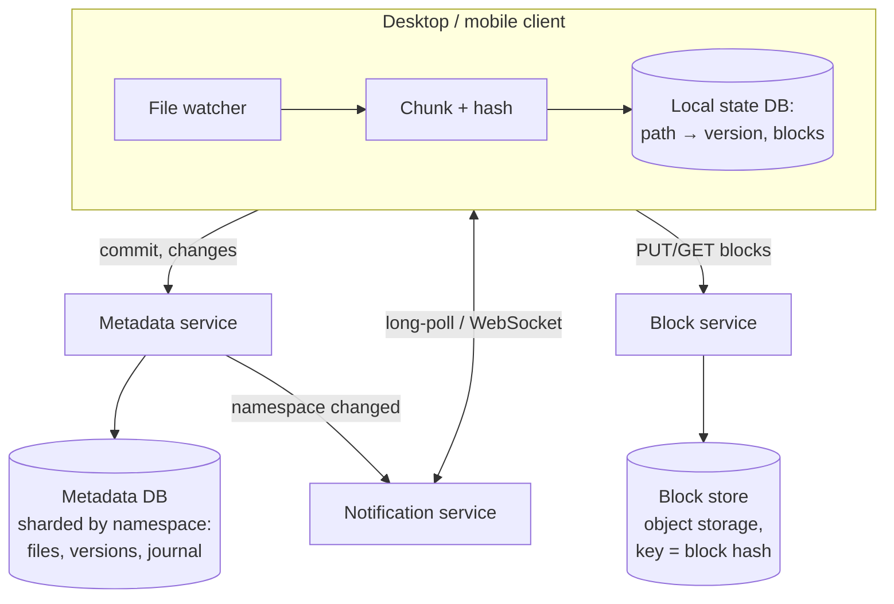

# File Storage & Sync (Dropbox / Google Drive) — L4 (Mid-level / SDE2) Interview

> **Level expectation:** split **metadata** from **blocks**, upload only the blocks the server doesn't have (content addressing, dedup), commit new file versions with an optimistic version check, notify other devices without polling storms, sync with a per-namespace change journal and a cursor, keep versions and a trash, and model sharing. Estimates should show why blocks and metadata need very different storage.

> 🆕 Read [00-understand-the-product.md](00-understand-the-product.md) first. Its sequence diagram (commit → missing blocks → upload → notify) is the core of this design.

Legend: **🧑‍💼 Interviewer** · **🧑‍💻 Candidate** · **📝 Note** = commentary for you.

---

## 1. Clarifying requirements

**🧑‍💼 Interviewer:** Design Dropbox.

**🧑‍💻 Candidate:** Questions:
- Core: a synced folder on desktop and mobile, plus web access? Sharing?
- File sizes: documents only, or multi-GB videos too?
- Do we need version history and deleted-file recovery? For how long?
- Real-time collaborative editing inside files (like Google Docs), or whole-file sync?
- Scale: users, devices, total storage?

**🧑‍💼 Interviewer:** Desktop and mobile sync plus web. Files up to 50 GB. Version history for 30 days. Whole-file sync, no co-editing inside files. 500M registered users, 100M daily active, a few devices each.

**🧑‍💻 Candidate:**

**Functional**
1. Upload, download, update, delete files; folders.
2. Automatic sync across a user's devices.
3. Sharing folders and files with permissions.
4. Version history and trash (30 days).

**Non-functional**
1. **Durability above everything:** never lose a file.
2. **Efficient transfers:** only send what changed; resume after failures.
3. **Sync latency:** changes visible on other online devices within seconds.
4. **Correctness:** concurrent edits never silently overwrite each other.
5. **Scale:** hundreds of millions of devices, exabyte-scale storage.

> 📝 **Note:** "Whole-file sync vs co-editing" is the clarification that separates this from the [Collaborative Editor](../collaborative-editor/README.md). Here a conflict means "two versions of a file", not merged characters.

---

## 2. Back-of-the-envelope estimates

(Method: [back-of-the-envelope](../../concepts/back-of-the-envelope.md).)

| What | Calculation | Result |
|---|---|---|
| Logical data | 500M users × ~2 GB average used | **~1 EB** (1,000 PB) |
| After dedup | assume ~30% of blocks are duplicates across users/versions | ~700 PB |
| Raw with redundancy | erasure coding at ~1.5× overhead (vs 3× for triple replication) | **~1 EB raw** |
| File changes | 100M DAU × ~10 changed files/day | **1B changes/day ≈ 11.6k commits/s** average |
| Upload volume | assume ~1 MB of *new* blocks per change after dedup | 1B × 1 MB = **~1 PB/day** in |
| Metadata entries | 500M users × ~2,000 files | **~1 trillion file entries** |
| Metadata size | 1T × ~300 bytes (path, version, block list pointer, owner) | **~300 TB** |
| Connected devices | 100M DAU × ~2 devices online | **~200M long-lived connections** |

**🧑‍💻 Candidate:** Takeaways:
- **Blocks: huge, immutable, write-once** → object storage, deduplicated by hash.
- **Metadata: 300 TB of small rows** needing transactions (a commit must atomically check the version and update the file) → a sharded relational database.
- **200M connected devices:** notifications must be pushed over cheap long-lived connections, not polled.

---

## 3. API

```http
# 1. Ask which blocks are missing (client already split the file and hashed each 4 MB block)
POST /v1/files/commit
{ "namespaceId": "ns_42", "path": "/Clients/Acme/deck.pptx",
  "parentVersion": 41, "blocks": ["h1","h2","h9"], "size": 9_437_184 }
→ 409 { "missingBlocks": ["h9"] }                    # or 409 conflict: parentVersion is stale

# 2. Upload missing blocks (idempotent: same hash = same content)
PUT  /v1/blocks/h9              body: 4 MB of bytes

# 3. Commit again
POST /v1/files/commit  (same body)  → 200 { "version": 42 }

# Sync
GET  /v1/changes?namespaceId=ns_42&cursor=c_9001&limit=1000
→ { "entries": [ {path, version, blocks, deleted}, ... ], "cursor": "c_9105", "hasMore": false }
GET  /v1/notify?cursor=c_9105   # long-poll: returns when something changed, or after ~60 s
GET  /v1/blocks/{hash}
```

- Block upload is **idempotent by construction**: the hash *is* the name, so uploading it twice stores it once ([idempotency](../../concepts/idempotency-and-delivery-semantics.md)).
- `parentVersion` makes commits **optimistic**: "update this file only if it's still at version 41" ([optimistic locking](../../../LLD/concepts/optimistic-vs-pessimistic-locking.md)).

---

## 4. High-level design



**🧑‍💻 Candidate:**
- **Client** watches the folder, splits changed files into blocks, hashes them, and keeps a local database of what it believes the server has.
- **Metadata service**: files, folders, versions, block lists, sharing, and an append-only **journal** of changes per namespace.
- **Block service** in front of [object storage](../../technologies/object-storage.md): stores blocks under their hash.
- **Notification service**: tells online devices "namespace X changed"; the device then pulls the details.

---

## 5. Deep dives

### 5.1 The upload flow, step by step

1. The watcher sees `deck.pptx` changed. The client splits it into 4 MB blocks and computes SHA-256 of each.
2. It **commits** the new block list with `parentVersion = 41`.
3. The server checks the version (still 41?) and which hashes it doesn't have; it replies with the missing ones.
4. The client uploads just those blocks (several in parallel; each retried independently; see [resumable uploads](../../concepts/resumable-and-chunked-uploads.md)).
5. The client commits again; the server writes version 42 **and** a journal entry in one transaction, then notifies.

Why "commit first, then upload missing": if every block already exists (a file copied or reverted), nothing is uploaded at all.

### 5.2 Blocks and dedup

**🧑‍💻 Candidate:** ([Chunking & block-level dedup](../../concepts/chunking-and-block-level-dedup.md), [content fingerprinting](../../concepts/content-fingerprinting-and-dedup.md).)
- **Block size trade-off:** 4 MB means a 1 GB file is 1,000 MB ÷ 4 MB = **250 blocks**; a one-byte edit re-uploads 4 MB instead of 1 GB. Smaller blocks dedup better but mean more metadata and more requests.
- **Content addressing:** the block's key is `SHA-256(content)`, so identical blocks from different files, versions or users are stored once.
- **Integrity for free:** the server can verify every uploaded block by re-hashing it, and clients verify every download the same way. (Same idea as [Git's object store](../../../under-the-hood/git-object-store.md).)

### 5.3 Sync: journal, cursor, notifications

**🧑‍💻 Candidate:** Each namespace (a user's root folder, or a shared folder) has an **append-only journal**: every commit, rename and delete gets the next sequence number ([message ordering & sequencing](../../concepts/message-ordering-and-sequencing.md)).
- A device stores a **cursor**: "I've applied everything up to entry 9,105 in namespace 42".
- To sync, it asks `changes since cursor`, applies them (downloading missing blocks), saves the new cursor.
- To avoid polling, it keeps a **long-poll** (or WebSocket) to the notification service, which answers only when its namespaces change. Then the device pulls changes.

💡 **Long-poll:** an HTTP request the server holds open until there's something to say (or a timeout), then the client immediately opens another. Cheap with event-loop servers ([epoll](../../../under-the-hood/epoll.md)).

This is the same "sync since sequence N" pattern as chat ([chat sequencer](../../../see-it-work/chat-sequencer-sync/README.md)).

### 5.4 Versions, deletes and the trash

- A file **version** is just a row: (namespace, path, version, block list, size, author, time). Old versions keep pointing at their blocks.
- **Restore** = commit a new version whose block list equals an old one. No bytes move.
- **Delete** = a journal entry marking the path deleted (a tombstone); the file appears in the trash for 30 days.
- After 30 days, versions are purged and blocks no longer referenced by any version become **garbage** (L5 §3.4).

### 5.5 Sharing

- A **shared folder** is its own namespace with a member list and roles (owner, editor, viewer). It's mounted into each member's tree, so their devices sync its journal too.
- Permission checks on every commit and download ([access control models](../../../LLD/concepts/access-control-models.md)).
- **Share links**: an unguessable token granting read access to one file or folder, optionally expiring or password-protected.

---

## 6. Follow-ups

**🧑‍💼 Interviewer:** Why not let the metadata service also store the bytes?

**🧑‍💻 Candidate:** Completely different workloads: metadata is small, transactional, query-heavy; blocks are huge, immutable, and only fetched by key. Keeping them apart lets each scale on the right storage. It also keeps the metadata DB small enough to shard and back up sensibly.

**🧑‍💼 Interviewer:** Two devices commit the same file at the same time.

**🧑‍💻 Candidate:** Both send `parentVersion = 41`. The metadata DB applies one (version 42); the other's conditional update fails with a conflict. That client must download v42 and decide: if it can't merge, it saves its own as a "conflicted copy" (L5 §3.2). Nothing is lost, nothing is overwritten silently.

**🧑‍💼 Interviewer:** How do you handle a 50 GB upload?

**🧑‍💻 Candidate:** It's 50,000 MB ÷ 4 MB = 12,500 blocks. Upload in parallel, each block retried independently, progress saved locally so a restart resumes. Commit only when all blocks are present; until then other devices don't see a half file.

---

## 7. What the interviewer was evaluating (L4)

- [ ] Clarified whole-file sync vs co-editing, sizes, history, scale
- [ ] Estimates separating exabyte blocks from terabyte metadata and 200M connections
- [ ] Metadata vs blocks split; content-addressed, deduplicated blocks
- [ ] Commit-then-upload-missing flow with an optimistic version check
- [ ] Journal + cursor sync, long-poll notifications instead of polling
- [ ] Versions as block lists; restore without moving bytes; trash with tombstones
- [ ] Shared folders as namespaces; permission checks

## 8. Common mistakes at this level

| Mistake | Why it hurts |
|---|---|
| Re-uploading whole files on change | Hours per edit for big files; massive bandwidth |
| Last write wins on commit | Silently loses a colleague's edit |
| Devices polling every few seconds | Hundreds of millions of useless requests |
| Storing bytes in the metadata DB | Impossible to scale or back up |
| Comparing timestamps to decide what changed | Clocks differ across devices; use versions and hashes |
| Deleting blocks as soon as a file is deleted | Breaks versions, trash and other files sharing the block |

➡️ Next: [L5-senior.md](L5-senior.md)
