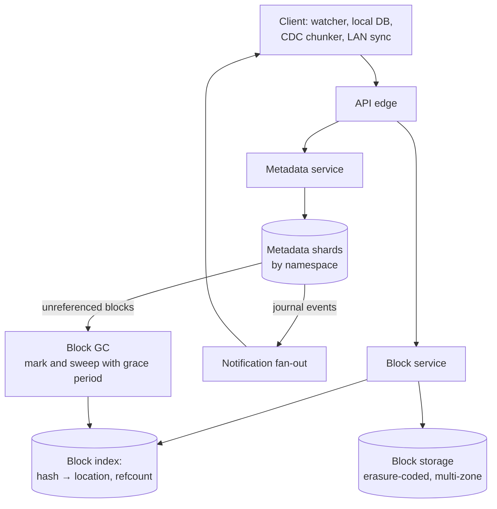

# File Storage & Sync (Dropbox / Google Drive) — L5 (Senior) Interview

> **Level expectation:** the L4 split (metadata vs content-addressed blocks, commit-then-upload, journal + cursor, long-poll) is assumed. Now the hard parts: **better chunking** for insertions, **correct conflict detection** with a base version, **scaling metadata** by namespace, **garbage-collecting blocks** safely, **durability** at exabyte scale, notifications for 200M devices, and the **client** (watchers, online-only files, LAN sync). Read [L4-mid.md](L4-mid.md) first.

Legend: **🧑‍💼 Interviewer** · **🧑‍💻 Candidate** · **📝 Note** = commentary for you.

---

## 1. Requirements (sharpened)

Same as L4, plus:
- Inserting data at the start of a large file shouldn't re-upload it.
- Offline edits on several devices must merge or conflict correctly, never silently lose work.
- Shared folders with 10,000 members and millions of files.
- 11 nines of durability for blocks (lose at most one block in 100 billion per year).

---

## 2. Architecture (what changes from L4)

---

## 3. Deep dives

### 3.1 Insert at the front: content-defined chunking and deltas

**🧑‍💻 Candidate:** With fixed 4 MB blocks, inserting 10 bytes at the start of a 1 GB file shifts every boundary: all 250 blocks get new hashes and the whole file is re-uploaded. Two fixes:
- **Content-defined chunking (CDC):** cut a block where a rolling hash of the last ~48 bytes matches a pattern (e.g. low 22 bits are zero → average ~4 MB). Boundaries depend on content, so after an insertion they **resynchronise** right after the edit; only one or two blocks change ([content-defined chunking](../../../under-the-hood/content-defined-chunking.md)).
- **Delta sync inside a block:** for a changed block, send only the difference against the old block (rsync-style rolling checksums, [rsync's rolling hash](../../../under-the-hood/rsync-rolling-hash.md)), so a 1-byte edit sends a few KB, not 4 MB.

Trade-off: CDC gives variable block sizes (bounded min/max) and costs CPU on the client; delta sync needs the old block on both sides.

### 3.2 Conflicts: three versions, not two

**🧑‍💼 Interviewer:** Meera edits offline; Ravi edits the same file online. Meera reconnects. What decides "conflict" vs "just a newer version"?

**🧑‍💻 Candidate:** Compare three states ([file sync & conflict resolution](../../concepts/file-sync-and-conflict-resolution.md)):
- **Base:** the version Meera's device last synced (v41), remembered in its local DB.
- **Local:** Meera's file now.
- **Remote:** the server's latest (v43, Ravi's edit).

| Local vs base | Remote vs base | Result |
|---|---|---|
| unchanged | changed | Download remote (fast-forward) |
| changed | unchanged | Upload local as v42 |
| changed | changed, **same content** | Nothing to do |
| changed | changed, different | **Conflict:** keep remote as the file, save local as "Meera's conflicted copy" |

The server enforces this with the commit's `parentVersion`: Meera's commit says "based on v41", the file is at v43, so it's rejected and the client resolves. **Never use modification timestamps** to pick a winner: device clocks drift, and a laptop with a wrong clock would overwrite newer work ([vector clocks & conflicts](../../concepts/vector-clocks-and-conflict-resolution.md)).

Renames and moves are journal entries too: a rename on one device and an edit on another must both apply (edit the file at its new path), which is why the client tracks files by a stable **file ID**, not just by path.

### 3.3 Scaling metadata: shard by namespace

- **Shard key = namespace ID** (a user's root or a shared folder). All files, versions and the journal of one namespace live on one shard, so a commit (check version + write version + append journal) is a **single-shard transaction** ([sharding & replication](../../concepts/sharding-and-replication.md)).
- **Moving a file between namespaces** (from your folder into a shared folder) touches two shards: do it as a copy-then-delete with an idempotent operation ID, or a small cross-shard transaction; it's rare, so it can be slower.
- **Hot shared folders** (a company-wide folder with 10,000 members): one namespace, one shard, many readers. Serve the journal from read replicas and caches; writes stay on the primary.
- **Very large namespaces** (millions of files): paginate `changes since cursor`; a brand-new device gets a **snapshot** of the tree at a version first, then the journal after it.

### 3.4 Blocks: durability and garbage collection

**Durability:** at ~1 EB, disks fail every day. Erasure coding stores data as, say, 6 data + 3 parity fragments across different machines/zones: any 6 of 9 rebuild the block, at 9 ÷ 6 = **1.5× storage** instead of 3× for triple replication. Background **scrubbing** re-reads data to catch silent corruption (checksums), and lost fragments are rebuilt from the others.

**Garbage collection:** a block may be referenced by many file versions across many users. When can it be deleted?
- **Reference counting** (increment on commit, decrement on purge) is fast but fragile: a missed decrement leaks storage; an extra one deletes live data.
- **Mark and sweep:** periodically mark every block referenced by any live version, then delete unmarked blocks. Slower but self-correcting.
- **The race:** a client uploads block `h9` but hasn't committed yet; a sweep sees `h9` unreferenced and deletes it; the commit then points at a missing block. Fix: **grace period**: never delete blocks younger than, say, 7 days, and re-check references at deletion time.

In practice: refcounts for speed, plus periodic mark-and-sweep audits to correct drift.

### 3.5 Notifications for 200M devices

- Devices hold one long-lived connection each to a notification tier of event-loop servers (~200M ÷ ~500k per server ≈ 400 servers, plus headroom).
- The tier keeps **namespace → connected devices** subscriptions in memory, sharded by namespace.
- A commit publishes "namespace 42 changed to journal position 9,106" (via [Kafka](../../technologies/kafka.md) or a pub/sub layer); the tier pings subscribed devices; each device pulls changes with its cursor.
- Notifications carry **no data**, only "something changed". Losing one is harmless: the device also re-checks on reconnect and periodically.

### 3.6 The client is half the system

- **File watchers** (inotify on Linux, FSEvents on macOS, ReadDirectoryChangesW on Windows) report changes, but can overflow or miss events, so the client also does periodic full scans comparing size/mtime/inode to its local DB.
- **Local DB** (e.g. SQLite): path → file ID, base version, block hashes. It's how the client knows "base" for conflicts.
- **Don't upload half-written files:** wait until a file stops changing for a moment; hash the version you upload.
- **Online-only files:** the client shows placeholders and fetches blocks when a file is opened (OS-level placeholder APIs exist on Windows and macOS).
- **LAN sync:** devices on the same network advertise which blocks they have; a new laptop fetches blocks from a colleague's machine instead of the internet.
- **Throttling:** bandwidth limits, pause on metered networks, and backoff when the server is overloaded ([retries & backoff](../../concepts/retries-backoff-and-dlq.md)).

### 3.7 Security and the dedup privacy trap

- Blocks encrypted at rest with keys managed per storage cluster; TLS in transit.
- **Cross-user dedup leaks information:** if uploading a file is instant because "the server already has these blocks", an attacker can test whether *anyone* has a specific file (a confirmation-of-file attack). Mitigations: dedup only within a user/team, or always perform the upload work for blocks not in *your* namespace.
- **End-to-end encryption** (client-side keys) makes cross-user dedup impossible and disables server-side previews and search: a product trade-off ([end-to-end encryption](../../concepts/end-to-end-encryption.md)).

---

## 4. Failure modes

| Failure | Behaviour | Mitigation |
|---|---|---|
| Upload interrupted | Some blocks uploaded, no commit | Resume missing blocks; commit when complete; GC grace period protects uploaded blocks |
| Two devices commit concurrently | One commit rejected | parentVersion check → conflict resolution on the client |
| Watcher missed events | Local change not synced | Periodic rescans against the local DB |
| Notification lost | Device unaware of change | Re-check on reconnect and on a timer |
| Disk / server / zone lost | Fragments missing | Erasure coding across zones; rebuild in background |
| GC bug | Live blocks deleted | Mark-and-sweep audits, grace periods, soft-delete of blocks before final removal |
| Clock skew on a device | Wrong "newer" decision | Never use mtimes for conflict decisions; versions and hashes only |

---

## 5. Follow-ups

**🧑‍💼 Interviewer:** Why not merge conflicting edits automatically like Google Docs?

**🧑‍💻 Candidate:** We don't understand most file formats (binary, compressed, proprietary). A wrong merge corrupts the file. For whole-file sync, keeping both copies is the safe default; apps that want merging (Docs, Figma) use their own collaboration protocol ([Collaborative Editor](../collaborative-editor/README.md)).

**🧑‍💼 Interviewer:** A user moves a folder with 200,000 files.

**🧑‍💻 Candidate:** Within one namespace that's a **single metadata operation** if files reference their parent folder by ID (the tree), not by full path: rename one folder row, append one journal entry. Devices apply the move locally (a local rename) without downloading anything. Storing full paths on every file would turn it into 200,000 row updates. Same lesson as the [In-memory File System](../../../LLD/interviews/file-system/README.md).

---

## 6. What the interviewer was evaluating (L5)

- [ ] Fixed vs content-defined chunking and in-block deltas, with the insertion example
- [ ] Three-way comparison (base/local/remote) and conflicted copies; no timestamps
- [ ] Stable file IDs so renames and edits compose
- [ ] Namespace sharding with single-shard commit transactions; hot shared folders
- [ ] Erasure coding arithmetic; refcount vs mark-and-sweep GC and the upload race
- [ ] Notification tier sized and data-free; pull after notify
- [ ] Client realities: watchers + rescans, local DB, online-only files, LAN sync
- [ ] Dedup privacy trade-off

## 7. Common mistakes at this level

| Mistake | Why it hurts at L5 |
|---|---|
| Fixed-size blocks only | Insertions re-upload whole files |
| Two-way comparison (local vs remote) | Can't tell "they changed it" from "both changed it" |
| Full paths as the identity of files | Folder moves become millions of updates; renames + edits conflict |
| Refcount-only GC with no audit | Leaks or deletes live data on bugs |
| Pushing file contents in notifications | Huge fan-out; notifications should only say "go pull" |
| Trusting file watchers completely | Missed events = files that never sync |

⬅️ Previous: [L4-mid.md](L4-mid.md) · ➡️ Next: [L6-staff.md](L6-staff.md)
