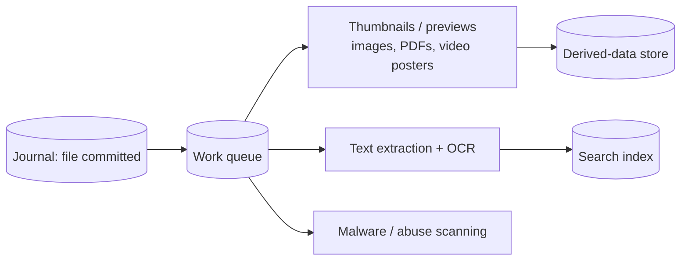

# File Storage & Sync (Dropbox / Google Drive) — L6 (Staff) Interview

> **Level expectation:** the L5 mechanics (CDC, three-way conflicts, namespace sharding, erasure coding, safe GC) are known. The staff conversation is about **storage economics and owning your storage**, **correctness of the sync engine** (where bugs mean lost files), **ransomware and recovery**, compliance and residency, the **derived-data pipeline** (previews, search, thumbnails), abuse, and build vs buy. Read [L5-senior.md](L5-senior.md) first.

Legend: **🧑‍💼 Interviewer** · **🧑‍💻 Candidate** · **📝 Note** = commentary for you.

---

## 1. Storage is the business: buy or build?

**🧑‍💼 Interviewer:** Our storage bill on a public cloud is our largest cost. Should we build our own storage?

**🧑‍💻 Candidate:** Do the arithmetic first (prices are **assumptions** for illustration only):

```text
~700 PB after dedup (L4)
Cloud object storage at an assumed $0.010 per GB-month (heavily negotiated, mixed tiers):
  700,000,000 GB × $0.010 = $7M per month ≈ $84M per year
Own storage: hardware + data centre + power + a large storage team
  must come out meaningfully cheaper over 4–5 years, AND match durability and operability
```

Considerations:
- **Scale threshold:** owning storage only pays at hundreds of petabytes with predictable growth. Below that, the team and data-centre costs dominate.
- **Workload fit:** sync storage is write-once, read-rarely for most blocks (old versions, cold files): ideal for dense, erasure-coded custom storage.
- **Risk:** you now own durability. Years of testing, scrubbing, and verification before trusting it with user data; migrate gradually with dual-writes and verification.
- 🟡 Dropbox publicly described moving most of its user data from Amazon S3 to its own storage system, **Magic Pocket**, around **2016**, as the canonical example of this decision.

> 📝 **Note:** "Build when the numbers and the workload say so, then migrate with verification" is the staff answer. Saying "build our own" without the cost model is a red flag.

---

## 2. The sync engine: where bugs lose people's files

**🧑‍💻 Candidate:** The client sync engine is the riskiest code in the product: it runs on hundreds of millions of machines with flaky disks, clocks, networks and file systems, and a bug can delete or overwrite user data at scale. How to make it trustworthy:
- **Model it as a state machine** with three trees (remote, local, synced base; L5 §3.2) and explicit operations; avoid ad-hoc handling of events.
- **Randomized testing:** simulate many clients, a server, random file operations, crashes, network partitions and clock skew in one deterministic process; check invariants (no data loss, all replicas converge, no conflicted copies when there was no real conflict). Replay any failing seed. 🟡 Dropbox wrote publicly (around 2020) about rewriting its sync engine ("Nucleus") with this kind of deterministic testing in mind ([file sync & conflict resolution](../../concepts/file-sync-and-conflict-resolution.md)).
- **Staged rollout** of client versions with telemetry on sync errors, conflicts created and files deleted; kill switch for risky behaviours (e.g. mass deletes).
- **Safety rails:** a client deleting more than N files at once asks the user or gets throttled server-side; deletions always go to the trash first.

This is the same discipline as testing collaborative editors ([Collaborative Editor L6 §3](../collaborative-editor/L6-staff.md#3-verifying-correctness-of-algorithms-that-fail-silently)) and databases ([Distributed KV Store L6 §5](../distributed-kv-store/L6-staff.md#5-how-do-you-know-its-correct)).

---

## 3. Ransomware and mass recovery

**🧑‍💼 Interviewer:** Ransomware encrypts every file on a customer's laptop. Sync uploads the encrypted versions everywhere.

**🧑‍💻 Candidate:** Sync faithfully spreads the damage, so recovery must be built in:
- **Versions are the backup:** every encrypted file is a new version; the previous versions still exist (L4 §5.4).
- **Detection:** a sudden burst of rewrites with high-entropy content (encrypted data looks random) and renamed extensions across thousands of files → alert the user/admin, optionally pause sync for that device.
- **Point-in-time restore:** "rewind this folder/namespace to yesterday 10:00" = for each file, commit the version that was current at that time. Because versions are just block lists, this is a metadata operation, no bytes copied.
- **Retention:** keep versions long enough (30–180 days depending on plan) for this to work; legal hold can freeze deletion entirely.

---

## 4. Compliance, residency and enterprise

- **Data residency:** some customers require files stored in a specific region. Namespaces carry a home region; their blocks and metadata live there. Cross-region dedup is disabled for them.
- **Retention policies and legal hold:** never purge versions under hold; deletion only after policy expiry; auditable.
- **Audit logs:** who viewed, downloaded, shared, deleted what, for enterprise admins.
- **Customer-managed keys:** blocks encrypted with keys the customer can revoke (revoking makes their data unreadable to the service).
- **Admin controls:** device approval, remote wipe of the local folder on a lost laptop, sharing restrictions outside the organisation ([access control models](../../../LLD/concepts/access-control-models.md)).

---

## 5. Derived data: previews, thumbnails, search

Every commit can trigger asynchronous work, none of it on the sync path:



- Derived data is **recomputable**: if lost or if the algorithm improves, regenerate from blocks. Store it separately with cheaper durability.
- Prioritise recently active files; lazily generate previews for old ones when first viewed.
- Search respects permissions at query time (filter results by what the user can access), the same problem as enterprise search ([inverted index](../../concepts/inverted-index.md)).

---

## 6. Abuse

- Free storage plus public links attracts malware hosting and illegal content. Scan new public links and popular files against known-bad hash lists and malware scanners; rate-limit link traffic; fast takedown tooling.
- Quotas and per-account upload rate limits stop the service being used as free bulk storage or a CDN ([rate limiter](../../../LLD/interviews/rate-limiter/README.md)).

---

## 7. Build vs buy

| Option | When |
|---|---|
| **Use an existing product** (Google Drive, OneDrive, Dropbox, Box) | Internal company needs: almost always |
| **Object storage + an existing sync tool** (rclone, Syncthing, Nextcloud) | Self-hosted or niche needs |
| **Build the product on cloud object storage** | Sync is your product; storage is bought |
| **Build the storage too** | Only at hundreds of PB with a cost model that clearly pays (§1) |

---

## 8. Curveballs

**🧑‍💼 Interviewer:** A bug in a client release starts creating thousands of conflicted copies per user.

**🧑‍💻 Candidate:** Halt the rollout (staged rollouts make this a small percentage), push a kill switch disabling the faulty behaviour, then clean up: conflicted copies are new files whose content duplicates an existing version (same block list), so a server-side job can identify and trash the spurious ones safely. Post-incident: add the scenario to the randomized test suite and an alert on "conflicted copies per active device".

**🧑‍💼 Interviewer:** Why not make every block 64 KB for perfect dedup?

**🧑‍💻 Candidate:** 1 EB ÷ 64 KB ≈ 16 trillion blocks, each needing an index entry (hash + location + refcount ≈ 64 bytes): about 1 PB of block index alone, plus far more requests per file. Block size balances dedup ratio against metadata and request overhead; content-defined chunking with a few-MB average gets most of the benefit.

---

## 9. What the interviewer was evaluating (L6)

- [ ] Storage build-vs-buy with a cost model, workload fit and migration risk
- [ ] Sync engine correctness: state model, deterministic randomized tests, staged rollout, safety rails
- [ ] Ransomware: detection and point-in-time restore via versions
- [ ] Residency, retention, legal hold, audit, customer-managed keys
- [ ] Derived-data pipeline off the sync path; permission-aware search
- [ ] Abuse handling; block-size arithmetic at exabyte scale

## 10. Common mistakes at this level

| Mistake | Why it hurts at L6 |
|---|---|
| "We'll build our own storage" with no numbers | Years of risk without proven savings |
| Treating the client as a thin uploader | The client is where data-loss bugs live |
| No mass-restore path | Ransomware turns sync into a weapon |
| Generating previews/search synchronously on commit | Sync latency tied to slow, optional work |
| Tiny blocks "for better dedup" | Index and request overhead explode |

⬅️ Previous: [L5-senior.md](L5-senior.md) · 🏠 [Problem overview](README.md)
