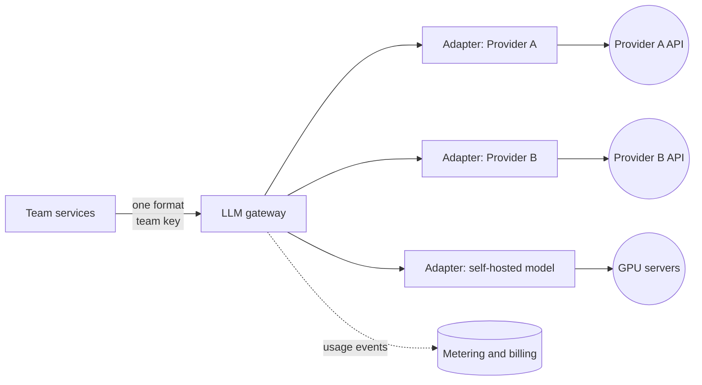

# Start Here: What Is an LLM Gateway? (Before the Interview)

> Every team in your company now wants to call an AI model (an **LLM**, large language model, the thing behind ChatGPT or Claude) from its product. If each team signs up with a provider on its own, you get leaked keys, a surprise bill and an outage nobody can route around. An **LLM gateway** is one internal endpoint all teams call instead. It checks who you are, limits and meters usage, caches, retries, fails over and logs. It is the [API gateway](../api-gateway/README.md) idea, with three twists: calls are slow, billed by size, and streamed.
>
> Time: ~12 minutes. Then: [L4](L4-mid.md) → [L5](L5-senior.md) → [L6](L6-staff.md).

---

## 1. The story: "Why is the AI bill 6x what we planned?"

A 200-engineer company, three months after the AI push:
- **Week 2:** the search team puts a provider API key in a config file. It lands in a public repo. Someone mines it; a spike of calls appears on the invoice.
- **Week 5:** the support team's chatbot loops: a bug retries a failed call 20 times, and each retry is billed. Nobody notices until the month-end invoice.
- **Week 8:** the provider has a two-hour outage. Four teams each build their own "switch to another provider" code at 2 a.m. Three of them get it wrong.
- **Week 10:** finance asks "which team spent what?" Nobody knows: all calls share one company key.
- **Week 11:** security asks "did anyone paste customer phone numbers into prompts?" Nobody knows: there are no logs.

Each is an interview question: key management, budgets, retries that cost money, failover, metering, safe logging. Same pain as when every service called the database directly and you introduced a connection pool/proxy: one controlled doorway.

---

## 2. Where you've already seen it

| Where | What you saw |
|---|---|
| **At work: API gateway / service mesh** | One entry point doing auth, rate limits, routing, metrics ([API gateway](../api-gateway/README.md)) |
| **Cloud billing** | Per-team cost tags, budgets and alerts ("you have used 80% of your budget") |
| **Open-source gateways** | Projects such as LiteLLM (🟡 an open-source proxy that gives many providers one OpenAI-style API) and cloud-vendor "AI gateway" products exist; reading their docs shows the feature list |
| **Payments** | A card "hold" first, final charge later: the same trick used to reserve tokens (L4 §5.3) |

---

## 3. The words you need first

> 💡 **Token.** The unit an LLM reads and writes: a chunk of text, roughly ¾ of an English word (rule of thumb; varies by model and language). "Hello world" is about 2 tokens. Providers count and bill tokens, not requests.
> **Input vs output tokens.** Input = your prompt (instructions + context + question). Output = the model's answer. Output tokens usually cost several times more than input tokens, because each is generated one at a time.
> **Context window.** The maximum tokens (input + output) a model can handle in one call, for example tens of thousands up to a million depending on the model 🟡. A long chat history or pasted document eats it.
> **Streaming (SSE).** Instead of waiting 10 s for the full answer, the server sends tokens as they are produced over one long-lived HTTP response, using Server-Sent Events: a plain HTTP response that stays open and delivers `data: ...` lines ([WebSockets and SSE](../../technologies/websockets-and-sse.md)).
> **Rate limit (429).** The provider's own cap, in requests/min and tokens/min, per account. Exceeding it returns HTTP 429 "Too Many Requests".

---

## 4. The features, through situations

### 4.1 "Which team is calling?" → auth with per-team keys
Teams get gateway keys, never provider keys. Leaked key? Revoke one team's key. → L4 §5.1.

### 4.2 "One chatbot sent a 90,000-token document 50 times in a minute" → limits in tokens, not just requests
Requests per minute treats a 20-token call and a 90,000-token call the same. We need a tokens-per-minute limit too. → L4 §5.3 ([rate limiter](../../../LLD/interviews/rate-limiter/README.md)).

### 4.3 "Answers appear word by word" → streaming pass-through
Users stare at a blank screen for 10 s otherwise. The gateway must forward chunks as they arrive, not buffer. → L4 §5.4.

### 4.4 "The retry loop cost us ₹40,000" → retries that cost money
A timed-out call may still have been billed and completed. → L4 §5.5, [idempotency](../../concepts/idempotency-and-delivery-semantics.md).

### 4.5 "Stop team X at its monthly budget" → spend counters and caps
Soft cap = warn; hard cap = block. Needs near-real-time spend. → L5 §3.1.

### 4.6 "People ask the same question all day" → caching
Exact-match cache is safe; **semantic** cache (similar meaning counts as a hit) saves more but can return a wrong answer. → L5 §3.2.

### 4.7 "Provider is down / throttling us" → failover and fallback
Switch provider or a cheaper model, with circuit breakers; queue and shed load when everyone is throttled. → L5 §3.3–3.4.

### 4.8 "Did someone paste Aadhaar numbers into a prompt?" → guardrails and safe logging
Redact secrets/PII (personal data), detect prompt injection, log with retention rules. → L5 §3.6–3.7.

### 4.9 "Our contract says EU data stays in the EU" → residency, self-hosting, governance
→ L6.

---

## 5. The key mechanism in plain words

The gateway speaks **one** request format to all teams (commonly the shape of the "chat completions" API that many providers and open-source servers copy). Behind it, per-provider **adapters** translate to each provider's real API.



Two things make it different from a normal API gateway:
1. **Latency is seconds, not milliseconds.** The model generates tokens one by one (roughly tens of tokens per second 🟡), so a 500-token answer takes several seconds. Connections stay open for a long time, so you hold many more concurrent connections than request-rate suggests (Little's law: concurrent = rate × duration).
2. **Cost scales with size.** Requests are not equal; tokens are the currency.

---

## 6. Try it yourself

- Read a provider's public API docs for its "chat" or "messages" endpoint: request fields (model, messages, max tokens, `stream`), the `usage` block in the response (input and output token counts) and the rate-limit headers. Shape of a call (placeholder key, do not paste real keys into shells you share):

```bash
curl https://api.example-provider.com/v1/chat/completions \
  -H "Authorization: Bearer $PROVIDER_API_KEY" \
  -H "Content-Type: application/json" \
  -d '{"model":"some-model","messages":[{"role":"user","content":"Say hi"}],"stream":true}'
```
  (`api.example-provider.com` is a placeholder; use the host and path from your provider's docs. Paths and field names differ by provider 🟡.)
- Add `"stream": true` and watch `data:` lines arrive one by one: that is SSE.
- Skim an open-source gateway's README (LiteLLM is one 🟡) and list which of the §4 features it has. Do not build a toy gateway here; the interview is about the design.

---

## 7. Experience → requirements

| What users and owners experience | Functional requirement | Non-functional requirement |
|---|---|---|
| "Use one endpoint, no provider keys" | Per-team auth; provider adapters | Gateway adds little overhead (tens of ms, excluding model time) |
| "Don't let one team starve others" | Limits in requests/min and tokens/min | Fair under bursts; limiter available even if one node dies |
| "Answers stream" | Streaming pass-through | Low time to first token (TTFT) overhead |
| "Know and cap spend" | Usage metering, budgets, caps | Counters fresh within seconds; billing exact |
| "Survive provider outages" | Failover, model fallback, retries | Gateway availability higher than any single provider |
| "Cheaper repeats" | Exact and semantic cache | Never return another tenant's cached answer |
| "Safe by default" | Redaction, guardrails, audit logs | Logs encrypted, access-controlled, retention-limited |

---

## 8. Mini glossary

| Term | Meaning |
|---|---|
| **LLM** | Large language model: text in, text out |
| **Token** | Billing unit, about ¾ of a word |
| **Context window** | Max tokens per call (input + output) |
| **TTFT** | Time to first token: delay before the first streamed word |
| **TPM / RPM** | Tokens per minute / requests per minute limits |
| **SSE** | Server-Sent Events: streaming over a normal HTTP response |
| **Adapter** | Code translating the gateway's format to one provider's API |
| **Semantic cache** | Cache keyed by meaning (embedding similarity), not exact text |
| **Fallback** | Switching to another model or provider when the first fails |
| **Chargeback** | Billing each team for what it used |
| **PII** | Personally identifiable information (phone, email, ID numbers) |
| **Prompt injection** | Text in the input that tries to override the model's instructions |
