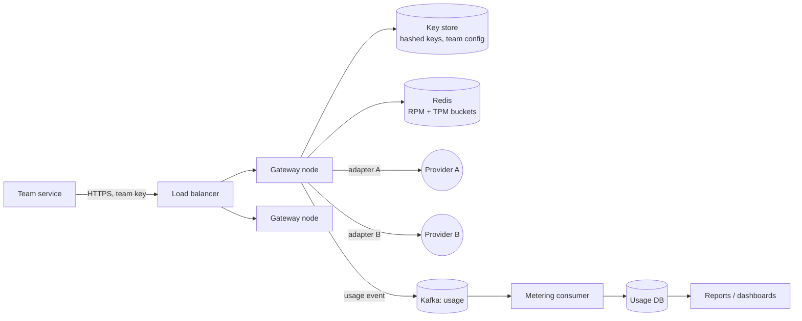

# LLM Gateway — L4 (Mid-level / SDE2) Interview

> **Level expectation:** a working gateway:
> - one OpenAI-style endpoint, per-team keys, provider adapters;
> - rate limits in requests/min **and** tokens/min;
> - usage metering to a database;
> - streaming passed through, not buffered;
> - sensible timeouts and retries, knowing that retries cost money.
>
> Budgets, caches, failover and guardrails are L5; residency, self-hosting and governance are L6.

> 🆕 Read [00-understand-the-product.md](00-understand-the-product.md) first: tokens, streaming and the "AI bill is 6x the plan" story.

Legend: **🧑‍💼 Interviewer** · **🧑‍💻 Candidate** · **📝 Note** = commentary for you.

---

## 1. Clarifying requirements

**🧑‍💼 Interviewer:** Design an LLM gateway for our company.

**🧑‍💻 Candidate:** Questions:
- **Callers:** internal services only? How many teams?
- **Providers:** one or several? Same API shape?
- **Features:** streaming? Limits per team? Cost tracking?
- **Scale:** requests per second, tokens per request?
- **Latency:** what overhead can the gateway add?

**🧑‍💼 Interviewer:** Internal services only, about 200 teams, two external providers. Streaming is required. Per-team limits and usage reports. Around 50 req/s on average, ~2,000 tokens per request. Gateway overhead should be small compared to the model's seconds.

**🧑‍💻 Candidate:**

**Functional**
1. One endpoint (chat-completion style) for all teams, streaming or not.
2. Authenticate each call to a team; teams never hold provider keys.
3. Translate to the chosen provider's API (adapters) and back.
4. Rate-limit per team in requests/min and tokens/min.
5. Record usage (tokens in/out, model, team, latency, status) for reports and billing.

**Non-functional**
1. Gateway overhead tens of ms (excluding model time).
2. Streaming forwarded as it arrives (low time to first token, **TTFT**: delay before the first word).
3. Highly available: if the gateway is down, every AI feature is down.
4. Usage records not lost, since they become invoices.

---

## 2. Back-of-the-envelope estimates

(Method: [back-of-the-envelope](../../concepts/back-of-the-envelope.md). **Prices are illustrative, not real.**)

| What | Calculation | Result |
|---|---|---|
| Requests/day | 50 × 86,400 s | **4.32M** |
| Peak rate | assume 5× average | **250 req/s** |
| Tokens/request | 1,500 input + 500 output | 2,000 |
| Tokens/day | 4.32M × 2,000 | **8.64B** |
| Tokens/second (avg) | 50 × 2,000 | 100,000 → **6M tokens/min** |
| Assumed price | $1 / M input tokens, $4 / M output tokens | |
| Cost per request | 1,500 × $1/1M + 500 × $4/1M = $0.0015 + $0.0020 | **$0.0035** |
| Cost/day | 4.32M × $0.0035 | **$15,120/day** (~$5.5M/year: 15,120 × 365) |
| Concurrent streams | rate × duration = 50 × 8 s | **~400 avg**, ~2,000 at peak |
| Usage records | 4.32M × ~500 B | **~2.2 GB/day** |

**🧑‍💻 Candidate:** Two lessons. The gateway's own load is small (250 req/s peak, a few cores' worth of proxying), but it holds ~2,000 long-lived connections at peak, so I must use async/non-blocking I/O. And the *provider bill* dwarfs the infra bill, so cost control is a first-class feature.

> 📝 **Note:** the interviewer is checking you notice that concurrency (rate × duration) drives connection counts here, and that you compute cost, not just QPS.

---

## 3. API

```http
POST /v1/chat/completions
Authorization: Bearer gw_team_search_8f3…
Content-Type: application/json

{ "model": "default-large",          // a logical name; the gateway maps it to a real provider model
  "messages": [{"role":"user","content":"Summarise this ticket…"}],
  "max_tokens": 500,                 // cap on output tokens
  "stream": true }
```

Non-stream response: `200` with `choices[]` and a `usage: {input_tokens, output_tokens}` block. Stream response: `200 text/event-stream` with `data: {...}` chunks and a final chunk carrying usage. Errors: `401` bad key, `429` over limit (with `Retry-After`), `502/504` provider failed or timed out.

**🧑‍💻 Candidate:** I copy the widely used "chat completions" shape so teams can reuse existing client libraries. `model` is a **logical alias** (`default-large`) so I can change the real model without touching callers. Providers' field names differ 🟡; adapters absorb that.

---

## 4. High-level design



**🧑‍💻 Candidate:**
- **Gateway nodes** are stateless, behind a load balancer; scale by adding nodes.
- **Key store:** team → (hashed key, limits, allowed models). Cached in memory, refreshed every few seconds.
- **[Redis](../../technologies/redis.md)** holds shared limit counters so all nodes see one budget per team.
- **Adapters** translate request/response/stream formats per provider.
- **Usage events** go to [Kafka](../../technologies/kafka.md), off the hot path; a consumer writes them to the usage DB.

---

## 5. Deep dives

### 5.1 Authentication and per-team keys

- Each team gets one or more gateway keys. We store only a **hash** of each key (like passwords), plus team ID, limits, allowed models.
- Provider keys live only in the gateway's secret store (they never appear in prompts, logs or error messages). Rotating a provider key touches one place.
- A leaked team key is revoked in one row; the blast radius is one team's limits, not the company's account.

> 📝 **Note:** "teams never see provider keys" is the single biggest win. Say it explicitly.

### 5.2 Provider adapters

An adapter implements: `toProviderRequest(common)`, `fromProviderResponse(...)`, `fromProviderStreamChunk(...)`, `mapError(...)`. Differences it hides: field names, how system prompts are passed, how usage is reported, error codes. Routing at L4 is simple: the alias maps to a primary provider, with a config switch (L5 adds automatic failover).

### 5.3 Rate limits in requests and tokens

A request limit alone is not enough: one call can be 50 tokens or 50,000. We keep **two token buckets** per team (a bucket refills at a steady rate and each call takes from it; see the [rate limiter](../../../LLD/interviews/rate-limiter/README.md) and [API gateway](../api-gateway/README.md) for the algorithm):

| Bucket | Example for a team | Charged |
|---|---|---|
| RPM | 600 requests/min | 1 per request |
| TPM | 300,000 tokens/min | estimated tokens |

- **Before the call** we know input tokens (count the prompt with the model's tokenizer, or estimate ≈ characters ÷ 4 🟡) and `max_tokens` (the output ceiling). Charge `input + max_tokens` as an estimate up front.
- **After the call** the provider reports real usage. Refund the difference (`max_tokens - actual output`) to the bucket. Like a card hold: reserve first, settle later (L5 uses this for budgets).
- Implementation: a Redis Lua script does check-and-take atomically (so two gateway nodes can't both spend the last tokens). Over limit → `429` + `Retry-After`.

> 📝 **Note:** the interviewer wants "tokens, not just requests" and "output tokens unknown until the end". Mentioning reserve-then-refund is the senior-leaning detail.

### 5.4 Streaming pass-through

- The gateway opens the provider stream and forwards each SSE chunk immediately ([WebSockets and SSE](../../technologies/websockets-and-sse.md)). No buffering of the whole answer, or TTFT becomes total time.
- Use non-blocking I/O (Netty / Vert.x / virtual threads in Java 21) since ~2,000 streams are open at peak. A thread-per-request pool of 200 would run out.
- The last chunk carries usage; we read it to settle limits and emit the usage event. If the client disconnects, we cancel the provider call to stop paying for tokens nobody reads 🟡 (provider behaviour on cancel varies).
- Disable proxy buffering on any load balancer in front (it would batch chunks).

### 5.5 Timeouts and retries (retries cost money)

| Situation | Behaviour |
|---|---|
| Connect timeout | Short (1–2 s); safe to retry on another provider/node |
| Time to first token timeout | e.g. 20 s; then retry once |
| Total timeout | Bounded by `max_tokens` and a hard cap (e.g. 120 s) |
| `429` / `5xx` from provider | Retry with exponential backoff + jitter, max 2 attempts ([retries and backoff](../../concepts/retries-backoff-and-dlq.md)) |
| `4xx` bad request | Never retry; return to the caller |

**Caveat:** generation is not free to repeat. A call that timed out on our side may still have been billed by the provider, and a retry bills again. So: few retries, retry only before any output has been sent, and include a request ID in logs to spot double charges. Calls have no natural idempotency key at most providers 🟡, so the gateway deduplicates *client* retries using an optional `Idempotency-Key` header (same key within a few minutes → return the stored result, see [idempotency](../../concepts/idempotency-and-delivery-semantics.md)).

### 5.6 Usage metering

Event per call: `request_id, team, model, provider, input_tokens, output_tokens, latency_ms, ttft_ms, status, ts`. Gateway → Kafka (keyed by team) → consumer → usage DB (a table partitioned by day; `INSERT ... ON CONFLICT (request_id) DO NOTHING` so replays don't double count). Daily and monthly rollups feed reports. If Kafka is down, buffer a bounded amount locally and keep serving: lost metering is bad, but blocking every AI call is worse.

---

## 6. Interviewer follow-ups / curveballs

**🧑‍💼 Interviewer:** A team sets `max_tokens` to 100,000 on every call. What happens?
**🧑‍💻 Candidate:** The up-front TPM charge is huge, so they drain their own bucket and get 429s quickly. Also cap `max_tokens` per team config and per model's context window.

**🧑‍💼 Interviewer:** The provider is returning 500s.
**🧑‍💻 Candidate:** At L4: retry once with backoff, then return 502. A config flag switches the alias to provider B. I'd note that automatic failover and circuit breakers are the next step (L5).

**🧑‍💼 Interviewer:** How do you count tokens for a provider whose tokenizer you don't have?
**🧑‍💻 Candidate:** Estimate before (chars ÷ 4) and trust the provider's reported usage after. Meter on the reported number, since that's what we're billed.

**🧑‍💼 Interviewer:** Redis dies.
**🧑‍💻 Candidate:** Fail open with a conservative local in-memory limit per node (for example team limit ÷ node count), so calls continue but runaway teams are still bounded.

---

## 7. What the interviewer was evaluating (L4 checklist)

- [ ] Clarified scale and computed requests/day, tokens/day, cost/day with arithmetic
- [ ] Noticed concurrency = rate × duration and chose non-blocking I/O
- [ ] Per-team keys; provider keys never exposed
- [ ] Limits in both requests and tokens, with reserve-then-refund
- [ ] Streaming forwarded chunk by chunk
- [ ] Timeouts distinct for connect / first token / total; bounded retries; knows retries cost money
- [ ] Usage events off the hot path, idempotent writes
- [ ] Failure behaviour for Redis and Kafka stated

## 8. Common mistakes at this level

1. Rate limiting only by requests (a single huge prompt bypasses it).
2. Buffering the full response before forwarding (kills streaming and TTFT).
3. Thread-per-request with a small pool for 2,000 long streams.
4. Retrying aggressively with no cap, multiplying the bill during an incident.
5. Giving teams the provider key, or logging full prompts and keys.
6. Forgetting the estimate: no tokens/day or cost/day number.
7. Metering with a plain counter increment (replays double count); write events with a unique request ID.
