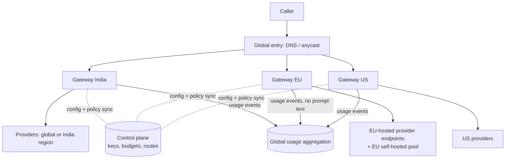

# LLM Gateway — L6 (Staff) Interview

> **Level expectation:** you treat the gateway as a company platform, not a service:
> - multi-region operation and **data residency** (where prompts may travel);
> - self-hosted models vs provider APIs, with a cost model;
> - cost governance and **chargeback**;
> - evaluation gates before any model switch;
> - build vs buy;
> - platform SLOs and vendor lock-in strategy.
>
> You are expected to drive the conversation, name trade-offs, and say what you would *not* build.

> 🆕 Baselines: [L4](L4-mid.md) (keys, adapters, token buckets, metering) and [L5](L5-senior.md) (budgets, caches, failover, queues, guardrails). Product background: [00-understand-the-product.md](00-understand-the-product.md).

Legend: **🧑‍💼 Interviewer** · **🧑‍💻 Candidate** · **📝 Note** = commentary for you.

---

## 1. Clarifying requirements and framing

**🧑‍💼 Interviewer:** The company now operates in India, the EU and the US. AI spend is ~$15k/day (about $5.5M/year, illustrative) and growing 10% a month. The CFO, the CISO and three product VPs all have opinions. What do you build, and what do you decide first?

**🧑‍💻 Candidate:** I would frame it as four stakeholders with different goals:

| Stakeholder | Wants | Gateway lever |
|---|---|---|
| Finance | Predictable, attributable spend | Budgets, chargeback, forecasts |
| Security / legal | Data stays where promised, auditable | Residency routing, redaction, audit logs |
| Product teams | Best model fast, no outages | Aliases, evals, failover, SLOs |
| Platform (us) | Few moving parts, low toil | Build vs buy, self-service |

Questions I need answered first: Which data classes exist (public, internal, customer, regulated)? Which contracts restrict processing location? Is there a target of cost per request? What is the failure budget for customer-facing AI features?

**🧑‍💼 Interviewer:** Customer data of EU users must be processed in the EU. Internal docs may go anywhere. Customer-facing chat needs 99.9% availability.

---

## 2. Numbers that frame the decisions

| What | Calculation | Result |
|---|---|---|
| Growth | $15k/day × 1.1^12 | **~$47k/day** in a year (15,120 × 3.14); ~$17M/yr at that point |
| Cost per request | $0.0035 (L4 §2) | at 4.32M req/day → $15,120/day |
| Availability budget | 0.1% of 30 days × 24 h × 60 | **43.2 min/month** of allowed downtime for 99.9% |
| Self-host breakeven (illustrative) | 8.64B tokens/day ÷ 86,400 = 100k tokens/s needed. If one GPU node serves ~5k tokens/s 🟡 (made-up round number): 100k ÷ 5k = **20 nodes** at average, ~100 at 5× peak without queueing | cost = nodes × hourly price × 24, to compare with $15k/day |

**🧑‍💻 Candidate:** I will not claim a breakeven without real throughput and GPU prices. I would present this formula and fill it with measurements from a pilot. The point is that self-hosting needs sustained, predictable load to pay off, because GPUs cost money while idle (see [LLM inference serving](../../../under-the-hood/llm-inference-serving.md)).

---

## 3. Deep dives

### 3.1 Multi-region and data residency

> 💡 **Anycast / global DNS entry:** one address (or name) that routes each caller to the nearest healthy region, like a global load balancer. **Fail closed:** when unsure, deny; the opposite of fail open. **GPU:** the chip that runs LLMs fast; rented by the hour and expensive when idle.

- **Data plane vs control plane.** Data plane = gateways serving calls in each region. Control plane = a single source of truth for keys, budgets, routes and price tables, replicated to regions. A control-plane outage must not stop calls (regions run on the last-known config), the same discipline as a Kubernetes API server vs kubelets.
- **Residency rules as routing policy.** Each request carries (or the team has) a **data class**. Policy table: `EU-customer → only EU endpoints/EU self-hosted pool`; if none is healthy, **fail closed** (reject) rather than fall back to a US provider. Failover lists therefore depend on data class, not just on provider health.
- **What crosses regions:** usage metadata (team, tokens, cost) may flow to a global aggregator; prompt text and logs stay in-region. Budget enforcement across regions: give each region a **slice** of the team's budget (for example 40/30/30), rebalanced periodically, so regions don't need synchronous global counters ([counters at scale](../../concepts/counters-at-scale.md)). Slight overshoot is accepted and bounded by slice size.
- **Provider capabilities vary by region:** not every model is offered in every region, and processing-location commitments differ per provider and contract 🟡. Verify in contracts; the gateway only enforces what you configured.
- **Caches are regional;** never share a semantic cache across residency boundaries.

> 📝 **Note:** the staff signal is "fail closed on residency" and "slice budgets instead of global locks".

### 3.2 Self-hosted models vs provider APIs

| | Provider API | Self-hosted (open-weight model on GPUs) |
|---|---|---|
| Cost shape | Pay per token, zero idle cost | Pay per GPU-hour, idle costs money |
| Capacity | Limited by provider rate limits | Limited by your GPU count; autoscaling is slow (minutes, model load) |
| Quality | Often the strongest models | Good, task-dependent; you choose and tune |
| Data control | Data leaves the company (contract terms) | Stays in your network |
| Effort | Low | High: serving stack, batching, GPU scheduling, upgrades |
| Latency | Network + queueing at the provider | You control; can co-locate |

- **Decision rule:** start with APIs. Self-host a model for (a) high, steady, simple workloads (classification, extraction, embeddings) where a small model is good enough, (b) strict data control, (c) when the provider cap is your bottleneck. Route by task: small self-hosted model for volume, API frontier model for hard queries.
- The gateway makes this reversible: a self-hosted pool is just another adapter (`inference servers expose the same chat-completions shape`; many open-source servers do 🟡). Internals worth knowing for the interview (batching, KV cache, GPU memory): [LLM inference serving](../../../under-the-hood/llm-inference-serving.md).
- Capacity planning for self-hosted: tokens/s per GPU × GPUs ≥ peak demand ÷ target utilisation (say 60%), plus a warm spare. Burst overflow goes to the API ("spill to cloud"). Be careful: the spill path must follow the same residency rules.

### 3.3 Cost governance and chargeback

- **Attribute every token:** `team → product/feature → environment` tags on the key (or a header validated against the key), so spend is traceable. Untagged = unattributed = escalated.
- **Showback first, chargeback later.** Showback = a dashboard saying what each team would pay. Chargeback = the amount is actually moved to the team's cost centre monthly from the audited usage ledger ([Kafka](../../technologies/kafka.md) → usage DB, same exactness concerns as [ad click aggregation](../ad-click-aggregation/README.md): events deduped by request ID, nightly recount, versioned price table). Disputes need the per-request ledger and a query by request ID.
- **Levers beyond caps:** default cheaper models per use case; cache hit-rate targets; `max_tokens` policies; prompt-size alerts (a prompt that grew 10× after a "small" template change); anomaly detection on cost per request; idle-key cleanup.
- **Shared costs:** the gateway's own infra, evals, and the committed-spend discounts with providers (reserved throughput, volume deals 🟡) are allocated by usage share. Mention commitments carry risk: you pay even if usage drops.
- **Forecasting:** project from trailing token growth × planned launches; review monthly with finance.

### 3.4 Evaluation and regression gates when switching models

Switching a model (cheaper, newer, other provider) changes outputs. The gateway is the right place to run the change safely, but **evals** (automated test sets scoring answers, like regression tests; see [LLM evals, guardrails and prompt injection](../../concepts/llm-evals-guardrails-and-prompt-injection.md)) decide whether to do it.

1. Each team owns an eval set for its use case (golden inputs, scoring rubric, maybe an LLM judge plus human spot checks). The platform provides the harness.
2. **Shadow:** gateway copies a sample of live traffic to the candidate model (response discarded), compares offline: quality score, latency, cost.
3. **Canary:** 1% → 10% → 50% → 100% of an alias, with automatic rollback on SLO or quality regression, the same as a service rollout.
4. **Gate:** alias repointing requires passing the eval threshold for each consuming team (or an owner's waiver). Model versions are pinned (never `latest`) so provider-side changes cannot silently alter behaviour 🟡.
5. Keep the old route warm for a rollback window.

Costs of evals are themselves tokens: budget them.

### 3.5 Build vs buy

| Option | Strengths | Weaknesses |
|---|---|---|
| Open-source gateway (e.g. LiteLLM 🟡) self-run | Fast start, many adapters, community fixes | You operate it; your policies (residency, chargeback) still need custom work; check licence and security posture |
| Cloud-vendor / SaaS AI gateway 🟡 | Little operations, built-in dashboards | Another vendor in the data path (prompts flow through it); limited custom policy; lock-in |
| Build in-house | Exact fit to policies, no extra data processor | Team cost, slow to match adapter coverage |
| **Hybrid** | Reuse OSS for adapters and basics, build the policy layer (budgets, residency, guardrails, chargeback) | Integration and upgrade effort |

**Recommendation:** hybrid, starting with the smallest thing that gives per-team keys, metering and failover; build in-house only the parts that encode company policy. Revisit yearly: this space moves fast and commodity features get absorbed by vendors. The question that decides it is: *which parts differentiate us?* (Usually none of the proxying; the policy is ours.)

### 3.6 Platform SLOs

> 💡 **SLI** = a measured number (e.g. fraction of good requests). **SLO** = the target for it. **Error budget** = how much you may miss before you stop launching and fix reliability ([observability](../../concepts/observability.md)).

| SLI | Why this one | Example SLO |
|---|---|---|
| Gateway availability (non-5xx caused by us) | Separate our fault from provider fault | 99.95% |
| End-to-end success incl. failover | What users feel | 99.9% (43.2 min/month budget, §2) |
| Gateway overhead latency (p99) | We should be invisible | < 50 ms added |
| **TTFT** (time to first token) p95 | How "fast" streaming feels | model-dependent, e.g. < 2 s 🟡 |
| **Tokens/s** per stream, p50 | Reading speed of the answer | e.g. ≥ 30 tokens/s 🟡 |
| Metering completeness | Money | 99.99% of calls have a usage record within 5 min |
| Spend counter staleness | Budget safety | < 10 s |

- **Attribution matters:** report provider-caused vs gateway-caused failures separately; otherwise the platform team owns outages it cannot fix. Offer an SLO that includes failover (our job) but excludes "all providers down for a data class".
- **Operations:** per-provider synthetic probes every minute (a tiny prompt, expected answer) to detect degradation before users do; runbooks per breaker; game days (drop a provider in staging, throttle to 429).
- **Multi-gateway risk:** the gateway is a shared dependency for every AI feature. Keep it simple, deploy gradually, make the client SDK degrade (timeouts, fallback to a static response).

### 3.7 Vendor lock-in

Lock-in lives in: prompt formats tuned to one model, proprietary features (tools/function calling shapes, structured outputs, fine-tunes, batch APIs), embedding models (changing one means **re-embedding** all stored documents), and committed-spend contracts.

Mitigations: the common request shape and aliases; adapters that normalise tool-calling and structured output; keep prompts and eval sets in your repo, not a vendor console; store raw text, not only embeddings; avoid fine-tunes you cannot reproduce; keep a tested second provider (a failover path never exercised is a failover path that doesn't work). Accept some lock-in where the capability is worth it, but make it an explicit decision.

---

## 4. Interviewer follow-ups / curveballs

**🧑‍💼 Interviewer:** A team demands to bypass the gateway "for latency".
**🧑‍💻 Candidate:** I measure the overhead (tens of ms vs seconds of model time) and show them. If a real exception exists, it still gets a gateway-issued, scoped credential or a sidecar mode so metering and policy remain. Egress firewall rules allow provider traffic only from the gateway, so direct calls simply don't work.

**🧑‍💼 Interviewer:** A provider changes its terms on data retention.
**🧑‍💻 Candidate:** Data classes map to allowed providers; legal flips the policy table, and the gateway reroutes (or fails closed) without app changes. Audit logs show which requests went where.

**🧑‍💼 Interviewer:** The new cheaper model passes evals but customers complain.
**🧑‍💻 Candidate:** The eval set missed a case. Roll back via the alias, add the complaint cases to the eval set, and track online signals (thumbs-down rate, escalation rate) as canary metrics.

**🧑‍💼 Interviewer:** What would you not build?
**🧑‍💻 Candidate:** My own tokenizers for every vendor, a custom vector database for the semantic cache if the existing store works, or a prompt-management UI before teams ask.

---

## 5. What the interviewer was evaluating (L6 checklist)

- [ ] Framed stakeholders and decisions before designing
- [ ] Data plane vs control plane; regions survive control-plane outage
- [ ] Residency as policy with fail-closed behaviour; budget slices per region
- [ ] Self-host vs API with an explicit cost formula and routing by task
- [ ] Chargeback built on an exact ledger, not Redis counters
- [ ] Eval-gated, canaried model switches with pinned versions
- [ ] Build/buy/hybrid reasoned by differentiation, not by habit
- [ ] SLOs separate provider faults from gateway faults; includes TTFT and tokens/s
- [ ] Lock-in named with concrete mitigations

## 6. Common mistakes at this level

1. Designing the tech first and ignoring legal/finance constraints.
2. Falling back to a non-compliant region to "stay available".
3. Declaring self-hosting cheaper without utilisation and throughput numbers.
4. Switching models by editing a config, with no eval or canary.
5. One global SLO that blames the platform for provider outages (or hides them).
6. Building everything in-house, or buying a gateway that sees all prompts without a security review.
7. Never testing the second provider path.
