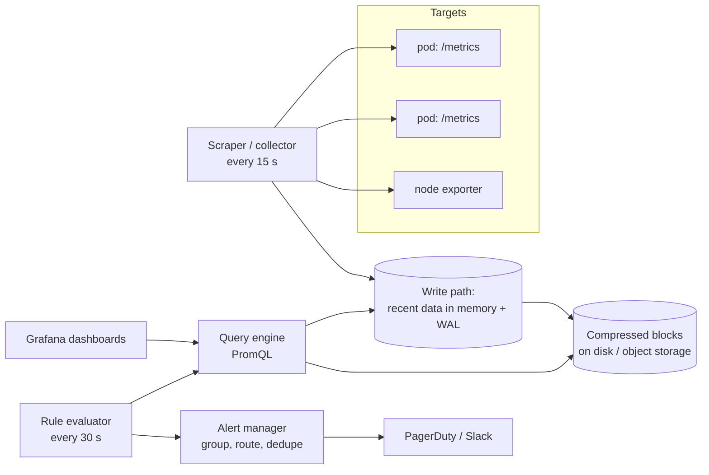

# Start Here: What Is a Metrics & Monitoring System? (Before the Interview)

> You already use one: Grafana dashboards, Prometheus queries, the PagerDuty alert at 3 a.m. saying "p99 latency of checkout > 2 s for 5 minutes". This interview asks you to build that system yourself: collect millions of numbers every few seconds from thousands of machines, store them for months in very little space, answer "show me the last 7 days" in under a second, and wake the right person, once, when something breaks.
>
> Time: ~15 minutes. Then: [L4](L4-mid.md) → [L5](L5-senior.md) → [L6](L6-staff.md).

---

## 1. The story: "is it broken, and since when?"

It's 3:07 a.m. The checkout service is slow. The on-call engineer needs answers in minutes:
- **Is it slow for everyone, or one region?** → latency broken down by region.
- **When did it start?** → a graph of the last 6 hours.
- **What changed at that moment?** → deploys, CPU, database connections, error rates, all on the same time axis.
- **Is it getting worse or recovering?** → live data, updated every few seconds.

Logs can answer some of this, but searching billions of log lines for "how many errors per minute" is slow and expensive. **Metrics** are the pre-counted version: every service regularly reports numbers (requests served, errors, latency, queue depth, memory), and the monitoring system stores those numbers over time.

💡 **Metric:** a named number measured over time, e.g. `http_requests_total` or `jvm_memory_used_bytes`. **Time series:** one metric for one specific thing (one pod, one endpoint, one status code), as a list of (timestamp, value) points.

What goes wrong with the naive version ("each service writes a row into a SQL table every 10 seconds"):
- **Volume:** 50,000 pods × 1,000 numbers each every 15 s = millions of rows **per second**. A normal relational table and its indexes can't keep up.
- **Storage:** at 16 bytes per point plus row overhead, a year of data is petabytes.
- **Queries:** "error rate per region, last 7 days" scans billions of rows.
- **Alerts:** rules re-run every 30 seconds over all that data.
- **The monitoring system fails with the outage:** if it runs on the same cluster, the moment you need it most is when it's down.

---

## 2. Where you've already seen it

| Where | What it is |
|---|---|
| **Prometheus + Grafana** | Scrapes `/metrics` endpoints, stores time series, PromQL queries, dashboards |
| **Spring Boot Actuator `/actuator/prometheus`** | Your Java service *exposing* metrics (JVM, HTTP, HikariCP pool) |
| **Kubernetes** | `kubectl top`, the metrics-server, kube-state-metrics, HPA scaling on CPU |
| **Datadog, New Relic, CloudWatch** | Hosted versions of the same thing |
| **Alertmanager / PagerDuty / Opsgenie** | Turning "a rule fired" into "one page to the right person" |
| **Uber's M3, Meta's Gorilla, Netflix's Atlas** | Big companies' own systems for billions of points (see L5/L6) |

> 💡 **You are the user of this product every day.** That's an advantage in this interview: every requirement can come from something that annoyed you on call.

---

## 3. The features, through situations

### 3.1 "Count requests, measure latency" → the data model
A metric has a **name** and **labels** (key=value tags):

```text
http_requests_total{service="checkout", region="ap-south-1", status="500"}  →  41,230
```

Each unique combination of name + labels is **one time series**. Types matter: a **counter** only goes up (requests served), a **gauge** goes up and down (memory used), a **histogram** counts values into buckets (how many requests took < 100 ms, < 250 ms, …) so you can compute percentiles later. → L4 §5.1.

### 3.2 "Collect from 50,000 pods" → pull vs push
Prometheus **pulls**: every 15 s it fetches each target's `/metrics` page. Other systems have agents **push** to a collector. Pull makes "is this target down?" obvious; push works for short-lived jobs and through firewalls. → L4 §5.2.

### 3.3 "Store months of data cheaply" → time-series storage and compression
Consecutive points of one series are very similar (timestamps every 15 s, values that change a little), so they compress extremely well: Facebook's Gorilla design stores a point in under 2 bytes on average instead of 16. → [Time-series compression & downsampling](../../concepts/time-series-compression-and-downsampling.md), L4 §5.3, L5 §3.1.

### 3.4 "Show me the last 30 days" → downsampling
Nobody needs 15-second detail for last month. Old data is **downsampled** into 5-minute or 1-hour summaries (min, max, sum, count), so a 30-day graph reads thousands of points, not millions. → L5 §3.4.

### 3.5 "Someone added user_id as a label" → cardinality
Every new label value creates a new series. Adding `user_id` with 10 million users multiplies series by 10 million, and the system runs out of memory. Controlling **cardinality** (the number of distinct series) is the operational problem of this domain. → L5 §3.3.

### 3.6 "Page me when checkout is broken, but only once" → alerting
A rule like "error rate > 5% for 5 minutes" is evaluated every 30 s. When it fires, the alert is **grouped** (one page for 200 pods failing, not 200 pages), **routed** (checkout team, not database team), and **deduplicated**. → [Alerting & SLOs](../../concepts/alerting-and-slos.md), L4 §5.5, L5 §3.7.

### 3.7 "Alert on what users feel, not on CPU" → SLOs and burn rates
"99.9% of checkouts succeed over 30 days" leaves an **error budget** of 0.1%. Alerting on how fast that budget is being spent catches real problems and ignores harmless blips. → L6 §3.

### 3.8 "The monitoring was down during the outage" → meta-monitoring
The system that watches everything must be watched too, and must not depend on the things it watches. → L6 §1.

---

## 4. The key mechanism: scrape → store compressed → query → alert



What a target exposes (real Prometheus text format; your Spring Boot app produces exactly this at `/actuator/prometheus`):

```text
# TYPE http_server_requests_seconds histogram
http_server_requests_seconds_bucket{uri="/checkout",status="200",le="0.1"} 9120
http_server_requests_seconds_bucket{uri="/checkout",status="200",le="0.5"} 9870
http_server_requests_seconds_bucket{uri="/checkout",status="200",le="+Inf"} 9902
http_server_requests_seconds_count{uri="/checkout",status="200"} 9902
http_server_requests_seconds_sum{uri="/checkout",status="200"} 1083.4
```

`le` means "less than or equal to": 9,120 requests took ≤ 0.1 s, 9,870 took ≤ 0.5 s, all 9,902 took ≤ infinity.

---

## 5. Try it yourself

- **Your own service:** `curl -s localhost:8080/actuator/prometheus | head -50` on any Spring Boot app with Micrometer's Prometheus registry. Find `hikaricp_connections_active` and `jvm_threads_live_threads`.
- **Run Prometheus locally** (if you have Docker): `docker run -p 9090:9090 prom/prometheus`, open `localhost:9090`, and query `rate(prometheus_http_requests_total[1m])`: Prometheus monitors itself.
- **In your company's Grafana:** open any panel → *Inspect → Query* and read the PromQL. Look for `rate(...)`, `sum by (...)` and `histogram_quantile(0.99, ...)`.
- **Count your cardinality:** in Prometheus, `count({__name__=~".+"})` returns the number of active series; `topk(10, count by (__name__)({__name__=~".+"}))` shows which metrics have the most.

> Commands needing network or Docker weren't run from the environment this repo was written in.

---

## 6. From experience to requirements

| What on-call experiences | Requirement |
|---|---|
| Graphs update within seconds | **NF:** ingestion-to-query delay ~10–30 s |
| Any service, any label, any time range | **F:** flexible queries (filter, group by labels, rates, percentiles) |
| Last 6 hours load instantly; last year loads too | **NF:** fast recent queries; downsampled long-term storage |
| One page per incident, to the right team | **F:** alert rules, grouping, routing, silences, dedup |
| Monitoring works during outages | **NF:** higher availability than the systems it monitors; independent failure domain |
| One bad label doesn't take everything down | **NF:** cardinality limits per tenant/team |
| The bill is reasonable | **NF:** compression, retention tiers |

---

## 7. Mini glossary

| Term | Plain meaning |
|---|---|
| Metric / time series | A named measurement / one labelled stream of (timestamp, value) points |
| Label | A key=value tag that identifies a series (`region="ap-south-1"`) |
| Sample | One (timestamp, value) point |
| Counter / gauge / histogram | Only increases / goes up and down / counts values into buckets |
| Scrape | The collector fetching a target's current metrics |
| Cardinality | Number of distinct series; explodes with high-variety labels |
| Downsampling | Replacing detailed old points with summaries over longer intervals |
| Retention | How long data is kept |
| PromQL | Prometheus's query language |
| SLI / SLO / error budget | What you measure / the target / how much failure the target allows |
| Burn rate | How fast you're spending the error budget compared with "exactly on target" |

➡️ Next: [README.md](README.md) · then [L4-mid.md](L4-mid.md)
