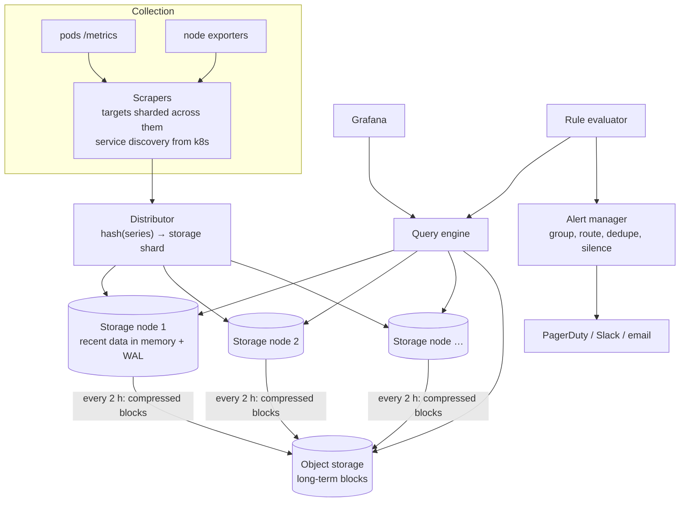

# Metrics & Monitoring (Prometheus-like) — L4 (Mid-level / SDE2) Interview

> **Level expectation:** a working design: a clear data model (metric + labels = series; counters, gauges, histograms), a collection strategy (pull vs push, with reasons), a write path built for append-heavy time series rather than a relational table, a query path for dashboards, basic alerting, and estimates showing why one machine isn't enough. Infra readers have an edge here: use what you've seen on call.

> 🆕 Read [00-understand-the-product.md](00-understand-the-product.md) first. It explains series, labels, histograms and the scrape → store → query → alert loop.

Legend: **🧑‍💼 Interviewer** · **🧑‍💻 Candidate** · **📝 Note** = commentary for you.

---

## 1. Clarifying requirements

**🧑‍💼 Interviewer:** Design a metrics monitoring system for our company's infrastructure.

**🧑‍💻 Candidate:** Questions first:
- What's being monitored: hosts, containers, application metrics, business metrics? How many targets?
- Metrics only, or also logs and traces? (I'll assume metrics only.)
- How fresh must dashboards be, and how far back do people look?
- Do we need alerting and notification, or just storage and dashboards?
- One team or many teams sharing it (multi-tenant)?

**🧑‍💼 Interviewer:** Application and infra metrics from about 50,000 pods and hosts. Metrics only. Dashboards within ~30 s of real time. 15 days at full detail, a year at lower detail. Yes to alerting. Many teams share it.

**🧑‍💻 Candidate:**

**Functional**
1. Collect metrics (counters, gauges, histograms) from all targets.
2. Store them: 15 days full resolution, 1 year downsampled.
3. Query: filter by labels, aggregate, rates, percentiles; power dashboards.
4. Alert rules evaluated continuously; notifications grouped and routed to teams.

**Non-functional**
1. **Write-heavy:** millions of samples per second, all the time.
2. **Fresh:** data visible within ~30 s.
3. **Fast recent queries:** last few hours in < 1 s.
4. **More available than the systems it watches**, and in a separate failure domain.
5. **Cheap per sample:** compression and retention tiers.

---

## 2. Back-of-the-envelope estimates

(Method: [back-of-the-envelope](../../concepts/back-of-the-envelope.md).)

| What | Calculation | Result |
|---|---|---|
| Active series | 50,000 targets × ~1,000 series each (JVM, HTTP per endpoint × status, pool, OS) | **50M series** |
| Ingestion rate | 50M series ÷ 15 s scrape interval | **~3.3M samples/s** |
| Raw size | 3.3M × 16 bytes (8-byte timestamp + 8-byte float) = 53 MB/s × 86,400 s | **~4.6 TB/day** uncompressed |
| Compressed size | Gorilla-style compression ≈ 1.37 bytes/sample: 3.3M × 1.37 = 4.6 MB/s × 86,400 | **~395 GB/day** |
| 15 days full resolution | 395 GB × 15 | **~6 TB** |
| Memory for active series | assume ~4 KB per active series (labels, index entry, in-memory recent chunk) × 50M | **~200 GB RAM** |
| Dashboard queries | ~1,000 open dashboards × 20 panels ÷ 30 s refresh | **~670 queries/s** |
| Alert rule evaluations | 20,000 rules ÷ 30 s | **~670 evaluations/s** |

**🧑‍💻 Candidate:** Takeaways:
- **200 GB of RAM for active series** and 3.3M writes/s → this must be **sharded** across many storage nodes.
- **Compression changes everything:** 4.6 TB/day vs 395 GB/day is the difference between expensive and affordable ([time-series compression](../../concepts/time-series-compression-and-downsampling.md)).
- The read side (dashboards + alerts) is ~1,300 queries/s, but each query may touch thousands of series.

> 📝 **Note:** "Series count" is the number to anchor on in this interview. Samples/s, memory and index size all follow from it. Infra engineers who've seen Prometheus OOM from too many series will recognise why.

---

## 3. API

**Collection (pull):** each target exposes `GET /metrics` in a text format (see the product page). **Push** alternative: `POST /v1/write` with batches of `(series labels, timestamp, value)`, as in Prometheus `remote_write` or OpenTelemetry (OTLP).

**Query:**
```http
GET /api/v1/query_range?query=sum by (region)(rate(http_requests_total{service="checkout",status=~"5.."}[5m]))
                        &start=2026-10-08T00:00:00Z&end=2026-10-08T06:00:00Z&step=30s
→ { "series": [ { "labels": {"region":"ap-south-1"}, "points": [[t1, 0.42], [t2, 0.40], ...] }, ... ] }
```

**Alert rule (configuration):**
```yaml
- alert: CheckoutHighErrorRate
  expr: sum(rate(http_requests_total{service="checkout",status=~"5.."}[5m]))
        / sum(rate(http_requests_total{service="checkout"}[5m])) > 0.05
  for: 5m
  labels: { team: payments, severity: page }
```

---

## 4. High-level design



**🧑‍💻 Candidate:**
- **Scrapers** discover targets from Kubernetes ([service discovery](../../concepts/service-discovery.md)) and scrape them every 15 s. Targets are split among scrapers so each handles a few thousand.
- **Distributor** hashes each series (name + sorted labels) to a storage shard, so all points of one series land on the same node ([consistent hashing](../../concepts/consistent-hashing.md)).
- **Storage nodes** keep the last ~2 hours in memory (with a write-ahead log for crash safety), then write **immutable compressed blocks** to object storage ([Prometheus & TSDBs](../../technologies/prometheus-and-time-series-databases.md)).
- **Query engine** fans out to the nodes and blocks that hold the requested series and time range, then merges.
- **Rule evaluator** runs alert rules as queries on a schedule; **alert manager** turns firing alerts into notifications.

---

## 5. Deep dives

### 5.1 Data model

**🧑‍💻 Candidate:** A series is identified by its name plus its full label set:

```text
http_requests_total{service="checkout", region="ap-south-1", status="500"}
```

| Type | Meaning | How you query it |
|---|---|---|
| **Counter** | Only increases (resets to 0 on restart) | Never graph raw: use `rate()` = per-second increase over a window, which also handles resets |
| **Gauge** | Current value, up or down | Graph directly; `avg`, `max` |
| **Histogram** | Counts of observations in fixed buckets (`le="0.1"`, `le="0.5"`, …) plus sum and count | `histogram_quantile(0.99, sum by (le)(rate(..._bucket[5m])))` estimates p99 **across all pods** |

**Why histograms beat precomputed percentiles:** you can't average p99s from 100 pods into a fleet p99 (the average of percentiles is not a percentile). Bucket counts **can** be summed across pods, and the percentile is computed afterwards.

### 5.2 Pull or push?

| | Pull (scrape) | Push |
|---|---|---|
| Target down | Obvious: scrape fails, `up == 0` | Silence: can't tell "dead" from "nothing to report" |
| Who controls load | The monitoring system (scrape interval) | The clients (a bug can flood you) |
| Short-lived jobs (a 20 s batch job) | May finish between scrapes | Natural fit |
| Firewalls / NAT, edge devices | Scraper must reach the target | Target only needs to reach the collector |
| Example | Prometheus | StatsD, OpenTelemetry push, CloudWatch agent |

**My choice:** pull for long-running services and infrastructure (most of our 50,000 targets, discovered from Kubernetes), push for batch jobs and things we can't reach. Both end up in the same storage.

### 5.3 Storage: why not a SQL table?

**🧑‍💻 Candidate:** A row per sample with an index on (series, time) means 3.3M index updates per second, row overhead larger than the data, and range scans touching scattered pages. Time-series data has properties a specialised store exploits:
- **Append-only, in time order:** each series only gets new points at the end. No updates.
- **Read in ranges:** queries read "series X from t1 to t2", so store each series' points **together in chunks** (e.g. 120 points or 2 hours per chunk).
- **Highly compressible:** timestamps are regular, values change slowly → delta encoding.
- **Old data is immutable:** write it once as compressed blocks, never touch it again; delete whole blocks when retention ends.

Layout per storage node:
- **Head (last ~2 h):** in memory, per series an open chunk; every sample also appended to a **write-ahead log** so a crash loses nothing ([durability, WAL](../../../LLD/concepts/durability-wal-and-snapshots.md)).
- **Blocks:** every 2 h, the head is cut into an immutable block: compressed chunks + an **inverted index** from label values to series IDs, so `{service="checkout"}` finds matching series quickly ([inverted index](../../concepts/inverted-index.md)).
- **Retention:** delete blocks older than 15 days; downsampled blocks kept a year.

### 5.4 Query path

1. Parse the query, find which series match the label filters (via the inverted index of each block/head).
2. Read chunks for those series in the time range, decompress.
3. Apply functions (`rate`), then aggregate (`sum by (region)`).
4. Return one point per `step` (e.g. every 30 s for a 6-hour graph = 720 points per line).

**Dashboards over long ranges** read **downsampled** data (5 min or 1 h resolution) instead of 15 s data: a 30-day graph at 15 s would be 30 × 86,400 ÷ 15 = 172,800 points per series; at 1 h it's 720.

### 5.5 Alerting basics

- The rule evaluator runs every rule every 30 s. A condition must hold for the rule's **`for:` duration** (e.g. 5 min) before firing, so one bad scrape doesn't page anyone.
- Firing alerts go to the **alert manager**, which:
  - **Groups** related alerts (200 pods of checkout failing → one notification listing them).
  - **Routes** by labels (`team=payments` → payments on-call).
  - **Deduplicates** (the same alert re-sent every 30 s is one page) and **silences** during maintenance.
  - Sends **resolved** notifications when the condition clears.

See [alerting & SLOs](../../concepts/alerting-and-slos.md).

---

## 6. Follow-ups

**🧑‍💼 Interviewer:** A storage node dies. What's lost?

**🧑‍💻 Candidate:** With one copy, its head data since the last block (up to 2 hours of its series) until it replays its WAL on restart, or permanently if the disk is gone. So **replicate each series to 2–3 storage nodes** (the distributor writes to all replicas); queries read any replica and deduplicate. Monitoring data tolerates small gaps, but not hours of missing data during an incident.

**🧑‍💼 Interviewer:** Why is `rate()` used on counters instead of graphing the raw value?

**🧑‍💻 Candidate:** A raw counter is a line going up forever, and it drops to zero when a pod restarts. `rate()` turns it into "per second over the last N minutes" and treats a drop as a reset, so restarts don't show up as huge negative spikes.

**🧑‍💼 Interviewer:** Why does the monitoring system need to be in a separate failure domain?

**🧑‍💻 Candidate:** If it runs on the same Kubernetes cluster, network and database as production, the outage that takes down production also takes down your ability to see it. Run it on separate infrastructure, and monitor it from outside (L6).

---

## 7. What the interviewer was evaluating (L4)

- [ ] Clarified targets, freshness, retention, alerting, multi-tenancy
- [ ] Estimates anchored on series count: samples/s, bytes/day raw vs compressed, memory
- [ ] Data model with counters, gauges, histograms; why histograms aggregate and percentiles don't
- [ ] Pull vs push trade-offs with a justified choice
- [ ] Time-series storage: head + WAL, chunks per series, immutable blocks, inverted label index, retention by block
- [ ] Sharding by series hash; replication
- [ ] Basic alerting with `for:`, grouping, routing, dedup

## 8. Common mistakes at this level

| Mistake | Why it hurts |
|---|---|
| One row per sample in a relational DB | Can't sustain millions of inserts/s; storage overhead larger than data |
| Averaging p99s across pods | Mathematically wrong; hides tail latency |
| Graphing raw counters | Meaningless lines; restarts look like crashes to zero |
| Alerting on every threshold crossing immediately | Pages on blips; alert fatigue |
| Ignoring series count | The system OOMs the first time someone adds a high-cardinality label |
| Running monitoring on the infrastructure it monitors | Goes blind exactly when needed |

➡️ Next: [L5-senior.md](L5-senior.md)
