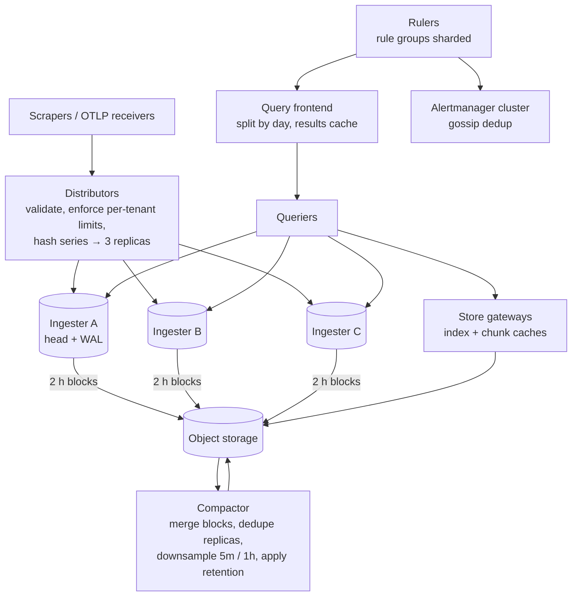

# Metrics & Monitoring (Prometheus-like) — L5 (Senior) Interview

> **Level expectation:** the L4 pipeline (scrape → shard by series → head + WAL → blocks → query → alert) is assumed. Now the hard parts: **compression** with numbers, **sharding and replication** with hot tenants, **cardinality** as the main operational risk, **downsampling** and long-term storage in object storage, **buffering ingestion** with back-pressure, **query fan-out** with caching, and **alerting at scale** without duplicate pages. Read [L4-mid.md](L4-mid.md) first.

Legend: **🧑‍💼 Interviewer** · **🧑‍💻 Candidate** · **📝 Note** = commentary for you.

---

## 1. Requirements (sharpened)

Same as L4 (50M active series, ~3.3M samples/s), plus:
- **200 teams** share the system; one team's mistake must not hurt the others.
- **1 year** of history, queryable in seconds at coarse resolution.
- No more than a few seconds of data loss when a node dies.
- No duplicate pages when alerting components fail over.

---

## 2. Architecture

This is roughly the shape of Cortex/Mimir and Thanos, the systems built to scale Prometheus horizontally ([Prometheus & TSDBs](../../technologies/prometheus-and-time-series-databases.md)).

---

## 3. Deep dives

### 3.1 Compression: from 16 bytes to under 2

**🧑‍💻 Candidate:** Facebook's Gorilla paper (VLDB 2015) is the standard reference ([time-series compression](../../concepts/time-series-compression-and-downsampling.md)):
- **Timestamps:** scrapes arrive every 15 s, so store the **delta of deltas**. 1000, 1015, 1030, 1045 → deltas 15, 15, 15 → delta-of-deltas 0, 0. A zero costs **1 bit**.
- **Values:** XOR each float with the previous one. A slowly changing gauge shares most bits with its previous value, so the XOR is mostly zeros; store only the meaningful middle bits. Identical values cost 1 bit.
- Result reported by Gorilla: an average of **1.37 bytes per point** instead of 16, about 12× smaller.

Arithmetic on our numbers: 3.3M samples/s × 16 B = 53 MB/s raw vs 3.3M × 1.37 B ≈ 4.6 MB/s compressed. **That's 4.6 TB/day vs ~395 GB/day**, and it's why recent data fits in memory at all.

### 3.2 Sharding, replication, and hot tenants

- **Shard key = series** (hash of name + sorted labels). Each series lives on 3 ingesters (replication factor 3); a write succeeds after 2 of 3 acknowledge, like a quorum write ([sharding & replication](../../concepts/sharding-and-replication.md)).
- **Consistent hashing** with many tokens per ingester, so adding an ingester moves only a share of series ([consistent hashing](../../concepts/consistent-hashing.md)).
- **Hot tenant:** a team with 5M series could overload whichever ingesters its series land on. Use **shuffle sharding**: each tenant is assigned a random subset of, say, 6 of 60 ingesters. A tenant blowing up only hurts its subset, and two tenants rarely share all six. 💡 *Shuffle sharding:* giving each customer a different random small group of servers, so one bad customer affects few others.
- Replicas mean every block exists 3 times in object storage; the **compactor deduplicates** them when merging.

### 3.3 Cardinality: the thing that actually takes these systems down

**🧑‍💼 Interviewer:** A team deploys a change that adds `user_id` as a label on their request counter. What happens?

**🧑‍💻 Candidate:** Each new label value creates a new series. Arithmetic: that counter had `endpoint` (20 values) × `status` (5) = 100 series per pod × 300 pods = 30,000 series. With `user_id` (2M active users) it becomes up to 100 × 2M = **200M series** for one metric: four times the entire company's current total, at ~4 KB of memory each = 800 GB. Ingesters run out of memory and crash, and with them everyone's monitoring.

Defences, from cheapest:
1. **Per-tenant limits** at the distributor: max active series per tenant, max series per metric, max label value length, max labels per series. Writes over the limit are **rejected for that tenant only**, with a clear error.
2. **Visibility:** per-tenant series counts and "top metrics by series" dashboards; alert a team *before* it hits its limit.
3. **Guidance and linting:** labels must be bounded sets (status codes, regions, endpoints), never IDs, emails or URLs with parameters. High-cardinality detail belongs in logs or traces.
4. **Relabelling** at scrape time to drop or rewrite offending labels.

> 📝 **Note:** Bringing up cardinality *before* the interviewer does is a strong senior signal for this question. It's the most common real-world failure.

### 3.4 Downsampling and long-term storage

**🧑‍💻 Candidate:** Two-hour blocks are uploaded to object storage; a **compactor** merges them into larger blocks (e.g. 2 h → 12 h → daily), and creates **downsampled** copies:

| Resolution | Kept for | Used for |
|---|---|---|
| Raw (15 s) | 15 days | Incident debugging, recent dashboards |
| 5 min | 90 days | Weekly reviews |
| 1 h | 1 year+ | Capacity planning, trends |

Each downsampled point keeps **min, max, sum and count** (not just the average), so the queries still work correctly: `max` stays a true max, averages are `sum ÷ count`, and rates of counters can still be computed.

Size check: 1 h resolution has 3,600 ÷ 15 = 240× fewer points; even storing 4 values per point, it's ~60× smaller. A year at 1 h ≈ 395 GB/day × 365 ÷ 60 ≈ **2.4 TB**, cheap in object storage.

### 3.5 Buffering ingestion

Two schools:
- **Direct writes** (Prometheus, Mimir): distributors write straight to ingesters; the ingester WAL provides durability. Simple, low latency.
- **Through a log** ([Kafka](../../technologies/kafka.md)): distributors append to Kafka, ingesters consume. Ingester restarts and slowdowns don't drop data (they replay from their offset), and other consumers (anomaly detection, billing) can read the same stream. Costs another system and a few seconds of delay.

Either way, when ingesters fall behind, the system must apply **back-pressure** deliberately: reject over-limit tenants first, sample or drop low-priority metrics, never let an unbounded buffer OOM the distributors ([back-pressure](../../../LLD/concepts/back-pressure.md)).

### 3.6 Query path at scale

- **Split by time:** a 7-day query becomes 7 one-day queries run in parallel.
- **Results cache** for completed days (they never change): dashboards re-run the same queries every 30 s; only the newest slice is recomputed. Align `start`/`end` to the `step` so cached slices can be reused.
- **Pick the resolution automatically:** a 30-day range reads 1 h downsampled blocks.
- **Guardrails:** per-query limits on series touched, samples read and run time; one bad `{__name__=~".+"}` query must not take the queriers down.
- **Recording rules:** precompute expensive expressions (e.g. per-service error ratio) every minute and store them as new series, so dashboards and alerts read one cheap series ([observability](../../concepts/observability.md)).

### 3.7 Alerting at scale, without duplicate pages

**🧑‍💻 Candidate:** 20,000 rules every 30 s:
- **Shard rule groups** across rulers with consistent hashing; each group evaluated by exactly one ruler (with a standby taking over via a lease if it dies ([leases](../../concepts/distributed-locks-and-leases.md))).
- **Alertmanager runs as a cluster of 2–3.** Rulers send every alert to *all* of them; the instances **gossip** which notifications they've sent, so a page goes out once even if one instance dies mid-send ([gossip](../../concepts/gossip-and-failure-detection.md)). This chooses "maybe a duplicate page" over "maybe a missed page", which is the right trade for paging.
- **Grouping, inhibition and silences:** group by `alertname, cluster, team`; an "entire cluster down" alert **inhibits** the 300 per-service alerts it causes; silences during planned maintenance ([alerting & SLOs](../../concepts/alerting-and-slos.md)).
- **Missing data is a signal:** `absent(up{job="checkout"})` and "target down" alerts, otherwise a silent exporter looks like a healthy service.

### 3.8 Late and out-of-order samples

Pull scraping produces in-order samples per series, but pushed data (batch jobs, edge devices, replays after an outage) can arrive late. Options: reject samples older than the head's window (simple, Prometheus's old default), or accept a bounded **out-of-order window** (e.g. 1 hour) by keeping a small separate structure merged at block time. Bounded is the key word: unbounded late writes would force rewriting compressed blocks.

---

## 4. Failure modes

| Failure | Behaviour | Mitigation |
|---|---|---|
| One ingester dies | Its series still on 2 replicas | RF 3, quorum writes, WAL replay on restart |
| Cardinality explosion from one team | Ingester memory spikes | Per-tenant series limits, shuffle sharding, rejection with clear errors |
| Object storage slow/unavailable | Old-data queries fail; uploads queue | Recent data still served from ingesters; retry uploads; local disk buffer |
| Huge query | Queriers OOM | Query limits, splitting, per-tenant concurrency limits |
| Ruler dies mid-evaluation | Some rules not evaluated | Lease-based failover; alert on rule evaluation failures |
| Alertmanager instance dies | Notifications could be lost | Clustered Alertmanager with gossip dedup; every ruler sends to all instances |

---

## 5. Follow-ups

**🧑‍💼 Interviewer:** How would you compute a fleet-wide p99 latency correctly?

**🧑‍💻 Candidate:** From **histogram buckets**: `histogram_quantile(0.99, sum by (le)(rate(http_request_duration_seconds_bucket[5m])))`. Sum the bucket rates across pods first, then estimate the quantile. Precision is limited by bucket boundaries, so choose buckets around the SLO threshold (e.g. 100 ms, 250 ms, 500 ms if the SLO is 300 ms). Newer "native"/exponential histograms use many automatic buckets for better precision.

**🧑‍💼 Interviewer:** Should application teams push or should we scrape them?

**🧑‍💻 Candidate:** Scrape long-running services discovered from Kubernetes (we get `up` for free), accept OTLP push for batch jobs, serverless functions and external sources. The storage layer doesn't care; the collection layer is pluggable.

---

## 6. What the interviewer was evaluating (L5)

- [ ] Gorilla-style compression explained, with the bytes-per-sample arithmetic
- [ ] Series-hash sharding, RF 3, quorum writes; shuffle sharding for tenants
- [ ] Cardinality: arithmetic of a bad label and layered defences
- [ ] Downsampling keeping min/max/sum/count; retention tiers in object storage
- [ ] Ingestion buffering choice and deliberate back-pressure
- [ ] Query splitting, results cache, resolution selection, query limits, recording rules
- [ ] Ruler sharding, clustered Alertmanager with dedup, inhibition, absent-data alerts
- [ ] Bounded out-of-order acceptance

## 7. Common mistakes at this level

| Mistake | Why it hurts at L5 |
|---|---|
| No per-tenant limits | One label change takes everyone's monitoring down |
| Downsampling to averages only | Max/min spikes disappear; rates break |
| Unbounded ingestion buffers | The pipeline OOMs during the incident it's supposed to show |
| Single Alertmanager | A single crash can drop a page |
| Alerting only on bad values, never on missing data | A dead exporter looks like a perfectly healthy service |
| Querying raw 15 s data for 30-day dashboards | Slow queries, heavy load, no benefit on screen |

⬅️ Previous: [L4-mid.md](L4-mid.md) · ➡️ Next: [L6-staff.md](L6-staff.md)
