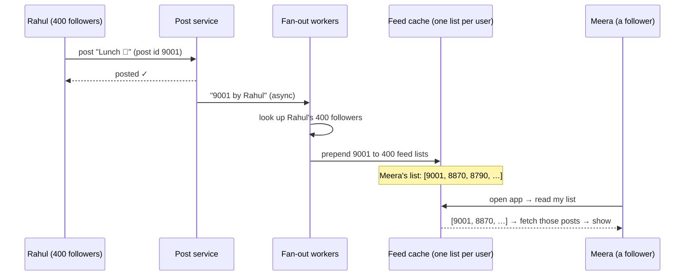

# Start Here: How Does a News Feed Work? (Before the Interview)

> You scroll Instagram, LinkedIn or X every day. But what *is* "the feed"? Where does each post come from, why is it in that order, and how does it load instantly for 500 million people? This page unpacks the product you already know, so the interview is about building it, not figuring out what it is.
>
> Time: ~15 minutes. Then: [L4](L4-mid.md) → [L5](L5-senior.md) → [L6](L6-staff.md).

---

## 1. One scroll, unpacked

Meera opens Instagram during lunch.

| What Meera sees | What the system is doing |
|---|---|
| The feed appears in under a second | It already **pre-built a list** of post IDs for her before she opened the app (or builds it very fast on demand) |
| Posts from friends, a cooking page she follows, a cricketer with 270M followers | Her feed is made from the posts of **accounts she follows** (the **follow graph**) |
| Not in time order: a friend's post from yesterday is above one from 10 minutes ago | The feed is **ranked**: the system predicts which posts she's most likely to care about |
| She scrolls; more posts keep loading | **Pagination**: the app fetches the feed in pages of ~10–20 using a **cursor** ("continue after this point") |
| "❤️ 12,481 likes" | A **counter**, updated by thousands of people per second on popular posts |
| Photos and videos load instantly | Media is served from a **CDN**, not from the feed servers |
| "New posts ↑" button appears at the top | New items arrived since she loaded the feed; the app doesn't reshuffle what she's reading |
| "You're all caught up ✓" after a while | The system tracks what she's **already seen** |
| She posts a photo of her lunch | Her post now has to appear in the feeds of her **400 followers** |

And at the same moment, the cricketer posts. That one post must reach **270 million** feeds. That's the hardest problem in this interview.

---

## 2. Where you've seen it

| Product | Feed type |
|---|---|
| **Instagram, Facebook, LinkedIn** | Ranked feed of people/pages you follow + suggestions |
| **X (Twitter)** | Two tabs: **"Following"** (people you follow, newest first) and **"For you"** (ranked, includes accounts you don't follow) |
| **YouTube Subscriptions vs Home** | Subscriptions = chronological from followed channels; Home = recommendations |
| **Reddit / Hacker News** | Ranked by votes + age, the same for everyone (not personalised per follow graph) |
| **At work: Slack channels, GitHub "dashboard" feed, Jira activity streams** | Activity feeds: events from things you follow, newest first |
| **Infra: `kubectl get events`, CI/CD activity, audit log viewers** | A chronological feed of events, filtered by what you care about (namespace, repo) |

---

## 3. The features, one situation at a time

### 3.1 Following and the follow graph
Meera follows 400 accounts. The cricketer has 270M followers but follows 50. These **who-follows-whom** links form the **social graph**. It's asymmetric (following ≠ being followed) and *very* uneven.

👉 Interview: *storing billions of edges and answering "who follows X?" and "whom does X follow?" fast*. See [graph databases](../../technologies/graph-databases.md).

### 3.2 Building the feed: push vs pull
Two ways to put posts into Meera's feed:
- **Push (fan-out on write):** when someone posts, immediately add the post ID to the feed list of **every follower**. Reading the feed is then instant: the list is ready.
- **Pull (fan-out on read):** when Meera opens the app, look up everyone she follows, fetch their recent posts, merge and sort.

Push is great for normal users (400 followers → 400 small writes). For the cricketer, push means **270 million writes per post**. That's why real systems use a **hybrid**.

👉 Interview: *the celebrity problem and hybrid fan-out*. See [fan-out](../../concepts/fan-out.md).

### 3.3 Ranking
Chronological is simple and predictable. Ranked feeds show "best first", predicted from signals like: how close she is to the author, how many people liked it, whether she usually watches videos, how old it is.

👉 Interview: *ranking pipeline: collect candidates → score → re-order*. See [feed ranking](../../concepts/feed-ranking.md).

### 3.4 Infinite scroll (pagination)
The app asks for 20 posts, then "the next 20 **after this one**". If it asked for "page 2" by position (offset 20) while new posts were arriving, she'd see duplicates or miss posts.

👉 Interview: *cursor-based pagination*. See [pagination](../../concepts/pagination.md).

### 3.5 Likes, comments, view counts
A viral post can get 50,000 likes per minute. Updating a single "likes" number in a database row that fast causes contention, because every update waits for the row lock.

👉 Interview: *counters at scale*. See [counters at scale](../../concepts/counters-at-scale.md).

### 3.6 "You're all caught up" and not repeating posts
The system remembers which posts she's already seen so it doesn't show them again.

👉 Interview: *a compact "seen" set per user*. See [Bloom filters](../../concepts/bloom-filters.md).

### 3.7 Photos and videos
The feed itself only carries post IDs and text; images and videos come from [object storage](../../technologies/object-storage.md) via a [CDN](../../technologies/cdn.md).

### 3.8 Deleting, blocking, unfollowing
She unfollows someone, or a post is deleted, or someone makes their account private. Their posts must disappear from her feed, even though her pre-built feed list still contains those IDs.

👉 Interview: *filtering at read time; consistency of pre-computed data*.

---

## 4. The key mechanism: fan-out on write, drawn



Reading is now cheap: one list lookup plus fetching ~20 posts (usually from cache). Writing costs one small insert **per follower**, which is fine for 400 followers and impossible for 270 million. The interviews build from here.

---

## 5. Try it yourself (10 minutes, all real)

1. **Compare chronological vs ranked:** on X, switch between the **Following** and **For you** tabs. On Instagram, tap the logo at the top-left → **Following** for a chronological view. Notice what changes.
2. **See cursor pagination in a real public API.** Mastodon (an open-source social network) has a public timeline API:
   ```sh
   curl -s -i 'https://mastodon.social/api/v1/timelines/public?limit=2' | grep -i '^link:'
   ```
   The `Link` header contains a URL with `max_id=…`: "give me posts older than this ID". That's a cursor. Call that URL to get the next page.
3. **Reddit does the same** with an `after` field:
   ```sh
   curl -s -A "sd-study/0.1" 'https://www.reddit.com/r/programming/new.json?limit=3' | grep -o '"after": *"[^"]*"'
   ```
   Pass `&after=<that value>` to get the next page. (Public APIs change and rate-limit; if one fails, try the other.)
4. **Watch the like counter:** on a viral post, the count often updates in jumps or shows "12.4K" rather than an exact number, a hint that counts are aggregated and approximate.

---

## 6. From experience to requirements

| What you experienced | Requirement | Type |
|---|---|---|
| Post a photo/text | `createPost` | Functional |
| Follow / unfollow | Follow graph management | Functional |
| Open the app → feed | `getFeed(userId, cursor)` from followed accounts | Functional |
| Endless scrolling | Cursor-based pagination | Functional |
| Best posts first | Ranking (chronological as a baseline) | Functional |
| Likes and comments counts | Counters | Functional |
| Loads in < 1 s | **Low read latency** (p99 a few hundred ms) | Non-functional |
| 500M daily users opening it many times | **Read-heavy at huge scale** | Non-functional |
| Celebrity posts reach millions | **Uneven fan-out** handled | Non-functional |
| A friend's post appears within seconds/minutes | **Eventual consistency is acceptable** | Non-functional |
| Deleted/blocked posts never shown | **Correctness on read** | Non-functional |

---

## 7. Mini glossary

| Term | Meaning in plain words |
|---|---|
| **Feed** | The personalised list of posts a user sees |
| **Follow graph / social graph** | Who follows whom |
| **Fan-out on write (push)** | When someone posts, copy the post ID into every follower's feed list right away |
| **Fan-out on read (pull)** | Build the feed when the user asks, by fetching from everyone they follow |
| **Hybrid fan-out** | Push for normal users, pull for celebrities |
| **Hydration** | Turning a list of post IDs into full posts (text, author, counts, media URLs) |
| **Ranking** | Ordering posts by predicted interest instead of time |
| **Cursor** | An opaque "bookmark" telling the server where the last page ended |
| **Celebrity / hot user** | An account with so many followers that normal approaches break |
| **Counter** | A number like likes/views that many users update at once |
| **Bloom filter** | A tiny structure that can say "definitely not seen" or "probably seen" |

➡️ **Now design it:** [L4-mid.md](L4-mid.md)
