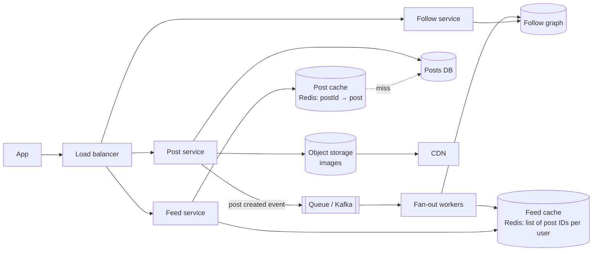
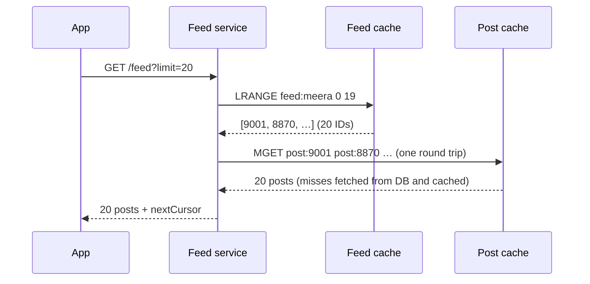

# News Feed — L4 (Mid-level / SDE2) Interview

> **Level expectation:** a working design: create posts, follow users, read a feed of followed users' posts, fast. Precompute feeds with fan-out on write, store post IDs in a cache, hydrate posts, paginate with a cursor, serve media from a CDN. Handle follow-ups (celebrities, deletes) sensibly when asked.

> 🆕 Never thought about how feeds work? Read [00-understand-the-product.md](00-understand-the-product.md) first. It explains push vs pull, ranking and cursors with an Instagram example.

Legend: **🧑‍💼 Interviewer** · **🧑‍💻 Candidate** · **📝 Note** = commentary for you.

---

## 1. Clarifying requirements

**🧑‍💼 Interviewer:** Design a news feed like Instagram's.

**🧑‍💻 Candidate:** Some questions:
- Follow model: one-way follows (Instagram/X) or mutual friendships (Facebook)?
- Post types: text, images, video?
- Feed order: chronological or ranked?
- Does the feed include accounts the user doesn't follow (suggestions, ads)?
- How fresh must it be: is a few seconds' delay OK before a new post shows up?

**🧑‍💼 Interviewer:** One-way follows. Text + images. Start chronological. Only followed accounts. A few seconds or even a minute of delay is fine.

**🧑‍💻 Candidate:**

**Functional**
1. Create a post (text + optional images).
2. Follow / unfollow.
3. Get feed: posts from followed accounts, newest first, paginated.

**Non-functional**
1. **Feed loads fast:** p99 < 300 ms server-side.
2. **Read-heavy:** people scroll far more than they post.
3. **Eventually consistent:** a new post may take a short time to appear.
4. **Highly available:** a stale feed is better than an error.

> 📝 **Note:** "Is a delay OK?" unlocks the whole design. If posts needed to appear in all feeds instantly and atomically, precomputing feeds would be much harder.

---

## 2. Back-of-the-envelope estimates

**🧑‍💻 Candidate:** Assume **500M daily active users**. (Method: [back-of-the-envelope](../../concepts/back-of-the-envelope.md).)

| What | Calculation | Result |
|---|---|---|
| Feed loads | 500M × ~10 opens/day = 5B/day; 5B / ~86,400 s | **~58k feed reads/s** (peak ~150k/s) |
| New posts | 10% of users post once/day = 50M/day | **~600 posts/s** |
| Avg followers | assume ~200 | |
| Fan-out writes | 50M × 200 = 10B/day | **~115k feed inserts/s** |
| Feed cache | 500M users × 500 post IDs × 8 bytes | **~2 TB** in memory |
| Post metadata | 50M/day × ~1 KB | ~50 GB/day |
| Media | 50M × 50% with images × ~300 KB | **~7.5 TB/day** → object storage + CDN |

**🧑‍💻 Candidate:** Takeaways:
- **Reads (~58k/s) dominate** and must be fast → precompute feeds.
- Fan-out on write turns 600 posts/s into **~115k small writes/s**. That's a lot, but each one is tiny and they're easy to parallelise.
- ~2 TB of feed lists → a [Redis](../../technologies/redis.md) **cluster** (tens of nodes), not one box.

---

## 3. API

```http
POST /v1/posts                 { "text": "Lunch 🍛", "mediaIds": ["m_77"] }   → 201 { "postId": "p_9001" }
POST /v1/users/{id}/follow
DELETE /v1/users/{id}/follow
GET  /v1/feed?limit=20&cursor=<opaque>
→ 200 { "posts": [ {post…}, … ], "nextCursor": "eyJiZWZvcmUiOiJwXzg4NzAifQ" }
```

**🧑‍💼 Interviewer:** What's in the cursor?

**🧑‍💻 Candidate:** Essentially "the ID of the last post you saw", encoded so clients treat it as opaque. The next request says "posts older than p_8870". If I used `?page=2` (offset), a new post arriving between requests would shift everything by one and the user would see a duplicate. ([Pagination](../../concepts/pagination.md).)

---

## 4. High-level design



**🧑‍💻 Candidate:** Components:
- **Post service:** stores the post in the posts DB, images in [object storage](../../technologies/object-storage.md) (served by a [CDN](../../technologies/cdn.md)), then publishes a "post created" event.
- **Follow service + follow graph:** two tables, `followers(user_id, follower_id)` and `following(user_id, followee_id)`, so both directions are a single lookup ([graph storage](../../technologies/graph-databases.md)).
- **Fan-out workers** consume post events: look up the author's followers and **prepend the post ID to each follower's feed list** in Redis.
- **Feed service:** reads the user's list of post IDs, then **hydrates** them (fetches the full posts) from a post cache.

### Data model

```sql
posts(post_id BIGINT PK, author_id, text, media_ids, created_at)   -- post_id is time-ordered (Snowflake)
followers(user_id, follower_id, created_at, PRIMARY KEY(user_id, follower_id))
following(user_id, followee_id, created_at, PRIMARY KEY(user_id, followee_id))
```

Redis:
```text
feed:{userId}  → LIST of post IDs, newest first, trimmed to 500 (LPUSH + LTRIM)
post:{postId}  → HASH or JSON of the post (hydration cache)
```

**🧑‍💼 Interviewer:** Why store IDs instead of full posts in each feed?

**🧑‍💻 Candidate:** A post with 200 followers would be copied 200 times. If it's edited or deleted, I'd have to update 200 copies. With IDs, the post lives in one place; feeds just point to it. 8 bytes per entry instead of ~1 KB makes the feed cache ~100× smaller.

**🧑‍💼 Interviewer:** How do you generate post IDs?

**🧑‍💻 Candidate:** **Snowflake-style** 64-bit IDs: timestamp in the high bits, so sorting by ID = sorting by time, and they can be generated on many servers without coordination ([ID generation](../../concepts/id-generation.md)). The cursor "older than p_8870" then works directly on the ID.

---

## 5. Deep dives

### 5.1 Reading the feed



Two cache round trips, a few milliseconds total. Batch fetching (`MGET`) matters: 20 separate calls would be 20 round trips.

### 5.2 Fan-out on write

```text
on PostCreated(postId, authorId):
    for followerId in followers(authorId):            -- paged, 1,000 at a time
        LPUSH feed:{followerId} postId
        LTRIM feed:{followerId} 0 499                 -- keep the latest 500
```

Asynchronous: the author gets "posted ✓" as soon as the post is stored; feeds update a moment later. ([Fan-out](../../concepts/fan-out.md).)

---

## 6. Follow-ups

**🧑‍💼 Interviewer:** A celebrity with 100M followers posts. What happens?

**🧑‍💻 Candidate:** 100M Redis writes for one post. Even at 100k writes/s that's ~17 minutes before the last follower sees it, and it blocks the workers for everyone else's posts. Fix: **don't fan out for celebrities**. When a user reads their feed, also fetch recent posts from the few celebrities they follow and merge them in. That's the hybrid model in [L5](L5-senior.md#31-hybrid-fan-out-the-celebrity-problem).

**🧑‍💼 Interviewer:** A post is deleted. It's still in thousands of feed lists.

**🧑‍💻 Candidate:** Leave the IDs; when hydrating, a deleted post is missing (or marked deleted) in the post store, so the feed service skips it. Cheaper and safer than chasing every copy. The same "check at read time" handles blocked users and unfollows.

**🧑‍💼 Interviewer:** Meera follows someone new. Their old posts aren't in her feed.

**🧑‍💻 Candidate:** On follow, enqueue a small job to fetch that account's recent ~20 posts and merge them into her feed list.

**🧑‍💼 Interviewer:** Where do like counts live?

**🧑‍💻 Candidate:** Simplest: a `like_count` column, incremented on each like. For viral posts that one row becomes a hotspot. Better is Redis `INCR` with periodic flush to the DB, or counting likes asynchronously. ([Counters at scale](../../concepts/counters-at-scale.md).)

---

## 7. What the interviewer was evaluating (L4)

- [ ] Clarified follow model, ordering, freshness
- [ ] Estimated reads vs writes and fan-out volume; concluded "precompute"
- [ ] Separate post / follow / feed services
- [ ] Feed lists of **post IDs** in Redis, hydrated from a post cache in batches
- [ ] Asynchronous fan-out on write
- [ ] Cursor-based pagination with time-ordered IDs
- [ ] Media in object storage + CDN
- [ ] Reasonable answers on celebrities, deletes and new follows

## 8. Common mistakes at this level

| Mistake | Why it hurts |
|---|---|
| Building the feed with a big SQL join on every request | `JOIN following … ORDER BY created_at LIMIT 20` across billions of rows at 58k/s won't work |
| Copying full posts into every feed | 100× more memory; edits/deletes become a nightmare |
| Offset pagination (`?page=3`) | Duplicates and gaps on a live feed; slow at depth |
| Synchronous fan-out in the post request | Posting takes seconds (or minutes for big accounts) |
| Fetching each post separately during hydration | 20 round trips per feed load |
| Images through the feed service | Wastes bandwidth; use CDN URLs |

➡️ Next: [L5-senior.md](L5-senior.md)
