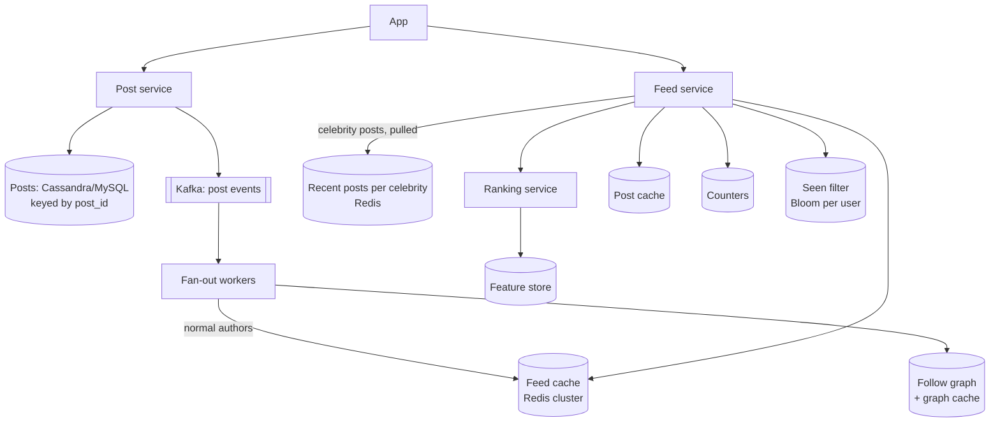
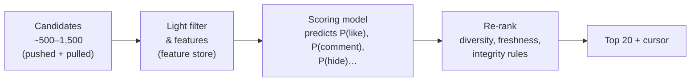

# News Feed — L5 (Senior) Interview

> **Level expectation:** you drive the design and go deep on the parts that are genuinely hard: **uneven fan-out (celebrities)**, **cache sizing and misses**, **correctness of precomputed feeds**, **counters**, and a credible **ranking pipeline**. Every decision is tied to numbers, and you raise failure modes yourself. Read [L4-mid.md](L4-mid.md) first.

Legend: **🧑‍💼 Interviewer** · **🧑‍💻 Candidate** · **📝 Note** = commentary for you.

---

## 1. Requirements

**🧑‍💻 Candidate:** Same scope as L4 plus: **ranked** feed (with chronological as a fallback), likes/comments counts, "seen" filtering, and accounts with up to **hundreds of millions of followers**.

| Property | Target |
|---|---|
| Feed read latency | p99 < 300 ms server-side (includes ranking) |
| Post visible to followers | p95 < 30 s for normal accounts; minutes acceptable for huge accounts |
| Availability | 99.95% for reads, degrading gracefully (stale/chronological > error) |
| Correctness | Deleted/blocked/private content never served |

Scale from [L4](L4-mid.md#2-back-of-the-envelope-estimates): ~58k feed reads/s (peak ~150k/s), ~600 posts/s, ~115k fan-out writes/s, ~2 TB of raw post IDs in feed caches (~3 TB with Redis overhead, §3.2).

---

## 2. Architecture



---

## 3. Deep dives

### 3.1 Hybrid fan-out: the celebrity problem

**🧑‍💻 Candidate:** Follower counts follow a power law: most accounts have hundreds of followers; a tiny number have tens or hundreds of millions ([fan-out](../../concepts/fan-out.md)).

| Author type | Strategy | Why |
|---|---|---|
| Followers < threshold (say 100k) | **Push**: fan-out on write into each follower's feed list | Cheap per post; reads stay trivial |
| Followers ≥ threshold ("celebrities") | **Pull**: store only in the celebrity's own recent-posts list; merged at read time | One post would otherwise mean 100M+ writes |

At read time:

```text
candidates = LRANGE feed:{user} 0 499                         -- pushed posts
for c in celebritiesFollowedBy(user):                         -- typically a few dozen
    candidates += LRANGE celebposts:{c} 0 19                  -- pulled, very hot keys → heavily cached
rank(candidates) → hydrate top 20 → filter → return
```

**🧑‍💼 Interviewer:** How do you pick the threshold?

**🧑‍💻 Candidate:** It's a cost trade-off. Pushing a post costs `followers` writes, **once**. Pulling costs extra reads **on every feed load of every follower**. For an author with F followers who each open the feed ~10×/day and who posts P times/day: push ≈ F × P writes/day; pull ≈ F × 10 extra reads/day. Push wins when the author posts less than ~10×/day *and* F is small enough not to clog the workers. Practically: start at ~100k–1M, measure fan-out lag and read latency, adjust. A threshold that's configurable per account also handles "bursty" accounts (a news account posting 200×/day).

**Also skip inactive users:** don't fan out to followers who haven't opened the app in 30 days. If 40% of followers are inactive, that cuts fan-out writes by 40%. When one returns, rebuild their feed with a pull (§3.3).

### 3.2 Feed cache sizing

| Item | Math | Result |
|---|---|---|
| Entries per user | keep latest 500 post IDs | — |
| Bytes per entry | 8-byte ID (+ small Redis list overhead) | ~10–16 B |
| Active users | 500M | — |
| Total | 500M × 500 × ~12 B | **~3 TB** |

A Redis cluster of ~30–50 nodes with 64–128 GB each, plus replicas. Sharded by `userId` ([consistent hashing](../../concepts/consistent-hashing.md) / hash slots). Only *active* users have a feed list; inactive users' lists expire (TTL), which keeps memory bounded.

### 3.3 Cache miss: rebuild by pulling

**🧑‍💻 Candidate:** A returning user, a Redis node failure, or an expired list means no precomputed feed. The feed service falls back to **pull**: get the user's followees, fetch each one's recent posts (from a per-author recent-posts list), merge the top 500 by time, write the list back, continue. Slower (tens of ms to fetch from hundreds of followees in parallel), but rare. And it means the feed cache is a **cache**, not the source of truth: losing it degrades latency, not correctness.

> 📝 **Note:** "The precomputed feed is just a cache; it can always be rebuilt from posts + the follow graph" is the sentence that shows you've thought about failure.

### 3.4 Correctness: filter at read time

Precomputed lists go stale. On every feed load, after candidate generation:
- Drop posts that are **deleted** or **hidden** (hydration returns a tombstone).
- Drop authors the user **blocked** or **unfollowed** (check against a small per-user set, cached).
- Drop posts from accounts that became **private** if the viewer isn't approved.
- Drop posts already **seen** recently: a per-user [Bloom filter](../../concepts/bloom-filters.md) of seen post IDs (~1–2 KB per user at 1% false positive rate), so the check is O(1) without storing full lists. A false positive just hides a post the user hadn't seen, which is acceptable for a feed.

**🧑‍💼 Interviewer:** Why not remove the post from every feed on delete?

**🧑‍💻 Candidate:** You still need read-time filtering (for blocks, privacy, races with in-flight fan-out), so removal is optional. I'd do *both* for deletes: read-time filtering guarantees correctness immediately, and an async cleanup job removes IDs lazily to keep lists tidy.

### 3.5 Ranking pipeline

**🧑‍💻 Candidate:** Chronological is the baseline. Ranked feeds work in stages ([feed ranking](../../concepts/feed-ranking.md)):



- **Latency budget** (~300 ms total): candidates ~20 ms, features ~30 ms, scoring ~100 ms (batched model inference), re-rank + hydrate ~50 ms.
- **Re-rank rules** prevent bad experiences: not 5 posts from the same author in a row, boost fresh posts, demote content flagged by integrity systems.
- **Cursor for ranked feeds:** offset into a ranked list is unstable (ranking changes between requests). Rank once per **session**, cache the ranked list (`rankedfeed:{user}:{session}`, TTL ~30 min), and page through it with a cursor = position within *that* list. New posts show up via the "New posts ↑" pill, not by reshuffling ([pagination](../../concepts/pagination.md)).
- **Fallback:** if ranking times out, return the candidates chronologically. A slightly worse feed beats an error page.

### 3.6 Counters

**🧑‍💻 Candidate:** Likes on a viral post can hit tens of thousands per minute; a single DB row can't absorb that ([counters at scale](../../concepts/counters-at-scale.md)).
- Store **who liked what** in a `likes(post_id, user_id)` table: source of truth, prevents double-likes, answers "did I like this?".
- The **count** is derived: Redis `INCR likes:{post}` on each like, periodically persisted; for extreme hotspots, **sharded counters** (`likes:{post}:{0..15}`, summed on read).
- Display approximately: "12.4K". Nobody needs exact numbers above a few thousand, and it hides small inconsistencies.

### 3.7 Fan-out workers at scale

- Consume `post_created` from [Kafka](../../technologies/kafka.md), partitioned by `authorId`.
- For an author with 50k followers: page through followers 1,000 at a time; pipeline Redis writes (`LPUSH` + `LTRIM` per follower, batched per Redis node).
- **Idempotent:** a retried batch re-pushes the same post ID; dedupe by checking the head of the list, or tolerate it and dedupe at read time (cheap: IDs are unique).
- **Lag monitoring:** "time from post to last follower feed write" per author size bucket. That's the freshness SLO.

---

## 4. Failure modes

| Failure | Impact | Mitigation |
|---|---|---|
| Redis feed node down | Users on that shard have no precomputed feed | Replica failover; otherwise rebuild by pull (§3.3) |
| Fan-out backlog (big event, many posts) | New posts appear late | Autoscale workers; prioritise smaller authors (their followers expect freshness); celebrity posts unaffected (pull) |
| Ranking service slow | Latency SLO breach | Timeout → chronological fallback |
| Post cache cold after deploy | DB read spike | Warm hot posts; request coalescing ([LRU cache L6](../../../LLD/interviews/lru-cache/L6-staff.md#2-cache-stampede-single-flight-loading)) |
| Celebrity recent-posts key extremely hot | One Redis shard overloaded | Replicate hot keys / local in-process cache with a few seconds TTL |
| Follow graph shard hot (celebrity's follower list) | Slow fan-out lookups | Not needed for celebrities (pull); paginate and cache otherwise |

---

## 5. Follow-ups

**🧑‍💼 Interviewer:** Someone follows 5,000 accounts. Any problem?

**🧑‍💻 Candidate:** Push still works (their list is capped at 500, so it just churns faster). But a rebuild-by-pull touching 5,000 followees is slow. Cap the pull to the most-interacted-with followees, or precompute per-author recent lists so each fetch is a cheap cache read in parallel.

**🧑‍💼 Interviewer:** Why Cassandra or MySQL for posts?

**🧑‍💻 Candidate:** Access is by `post_id` (hydration) and by `(author_id, time)` (profile page, pull). Both fit [Cassandra](../../technologies/cassandra.md) (two tables, write-heavy, huge scale) or sharded MySQL/[Postgres](../../technologies/postgresql.md) (what Instagram historically used). The cache absorbs most reads either way; I'd pick based on what the team operates well.

---

## 6. What the interviewer was evaluating (L5)

- [ ] Hybrid fan-out with a reasoned, configurable threshold; skipping inactive users
- [ ] Cache sizing with math; sharding; feed cache treated as rebuildable
- [ ] Read-time filtering for deletes/blocks/privacy/seen (Bloom filter)
- [ ] Ranking pipeline stages with a latency budget and a fallback
- [ ] Session-stable cursors for ranked feeds
- [ ] Likes as source-of-truth rows + derived, sharded/approximate counts
- [ ] Fan-out worker design: batching, idempotency, lag SLO
- [ ] Failure modes raised unprompted

## 7. Common mistakes at this level

| Mistake | Why it hurts at L5 |
|---|---|
| Pure push or pure pull | Push dies on celebrities; pull is too slow for everyone |
| Fan-out to all followers including dormant ones | Wastes ~half the writes and memory |
| Treating the feed cache as the source of truth | A Redis loss = lost feeds |
| Offset pagination on a ranked feed | Re-ranking between pages causes duplicates/skips |
| Count likes by `SELECT COUNT(*)` on each view | Expensive at scale; use derived counters |
| No fallback when ranking fails | Ranking incidents become full outages |

⬅️ Previous: [L4-mid.md](L4-mid.md) · ➡️ Next: [L6-staff.md](L6-staff.md)
