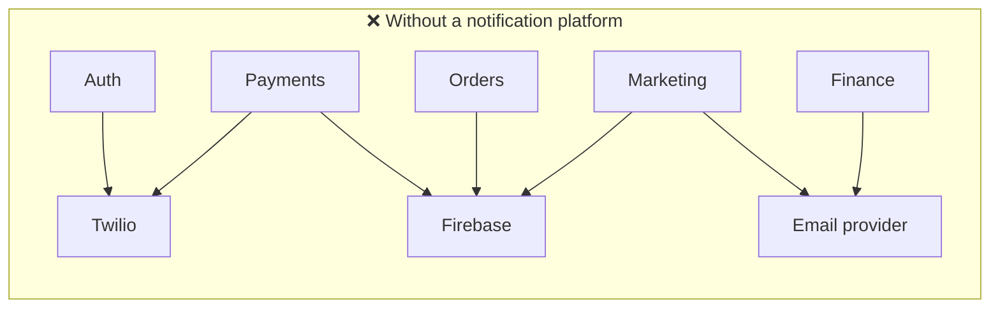
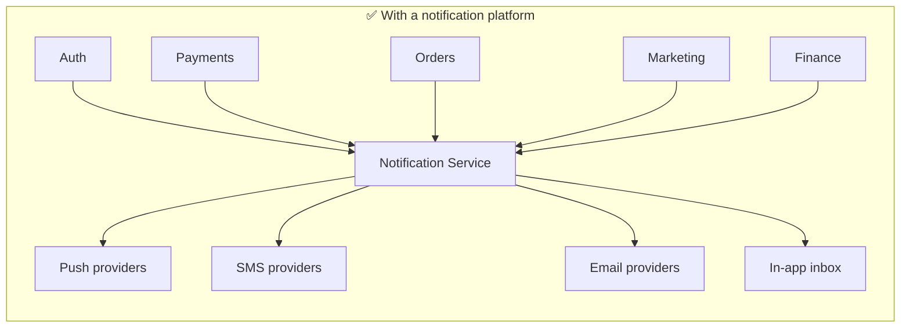
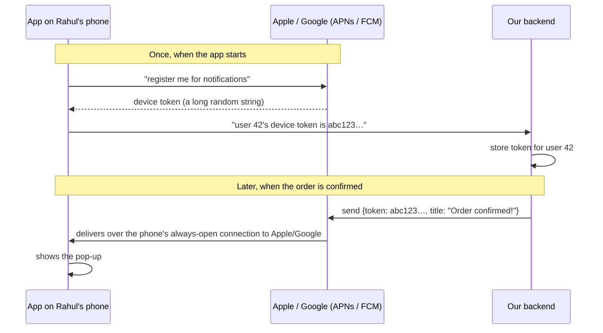
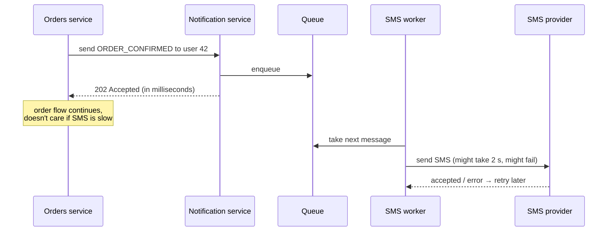

# Start Here: What Is a Notification System? (Before the Interview)

> Every app you use sends you notifications. But "a notification system" isn't the thing on your phone. It's the **backend platform inside a company** that every team uses to reach users. This page shows it from both sides: what *you* experience as a user, and what the *company* struggles with if it doesn't have one.
>
> Time: ~15 minutes. Then: [L4](L4-mid.md) → [L5](L5-senior.md) → [L6](L6-staff.md).

---

## 1. The user's side: one food order, seven notifications

Rahul orders dinner on a food-delivery app. Count what reaches him:

| # | When | What he gets | Channel | Who inside the company sent it |
|---|---|---|---|---|
| 1 | Logs in | "Your OTP is 482913" | **SMS** | Auth team |
| 2 | Pays | "Payment of ₹420 successful" | **Push** + **SMS** | Payments team |
| 3 | Restaurant accepts | "Order confirmed! Arriving in 35 min" | **Push** | Orders team |
| 4 | Rider picks up | "Ravi is on the way 🛵" | **Push** + live update **in the app** | Delivery team |
| 5 | Delivered | "Enjoy your meal! Rate your order" | **Push** | Orders team |
| 6 | 5 minutes later | Invoice PDF | **Email** | Finance team |
| 7 | Next day 1 pm | "50% off biryani today only!" | **Push** | Marketing team |

And in the app, a 🔔 **bell icon with a red "3"** shows a list of recent ones. That's the **in-app inbox**.

Now imagine things going wrong, because they do go wrong in real apps:
- 😡 The OTP arrives **3 minutes late**. Rahul has already given up.
- 😡 He gets "Order delivered" **three times**.
- 😡 He turned off marketing notifications in settings, but still gets "50% off!" at **2 am**.
- 😡 The marketing team sends a campaign to 10 million users and **OTPs stop arriving for an hour**, because the SMS provider is busy with the campaign.

Every one of those is a real interview topic. Keep them in mind.

---

## 2. The company's side: why build a *central* system?

Without a central notification system, each of those 6 teams would:
- integrate with Apple's and Google's push services, an SMS provider and an email provider **themselves**, six times over,
- each store the user's phone number, email and device tokens separately,
- each implement retries when the SMS provider times out,
- and **none of them** would know that Rahul turned off marketing or that he already got 5 notifications today.





With a platform, a team just says **"send template `ORDER_CONFIRMED` to user 42 with `{eta: 35}`"**. The platform handles the rest: which channels, the user's language, opt-outs, quiet hours, retries, deduplication, tracking.

> 🛠️ **You already know a system like this from infra: Prometheus Alertmanager (or PagerDuty / Opsgenie).**
> Alerts come in from many sources, and Alertmanager decides *who* to notify, on *which channel* (Slack, email, PagerDuty), **deduplicates** repeated alerts, **groups** related ones into one message, respects **silences** and **inhibition**, and retries when Slack is down.
> A user-facing notification system is the same idea for customers instead of on-call engineers:
>
> | Alertmanager | Notification system |
> |---|---|
> | Routes (who gets which alert) | User preferences + channel selection |
> | Receivers (Slack, email, PagerDuty) | Channels (push, SMS, email, in-app) |
> | Deduplication of repeated alerts | **Idempotency**: don't send "delivered" 3 times |
> | Grouping (`group_wait`, `group_interval`) | **Batching / digests**: "You have 5 new messages" |
> | Silences | **Opt-outs, quiet hours** |
> | Retries when a receiver fails | **Retries with backoff, dead-letter queue** |

---

## 3. The features, one situation at a time

### 3.1 Channels: push, SMS, email, in-app
| Channel | Good for | Cost (rough) | Reliability / speed |
|---|---|---|---|
| **Push** (phone pop-up) | Real-time updates, re-engagement | ~free | Fast, but only if the app is installed and notifications are allowed |
| **SMS** | OTPs, critical alerts; works with no internet/app | **Expensive** (~₹0.1–0.25 per SMS in India, more internationally) | Reliable, a few seconds |
| **Email** | Receipts, long content, legal records | Very cheap | Slow-ish, may land in spam |
| **In-app** (bell icon, banners) | History, things that can wait until the user opens the app | Free | Only seen when the user is in the app |

👉 Interview: *one notification can go to several channels. How do you route and fan out per channel?*

### 3.2 Priority: an OTP is not a marketing message
The OTP must arrive in **seconds**. "50% off biryani" can arrive in 10 minutes and nobody cares. If both wait in the **same line**, a 10-million-user campaign delays every OTP behind it. That's the story from section 1.

👉 Interview: *separate queues / lanes per priority so bulk traffic can never block critical traffic.*

### 3.3 User preferences and opt-outs
Phone settings → your app → **Notifications**. On Android you'll see separate toggles like "Order updates", "Offers", "Chat". Each toggle is a **preference** the backend must check before sending. Plus legal rules: marketing SMS in India must respect DND/TRAI rules, and marketing emails need an unsubscribe link (CAN-SPAM, GDPR).

👉 Interview: *where are preferences stored, and how do you check them fast for every notification?*

### 3.4 Templates and languages
Teams don't send raw text. They send a **template ID + variables**: `ORDER_CONFIRMED {eta: 35}`. The platform renders "Order confirmed! Arriving in 35 min" in English, or the Hindi version for a user whose app language is Hindi.

👉 Interview: *template service, caching templates, versioning.*

### 3.5 Don't send it twice (deduplication)
The orders service sends "Order delivered", times out waiting for a reply, and **retries**. Now the platform has two requests. Without care, Rahul gets two notifications. Worse: a payment SMS sent twice looks like he was charged twice.

👉 Interview: ***idempotency keys***. The caller attaches a unique ID, and the platform drops duplicates.

### 3.6 Providers fail. Retry, but carefully
The SMS provider returns `503 Service Unavailable`. Retry? Yes, after a pause. Retry immediately 10 times? No, that's how you turn a provider hiccup into an outage (a **retry storm**). And some errors should never be retried: "invalid phone number" will be invalid forever.

👉 Interview: *exponential backoff, retryable vs permanent errors, dead-letter queue, failover to a second SMS provider.*

### 3.7 Don't spam (rate limits and frequency caps)
If 4 teams each send Rahul "just one" notification an hour, he gets 4 per hour and uninstalls the app. The platform enforces **"max N marketing notifications per user per day"**. It also respects the *providers'* limits: an SMS provider may only accept, say, 1,000 messages/second from your account.

👉 Interview: *per-user and per-provider rate limiting*. That's literally the [LLD Rate Limiter](../../../LLD/interviews/rate-limiter/README.md).

### 3.8 Scheduling and quiet hours
"Send at 9 am in each user's local time." "Don't send marketing between 10 pm and 8 am." So notifications sometimes need to **wait**.

👉 Interview: *delayed delivery, scheduler design, time zones.*

### 3.9 Broadcasts (one message → millions of users)
Marketing clicks "Send to all 10M users in Bangalore". One API call becomes **10 million** individual notifications, each needing preference checks and rendering, and it must not melt the providers or delay OTPs.

👉 Interview: ***fan-out***. Expanding one request into millions, in batches, throttled.

### 3.10 Tracking: was it delivered? opened?
Marketing wants to know: sent → delivered → opened → clicked. Support wants to answer "the user says they never got the OTP". Providers report delivery status back via **webhooks** (they call *our* URL later).

👉 Interview: *status tracking, an append-heavy event store, analytics.*

---

## 4. How a push notification actually reaches a phone

This mechanism is the one most people have never seen, and the interview assumes it:



Key facts:
- **We never talk to the phone directly.** Apple (APNs) and Google (FCM) keep one connection open to every phone. Apps can't each keep their own (battery!). We hand the message to them.
- A user can have **several devices**, so several tokens.
- Tokens **expire or change** (app reinstalled, phone reset). The provider tells us "invalid token" and we must delete it.
- SMS and email work similarly: we hand messages to a **provider** (Twilio, MSG91, Amazon SES, SendGrid…), which delivers them.

### And why it's asynchronous
When the orders service confirms an order, it **must not wait** for the SMS to be delivered:



`202 Accepted` means "got it, will do it later". The **queue** is the buffer that absorbs spikes and failures. More in [message queues](../../technologies/message-queues.md).

---

## 5. Try it yourself (10 minutes, all real)

1. **Your phone's notification settings.** Open Settings → Apps → (any food/shopping app) → Notifications. Count the categories ("Order updates", "Promotions"…). Each is a preference the backend checks before sending.
2. **Send yourself a real push notification with one `curl`.** [ntfy.sh](https://ntfy.sh) is a free, open-source push service. Install the **ntfy** app on your phone, subscribe to a topic with a random name (e.g. `rahul-sd-test-8271`), then from your laptop:
   ```sh
   curl -d "Order confirmed! Arriving in 35 min" ntfy.sh/rahul-sd-test-8271
   ```
   Your phone buzzes. You just did what the "push worker" does: hand a message to a push service, which delivers it to the device. (Topics are public. Use a random name and don't send anything private.)
3. **Look inside a marketing email.** In Gmail open any promotional email → ⋮ → **Show original**. Look for:
   - `List-Unsubscribe:` is the header that makes Gmail's "Unsubscribe" button work (a legal/preference requirement).
   - `Received: from ... amazonses.com` / `sendgrid.net` / similar shows which **email provider** the company used.
4. **If you run Prometheus at work:** read your `alertmanager.yml`. `route`, `receivers`, `group_by`, `repeat_interval`, `inhibit_rules` map one-to-one onto this interview (see the table in section 2).

---

## 6. From experience to requirements

| What you experienced | Requirement | Type |
|---|---|---|
| Teams send "template + user + data" | `send(userId, templateId, params, channels?)` API | Functional |
| Push, SMS, email, bell icon | Multiple **channels** | Functional |
| Toggles in phone settings | **User preferences / opt-out** honoured on every send | Functional |
| Hindi vs English | **Templates + localisation** | Functional |
| "Send at 9 am" / no 2 am offers | **Scheduling, quiet hours** | Functional |
| Campaign to 10M users | **Broadcast / fan-out** | Functional |
| Bell icon with history | **In-app inbox** (read/unread) | Functional |
| Sent/delivered/opened stats | **Delivery tracking** | Functional |
| OTP in seconds, even during a campaign | **Priority isolation**, low latency for critical | Non-functional |
| Never "delivered" ×3 | **Deduplication / idempotency** | Non-functional |
| SMS provider down → still delivered later | **Reliability**: at-least-once with retries, no message lost | Non-functional |
| Max N promos per day | **Rate limiting / frequency caps** | Non-functional |
| Millions of notifications per minute at peak | **Scalability** | Non-functional |

---

## 7. Mini glossary

| Term | Meaning in plain words |
|---|---|
| **Channel** | How the message travels: push, SMS, email, in-app |
| **Provider** | External company that actually delivers: APNs/FCM (push), Twilio/MSG91 (SMS), SES/SendGrid (email) |
| **Device token** | The address of one app install on one phone, issued by Apple/Google |
| **Template** | Message text with placeholders: `"Arriving in {eta} min"` |
| **Idempotency key** | Unique ID per logical notification so retries don't create duplicates |
| **Queue** | A buffer of work items: producers add, workers take. Absorbs spikes and failures |
| **Retry with backoff** | Try again after waiting longer each time (1 s, 2 s, 4 s…) |
| **Dead-letter queue (DLQ)** | Where messages go after failing too many times, for inspection instead of infinite retries |
| **Fan-out** | Turning one request ("send to all of Bangalore") into many individual sends |
| **Webhook / callback** | The provider calls *our* URL later to report delivery status |
| **Quiet hours** | Time window when non-critical notifications are held |
| **202 Accepted** | HTTP status for "received, will process later" |

➡️ **Now design it:** [L4-mid.md](L4-mid.md)
