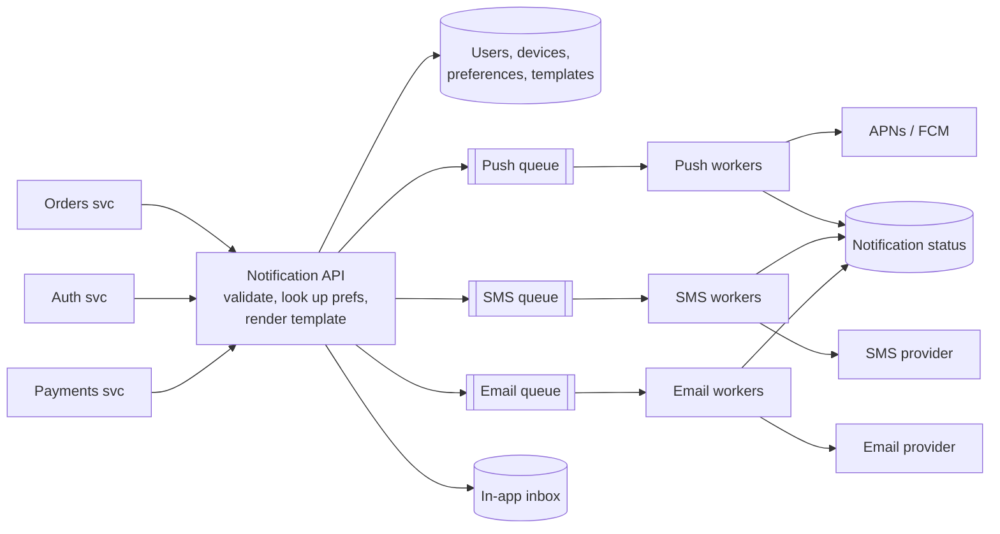

# Notification System — L4 (Mid-level / SDE2) Interview

> **Level expectation:** a correct asynchronous design (SDE2 = software development engineer 2, roughly 2-5 years' experience). The API accepts and enqueues, workers per channel call providers, preferences are respected, failures are retried, and status is recorded. Handle follow-ups (duplicates, priorities, broadcasts) sensibly when asked.

> 🆕 New to notification systems? Read [00-understand-the-product.md](00-understand-the-product.md) first. It explains channels, device tokens, providers and why everything is asynchronous.

Legend: **🧑‍💼 Interviewer** · **🧑‍💻 Candidate** · **📝 Note** = commentary for you.

---

## 1. Clarifying requirements

**🧑‍💼 Interviewer:** Design a notification system for our company's apps.

**🧑‍💻 Candidate:** Some questions first:
- Which channels? Push, SMS, email, in-app?
- Who calls this system: other internal services, or also a marketing tool for broadcasts?
- Are there different kinds of notifications, like OTPs vs promotions?
- Do users control what they receive?
- Do we need to track delivery?

**🧑‍💼 Interviewer:** All four channels. Internal services call it; marketing broadcasts are a stretch goal. Yes, OTPs and promotions both. Users have preferences. Basic delivery status is enough.

**🧑‍💻 Candidate:** Functional requirements:
1. `send(userId, templateId, params)`: the platform picks channels, renders text, delivers.
2. Channels: push (iOS/Android), SMS, email, in-app inbox.
3. Respect user **preferences** (opt-out per category and channel).
4. Record **status** per notification: queued → sent → failed. (A *queue* is a buffer between the sender and the workers; *providers* are outside services such as APNs/FCM for push, an SMS gateway or an email service.)

Non-functional:
1. **Reliable:** an accepted notification must not be lost, even if a provider is down for a while.
2. **Doesn't slow callers down:** the order service shouldn't wait for an SMS to go out.
3. **Scalable** to hundreds of millions of notifications/day.
4. **Low latency for critical ones** (OTP within a few seconds).

> 📝 **Note:** "Doesn't slow callers down" is the requirement that justifies the whole asynchronous design. Say it explicitly.

---

## 2. Back-of-the-envelope estimates

**🧑‍💻 Candidate:** Assume **50M daily active users**, **~10 notifications per user per day**. (Method: [back-of-the-envelope](../../concepts/back-of-the-envelope.md).)

| What | Calculation | Result |
|---|---|---|
| Notifications/day | 50M × 10 | **500M/day** |
| Average rate (QPS = queries per second) | 500M / ~86,400 s | **~6,000/s** |
| Peak (campaigns, evenings) | ~5× average | **~30,000/s** |
| By channel | push 80% / email 15% / SMS 5% | 400M push, 75M email, **25M SMS**/day |
| Status records | 500M × ~1 KB | **~500 GB/day** (≈15 TB for 30 days) |

**🧑‍💻 Candidate:** Takeaways:
- 30k/s at peak means the work must be **spread across many workers**, with a buffer for spikes.
- 500 GB/day of status data is big. We need a retention policy and a store that handles heavy writes.
- 25M SMS/day costs real money (₹ lakhs per day), so we don't want to send SMS when push would do.

---

## 3. API

```http
POST /v1/notifications
{
  "userId": "u_42",
  "templateId": "ORDER_CONFIRMED",
  "params": { "eta": 35, "restaurant": "Biryani House" },
  "category": "ORDER_UPDATES"
}
→ 202 Accepted
{ "notificationId": "n_8f3a..." }
```

```http
GET /v1/notifications/{notificationId}          → status per channel
GET /v1/users/{userId}/inbox?cursor=...         → in-app notifications (bell icon)
PUT /v1/users/{userId}/preferences              → { "PROMOTIONS": { "push": false, "sms": false } }
POST /v1/users/{userId}/devices                 → register a device token from the app
```

**🧑‍💼 Interviewer:** Why `202` and not `200`?

**🧑‍💻 Candidate:** `200 OK` would suggest "done". We haven't delivered anything yet, we've only **accepted** it into a queue. `202 Accepted` means exactly that: "received, will be processed". The caller gets an ID to check status later.

---

## 4. High-level design



**🧑‍💻 Candidate:** Walking through a send:

1. **Notification API** (stateless servers, i.e. they keep no per-user memory between requests, behind a [load balancer](../../technologies/load-balancer.md), which spreads requests over the servers) receives the request.
2. Loads the user's **preferences**, contact info and device tokens, and the **template**. Drops channels the user opted out of.
3. Renders the text per channel ("Order confirmed! Arriving in 35 min").
4. Puts **one message per channel** on that channel's **[queue](../../technologies/message-queues.md)**, writes the in-app entry to the inbox, and returns `202`.
5. **Channel workers** pull from their queue and call the external **[provider](../../technologies/push-email-sms-providers.md)** (APNs/FCM for push, an SMS gateway, an email service).
6. Workers record the result in the **status** store.

**🧑‍💼 Interviewer:** Why a separate queue per channel instead of one queue?

**🧑‍💻 Candidate:** The channels behave very differently. Email providers can be slow; the SMS provider might be down. With one shared queue, a stuck SMS provider would block push messages queued behind it. Separate queues mean **each channel fails and scales independently**: we can run 50 push workers and 10 SMS workers.

### Why a queue at all?

**🧑‍💻 Candidate:** Three reasons:
1. **Callers don't wait**: enqueueing takes milliseconds; delivery can take seconds.
2. **Absorbs spikes**: 30k/s at peak goes into the queue; workers drain it at their own pace.
3. **Survives failures**: if the SMS provider is down for 5 minutes, messages wait in the queue instead of being lost.

### Data model

```sql
-- Who to reach and how (PostgreSQL)
users(user_id PK, email, phone, locale, timezone)
devices(device_token PK, user_id, platform /* IOS | ANDROID */, updated_at)  -- index on user_id
preferences(user_id, category, channel, enabled, PRIMARY KEY(user_id, category, channel))
templates(template_id, channel, locale, body, version)

-- What happened (write-heavy)
notifications(notification_id, user_id, channel, template_id, status, provider_msg_id, created_at, updated_at)
```

**🧑‍💻 Candidate:** Users, devices, preferences and templates are small, relational and read-heavy → [PostgreSQL](../../technologies/postgresql.md) (a relational SQL database) with a [Redis](../../technologies/redis.md) cache (an in-memory key-value store) in front of preferences and templates, since every send reads them.

The `notifications` table gets ~6k inserts/s plus status updates. Postgres can handle that if we **partition by day** (one physical piece of the table per day) and drop partitions older than 30 days (dropping a partition is instant; `DELETE`-ing billions of rows is not). If it grows further, a write-optimised store like [Cassandra](../../technologies/cassandra.md) (a distributed database built for very high write rates) fits better. That's an L5 discussion.

---

## 5. Deep dives

### 5.1 How push actually works (device tokens)

**🧑‍💻 Candidate:** The mobile app registers with Apple (APNs) or Google (FCM) and gets a **device token**, then sends it to us via `POST /devices`. To push, we send `{token, title, body}` to APNs/FCM and they deliver it to the phone. A user can have multiple devices → we send to each token. When APNs/FCM respond "token invalid/unregistered" (app uninstalled), we **delete** that token, or we waste calls forever.

### 5.2 Retries

**🧑‍💼 Interviewer:** The SMS provider returns an error. What happens?

**🧑‍💻 Candidate:** Depends on the error:
- **Temporary** (timeout, `503` "service unavailable", `429 too many requests` meaning we're being rate limited) → retry later.
- **Permanent** (invalid phone number, user blocked) → don't retry. Mark `failed`.

For temporary errors, retry with **increasing waits**: 1 s, 2 s, 4 s, 8 s… (exponential backoff: the wait doubles each time). If it still fails after, say, 5 attempts, move the message to a **dead-letter queue (DLQ)** so an engineer can look at it, instead of retrying forever. Details: [retries, backoff & DLQ](../../concepts/retries-backoff-and-dlq.md).

**🧑‍💼 Interviewer:** How does the message "wait" before retrying?

**🧑‍💻 Candidate:** With SQS-style queues (AWS's managed queue service), the worker simply doesn't acknowledge ("ack") the message and sets a **visibility timeout / delay** (how long the message stays hidden before another worker may take it); the queue redelivers it later. A worker must **not** `Thread.sleep()` while holding the message: that wastes a worker and blocks everything behind it.

### 5.3 The in-app inbox

**🧑‍💻 Candidate:** In-app notifications are just rows: `inbox(user_id, created_at, notification_id, title, body, read)`. The app calls `GET /inbox` when opened and shows the unread count on the bell. For live updates while the app is open, the simplest approach is polling every 30–60 s. [WebSockets](../../technologies/websockets-and-sse.md) (a long-lived two-way connection between app and server) are better for real-time but add complexity; I'd start with polling.

---

## 6. Follow-ups

**🧑‍💼 Interviewer:** The orders service calls you, times out, and retries. Now the user gets two "order confirmed" messages. How do you prevent that?

**🧑‍💻 Candidate:** Ask callers to send an **idempotency key** (a unique ID per logical request so repeats are recognised), e.g. `orderId + "ORDER_CONFIRMED"`. Before enqueueing, we check whether we've seen that key: store it in Redis with `SET key 1 NX EX 86400` (`NX` = set only if the key doesn't exist, `EX 86400` = expire after 86,400 s, i.e. a day; check-and-set happens as one atomic step). If `SET` fails, it's a duplicate: return the original `notificationId` and don't enqueue again. ([Idempotency](../../concepts/idempotency-and-delivery-semantics.md).)

**🧑‍💼 Interviewer:** Marketing sends a campaign to 10M users at the same time OTPs are being sent. Problem?

**🧑‍💻 Candidate:** Yes: OTPs sit in the same SMS queue behind millions of promotions. Fix: **separate queues by priority**: `sms-critical` and `sms-bulk`, with dedicated workers for critical. Then a campaign can't delay OTPs. (L5 takes this further.)

**🧑‍💼 Interviewer:** How would you send to 10M users?

**🧑‍💻 Candidate:** Not in the API request: a loop over 10M users would take ages and time out. The API accepts a **broadcast job** (`audience: "city=Bangalore"`), and a background job reads users in batches of, say, 1,000 and enqueues individual notifications into the bulk queues. ([Fan-out](../../concepts/fan-out.md).)

**🧑‍💼 Interviewer:** What if the Notification API crashes after enqueueing push but before enqueueing SMS?

**🧑‍💻 Candidate:** The caller didn't get `202`, so it retries; with the idempotency key we'd skip... actually we'd skip the whole thing, and SMS would be lost. Better: the API enqueues **one** message to a single "notifications" queue, and a separate **router** step (a component that fans one message out to per-channel messages) expands it into per-channel messages. Each step is then a single enqueue, and retries are safe.

> 📝 **Note:** It's fine at L4 to correct yourself mid-answer. Interviewers value noticing the problem over pretending the first answer was perfect.

---

## 7. What the interviewer was evaluating (L4)

- [ ] Asked about channels, callers, priority, preferences, tracking
- [ ] Estimated volume and drew conclusions (spread work, retention, SMS cost)
- [ ] `202 Accepted` + asynchronous processing, and could say why
- [ ] Queue per channel; workers; external providers
- [ ] Preferences checked before sending; device tokens understood
- [ ] Retryable vs permanent errors, backoff, DLQ
- [ ] Reasonable answers on duplicates, priorities and broadcasts when prompted

## 8. Common mistakes at this level

| Mistake | Why it hurts |
|---|---|
| Calling the SMS/email provider synchronously inside the API request | Caller latency depends on a third party; provider outage = your outage |
| One queue for everything | One slow channel or one campaign blocks everything |
| Retrying immediately in a tight loop | Hammers a struggling provider (retry storm) |
| Retrying "invalid phone number" | It will never succeed; wastes money and capacity |
| `Thread.sleep` inside the worker for backoff | Holds a worker hostage; use queue delays |
| Never deleting invalid device tokens | Ever-growing wasted calls and provider throttling |
| Keeping notification status forever with `DELETE` cleanup | Partition by day and drop partitions / use TTL (time to live: rows auto-expire) |

➡️ Next: [L5-senior.md](L5-senior.md)
