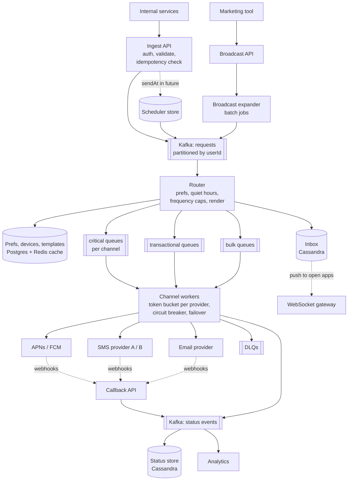
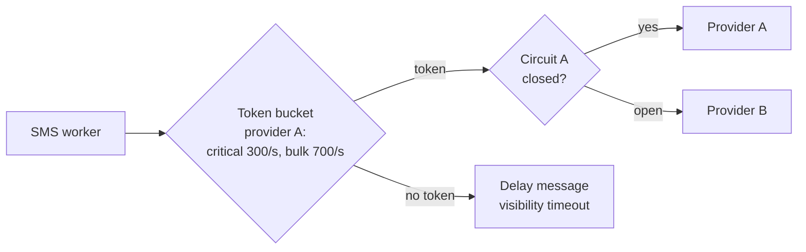
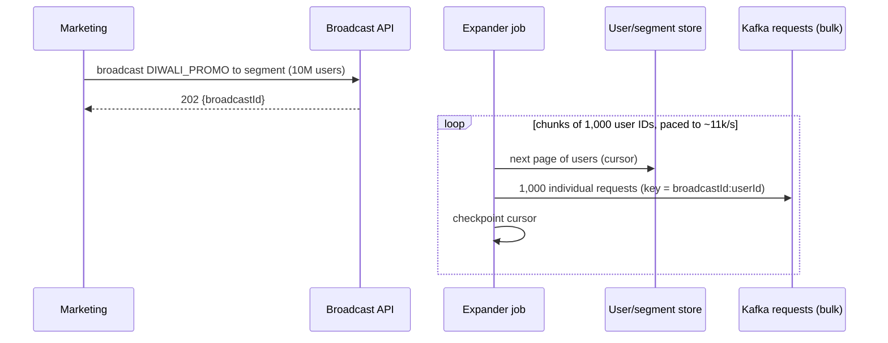

# Notification System — L5 (Senior) Interview

> **Level expectation:** you drive. Numbers shape decisions. You design **priority isolation end to end**, a real **retry and idempotency** story, **provider rate limits and failover**, **scheduling**, and **broadcast fan-out**, and you raise failure modes without being asked. Read [L4-mid.md](L4-mid.md) first; this file covers what's new.

Legend: **🧑‍💼 Interviewer** · **🧑‍💻 Candidate** · **📝 Note** = commentary for you.

---

## 1. Requirements

**🧑‍💻 Candidate:** I'll propose scope; correct me.

**Functional:** `send` (single), `broadcast` (segment of users), four channels, templates + localisation, preferences + opt-outs, **scheduling** ("at 9 am local") and **quiet hours**, in-app inbox, delivery status (sent / delivered / failed / opened).

**Non-functional, with numbers:**

| Property | Critical (OTP, security, payments) | Transactional (order updates) | Bulk (marketing) |
|---|---|---|---|
| End-to-end latency (accept → handed to provider) | p99 **< 2 s** | p99 < 30 s | minutes are fine |
| Loss | never | never | rare loss tolerable |
| Duplicates | very bad (two OTPs confuse users) | bad | annoying |
| Under overload | **always served first** | served | **shed / delayed first** |

**🧑‍💻 Candidate:** These three classes drive the whole design. Delivery guarantee: **at-least-once with deduplication**. True exactly-once to a phone isn't achievable across third-party providers; I'll come back to that.

> 📝 **Note:** Senior signal: a requirements table **per priority class**, not one latency number for everything.

---

## 2. Estimates that drive decisions

Base: 50M DAU × 10/day = **500M/day ≈ 6k/s**, peak ~**30k/s** (see [L4](L4-mid.md#2-back-of-the-envelope-estimates)).

| Metric | Value | **Design consequence** |
|---|---|---|
| Peak 30k/s | ~30k msgs/s through the pipeline | Partitioned log/queues; horizontally scaled stateless workers |
| Broadcast: 10M users in ≤ 15 min | 10M / 900 s ≈ **11k/s** extra | Bulk lane needs its own capacity *and* must be throttled so it can't eat critical capacity |
| SMS 25M/day ≈ 290/s avg, ~1.5k/s peak | Providers cap per-account throughput (often ~100s–1,000s msg/s) | **Per-provider token bucket**; multiple providers |
| Preferences lookup per send | 30k/s reads | Redis cache, ~100% hit rate. Preferences change rarely |
| Status events | ~3 events per notification (sent, delivered, opened) → ~1.5B/day | Append-only, write-optimised store ([Cassandra](../../technologies/cassandra.md)), TTL 30–90 days |
| Inbox | ~50 items/user kept, 90 days | Partition by `user_id`, cluster by time desc |

---

## 3. API additions

```http
POST /v1/notifications
Idempotency-Key: order-981234:ORDER_CONFIRMED        ← required for critical/transactional
{ "userId": "u_42", "templateId": "ORDER_CONFIRMED", "params": {...},
  "priority": "TRANSACTIONAL", "sendAt": null }

POST /v1/broadcasts
{ "segment": "city=BLR AND last_active<30d", "templateId": "DIWALI_PROMO",
  "priority": "BULK", "sendAt": "2026-11-01T09:00", "respectLocalTime": true }
→ 202 { "broadcastId": "b_77" }

POST /v1/provider-callbacks/{provider}       ← delivery receipts (webhooks) from providers
```

**🧑‍💻 Candidate:** `priority` is **not** caller-controlled freely. Each template is registered with an allowed priority class, otherwise every team marks everything `CRITICAL` within a month.

---

## 4. High-level design



**🧑‍💻 Candidate:** The main decisions:

1. **Two kinds of messaging, chosen deliberately:**
   - **[Kafka](../../technologies/kafka.md)** for the high-volume *streams*: incoming requests and status events. High throughput, replayable, multiple consumers (router, analytics, audit) read the same data.
   - **[Message queues](../../technologies/message-queues.md)** (SQS / RabbitMQ) for the per-channel *delivery work*: per-message ack, visibility timeouts, delayed redelivery and built-in DLQs are exactly what retries need. In Kafka, one slow or retrying message blocks its whole partition (head-of-line blocking) unless you build retry topics yourself.
2. **Router is separate from ingest.** Ingest does the minimum (validate, dedupe, append to Kafka) so it's fast and almost never fails. All the logic that can be slow (prefs, rendering, caps) happens after the request is durable.
3. **Lanes by priority × channel**, each with its own workers and its own share of the provider quota.

---

## 5. Deep dives

### 5.1 Priority isolation, end to end

**🧑‍💻 Candidate:** Separate queues aren't enough on their own. Isolation must hold at **every shared resource**:

| Shared resource | How critical traffic is protected |
|---|---|
| Queues | Separate queue per (priority, channel) |
| Workers | Separate worker pools, so bulk workers can't steal critical capacity |
| **Provider quota** (e.g. 1,000 SMS/s per account) | Split the token bucket: critical reserved 300/s; bulk only gets what's left. Better still: a **separate provider account or sender ID** for OTPs |
| Router | Critical requests could get a dedicated Kafka topic and router pool |

**🧑‍💼 Interviewer:** Why is the provider quota the important one?

**🧑‍💻 Candidate:** Because it's the one people forget. You can have perfect queues, but if bulk workers push 1,000 SMS/s into a provider that accepts 1,000/s, the provider starts returning `429` to **everyone**, OTPs included. The bottleneck just moved downstream.

### 5.2 Idempotency at both ends

See [idempotency & delivery semantics](../../concepts/idempotency-and-delivery-semantics.md).

**Ingest (caller retries):**
```text
SET idem:{tenant}:{key} {notificationId} NX EX 86400
  OK   → new request: append to Kafka, return 202 {notificationId}
  nil  → duplicate: GET the stored notificationId, return 202 with it (same response as the first time)
```
Redis alone could lose keys on failover, so the critical path also writes `(idempotency_key)` with a unique constraint into a small durable table. Redis is the fast path, the DB is the guarantee.

**Producer side, the outbox:** what if the *orders service* commits the order but crashes before calling us? The notification is lost. Fix on their side: **transactional outbox**. Write the "notify" row in the same DB transaction as the order; a relay publishes outbox rows to us and retries until acknowledged. ([Fan-out & outbox](../../concepts/fan-out.md).)

**Worker side (queue redelivery):** a worker sends the SMS, then crashes before acking → the queue redelivers → duplicate SMS. Mitigation: before sending, check the status store for `(notificationId, channel) = SENT`; after the provider accepts, write `SENT` and then ack. That leaves a window of milliseconds between "provider accepted" and "we wrote SENT", which is the irreducible gap. **That's why the guarantee is at-least-once, and why OTP templates say "ignore if you received this already."**

> 📝 **Note:** Explaining *exactly where* the duplicate window remains, instead of claiming exactly-once, is a strong senior signal.

### 5.3 Retries that don't make things worse

See [retries, backoff & DLQ](../../concepts/retries-backoff-and-dlq.md).

| Response | Action |
|---|---|
| `2xx` accepted | Write `SENT`, ack |
| `429` / `503` / timeout | Retry with **exponential backoff + jitter**: `delay = random(0, min(cap, base × 2^attempt))` |
| `400 invalid number`, `410 token unregistered` | **Permanent**: mark failed, delete bad device token, ack. Never retry |
| Max attempts reached | → **DLQ**, alert if DLQ rate > threshold |

- **Jitter** matters: if the provider blips and 50k messages all retry at exactly +2 s, we hit it with a synchronized wave.
- **Critical messages get a deadline, not just an attempt count.** An OTP is useless after ~5 minutes. Retrying it at minute 20 is worse than dropping it, because the user may already have requested a new one.
- **Circuit breaker per provider:** if > 50% of calls fail in 30 s, stop calling for a cool-down and **fail over** to provider B (SMS) instead of queueing up retries.

### 5.4 Provider rate limiting and failover



Since we run many worker instances, the token bucket must be **shared** → a Redis-backed limiter, exactly the [LLD rate limiter L6 design](../../../LLD/interviews/rate-limiter/L6-staff.md) (Lua script, atomic). Same mechanism for **per-user frequency caps** ("max 3 promos/day"), checked in the router.

### 5.5 Scheduling and quiet hours

**🧑‍💻 Candidate:** Two needs: `sendAt` in the future, and holding non-critical messages during the user's night.

- Store scheduled items in a **time-bucketed table**: `scheduled(bucket_minute, notification_id, payload)`. A scheduler polls the *current* minute bucket every few seconds and pushes due items into Kafka. Many schedulers can split buckets by hash to scale.
- Alternative for small scale: a Redis sorted set scored by fire time (`ZRANGEBYSCORE 0 now`). Simple, but memory-bound and you must handle Redis durability.
- **Quiet hours** reuse this: the router sees `22:00–08:00` in the user's timezone for a non-critical message and reschedules it for 08:00 local, **plus a random spread of a few minutes**, so we don't fire 5M notifications at exactly 08:00:00.

### 5.6 Broadcast fan-out

See [fan-out](../../concepts/fan-out.md).



- **Chunked + checkpointed:** if the expander crashes at user 6,200,000, it resumes from the checkpoint. The idempotency key `broadcastId:userId` makes re-sent chunks harmless.
- **Paced:** the expander itself is rate-limited, so a campaign can't flood the bulk lane faster than providers drain it.
- **Kill switch:** marketing realises the coupon code is wrong → `cancel broadcastId`; expander stops, and workers drop queued messages whose broadcast is cancelled.

### 5.7 Delivery tracking and the inbox

- Providers call our **webhook** with `providerMsgId → delivered/failed`. The callback API verifies the provider's signature (otherwise anyone can fake receipts) and appends to the status Kafka topic.
- **Status store** in [Cassandra](../../technologies/cassandra.md): partition `(notification_id)` for lookups; a second table partitioned by `(user_id, day)` for "show me what we sent this user" (support). TTL 90 days.
- **Inbox:** `inbox(user_id, created_at DESC, …)` in Cassandra, one partition per user, a natural fit. Unread count kept as a counter in Redis. Live delivery to open apps via a [WebSocket gateway](../../technologies/websockets-and-sse.md); apps that are closed just fetch on open.

---

## 6. Failure modes (raise them yourself)

| Failure | Impact | Mitigation |
|---|---|---|
| SMS provider A down | SMS retries pile up | Circuit breaker → provider B; critical first; alert |
| Bulk campaign much larger than expected | Bulk queues back up for hours | Fine by design; critical lanes unaffected. Alert on queue age, not depth |
| Redis (prefs cache) down | Router falls back to Postgres | Postgres sized for cache-miss load or router degrades: critical only |
| Router bug sends wrong text | Millions of bad messages | Template versioning + canary rollout of template changes; broadcast kill switch |
| Webhook endpoint down | Delivery status delayed | Providers retry webhooks; status eventually correct; nothing user-facing breaks |
| Device token churn | Wasted calls, provider throttling | Delete on `unregistered`; periodic cleanup of tokens not seen in 60 days |
| Kafka partition lag | Delays for users hashed to that partition | Monitor consumer lag per partition; enough partitions for parallelism |

> 📝 **Note:** "Alert on **queue age** (how old is the oldest message), not queue depth" is a classic production lesson. A queue of 1M bulk messages is normal; one OTP waiting 30 s is an incident.

---

## 7. Follow-ups

**🧑‍💼 Interviewer:** Why partition the requests topic by `userId`?

**🧑‍💻 Candidate:** Ordering per user: "Order confirmed" should come before "Rider picked up". Kafka only orders within a partition, so all of one user's messages go to the same partition. Downside: a user-heavy partition can lag. Acceptable, since no single user generates much traffic. (For broadcasts the key is still userId, which spreads evenly.)

**🧑‍💼 Interviewer:** But the per-channel queues aren't ordered. Couldn't "picked up" arrive before "confirmed"?

**🧑‍💻 Candidate:** Yes, after retries anything can reorder. Two cheap mitigations: put a sequence/timestamp in the payload so the app shows the inbox in the right order, and for push use **collapse keys** (APNs/FCM can replace an older notification with the same key), so "Rider picked up" simply replaces "Order confirmed" on the lock screen. Strict ordering across retries would cost far more than it's worth.

**🧑‍💼 Interviewer:** How do you test this whole thing in production?

**🧑‍💻 Candidate:** Synthetic canaries: every minute, send a real OTP-class notification to a test phone/number we own and measure end-to-end time. That's the most honest signal that critical delivery works, because it includes the provider.

---

## 8. What the interviewer was evaluating (L5)

- [ ] Requirements per **priority class**; at-least-once + dedup stated as the guarantee
- [ ] Estimates drove decisions (lanes, provider quotas, Cassandra for status, cache for prefs)
- [ ] Chose Kafka vs message queues **per purpose**, with reasons
- [ ] Priority isolation at queues, workers **and provider quota**
- [ ] Idempotency at ingest, producer (outbox) and worker, with the remaining duplicate window explained
- [ ] Retry classification, backoff + jitter, deadlines for OTPs, DLQ, circuit breaker, failover
- [ ] Scheduling, quiet hours with spread, broadcast expansion with checkpoints and kill switch
- [ ] Failure modes and the "queue age" alerting insight

## 9. Common mistakes at this level

| Mistake | Why it hurts at L5 |
|---|---|
| Priority queues but one shared provider quota | Isolation breaks at the provider: OTPs get `429` during campaigns |
| Claiming "exactly-once delivery" | Impossible across a third-party boundary; shows a gap in fundamentals |
| Same retry policy for OTP and marketing | An OTP retried after 20 minutes is harmful |
| Broadcast expansion without checkpoints or idempotent keys | A crash means re-sending to millions, or silently missing millions |
| Kafka for everything including per-message delayed retries, without discussing head-of-line blocking | Shows you've not operated it |
| Firing quiet-hours backlog at exactly 08:00:00 | Self-inflicted thundering herd |

⬅️ Previous: [L4-mid.md](L4-mid.md) · ➡️ Next: [L6-staff.md](L6-staff.md)
