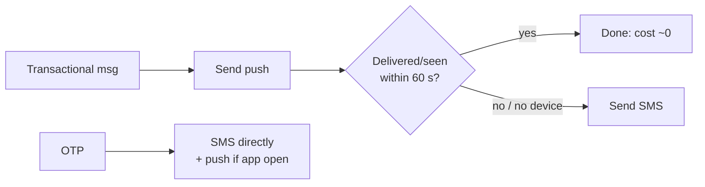

# Notification System — L6 (Staff) Interview

> **Level expectation:** the L5 pipeline is assumed and covered in minutes. The interview is about running this as a **company-wide platform**: what you actually promise callers, fairness between teams, cost (SMS dominates), fraud, compliance, SLOs per priority, organisational adoption, and build vs buy. Read [L5-senior.md](L5-senior.md) first.

Legend: **🧑‍💼 Interviewer** · **🧑‍💻 Candidate** · **📝 Note** = commentary for you.

---

## 1. Shape the problem before designing it

**🧑‍💼 Interviewer:** Design a notification platform for the company.

**🧑‍💻 Candidate:** First, what's driving this? The answer changes what we build:

| Driver | What we optimise |
|---|---|
| "OTPs are unreliable and we lose logins" | Critical path latency and reliability. Maybe that's a 2-month project, not a platform |
| "Users complain about spam, uninstalls are up" | Central frequency caps, preference centre, relevance |
| "Our SMS bill is ₹X crore/year" | Channel choice and cost routing |
| "Every team integrates providers separately, compliance found unsubscribe bugs" | Platform consolidation, compliance by construction |

**🧑‍💼 Interviewer:** All of them, honestly. Twelve teams send notifications today; each does it their own way.

**🧑‍💻 Candidate:** Then this is a **platform with internal customers**, and success is as much adoption and governance as architecture. My requirements, including what I'd push back on:

- **The delivery contract I'll offer teams:** "Once we return `202`, we will hand your message to a provider **at least once**, or tell you it failed, within the SLO for its priority class. Duplicates are rare but possible." I'll push back on any team asking for "exactly once" or "guaranteed delivered to the phone". We don't control the phone, the carrier, or Apple.
- **SLOs per class** (measured from accept to provider acceptance, and separately to delivery receipt where providers give one):
  - Critical: 99.9% within 5 s
  - Transactional: 99.5% within 60 s
  - Bulk: best effort, completes within the campaign window
- **Fairness:** no team can degrade another team's notifications.
- **Cost visibility:** each team sees what its notifications cost.
- **Compliance by default:** consent, unsubscribe, DND, retention: impossible to get wrong from a caller's side.

> 📝 **Note:** Writing the guarantee as a *contract teams can build on* (including its limits) is the staff framing. L5 says "at-least-once"; L6 explains what that means for the teams calling you and turns it into an SLO.

---

## 2. Cost is an architecture input here

**🧑‍💻 Candidate:** Rough unit costs: push ≈ free, email ≈ fractions of a paisa, **SMS ≈ ₹0.1–0.25 domestic, ₹2–6+ international**. With 25M SMS/day (from [L4 estimates](L4-mid.md#2-back-of-the-envelope-estimates)): 25M × ₹0.1–0.25 ≈ **₹25–60 lakh per day ≈ ₹8–19 crore per month**. That's probably the platform's single biggest cost, far bigger than all the servers. Every 1% of SMS we avoid saves lakhs per month.

Design responses:
1. **Channel cascade for transactional messages:** push first; if the provider's delivery receipt or the in-app "seen" event doesn't arrive within N seconds, fall back to SMS. Only OTPs and legally required messages go straight to SMS.
2. **Cost-aware provider routing:** pick the cheapest provider that meets the route's quality (per country/operator), and re-evaluate weekly from delivery-rate data.
3. **Per-team cost attribution:** a dashboard and monthly budget per tenant. Visibility alone changes behaviour.
4. **Dedup and frequency caps are cost controls too.**

---

## 3. Multi-tenant fairness

**🧑‍💻 Candidate:** Priority lanes (L5) protect critical from bulk. They **don't** protect team A's transactional traffic from team B's transactional traffic. If one team's bug sends 50M "order updates" in a loop, everyone's transactional lane slows.

- **Per-tenant quotas** at ingest (token bucket per tenant per class); excess gets `429` back to *that team*, and it's their bug to fix.
- **Weighted fair queuing** inside the router/workers: round-robin across tenants within a lane so one tenant's backlog can't starve others.
- **Cells for the biggest risks:** OTP/auth traffic runs in its own isolated deployment (own Kafka topic, router, workers, provider accounts). A bad deploy of the general pipeline cannot touch logins.
- **Template registry with review:** a new template declares its priority class, channels and expected volume; critical templates need platform approval. Governance as code.

---

## 4. Fraud: SMS pumping

**🧑‍💼 Interviewer:** Anything security-specific?

**🧑‍💻 Candidate:** Yes, and it's a cost and security problem specific to OTPs: **SMS pumping / artificially inflated traffic.** Attackers hit our "send OTP" endpoint with phone numbers on premium-rate or colluding international routes. Every OTP we send earns them a cut of the termination fee. Companies have lost millions this way.

Defences:
- Rate limit OTP requests per phone, per IP, per device, and **per destination country/prefix** (a sudden spike to one country prefix is the classic signal).
- Allowlist countries we actually operate in; block or CAPTCHA the rest.
- Prefer push/in-app/WhatsApp/email verification where possible.
- Monitor OTP **conversion rate** (OTPs sent vs successfully verified). Pumping traffic never verifies.

> 📝 **Note:** Knowing a domain-specific abuse vector like this is a strong staff signal: it shows production scars, not just textbook design.

---

## 5. Operating it

**SLOs and alerting**
- Measure from the **caller's perspective**: accept → provider-accepted, per priority class, per tenant.
- **Synthetic canaries** per critical route (each SMS provider × key countries): real OTPs to numbers we own, end-to-end including the carrier. Alert on canary failure before users notice.
- Alert on **oldest message age** per lane and DLQ inflow rate, not queue depth.

**Degraded modes, decided in advance**

| Situation | Behaviour |
|---|---|
| Provider brown-out | Circuit break → secondary provider; bulk paused first |
| Pipeline overloaded | **Shed bulk** (pause broadcasts), then delay transactional, never critical |
| Router/preferences store unavailable | Critical messages sent with **last-known cached prefs** (safety > a missed opt-out for OTPs); bulk stops entirely (can't risk sending to opted-out users) |
| Bad template shipped | Template versions are immutable; roll back pointer; broadcast kill switch |

**Blast radius**
- Region-by-region, tenant-by-tenant rollout of pipeline changes.
- The critical cell is deployed separately and less often.

---

## 6. Data, privacy, compliance

- **Consent ledger:** append-only record of every opt-in/opt-out with timestamp and source. Regulators and lawyers ask "prove this user consented on date X". A mutable `preferences` row can't answer that.
- **DND / regional rules** (TRAI DLT template registration in India, CAN-SPAM, GDPR): template registry stores the regulatory IDs; the router enforces sending windows and categories. Compliance happens in one place instead of twelve teams.
- **PII minimisation:** the status store keeps `notification_id, user_id, template_id, status`, not the rendered text (which may contain OTPs, amounts, addresses). Rendered bodies kept short-term only for support, encrypted, with short TTL.
- **Data residency:** EU users' contact data and logs stay in an EU region; the pipeline is deployable per region.

---

## 7. Build vs buy, and how to roll it out

**🧑‍💻 Candidate:** Options: **buy** (Braze, OneSignal, Customer.io, AWS SNS/Pinpoint), **open source** (Novu), or **build**.

My recommendation:
- **Buy the providers** (APNs/FCM, 2+ SMS aggregators, an email ESP). Never build SMTP or carrier connections.
- **Consider buying marketing orchestration** (campaign UI, segmentation, A/B tests) since that's a whole product.
- **Build the thin core**: ingest API, preferences/consent, routing, priority lanes, provider abstraction. That's where our reliability, cost and compliance requirements live, and vendors make it hard to guarantee OTP isolation and cost routing.

**Rollout plan:**
1. **Month 1–2:** critical cell only (OTP/auth). It has the clearest pain and a single owning team. Ship canaries and SLO dashboards first.
2. **Month 3–4:** transactional lane; migrate the 2–3 biggest teams with **dual-run** (send via both, compare, then cut over) behind a flag.
3. **Month 5+:** bulk + broadcast, preference centre, cost dashboards. Deprecate direct provider credentials (revoke team API keys) so new teams *can't* bypass the platform.

> 📝 **Note:** "Revoke direct provider credentials" is the governance lever that makes a platform actually become the platform. Staff engineers think about adoption, not just architecture.

---

## 8. Curveballs

**🧑‍💼 Interviewer:** A team says "we sent 1M notifications but only 600k were delivered. Your platform is broken."

**🧑‍💻 Candidate:** Break the funnel down: requested → passed preferences/caps (users opted out, frequency-capped) → no reachable device (no token, uninstalled) → sent to provider → provider accepted → delivery receipt. A 40% drop is often mostly *intended* filtering (opt-outs, caps, invalid tokens). The platform should show this funnel per broadcast by default; that turns a blame conversation into a data conversation.

**🧑‍💼 Interviewer:** Apple's APNs has a partial outage for 2 hours.

**🧑‍💻 Candidate:** iOS push for critical → automatic cascade to SMS for critical and high-value transactional (cost spike accepted, alerted, and capped). Bulk iOS push is held (with an expiry: a lunch promo held until dinner is useless, so drop it). Inbox still gets everything, so users see it when they open the app.

**🧑‍💼 Interviewer:** Product wants "real-time" in-app notifications for 50M users.

**🧑‍💻 Candidate:** Most users don't have the app open. Concurrent open sessions might be ~5% → 2.5M connections. That's a dedicated [WebSocket gateway](../../technologies/websockets-and-sse.md) fleet (~50k connections per node → ~50+ nodes), a connection registry, and deploy draining. Real cost and on-call burden. Before building it, I'd ask which notifications need sub-second in-app delivery. If it's only the order-tracking screen, an SSE stream on that one screen is far cheaper.

---

## 9. What the interviewer was evaluating (L6)

- [ ] Asked what's driving the project and framed it as a platform with internal customers
- [ ] Delivery guarantee as a contract with SLOs per class, and its limits stated
- [ ] Cost as a first-class input (SMS cascade, routing, attribution)
- [ ] Fairness across tenants, not just across priorities; isolated critical cell
- [ ] Domain-specific abuse (SMS pumping) and defences
- [ ] Degraded modes decided in advance, including the prefs-unavailable trade-off
- [ ] Compliance by construction: consent ledger, template registration, PII minimisation, residency
- [ ] Build vs buy with a clear line; phased rollout; adoption levers
- [ ] Turned "it's broken" escalations into a funnel the platform reports

## 10. Common mistakes at this level

| Mistake | Why it hurts at L6 |
|---|---|
| Re-deriving the L5 pipeline for 30 minutes | Time should go to cross-cutting judgement |
| Ignoring cost | SMS is often the platform's largest bill |
| Protecting priorities but not tenants | One team's bug degrades everyone in the same class |
| "Exactly-once delivery" promises to internal customers | Creates false expectations and incidents |
| Building everything, including campaign tooling | A product-sized effort that vendors already do well |
| No adoption plan | A platform nobody migrates to is just another system to maintain |
| Storing full message bodies forever | Privacy liability (OTPs, addresses, amounts in logs) |

⬅️ Previous: [L5-senior.md](L5-senior.md) · 🏠 [Problem overview](README.md)
