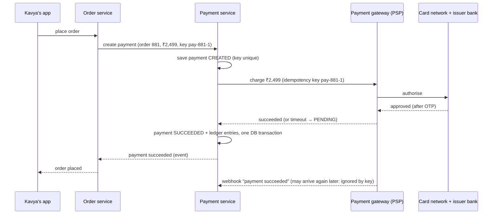

# Start Here: What Is a Payment System? (Before the Interview)

> You tap "Pay ₹2,499" for shoes on a shopping app. A spinner, an OTP or UPI PIN, then "Order placed". Behind that: your app, the shop's payment service, a payment gateway, a card network or the UPI switch, two banks, and a ledger that must never be off by a single paisa, even when networks time out halfway through. Payments are the one system where "eventually consistent" and "we'll retry" can mean charging someone twice.
>
> Time: ~15 minutes. Then: [L4](L4-mid.md) → [L5](L5-senior.md) → [L6](L6-staff.md). The single-system version (ATM, wallet, ledger in code) is the [ATM / Digital Wallet LLD](../../../LLD/interviews/digital-wallet/README.md).

---

## 1. The story: "Payment pending… please don't press back"

Kavya buys shoes on a shopping app during a sale:
1. She taps **Pay ₹2,499** and picks a card.
2. Her bank asks for an OTP. She enters it.
3. The app spins… and shows **"Payment pending. Don't press back."**
4. She waits. Ten seconds later: **"Order placed"**.

What could have gone wrong, and what each would mean:
- Her bank debited the money, but the response to the shop **timed out**. Without care, the shop shows "payment failed", she pays again, and she's **charged twice**.
- She taps "Pay" twice quickly on a laggy phone: **two payments** for one order.
- The payment succeeded but the **order service crashed** before saving the order: money taken, no shoes.
- She returns the shoes: the refund must go back to the **same card**, exactly once, and the seller's payout must be reduced.
- At night, the shop's records, the payment gateway's report and the bank's statement must **agree to the paisa**. When they don't, someone must find out why.

Each of these becomes an interview question.

---

## 2. Where you've already seen it

| Where | What you saw |
|---|---|
| **Shopping / food apps checkout** | "Payment pending", "Do not refresh", order confirmed later |
| **Razorpay / Stripe / PayU checkout pages** | The page that collects card or UPI, run by a payment gateway, not the shop |
| **"Amount debited, order failed"** | Auto-refund in a few days: reconciliation at work |
| **Refund "in 5–7 working days"** | Refunds travel through the same slow rails as settlements |
| **UPI apps** | The "pending" state and auto-reversals ([how UPI works](../../../under-the-hood/upi.md)) |
| **At work** | Idempotent APIs, retries with backoff, state machines, outbox/saga patterns |

---

## 3. The features, through situations

### 3.1 "Pay for this order" → a payment with a lifecycle
A payment isn't a single call; it moves through states: created → processing → succeeded / failed, and sometimes **unknown** (we don't know yet). Every transition is recorded. → [State machines](../../../LLD/concepts/state-machines.md), L4 §5.1.

### 3.2 "She tapped Pay twice" → idempotency
Each payment request carries an **idempotency key** (a unique ID chosen by the client for this one intent). If the same key arrives again, the server returns the first result instead of charging again. → [Idempotency](../../concepts/idempotency-and-delivery-semantics.md), L4 §5.2.

### 3.3 "The bank took 40 seconds to answer" → unknown outcomes
Timeouts don't mean failure. The payment might have succeeded. The system marks it **pending**, asks the gateway later ("what happened to payment X?"), and listens for a **webhook** (a callback the gateway sends when the result is final). → L4 §5.3, L5 §3.2.

💡 **Payment gateway / PSP (payment service provider):** a company (Razorpay, Stripe, PayU, Adyen…) that connects shops to card networks, UPI and banks, so each shop doesn't integrate with every bank. See [payment gateways & PSPs](../../technologies/payment-gateways-and-psps.md).

### 3.4 "Where exactly is the money right now?" → a ledger
Every movement of money (customer paid, platform fee, seller's share, refund) is written as **double-entry** records that always balance. Balances are computed from entries, never overwritten. → [Double-entry ledgers](../../../under-the-hood/double-entry-ledgers.md), L4 §5.4.

### 3.5 "I returned the shoes" → refunds
A refund is a **new** money movement linked to the original payment, not an edit of it. Partial refunds, multiple refunds, and "refund failed, retry" all need tracking. → L4 §5.5.

### 3.6 "Pay the seller every Tuesday" → payouts and settlement
The marketplace collects money from buyers, keeps a commission, and pays sellers on a schedule, after the return window. → L5 §3.4.

### 3.7 "Our numbers don't match the bank's" → reconciliation
Every day, compare your ledger with the gateway's settlement report and the bank statement; investigate every mismatch. → [Payment reconciliation](../../concepts/payment-reconciliation.md), L5 §3.3.

### 3.8 "The gateway is down during the sale" → multiple PSPs and routing
Big merchants integrate several gateways and route each payment to the one most likely to succeed, failing over when one degrades. → L5 §3.5.

### 3.9 "Someone is using stolen cards" → fraud and risk
Checks on velocity (many attempts quickly), device, location and amount before sending a payment to the bank. → L6 §2.

---

## 4. The key mechanism: one payment, end to end

Three rules hidden in that picture:
1. **The same key flows end to end** (app → payment service → gateway), so retries anywhere don't create a second charge.
2. **Money state and ledger change together** in one database transaction.
3. **The outcome can arrive more than once and late** (sync response, webhook, status check), and handling it twice must be harmless.

---

## 5. Try it yourself

- **Payment gateway test modes:** Stripe and Razorpay offer test API keys and test cards (Stripe's documented test card `4242 4242 4242 4242` always succeeds in test mode). Their docs show the `Idempotency-Key` header and webhook signature verification. Reading one gateway's "accept a payment" guide end to end is the best preparation for this interview.
- **Your own bank statement:** find a UPI payment and its **UTR** (Unique Transaction Reference): the ID that every bank and app in the chain uses to trace that one transfer.
- **A "failed but debited" payment** you once had: note how many days the auto-refund took. That delay is reconciliation plus the refund rail's settlement time.

> Nothing to install. The gateway docs are public; test mode requires a free account.

---

## 6. From experience to requirements

| What people experience | Requirement |
|---|---|
| Never charged twice for one order | **F:** idempotency keys end to end; **NF:** exactly-once *effect* |
| "Pending" resolves to success or refund | **F:** unknown-outcome handling: status checks, webhooks, timeouts |
| Order confirmed only after payment succeeds | **F:** payment ↔ order coordination (events, saga) |
| Refunds arrive, exactly once | **F:** refunds as new linked transactions; retries safe |
| Sellers paid correctly, on schedule | **F:** ledger with platform fee and seller balances; payout batches |
| Books always balance | **F:** double-entry ledger; **NF:** strong consistency for money data |
| Mismatches found and fixed | **F:** daily reconciliation with gateway and bank reports |
| Checkout works even if one gateway is down | **NF:** multiple PSPs, routing, failover |
| Card data safe | **NF:** never store raw card numbers (tokens), minimise PCI scope |

---

## 7. Mini glossary

| Term | Plain meaning |
|---|---|
| PSP / payment gateway | Company that processes payments for merchants (Razorpay, Stripe…) |
| Acquirer / issuer | The merchant's bank / the cardholder's bank |
| Authorisation / capture | "Reserve this amount" / "actually take it" (cards) |
| Settlement | The actual movement of money between banks, usually a day or more later |
| Idempotency key | Client-chosen unique ID so retries don't repeat the effect |
| Webhook | An HTTP callback the PSP sends to tell you a result |
| Ledger | Append-only record of every money movement |
| Double-entry | Every movement recorded as balancing debits and credits |
| Reconciliation | Matching your records against the PSP's and the bank's |
| Payout | Sending money from the platform to a seller's bank account |
| Chargeback | A customer disputes a card payment through their bank; money is pulled back |
| UTR | Unique transaction reference for Indian bank/UPI transfers |

➡️ Next: [README.md](README.md) · then [L4-mid.md](L4-mid.md)
