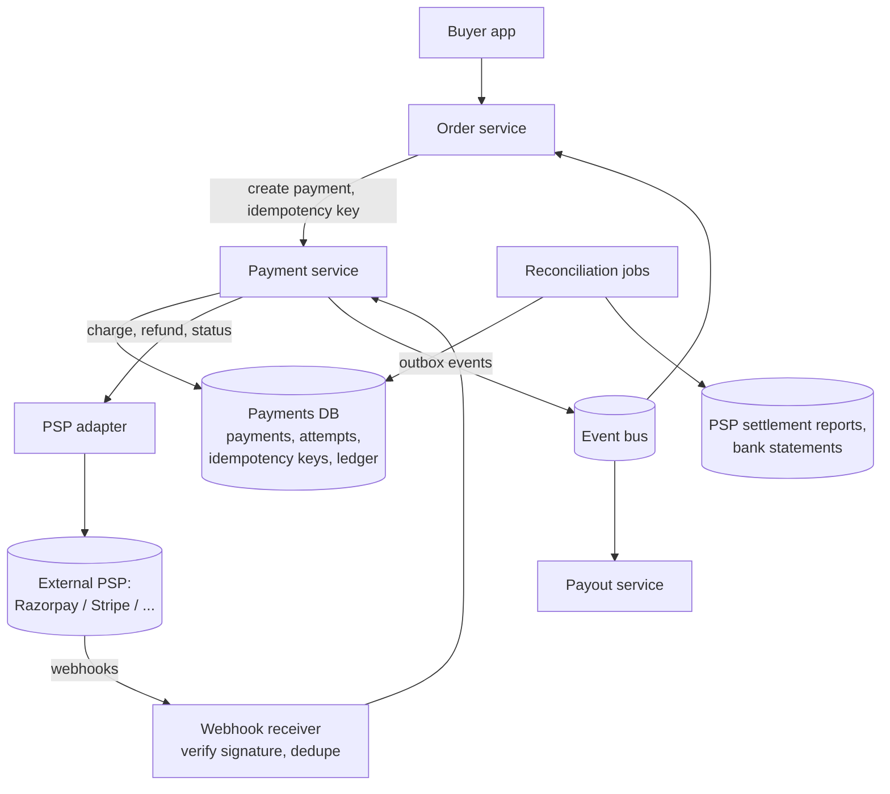
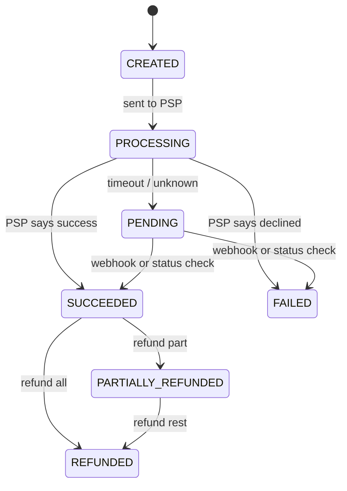

# Payment System — L4 (Mid-level / SDE2) Interview

> **Level expectation:** a correct payment flow for a marketplace checkout: a **payment state machine**, **idempotency keys** end to end, integration with a payment gateway (synchronous response **plus** webhooks), a **double-entry ledger** written in the same transaction as the payment state, refunds as new transactions, and a strongly consistent database. Throughput is low; **correctness** is the whole interview.

> 🆕 Read [00-understand-the-product.md](00-understand-the-product.md) first. Its "Payment pending… don't press back" story is what this design prevents from going wrong.

Legend: **🧑‍💼 Interviewer** · **🧑‍💻 Candidate** · **📝 Note** = commentary for you.

---

## 1. Clarifying requirements

**🧑‍💼 Interviewer:** Design the payment system for our e-commerce marketplace.

**🧑‍💻 Candidate:** Questions:
- Are we a **merchant** using payment gateways (PSPs), or are we building a gateway like Stripe? (Very different systems.)
- Payment methods: cards, UPI, wallets, net banking?
- Do we pay sellers (marketplace payouts), or only collect?
- Refunds, partial refunds?
- Scale: orders per day, peak during sales?

**🧑‍💼 Interviewer:** We're a marketplace: we collect from buyers through external PSPs, keep a commission, and pay sellers. Cards and UPI. Refunds and partial refunds yes. About 10M payments a day, with big sale days.

**🧑‍💻 Candidate:**

**Functional**
1. Create a payment for an order; process it via a PSP; report success/failure to the order service.
2. Never charge twice for the same order intent.
3. Refunds (full, partial, multiple).
4. Track every money movement (buyer, platform commission, seller balance) for payouts and accounting.

**Non-functional**
1. **Correctness over availability:** a payment must never be lost, duplicated or double-counted.
2. **Auditability:** every change traceable; nothing deleted.
3. **Latency:** checkout feels responsive (the PSP/bank step dominates: seconds).
4. **Availability:** high, but we'd rather show "pending" than guess.

> 📝 **Note:** "Merchant or gateway?" is the clarifying question that matters most. As a merchant we integrate PSPs and keep our own ledger; as a gateway we'd talk to card networks and banks directly.

---

## 2. Back-of-the-envelope estimates

(Method: [back-of-the-envelope](../../concepts/back-of-the-envelope.md).)

| What | Calculation | Result |
|---|---|---|
| Average payment rate | 10M ÷ 86,400 s | **~116 payments/s** |
| Sale peak | assume 2M payments in the first hour: 2,000,000 ÷ 3,600 | **~560 payments/s** |
| Calls per payment | create + PSP call + webhook + 1–2 status checks | ~5 → **~2,800 requests/s** at peak |
| Ledger entries | ~5 entries per payment (buyer, PSP clearing, commission, seller, fee) × 10M | **50M rows/day** |
| Ledger size | 50M × ~200 bytes | **~10 GB/day** → ~3.6 TB/year |

**🧑‍💻 Candidate:** These numbers are **small** for modern databases. A well-tuned relational database handles them on one primary with replicas. So the design should optimise for **correctness, auditability and clear failure handling**, not throughput. That's the opposite of most interviews here.

---

## 3. API

```http
POST /v1/payments
Idempotency-Key: pay-order881-attempt1
{ "orderId": "881", "amountPaise": 249900, "currency": "INR", "method": "card", "customerId": "c_42" }
→ 201 { "paymentId": "pm_7f3", "status": "PROCESSING", "redirectUrl": "https://psp.example/3ds/..." }

GET  /v1/payments/pm_7f3                 → { "status": "SUCCEEDED" | "FAILED" | "PENDING", ... }

POST /v1/payments/pm_7f3/refunds
Idempotency-Key: refund-pm_7f3-r1
{ "amountPaise": 50000, "reason": "one item returned" }

POST /webhooks/psp                        # called by the PSP; signature verified
```

- Money is always **integer paise** (₹2,499.00 = 249,900 paise) with a currency code, never floating point ([splitting money & rounding](../../../LLD/concepts/splitting-money-and-rounding.md)).
- The idempotency key is chosen by the **caller** (order service) per payment intent.

---

## 4. High-level design



**🧑‍💻 Candidate:**
- **Payment service** owns payments, their state, and the ledger. Single source of truth for "did this get paid?".
- **PSP adapter** wraps each gateway's API, so the core speaks one internal interface ([payment gateways & PSPs](../../technologies/payment-gateways-and-psps.md)).
- **Webhook receiver** accepts asynchronous results from the PSP.
- **Events** (payment succeeded/failed/refunded) go out via an **outbox** so the order service and payouts learn reliably (L5 §3.1).
- **Payments DB:** [PostgreSQL](../../technologies/postgresql.md): transactions, constraints, strong consistency. No eventual consistency for money.

---

## 5. Deep dives

### 5.1 The payment state machine



**🧑‍💻 Candidate:** ([state machines](../../../LLD/concepts/state-machines.md))
- Transitions are **conditional updates**: `UPDATE payments SET status='SUCCEEDED' WHERE id=? AND status IN ('PROCESSING','PENDING')`. If zero rows change, someone already moved it; we don't apply it twice.
- **Terminal states never change.** A late "failed" webhook after we recorded success is investigated, not applied blindly.
- Every transition is also appended to a `payment_events` history table for audit.

### 5.2 Idempotency, end to end

**🧑‍💻 Candidate:** Three layers ([idempotency](../../concepts/idempotency-and-delivery-semantics.md)):
1. **Our API:** `idempotency_keys(key PRIMARY KEY, request_hash, response, status)`. The first request inserts the key; a retry finds it and returns the stored response. If the same key comes with a *different* body, reject it (client bug).
2. **To the PSP:** we pass our payment ID as the PSP's idempotency key, so if our call times out and we retry, the PSP doesn't charge twice.
3. **From the PSP (webhooks):** store processed webhook event IDs; duplicates are acknowledged and ignored.

**Concurrent duplicates** (two identical requests at the same millisecond): the unique constraint on the key makes one insert win; the other waits for and returns the first result.

### 5.3 Talking to the PSP: sync response, webhooks, status checks

**🧑‍💻 Candidate:** A charge can end three ways:
- **Synchronous answer** (approved/declined): update the state.
- **Asynchronous** (UPI collect, 3-D Secure/OTP flows): the PSP later calls our **webhook**. We **verify the signature** (an HMAC computed with a shared secret, so attackers can't fake "payment succeeded"), dedupe by event ID, then apply the transition.
- **Timeout / network error:** the outcome is **unknown**. Mark `PENDING`, **don't** retry with a new key (that could charge twice), and schedule **status checks** ("what happened to pm_7f3?") with backoff ([retries & backoff](../../concepts/retries-backoff-and-dlq.md)). The webhook may also resolve it. Reconciliation is the final safety net (L5 §3.3).

> 📝 **Note:** "A timeout is not a failure" is the single most important sentence in this interview.

### 5.4 The ledger: double-entry, in the same transaction

**🧑‍💻 Candidate:** Each money movement is a **transaction** of ≥ 2 **entries** that sum to zero ([double-entry ledgers](../../../under-the-hood/double-entry-ledgers.md), [ledgers & event sourcing](../../../LLD/concepts/ledgers-and-event-sourcing.md)). For Kavya's ₹2,499 with a 10% commission:

| Account | Debit (₹) | Credit (₹) |
|---|---|---|
| PSP clearing (money the PSP owes us) | 2,499.00 | |
| Seller 17 payable (we owe the seller) | | 2,249.10 |
| Platform commission revenue | | 249.90 |
| **Total** | **2,499.00** | **2,499.00** |

- The status update to `SUCCEEDED` and these entries are written in **one database transaction**: either both or neither.
- Entries are **append-only**; balances = sum of entries (cached per account, updated in the same transaction).
- **Invariant checks:** every transaction sums to zero; the sum of all entries is zero. Run them continuously.

### 5.5 Refunds

- A refund is a **new record** (`refunds` table) with its own idempotency key and state machine (CREATED → PROCESSING → SUCCEEDED/FAILED/PENDING), linked to the payment.
- **Guard:** total successful + in-flight refunds ≤ captured amount, enforced with a row lock on the payment (or a conditional update) so two concurrent refunds can't exceed it.
- **Ledger:** reversing entries (debit seller payable and commission, credit PSP clearing), again in one transaction. Never edit or delete the original entries.

### 5.6 Data model

```text
payments(id, order_id UNIQUE, amount_paise, currency, status, psp, psp_payment_ref, created_at, updated_at, version)
payment_events(payment_id, from_status, to_status, source, at)          -- audit trail
idempotency_keys(key PK, request_hash, response_json, created_at)
refunds(id, payment_id, amount_paise, status, psp_refund_ref, idempotency_key UNIQUE)
ledger_transactions(id, type, reference_id, created_at)
ledger_entries(id, txn_id, account_id, amount_paise_signed, created_at)  -- per txn sums to 0
accounts(id, type, owner, cached_balance_paise, version)
```

`order_id UNIQUE` is a second safety net: one successful payment per order intent even if keys were misused.

---

## 6. Follow-ups

**🧑‍💼 Interviewer:** The PSP call times out. The user taps "retry". What happens?

**🧑‍💻 Candidate:** The order service retries with the **same** idempotency key. Our API returns the existing payment (status `PENDING`), and the app shows "payment pending, we'll confirm shortly". We resolve it via webhook or status check. If it ends `FAILED`, the user can start a **new** attempt with a new key; if `SUCCEEDED`, the order proceeds. At no point do we send a second charge for the same intent.

**🧑‍💼 Interviewer:** Why not use a NoSQL database for scale?

**🧑‍💻 Candidate:** We don't need the scale (~560/s peak), and we do need multi-row transactions (state + ledger + idempotency key atomically), unique constraints and strong consistency. A relational database gives all three. If we outgrow one primary, shard by merchant or account, keeping each transaction within one shard (L5).

**🧑‍💼 Interviewer:** How does the order service find out the payment succeeded?

**🧑‍💻 Candidate:** Through an event published via the **outbox pattern**: the "payment succeeded" event is written to an outbox table in the same transaction as the state change, and a relay publishes it. So an event is never lost and never sent for a change that didn't commit (L5 §3.1, [fan-out](../../concepts/fan-out.md) explains the outbox).

---

## 7. What the interviewer was evaluating (L4)

- [ ] Asked merchant vs gateway; recognised low throughput, correctness first
- [ ] Payment state machine with conditional transitions and terminal states
- [ ] Idempotency at our API, to the PSP, and for webhooks; concurrent duplicates
- [ ] Unknown outcomes: PENDING, status checks, webhooks; no blind retries
- [ ] Webhook signature verification and dedupe
- [ ] Double-entry ledger in the same DB transaction as the state change
- [ ] Refunds as new transactions with an over-refund guard
- [ ] Integer paise, relational DB, audit history

## 8. Common mistakes at this level

| Mistake | Why it hurts |
|---|---|
| Treating a timeout as a failure and retrying with a new key | Double charges |
| Floating-point amounts | Rounding errors that never reconcile |
| Updating a `balance` column without entries | No audit trail; impossible to explain or reconcile |
| Writing the ledger after the state change in a separate step | A crash in between leaves money state and books disagreeing |
| Trusting webhooks without signatures | Anyone can mark payments "succeeded" |
| Editing/deleting payments for refunds | History lost; auditors and reconciliation can't follow it |

➡️ Next: [L5-senior.md](L5-senior.md)
