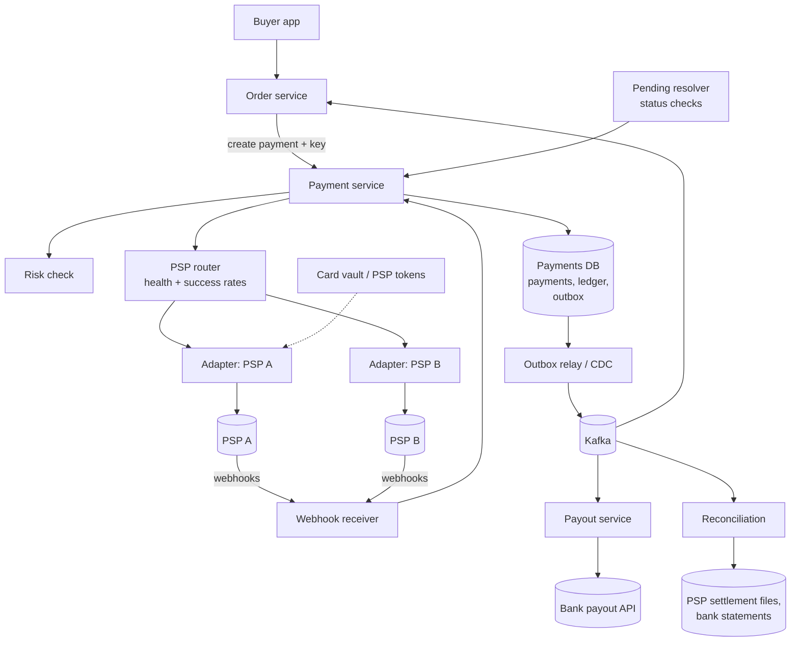
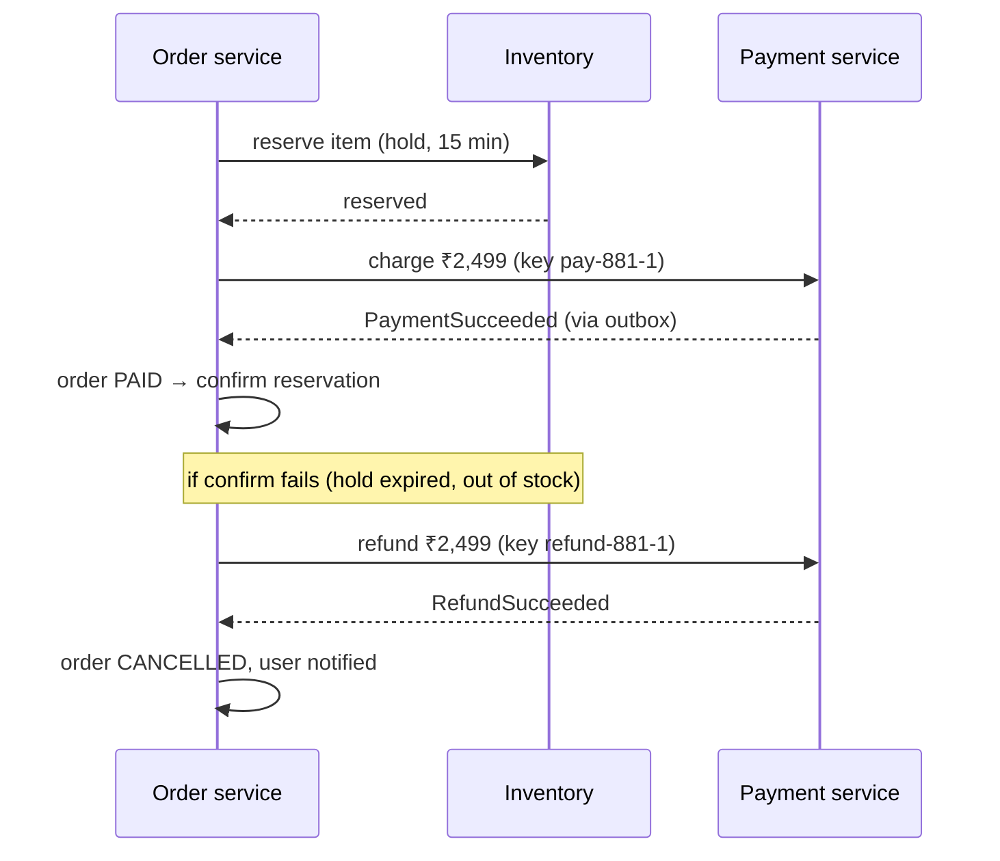
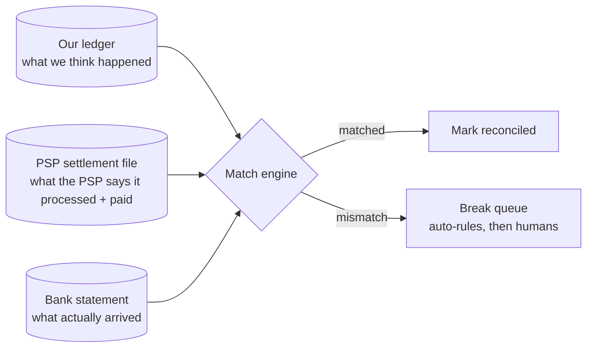

# Payment System — L5 (Senior) Interview

> **Level expectation:** everything in [L4](L4-mid.md), and then the hard edges: how a payment and an order agree without a distributed transaction (**outbox + idempotent consumers + saga**), what you do with outcomes you **cannot know yet**, **reconciliation** as a pipeline instead of a spreadsheet, **payouts** to sellers, **multiple PSPs** with routing and failover, keeping the ledger fast when one merchant is very hot, and keeping card data out of your systems (**PCI scope, tokenization**).

> 🆕 Read [00-understand-the-product.md](00-understand-the-product.md) and [L4](L4-mid.md) first. This file assumes the L4 state machine, three-layer idempotency and the double-entry ledger.

Legend: **🧑‍💼 Interviewer** · **🧑‍💻 Candidate** · **📝 Note** = commentary for you.

---

## 1. Requirements and estimates (fast)

**🧑‍💻 Candidate:** Same as L4: a marketplace collecting via external PSPs, cards + UPI, ~10M payments/day, ~560 payments/s at a sale peak, ~50M ledger rows/day. I'll add three requirements a senior engineer should raise:

1. **Sellers are paid out** on a schedule (T+7 after delivery, say), net of commission, refunds and chargebacks.
2. **Books must reconcile daily** against every PSP's settlement report and our bank statement, and every mismatch must be explained.
3. **Checkout must survive one PSP failing** during a sale.

And one extra number that changes the design:

| What | Calculation | Result |
|---|---|---|
| Ledger writes on the busiest single account | During a sale, every payment credits "platform commission revenue": 560 payments/s × 1 entry | **560 updates/s on one row** if we keep a cached balance there |

> 📝 **Note:** That last row is the senior-level observation. The *total* throughput is easy; one **hot account** that every transaction touches is not (§3.6).

---

## 2. High-level design

**🧑‍💻 Candidate:** New pieces compared to L4: a **router** in front of several PSP adapters, a **pending resolver** that chases unknown outcomes, an **outbox relay** feeding [Kafka](../../technologies/kafka.md), and dedicated **payout** and **reconciliation** services that consume events and never write to the payments tables directly.

---

## 3. Deep dives

### 3.1 Exactly-once *effect*: outbox, idempotent consumers, and the payment ↔ order saga

**🧑‍💼 Interviewer:** The payment succeeded. How do you guarantee the order gets confirmed, exactly once?

**🧑‍💻 Candidate:** "Exactly-once delivery" between two services over a network doesn't exist. What we can build is **exactly-once effect**: at-least-once delivery plus consumers that make duplicates harmless ([idempotency & delivery semantics](../../concepts/idempotency-and-delivery-semantics.md)).

1. **Outbox:** in the same DB transaction that sets the payment to `SUCCEEDED` and writes the ledger entries, insert a row into an `outbox` table: `{event_id, type: PaymentSucceeded, payment_id, order_id}`.
2. **Relay:** a separate process reads new outbox rows and publishes them to Kafka, then marks them sent. If it crashes after publishing but before marking, it publishes again: a duplicate, never a loss. (Instead of polling, it can tail the database's change log: change data capture, CDC: reading the database's own write-ahead log as a stream, see [Kafka](../../technologies/kafka.md).)
3. **Consumer:** the order service keeps a `processed_events(event_id PRIMARY KEY)` table and, in **one** transaction, inserts the event ID and moves the order to `PAID`. A duplicate event hits the primary key and is skipped.

💡 **Outbox pattern:** instead of "write to the DB, then publish to the queue" (two systems, and a crash between them loses or invents an event), write the event into the *same database* as the change and publish it afterwards. Explained in [sagas & distributed transactions](../../concepts/sagas-and-distributed-transactions.md).

**🧑‍💼 Interviewer:** And if the order can't be confirmed after the money is taken? Say the item went out of stock.

**🧑‍💻 Candidate:** That's a **saga**: a sequence of local transactions where each step has a **compensating** step that undoes its business effect.

- The compensation for "charge" is **refund**, not delete. Money movements are never undone, only reversed with a new linked transaction.
- **Order of steps matters:** reserve inventory *before* charging, because releasing a hold is free and refunding costs fees and takes days. Put the cheapest-to-undo steps first and the irreversible ones last.
- Every step and compensation is **idempotent** (its own key) and **retried until it succeeds**; a compensation that fails permanently goes to a human queue, it doesn't silently stop.
- The saga's progress is **persisted** (an orchestrator table or the order's own state), so a crash resumes instead of restarting. Watch it run, failures and crash recovery included, in [See it work: saga with compensations](../../../see-it-work/saga-compensations/README.md).

> 📝 **Note:** Interviewers listen for "we don't use two-phase commit across the PSP". You can't: the PSP and the bank are not participants in your transaction. Saga + idempotency is the only option. Bonus: say *why* the steps are ordered the way they are.

### 3.2 Timeouts and unknown outcomes, done properly

**🧑‍💼 Interviewer:** 2% of PSP calls time out during a sale. Walk me through what happens to those payments.

**🧑‍💻 Candidate:** They enter `PENDING`, and three independent paths race to resolve each one. Whichever arrives first wins through the conditional update; the others become no-ops.

| Path | When | Notes |
|---|---|---|
| **Webhook** | Usually seconds | Signature-verified, deduped by event ID |
| **Status check** (pending resolver) | At +10 s, +30 s, +2 min, +10 min, then hourly | Asks "what happened to `pm_7f3`?" by *our* payment ID, so it works even if we never got the PSP's ID |
| **Reconciliation** | Next day | The final word (§3.3) |

Details that matter:
- **"Not found" at the PSP is not "failed"** for the first minutes: the request may still be in flight inside the PSP. Only after a cutoff (say 30 minutes, longer for UPI) and a "not found" do we mark it `FAILED`, and even then reconciliation can overturn it.
- **The user isn't stuck.** After ~60 seconds of `PENDING`, the app says "We'll confirm in a few minutes; you won't be charged twice." If the payment later turns out `SUCCEEDED` but the user already paid again with a *new* intent (new key), the second one is auto-refunded. That's the "amount debited, order failed, refund in 5–7 days" message everyone has seen.
- **Late flips:** a payment we marked `FAILED` (after the cutoff) that turns out succeeded in the settlement file gets a `LATE_SUCCESS` handling path: either fulfil the order or auto-refund, by policy. **Never** silently overwrite a terminal state; record a new event and act on it.
- **Metrics:** count of `PENDING` older than 5 min, per PSP. That's the on-call signal that a PSP is degrading ([alerting & SLOs](../../concepts/alerting-and-slos.md)).

> 📝 **Note:** The UPI version of this is worth knowing: UPI has its own "deemed approved / pending" states and auto-reversal timelines set by NPCI. See [how UPI works](../../../under-the-hood/upi.md).

### 3.3 Reconciliation: a pipeline, not a spreadsheet

**🧑‍💼 Interviewer:** Finance says yesterday's numbers are ₹3.2 lakh off. How would you have caught it, and how do you find it?

**🧑‍💻 Candidate:** Reconciliation compares **three records of the same money** ([payment reconciliation](../../concepts/payment-reconciliation.md)):

1. **Ingest** each PSP's daily settlement file (CSV/SFTP or API) and the bank statement into normalised tables. Files are stored raw and immutable first, so we can re-run.
2. **Match** on keys: our payment ID ↔ PSP reference ↔ bank UTR/batch ID. Then compare amount, currency, status, fee.
3. **Classify breaks** (mismatches):

| Break | Typical cause | Auto-fix? |
|---|---|---|
| In PSP file, `PENDING`/`FAILED` in our DB | Missed webhook, timeout | Yes: apply success (late-success path) |
| In our DB as `SUCCEEDED`, missing from PSP file | Cut-off timing (11:59 pm payment lands in tomorrow's file) | Wait one more cycle, then escalate |
| Amount differs by the fee | PSP deducted MDR (its fee) before paying us | Yes: post a fee ledger entry |
| PSP paid us less than the file says | Chargeback or reserve held back | Match against the chargeback report |
| Bank deposit doesn't match the PSP's batch total | Batch split, bank holiday | Group-match by date range |

4. **Alert** on unmatched value and count per PSP, per day. "₹3.2 lakh off" should never be found by finance; it should be a page at 9 am with a list of the broken rows.

> 📝 **Note:** Say the phrase **"three-way match"** and mention **timing breaks** (cut-offs). Most "missing money" is just money in tomorrow's file.

### 3.4 Payouts to sellers

**🧑‍💼 Interviewer:** How do sellers get paid?

**🧑‍💻 Candidate:** We never move money directly from the buyer's payment to the seller. The ledger tracks what we owe each seller, and a **payout** process settles it in batches.

1. **Holding:** at payment success, the seller's share is credited to `seller_17:pending` (L4 §5.4 showed it as "seller payable").
2. **Release:** after the return window closes (delivery + 7 days), a job moves it `seller_17:pending → seller_17:available`. Refunds before release debit `pending`; there's nothing to claw back.
3. **Payout run** (daily or weekly): for each seller, `available` balance minus any **reserve** (a percentage held back for future chargebacks), minus any negative balance from earlier refunds. If above a minimum, create a `payout` record with an idempotency key `payout-17-2026-10-13`.
4. **Ledger:** debit `seller_17:available`, credit `bank_payouts:in_transit`. When the bank confirms (or the bank statement shows it), debit `in_transit`, credit `bank_account`.
5. **Send** through a bank payout API (IMPS/NEFT in India). These also time out and need the same PENDING/status-check treatment as payments.

Edge cases worth naming:
- **Negative balances:** a refund after the payout already went out leaves the seller owing us. Net it against the next payout; don't try to pull money back from their bank.
- **KYC and bank-account changes:** a changed bank account freezes payouts for 24–48 hours (a classic fraud pattern is hijacking a seller account and changing the payout account).
- **Batching** is cheaper and easier to reconcile than per-order payouts.

### 3.5 Multiple PSPs and smart routing

**🧑‍💼 Interviewer:** PSP A's success rate drops from 95% to 60% during the sale. What happens?

**🧑‍💻 Candidate:** With one PSP, our checkout degrades with it. With two or more behind one internal interface, the **router** chooses per payment:

- **Inputs:** payment method (card network, issuing bank, UPI), amount, each PSP's **rolling success rate** for that segment (last 5 minutes), latency, current error rate, and cost (fees differ by method).
- **Policy:** route to the cheapest PSP whose recent success rate is within ~1–2 points of the best; drop any PSP whose success rate falls below a threshold. A [circuit breaker](../../concepts/resilience-patterns.md) per PSP × method trips on errors/timeouts and probes with a small share of traffic to detect recovery.
- **Exploration:** keep sending a few percent of traffic to non-preferred PSPs so their success rates stay measured.

Things that make it harder than load balancing:
- **Never fail over a payment whose outcome is unknown.** A timeout at PSP A means A may have charged the card. Retrying at PSP B could charge twice. Fail over only on a **definite** "not processed" (connection refused, a clear 5xx before acceptance), and otherwise use PENDING handling.
- **Saved cards are tokens tied to one PSP** (§3.7) unless you use **network tokens** (issued by Visa/Mastercard, usable at any PSP) or your own vault. Routing freedom depends on this.
- **Reconciliation and refunds** must go to the PSP that processed the original payment; store `psp` on every payment and attempt.
- **Declines are not errors.** "Insufficient funds" from the bank shouldn't count against the PSP's health.

> 📝 **Note:** Contrast with a [load balancer](../../technologies/load-balancer.md): an LB can retry a GET on another backend freely. Here, retrying the wrong thing costs a customer real money.

### 3.6 The ledger at scale and hot accounts

**🧑‍💻 Candidate:** At ~50M entries/day, one [PostgreSQL](../../technologies/postgresql.md) primary is fine for writes. The real problem is the **hot account** from §1: every payment updates `platform_commission`'s cached balance, and row-level locking serialises those updates (about 1–2 ms each including the commit → a few hundred per second, max).

Options:
1. **Don't keep a cached balance for system accounts.** Insert entries only (no hot-row update); compute the balance by summing, with periodic **snapshots** ("balance at 10:00 = X, plus entries after"). Inserts don't contend.
2. **Split the account into N sub-accounts** (`platform_commission#0…#15`), pick one by hash of the payment ID, and sum them for reporting. Same trick as [counters at scale](../../concepts/counters-at-scale.md).
3. **Batch** postings to system accounts every second, from a durable queue.

Seller accounts are naturally spread out (millions of sellers), so they keep cached balances with optimistic locking ([optimistic vs pessimistic locking](../../../LLD/concepts/optimistic-vs-pessimistic-locking.md)), which is what lets the payout job check "available ≥ amount" cheaply.

**When we outgrow one database:** shard by **merchant/seller ID**, so a payment and its seller's entries live together. System accounts are then split per shard (option 2 falls out naturally). Cross-shard money movements (rare: e.g. moving money between two sellers) use a transfer saga through a clearing account ([sharding & replication](../../concepts/sharding-and-replication.md)).

> 📝 **Note:** Bring up isolation: the "check balance, then debit" for payouts must run under row locks or `SERIALIZABLE`, or two concurrent payouts can both see enough balance ([transactions & isolation](../../../LLD/concepts/transactions-and-isolation.md)).

### 3.7 Security: PCI scope and tokenization

**🧑‍💼 Interviewer:** Do you store card numbers?

**🧑‍💻 Candidate:** No. **PCI DSS** (the card industry's security standard) applies to any system that stores, processes or transmits card numbers. The less of our system that touches them, the smaller the audit and the risk.

- The card form is the **PSP's** hosted field or SDK (an iframe on web, an SDK on mobile). The card number goes **from the user's device straight to the PSP**; we receive a **token** like `tok_8Hk…` that's useless to anyone else.
- Saved cards: we store the PSP's token plus the last 4 digits and expiry for display. In India, RBI's card-on-file rules (2022) bar merchants from storing card numbers at all, which pushed everyone to **network tokenization**.
- The CVV is never stored by anyone, including the PSP after authorisation.
- Webhook endpoints: verify HMAC signatures, use per-PSP secrets with rotation, and allowlist the PSP's IP ranges where offered. [mTLS](../../concepts/tls-and-mtls.md) for bank payout APIs.
- The **ledger and payments DB** are high-value too: no direct human write access, every change through the service, audited admin tools with four-eyes approval (two people) for manual adjustments.

More on card data, PINs and hardware security modules in [card & PIN security](../../../LLD/concepts/card-and-pin-security.md).

---

## 4. Follow-ups / curveballs

**🧑‍💼 Interviewer:** The webhook says "succeeded" for a payment that's already `REFUNDED`. What now?

**🧑‍💻 Candidate:** It's a duplicate or a reordered event: the success already happened earlier, and the refund came after. The conditional update (`WHERE status IN ('PROCESSING','PENDING')`) matches zero rows, so nothing changes. We log it. Webhooks carry no ordering guarantee; the state machine is what enforces order.

**🧑‍💼 Interviewer:** A customer files a chargeback 60 days later.

**🧑‍💻 Candidate:** The PSP notifies us (webhook + report), and the amount is pulled from our next settlement. Ledger: debit the seller's balance (or our loss account if the seller's already paid out and negative), credit PSP clearing; plus a chargeback fee entry. Then a dispute workflow: submit delivery proof to the PSP within the deadline. The seller reserve (§3.4) exists for exactly this.

**🧑‍💼 Interviewer:** The outbox relay was down for an hour. What breaks?

**🧑‍💻 Candidate:** Nothing is lost: events wait in the outbox table. Orders stay "payment pending" for an hour, which is bad UX, so the relay is replicated with leader election and alerting on outbox lag (oldest unsent row age). When it recovers, it drains in order; consumers dedupe.

**🧑‍💼 Interviewer:** Why not make the order service call the payment service synchronously and skip the events?

**🧑‍💻 Candidate:** It does call synchronously to *create* the payment and gets an immediate result in the happy case. But async outcomes (webhooks, PENDING resolved 10 minutes later, late successes) have to reach the order service somehow. Events cover all of them through one path; a sync-only design would miss every result that arrives later.

---

## 5. What the interviewer was evaluating (L5)

- [ ] Exactly-once *effect* = outbox + at-least-once + idempotent consumers
- [ ] Saga with compensations, reasoned step order (cheap-to-undo first), persisted progress
- [ ] Unknown outcomes: three resolution paths, cutoffs, "not found ≠ failed", late success handling
- [ ] Reconciliation as a three-way match with break classification and timing breaks
- [ ] Payouts: pending → available → paid, reserves, negative balances, batch payouts
- [ ] Multi-PSP routing with health/success rates, and **no failover on unknown outcomes**
- [ ] Hot-account problem identified and solved; sharding by merchant
- [ ] PCI scope minimised with tokens; card-on-file rules

## 6. Common mistakes at this level

| Mistake | Why it hurts |
|---|---|
| "We'll use 2PC / XA across services and the PSP" | The PSP isn't a participant; it can't be done |
| Publishing to Kafka directly after commit (no outbox) | A crash between commit and publish loses the event |
| Failing over a timed-out payment to another PSP | Possible double charge |
| Paying sellers straight from each payment | No return window, no reserve, impossible to claw back refunds |
| Reconciliation by hand in spreadsheets | Breaks pile up; money "goes missing" for weeks |
| One cached balance row for platform revenue | Lock contention caps throughput at sale time |
| Storing card numbers "encrypted" | Still full PCI scope, and in India not allowed for merchants |

➡️ Next: [L6-staff.md](L6-staff.md)
