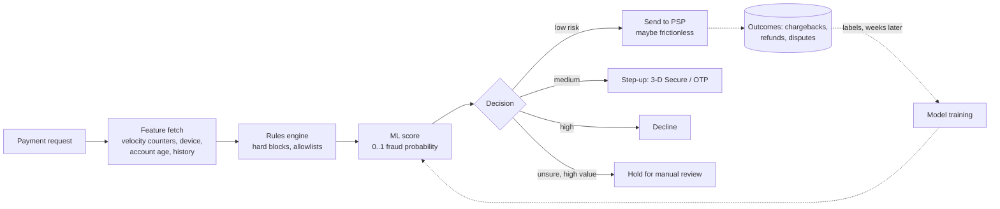

# Payment System — L6 (Staff) Interview

> **Level expectation:** the L4/L5 design is assumed. The staff conversation is about the **system around the system**: fraud and risk as a real-time decision with a cost on both sides, multi-currency without rounding drift, regulation that dictates architecture (data localisation, card-on-file), disaster recovery where the ledger may lose **zero** committed transactions, build-vs-buy for gateways and ledgers, and how you'd evolve a team's payment stack without a big-bang rewrite.

> 🆕 Read [00-understand-the-product.md](00-understand-the-product.md), [L4](L4-mid.md) and [L5](L5-senior.md) first.

Legend: **🧑‍💼 Interviewer** · **🧑‍💻 Candidate** · **📝 Note** = commentary for you.

---

## 1. Framing the problem

**🧑‍💼 Interviewer:** You're the staff engineer for payments at our marketplace. We're expanding to three more countries next year and chargebacks doubled last quarter. Where do you start?

**🧑‍💻 Candidate:** I'd split it into the questions that decide architecture, and say which ones I'd answer first:

1. **What does a wrong decision cost?** A false fraud block loses a sale (and often the customer); a missed fraud costs the amount + a chargeback fee + scheme penalties if our chargeback ratio passes a threshold. The risk system must optimise *money*, not accuracy.
2. **Which regulations shape the data path?** Card-on-file and data-localisation rules decide where data lives and which PSPs we can use in each country.
3. **What's our availability vs correctness contract?** For the ledger: no committed transaction is ever lost (RPO 0). For checkout: degrade (fewer methods, one PSP) rather than go down.
4. **What do we own vs rent?** Gateways, vaults, fraud models and ledgers are all buyable. Each "build" needs a reason.

> 📝 **Note:** A staff answer starts from *cost of errors and constraints*, not boxes. Interviewers want to see you set the frame before designing.

---

## 2. Fraud and risk

**🧑‍💼 Interviewer:** Design the fraud check that runs on every payment.

**🧑‍💻 Candidate:** It sits between "create payment" and "send to PSP", with a latency budget of about **100 ms at p99** (the bank step after it takes seconds, so this is affordable, but it must never become the bottleneck at a sale).

**Signals (features):**
- **Velocity:** attempts per card / device / IP / account in the last 1 min, 1 h, 24 h. Stored as sliding-window counters in [Redis](../../technologies/redis.md) ([counters at scale](../../concepts/counters-at-scale.md)). "Five different cards from one device in 10 minutes" is classic card testing.
- **Identity:** account age, verified phone, past successful orders, delivery address reused across many accounts.
- **Device and network:** device fingerprint, emulator detection, IP geolocation vs shipping address, known proxy/VPN ranges.
- **Graph signals:** many accounts sharing one card, address or device ([graph databases](../../technologies/graph-databases.md)).
- **Order context:** amount vs this user's normal, high-resale items (phones, gift cards), express delivery to a new address.

**Decision = expected cost, not a threshold on accuracy.** For a ₹40,000 phone, a 3% fraud probability means an expected loss of about ₹1,200 + fees: worth a 3-D Secure challenge (which shifts card-fraud liability to the issuer). For a ₹200 order, the same 3% is ₹6 of risk: let it through, because a challenge loses more in abandoned checkouts than it saves.

**Step-up instead of block.** In India, card payments almost always go through OTP-based authentication already (RBI's additional factor rule), so the lever there is mostly *which* orders to hold or block. In markets with frictionless flows (EU's 3-D Secure 2 exemptions), risk decides who gets challenged.

**Feedback loop and its traps:**
- Labels arrive **weeks late** (chargebacks take 30–120 days). Train on matured data; monitor proxy signals (refund requests, "didn't receive" tickets) meanwhile.
- **Selection bias:** you never learn whether the payments you blocked were fraud. Let a tiny random slice of medium-risk traffic through (with limits) to keep measuring.
- **Adversaries adapt:** rules for today's pattern, models for the broad picture, and a fast path to push a new rule in minutes during an attack (config with audit, like a feature flag).

**Failure mode:** if the risk service is down or slow, **fail open with limits** (allow low amounts, hold high ones) rather than closing checkout. Decided in advance, written in the runbook.

> 📝 **Note:** Mention the **chargeback ratio** that card networks monitor (roughly around 1% triggers monitoring programmes; exact thresholds vary by network and change, so treat that number as indicative). It's why fraud is a business-continuity problem, not just losses.

---

## 3. Multi-currency

**🧑‍💼 Interviewer:** We'll sell in AED and USD too. What changes?

**🧑‍💻 Candidate:**
- **Amounts stay integers in minor units**, with the currency next to them: `(249900, "INR")`. Minor units differ: INR and USD have 2 decimals, JPY has 0, KWD has 3. Keep an ISO 4217 table (the standard list of currency codes and their decimals); never assume 2.
- **Every ledger transaction balances per currency.** You can't make INR entries balance against USD entries.
- **Conversion is its own transaction** through FX accounts: debit `fx_usd` $30.00, credit `fx_inr` ₹2,505.30 at a **locked rate** stored with the transaction (rate ID, source, timestamp). Rate changes later create FX gain/loss entries at settlement, not edits.
- **Rounding:** round once, at a defined step, with a defined rule (e.g. banker's rounding), and put any remainder somewhere explicit. Splitting ₹100 into 3 sellers is ₹33.34 + ₹33.33 + ₹33.33, never three × ₹33.33 with a paisa lost ([splitting money & rounding](../../../LLD/concepts/splitting-money-and-rounding.md)).
- **Presentment vs settlement currency:** a buyer may pay in USD while we settle in AED; the PSP's settlement file reports both. Reconciliation matches on the settlement amount.

---

## 4. Compliance shapes the architecture

**🧑‍💻 Candidate:** Three examples where a rule becomes a design decision. (Regulations change; I'd check the current text with legal before building. What follows is the general shape.)

| Rule | What it forces |
|---|---|
| **RBI payment data storage (2018):** payment system data for Indian payments stored only in India | India-region database and backups for Indian payments; cross-border analytics on masked/aggregated data; PSP choice limited to compliant ones |
| **RBI card-on-file tokenization (2022):** merchants may not store card numbers | Saved cards = network or PSP tokens only; affects PSP routing freedom (L5 §3.5) |
| **PCI DSS:** the card security standard | Card data never enters our systems (hosted fields, tokens), keeping our scope small |
| **KYC / AML** (know-your-customer, anti-money-laundering) | Seller onboarding verification before payouts; monitoring for structured or circular money flows |
| **Data retention:** financial records kept for years (often 7–10, varies by country) | Ledger is append-only and archived to immutable cold storage; "delete my account" removes personal data but keeps the financial records (pseudonymised) |

**Architectural consequence:** a **cell per region** (an independent copy of the payment stack, like a separate k8s cluster per region with its own database). An Indian payment never leaves the India cell; a UAE payment lives in the UAE cell. Global services (catalogue, users) reference payments by ID only. This also limits blast radius: an incident in one cell doesn't take down another.

---

## 5. Disaster recovery: RPO 0 for the ledger

**🧑‍💼 Interviewer:** The primary database's zone goes down mid-sale. What do we lose?

**🧑‍💻 Candidate:** Define the targets first:
- **RPO** (recovery point objective: how much committed data we can lose) = **0** for payments and ledger. Losing a committed "succeeded + ledger entries" row means we charged someone and forgot it.
- **RTO** (recovery time objective: how long until we're serving again) = a few minutes for checkout.

How:
1. **Synchronous replication to another zone** in the same region: a commit returns only after a standby in a second zone has the WAL (write-ahead log: the database's append-only record of changes) on disk. Adds ~1–2 ms per commit (zones are a few km apart); acceptable at our volume. Postgres `synchronous_commit` with a quorum of standbys, or a distributed SQL database built on [consensus](../../concepts/consensus-and-raft.md) (Spanner, CockroachDB, YugabyteDB) that does the same thing natively.
2. **Automated failover** with fencing (the old primary must be cut off so it can't accept writes: the [distributed locks & leases](../../concepts/distributed-locks-and-leases.md) problem). Two primaries accepting money writes is the worst outcome.
3. **Cross-region:** asynchronous (sync would add 30+ ms round trips per commit across regions). A regional disaster may lose the last seconds, so we **recover them from external truth**: PSP status APIs and settlement files tell us about every payment that succeeded. Reconciliation is the backstop that makes regional RPO effectively zero for money, if slower.
4. **In-flight payments during failover** are just unknown outcomes: they go `PENDING` and the L5 §3.2 machinery resolves them.
5. **Practice it.** Quarterly failover drills in production, like Netflix's chaos engineering ([case study](../../../case-studies/netflix-open-connect-and-chaos-engineering.md)). An untested DR plan is a hope.

> 📝 **Note:** The staff move is noticing that **the outside world is a replica**: the PSP and the bank keep their own records, so reconciliation doubles as disaster recovery.

---

## 6. Build vs buy

| Component | Default | Build when |
|---|---|---|
| **PSP / gateway** | Buy (2–3 of them) | Almost never; becoming a payment aggregator needs a licence (in India, RBI's PA licence) |
| **Card vault** | PSP or network tokens | You route across many PSPs at large volume and need portable tokens: buy a vault service or build one in a PCI-audited enclave |
| **Payment orchestration (routing)** | Build thin, or buy an orchestration product | Routing is a competitive lever at your volume: success-rate gains of 1–2% on billions in volume pay for a team |
| **Ledger** | Build on Postgres; it's ~a few tables and invariants | Off-the-shelf ledger databases exist (e.g. TigerBeetle, open source) when volume or strictness outgrows your own; evaluate before writing a custom engine |
| **Fraud** | PSP's built-in risk + your rules | Marketplace-specific signals (sellers, delivery, returns) the PSP can't see |
| **Reconciliation** | Build matching; buy file ingestion if many PSPs/banks | Always own the break queue and its alerting |

> 📝 **Note:** "We'd build our own gateway" is a red flag unless you explain licences, bank integrations and PCI Level 1. Buying the commodity parts and owning **ledger, routing and reconciliation** is the typical staff answer for a marketplace.

---

## 7. Evolving an existing stack

**🧑‍💼 Interviewer:** Today the order service calls one PSP directly and stores `paid=true` on the order. How do you get to your design without stopping the business?

**🧑‍💻 Candidate:** Incrementally, each step shippable and reversible:
1. **Extract a payment service** behind the same API the order service already uses; it still calls the one PSP. Add the payments table and state machine. (Strangler pattern: new path wraps old, traffic moves gradually.)
2. **Idempotency keys** end to end, and webhook handling with signatures.
3. **Ledger in shadow mode:** write double-entry rows alongside the old totals; reconcile the two daily until they agree for a month.
4. **Outbox + events**; the order service consumes events instead of polling.
5. **Reconciliation** against the PSP files, with a break queue.
6. **Second PSP** behind the adapter interface, with 1% of traffic, then routing.
7. **Payouts from the ledger** (switch finance from spreadsheets once shadow numbers match).

Each step has a metric that proves it worked (duplicate charges → 0, unexplained breaks → 0, checkout success rate +x%).

---

## 8. Curveballs

**🧑‍💼 Interviewer:** A bug double-credited 2,000 sellers yesterday, and some have already been paid out.

**🧑‍💻 Candidate:** Stop the bleeding: pause payouts for affected sellers (feature flag). Fix forward: post **correcting entries** (never delete), each linked to an incident ID. Sellers already paid get a negative balance, netted against future payouts, with a notice. Then: why didn't an invariant catch it? Add one (e.g. "credits to seller accounts per day = net seller share of successful payments"), and require four-eyes approval for any bulk adjustment script.

**🧑‍💼 Interviewer:** A PSP sends 40,000 duplicate webhooks in a minute during an incident on their side.

**🧑‍💻 Candidate:** Webhook receiver responds fast and only enqueues (durable queue, dedupe by event ID); processing scales separately. Duplicates are no-ops. We rate-limit per PSP at the processor, not at the receiver, so nothing is dropped. Their retries back off because we keep returning 200 quickly.

**🧑‍💼 Interviewer:** Finance wants real-time revenue dashboards from the ledger.

**🧑‍💻 Candidate:** Not by querying the primary. Stream ledger entries (CDC/outbox) to an analytics store and build aggregates there ([stream processing](../../technologies/stream-processing.md)). Label it "provisional"; the reconciled daily numbers are the official ones.

**🧑‍💼 Interviewer:** Should we hold buyer money in a wallet balance to make checkout faster?

**🧑‍💻 Candidate:** Holding customer money is a regulated activity in most countries (in India, a prepaid payment instrument licence from RBI). Product value vs licence, escrow and compliance cost; often better to partner. If we do it, it's a ledger account per user with the same double-entry rules ([ATM / Digital Wallet LLD](../../../LLD/interviews/digital-wallet/README.md)).

---

## 9. What the interviewer was evaluating (L6)

- [ ] Framed the problem by error costs, regulation, consistency contract and build/buy before designing
- [ ] Fraud as expected-cost decisions, step-up vs block, delayed labels, selection bias, fail-open policy
- [ ] Multi-currency: minor units per currency, per-currency balance, locked FX rates, explicit rounding
- [ ] Regulation translated into architecture (regional cells, tokens only, retention vs deletion), with appropriate hedging
- [ ] DR: RPO 0 via synchronous replication + fencing; the outside world as a replica via reconciliation
- [ ] Reasoned build vs buy; owns ledger, routing, reconciliation
- [ ] Incremental migration plan with shadow mode and metrics

## 10. Common mistakes at this level

| Mistake | Why it hurts |
|---|---|
| Fraud threshold tuned for accuracy | Ignores that a ₹200 false decline and a ₹40,000 missed fraud cost very different amounts |
| One global database for all countries | Breaks data-localisation rules; one incident takes down every market |
| Async replication for the ledger "because it's faster" | Failover can lose committed money movements |
| Failover without fencing | Two primaries both accepting writes: split brain in the books |
| Big-bang rewrite of the payment stack | Months without value, risky cutover; shadow mode would have proven it first |
| Stating regulations as exact facts without hedging | Rules change and vary; a staff engineer says "confirm with legal" |

⬅️ Back to [README.md](README.md)
