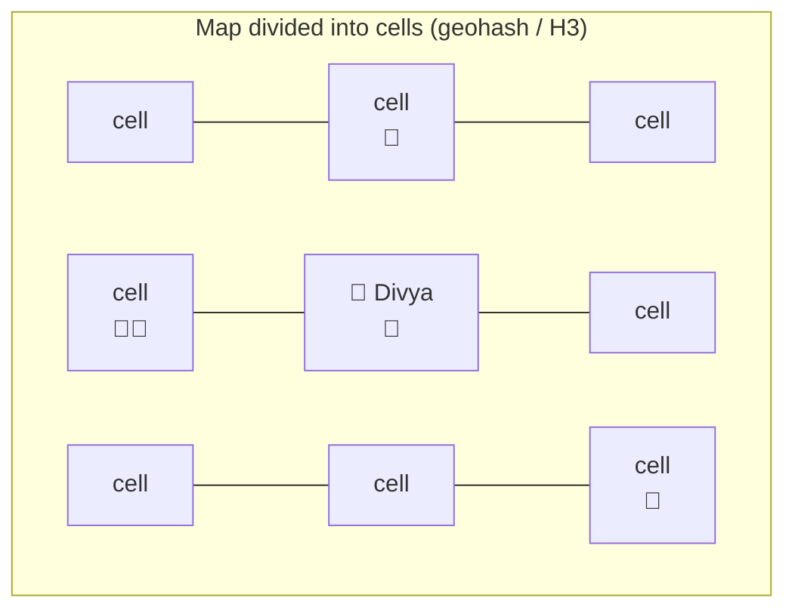
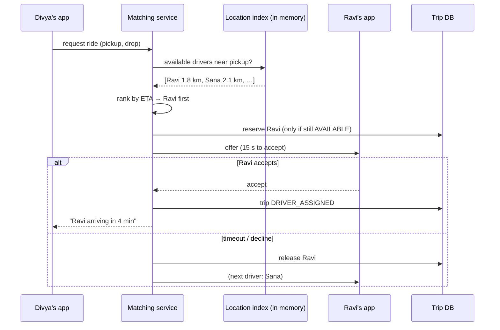

# Start Here: How Does Uber / Ola Find You a Driver? (Before the Interview)

> You've booked cabs dozens of times. But between tapping "Book" and seeing "Ravi is arriving in 4 min", the system tracked a million moving cars, picked one for you, made sure no other rider got the same car, and set a price. This page explains each of those steps from the rider's and driver's side before any architecture.
>
> Time: ~15 minutes. Then: [L4](L4-mid.md) → [L5](L5-senior.md) → [L6](L6-staff.md).

---

## 1. One ride, step by step

Divya needs a cab from Koramangala to the airport.

| What Divya / the driver see | What the system is doing |
|---|---|
| She opens the app; little car icons move around the map near her | The app shows **nearby drivers**: the system knows the live location of every online driver, updated every few seconds |
| She enters the destination: "₹642, Prime Sedan, 1.2× fare" | **Fare estimate**: distance/time from a maps/routing service × the current **surge multiplier** for her area |
| She taps **Book**: "Finding your ride…" | **Matching (dispatch):** find available drivers nearby, rank them by how quickly they can reach her |
| Ravi's phone rings: "New request, 1.8 km away, 15 s to accept" | The ride is **offered** to one driver at a time with a timeout |
| Ravi accepts. Divya sees "Ravi, KA 01 AB 1234, arriving in 4 min" | The trip is created; Ravi is now **unavailable** to everyone else (two riders must never get the same driver) |
| She watches the car move toward her on the map | **Live tracking**: Ravi's location updates are pushed to Divya's app |
| Ravi starts the trip with her OTP; the meter runs | Trip state: **ARRIVING → IN PROGRESS** |
| At the airport: "₹655 paid via UPI" | Fare finalised from the actual route; **payment** charged |
| Both rate each other | Ratings feed into future matching and safety systems |

Behind every step there's a hard question: where are a million drivers *right now*? How do you avoid giving one driver two rides? What happens if the payment fails after the ride?

---

## 2. Where you've seen this

| Product | Same core problem |
|---|---|
| **Uber, Ola, Rapido, Lyft** | Match riders to nearby moving drivers in real time |
| **Swiggy / Zomato / Dunzo delivery** | Match orders to nearby delivery partners (plus restaurant prep time) |
| **Google Maps "nearby"** | Find things near a point quickly (but they don't move) |
| **Find My Device / Life360** | Track moving devices' locations |
| **Infra: Kubernetes scheduler / load balancers** | Assign work to one of many available workers, exclusively and fast. A driver is like a node with capacity 1 |

---

## 3. The features, one situation at a time

### 3.1 Live driver locations
Every online driver's phone sends its GPS position every ~4 seconds. With 1 million drivers online, that's **250,000 location updates per second**, each overwriting the previous one.

👉 Interview: *a write-heavy, constantly-changing dataset where you only care about the latest value: keep it in memory*.

### 3.2 "Who's near me?"
"Find available drivers within 2 km of this point." Checking the distance to all 1 million drivers for every request is far too slow.

👉 Interview: *geospatial indexing*. Divide the map into cells and only look at nearby cells. See [geospatial indexing](../../concepts/geospatial-indexing.md).



Search Divya's cell first, then the ring of neighbouring cells, then the next ring, until enough drivers are found.

### 3.3 Picking the driver
The *closest in a straight line* isn't always best: a driver 500 m away on the other side of a flyover might take 10 minutes. Matching ranks by **ETA** (estimated time of arrival on real roads).

👉 Interview: *matching quality vs speed; sequential offers vs broadcasting to many drivers*.

### 3.4 One driver, one ride
Two riders request at the same moment and the system picks Ravi for both. Only one can get him.

👉 Interview: *exclusive assignment across servers* ([distributed locks & leases](../../concepts/distributed-locks-and-leases.md)).

### 3.5 Trip lifecycle
REQUESTED → DRIVER ASSIGNED → ARRIVING → IN PROGRESS → COMPLETED (or CANCELLED at several points, by either side, with different fees).

👉 Interview: *a state machine persisted in a database; every transition must be valid and survive crashes*.

### 3.6 Surge pricing
Friday 6 pm, raining: 500 ride requests, 80 free drivers in an area. Prices go up (1.8×) to bring more drivers in and reduce demand.

👉 Interview: *continuously computing demand vs supply per area per minute* ([stream processing](../../technologies/stream-processing.md)).

### 3.7 Payment
Uber puts a **hold** on your card when you book, then charges the actual fare at the end. If the ride is cancelled, the hold is released. Several systems must agree: trips, payments, driver earnings.

👉 Interview: *no single transaction spans all of them, so you need sagas and compensations* ([sagas](../../concepts/sagas-and-distributed-transactions.md)).

### 3.8 Live tracking and safety
Divya shares her live trip with family; the app detects unusual long stops. Location must keep flowing even on flaky mobile networks.

👉 Interview: *push updates over WebSockets; heartbeats; storing location history*.

---

## 4. The key mechanism: matching, drawn



---

## 5. Try it yourself (real, 10 minutes)

1. **Open Uber/Ola without booking** at two different times (e.g. 6 pm Friday vs 11 am Tuesday). Compare the number of cars on the map and the price for the same route. That's supply, demand and surge.
2. **Watch the car icons:** they jump every few seconds rather than gliding. That's the ~4-second location update interval (apps smooth it with animation).
3. **See geospatial cells:** open [h3geo.org](https://h3geo.org) (Uber's open-source hexagon grid) and explore how a city is divided into hexagons at different resolutions.
4. **Try Redis GEO** if you have Redis locally:
   ```sh
   redis-cli GEOADD drivers 77.6245 12.9352 ravi 77.6100 12.9300 sana 77.7000 13.1986 far_driver
   redis-cli GEOSEARCH drivers FROMLONLAT 77.6200 12.9340 BYRADIUS 3 km ASC WITHDIST
   ```
   (Longitude first!) You get Ravi and Sana with distances, not the far driver. That's the "who's near me" query in two commands.

---

## 6. From experience to requirements

| What you experienced | Requirement | Type |
|---|---|---|
| Cars on the map | Drivers report location every ~4 s; riders see nearby drivers | Functional |
| Fare before booking | Fare estimate (distance, time, surge) | Functional |
| "Finding your ride…" → assigned | Match rider to a nearby available driver | Functional |
| Driver gets 15 s to accept | Offer with timeout, fall back to next driver | Functional |
| Watching the car approach | Live trip tracking | Functional |
| OTP to start, fare at end | Trip lifecycle (state machine) | Functional |
| Charged after the ride | Payments: hold, capture, refund | Functional |
| Match in seconds | **Low latency matching** (p99 a few seconds end to end) | Non-functional |
| 250k location updates/s | **Write-heavy, in-memory, latest-value** data | Non-functional |
| Never two riders in one car | **Exclusive assignment** under concurrency | Non-functional (correctness) |
| Never charged twice | **Idempotent payments** | Non-functional (correctness) |
| App works city by city | **Partition by geography** | Non-functional (scalability) |

---

## 7. Mini glossary

| Term | Meaning in plain words |
|---|---|
| **Dispatch / matching** | Choosing which driver gets which ride request |
| **Supply / demand** | Available drivers / ride requests in an area |
| **Geohash / H3 cell** | A label for a small area of the map; nearby places share or neighbour labels |
| **ETA** | Estimated time of arrival, on real roads |
| **Surge** | A price multiplier when demand exceeds supply in an area |
| **Offer** | A ride proposal sent to one driver, who has seconds to accept |
| **Lease** | A reservation that expires automatically if not confirmed (e.g. a driver held for 15 s) |
| **Trip state machine** | The allowed steps of a ride: requested → assigned → arriving → in progress → completed/cancelled |
| **Authorisation hold** | Money reserved on your card but not yet charged |
| **Saga** | A multi-step process across services where each step can be undone if a later step fails |

➡️ **Now design it:** [L4-mid.md](L4-mid.md)
